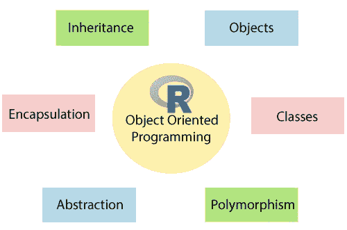
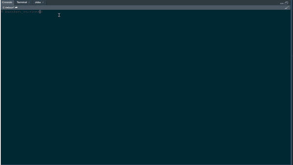

# 模拟一个简单的银行系统。

> 原文：<https://medium.com/geekculture/oop-in-r-simulating-a-simple-banking-system-18942ba146d3?source=collection_archive---------31----------------------->



# 介绍

面向对象编程是用任何语言编写程序的最佳方式。但是为什么是 OOP 技术呢？事实上，我们的物质世界是由不同质量的物体组成的。OOP 基于“对象”的概念，它可以包含数据或代码。

一个很好的例子可以是一个动物对象，它具有运动、声音、饮食、寿命等多种属性。我们也可以谈论一个“银行对象”，我将在这篇文章中考虑它，包括客户、账户等属性，以及账户创建、贷款偿还等方法。

# 为什么用 r 中的 OOP。

嗯，就我个人而言，我从简单的面向过程的编程开始了我的 R 之旅，然后我从函数式编程毕业。只有在接触了使用 python 以面向对象的方式构造我的脚本所带来的好处之后。r 提供了不止一种编写面向对象程序的方法，如 S3、S4、R6 等。在这篇文章中，我将重点介绍如何使用由 [R6 包](https://r6.r-lib.org/articles/Introduction.html)提供的 R6 类。这是因为它给出了 Python 使用的一个几乎相似的方法。如果你不擅长 python，你没什么好担心的，你需要知道的只是如何写一个 R 函数和简单的运算。

关于 OOP 的更多内容可以在找到[。](https://en.wikipedia.org/wiki/Object-oriented_programming)

我们在这里要学习的一些关键概念是:

1.  类别定义
2.  类实例
3.  方法:

*   公共方法
*   私有方法

4.反省

# 假设的例子。

在这篇文章中，我将介绍一个简单的银行系统，它使我们能够:

1.创建帐户

2.存款

3.提款

4.申请并支付贷款。

5.在控制台中模拟一个简单的 USSD 请求。

激动吗？我们继续吧。



# 必需的包。

这个项目我们只需要两个包，即 [tidyverse](https://www.tidyverse.org/) 和 [R6](https://r6.r-lib.org/articles/Introduction.html) 。

如果您当前的 R 安装中没有这些包，请安装它们。

```
**#install.packages("R6")**
**#install.packages("tidyverse")**
**# load the packages here**
suppressWarnings(suppressPackageStartupMessages(library(R6)))
suppressWarnings(suppressPackageStartupMessages(library(tidyverse)))
```

# 定义类别

OOP 的焦点是用于创建**对象的**类**。**类是对象的蓝图。它从字面上描述了一个物体将会是什么，但与物体本身是分离的。同一个类可用于创建多个对象。

R6 类是使用关键字`R6Class`创建的。它包含名为**方法**的函数。这些方法指定用同一类创建的对象可以使用其指定数据执行的行为和操作。

记下这门课最重要的两个论点很重要:

1.  `classname`:定义类名。对于这个类来说，这并不是必需的，但是正如包文档中所描述的，它对于 S3 方法分派很有用。
2.  `public`:公共成员列表，可以是函数(方法)，也可以是非函数(字段)。

下面是在 R6 创建一个类的简单方法。首先，让我们称我们的类为*CBS*——核心银行系统的简称。

```
CBS <- R6Class(classname = "CBS",**public** = **list**(
  accs = tibble(
"Full Name" = NA,
"IDNo" = NA,
'AccountNo' = NA,
'AccountBalance' = NA,
'LoanBalance' = NA),
  bank_name = NA,
  initialize = **function**(accs = NULL,bank_name) {
    **self**$bank_name = bank_name
    cat(paste(' --------- \n This is ',**self**$bank_name,'. \n --------- \n'))
  }
))
```

在上面的类中，我用方法`initialize()`定义了一个类`CBS`。对于来自 python 的人来说，你可以把这看作是`__init__`方法。当使用类名作为函数创建对象类的实例时，调用该函数。在这个方法中，`self$attribute`可以用来设置实例属性的初始值。

# 类实例化。

实例是从包含真实数据和对象的类中构建的对象。为了实例化上述类的一个对象，我们使用如下所示的`$new()`方法。让我们称我们的银行为 **ABCBank** 。

```
ABCBank <- CBS$new(bank_name = 'ABCBank')**#***#  ---------* 
**#***#  This is  ABCBank .* 
**#***#  ---------*
```

# 方法和类属性。

类定义了其他方法来为它们添加功能。这些方法基本上都是函数。

另一方面，类属性是通过在类体内分配变量来创建的，例如上面例子中的' bank_name '和' accs'。它们可以在类中访问。要访问这些属性，您将使用 self$attribute 参数，如上所述。

为了构建我们的核心银行系统，我们需要一些方法来提供功能。此时，你将需要 R 函数的知识。

# TL；博士；医生

# 帐户创建方法。

为此，客户需要他/她的名、姓和身份证号。

```
create_account = **function**(FirstName=NULL,SecondName=NULL,IDNo=NULL) {
    FirstName = readline(prompt = "Enter FirstName: ")
    SecondName = readline(prompt = "Enter SecondName: ")
    IDNo = readline(prompt = "Enter IDNo: ")
    id_acc = **private**$account_setup(IDNo)
    account_details = tibble("Full Name" = paste(FirstName,SecondName),"IDNo" = **as**.character(pluck(id_acc,'IDNo')),
                             'AccountNo' = pluck(id_acc,'accno'),'AccountBalance' = 0,'LoanBalance' = 0)
    **self**$accs = bind_rows(**self**$accs,account_details) %>% filter(!is.na(IDNo))
    cat(sprintf("Hi %s, welcome to %s.We look foward to doing business  with you!\nYour account number is %s",FirstName,account_details$AccountNo,self$bank_name))
  }
```

上面的函数简单地创建了新创建的帐户的表格数据框，并将其添加到现有的帐户中。包含的其他属性如`private$`将在下面解释。

# 存款方法

为了让我们的客户进行存款，我们将要求他们的贷款账户和金额按照下面的函数所示进行存款。

```
make_deposit = **function**(acc=NULL,Amount=NULL){
    acc = readline(prompt = "Enter acc ")
    Amount = **as**.numeric(readline(prompt = "Enter Amount "))
    **private**$check_acc(acc = acc,expr = {
      **self**$accs = **self**$accs %>% mutate(AccountBalance = ifelse(AccountNo == acc,AccountBalance+Amount,AccountBalance))
      cat(glue("Dear Customer,your deposit of Ksh {Amount} was received successfully.Your current balance is Ksh {
                   pull(filter(self$accs,AccountNo == acc),AccountBalance )}"))})
  }
```

您可以注意到，在存款之后，有一条消息被发送到客户端。

# 撤回方法

```
make_withdrawal = **function**(acc=NULL,Amount=NULL){
    acc = readline(prompt = "Enter acc ")
    Amount =  **as**.numeric(readline(prompt = "Enter Amount "))
    **private**$check_acc(acc = acc,expr = {
      info = filter(**self**$accs,AccountNo == acc)
      **if** ( (pull(info,AccountBalance) - 100) > Amount ) {
        **self**$accs <- **self**$accs %>% mutate(
          AccountBalance = ifelse(AccountNo == acc,AccountBalance - Amount,AccountBalance)
        )
      }**else**{
        message(paste(' ----------\n Dear ',pull(info,`Full Name`),',we are unable to process a your request due to low balance in your account.Please try a lower value'))
      }
    })

  }
```

这里发生的事情的快速概述:为了取款成功，提供正确的帐户加上不会离开帐户少于 Ksh 100 的金额。

# 账户结余

为了检查帐户余额，我们只需要帐号，下面是一个简单的从所有帐户中筛选的方法。

```
check_balance = **function**(acc=NULL){
    acc = readline(prompt = "Enter acc ")
    **private**$check_acc(acc = acc,expr = {
     balance =  **self**$accs %>% filter(AccountNo == acc) %>% pull(AccountBalance)
     message(glue("--------------\n Dear Customer,your account balance is Ksh {balance}.\n--------------"))
    })
  }
```

# 贷款申请方法

这种方法只是检查提供的帐号是否准确，检查客户是否有贷款，以避免多次贷款支出。

注意，要访问客户端数据库，您需要包含所有客户端列表的`self$accs`。

```
request_loan = **function**(acc=NULL,Amount=NULL){
    acc = readline(prompt = "Enter acc ")
    Amount =  **as**.numeric(readline(prompt = "Enter Amount "))
    **private**$check_acc(acc = acc,expr = {
      info = filter(**self**$accs,AccountNo == acc)
      **if** ( (pull(info,LoanBalance)) <= 0 ) {
        **self**$accs = **self**$accs %>% mutate(LoanBalance = ifelse(AccountNo == acc,Amount,LoanBalance))
        cat(glue("Dear Customer,your loan request of Ksh {Amount} was processed successfully.
                 Your outstanding loan balance is Ksh {pull(filter(self$accs,AccountNo == acc),LoanBalance )}"))
      }**else**{
        message(glue("Dear Customer,your loan request of Ksh {Amount} was not successfull.
                     Please clear your outstanding loan balance of Ksh {pull(filter(self$accs,AccountNo == acc),LoanBalance )}."))
      }
    })
  }
```

# 贷款偿还

同上，我们只需要要还款的账号和金额。如果金额大于余额，超出的金额将被添加到跨国账户余额中。

如果客户试图偿还现有的贷款，程序关闭，交易取消。

不错吧。

```
repay_loan = **function**(acc=NULL,Amount=NULL) {
    acc = readline(prompt = "Enter acc ")
    Amount =  **as**.numeric(readline(prompt = "Enter Amount "))
    **private**$check_acc(acc = acc,expr = {
      info = filter(**self**$accs,AccountNo == acc)
      **if** ((pull(info,LoanBalance)) > 0 ) {
        **self**$accs = **self**$accs %>% mutate(LoanBalance = ifelse(AccountNo == acc,LoanBalance-Amount,LoanBalance),
                                         AccountBalance = ifelse((AccountNo == acc) & (LoanBalance<0),abs(LoanBalance)+AccountBalance,AccountBalance ),
                                         LoanBalance = ifelse(LoanBalance < 0 ,0,LoanBalance))
        **if** ( (pull(info,LoanBalance)) >= Amount ) {

          cat(glue("Dear Customer,your loan payment of Ksh {Amount} was processed successfully.Your outstanding loan balance is Ksh {
                   pull(filter(self$accs,AccountNo == acc),LoanBalance )}"))
        }**else**{
          cat(glue("Dear Customer,your loan payment of Ksh {Amount} was processed successfully.Your loan is cleared,extra amount of Ksh {abs((pull(info,LoanBalance)) - Amount)} was deposited in your transactional account"))
        }
      }**else**{
        message("Dear Customer,you do not have an existing loan.")
      }
    })
  }
```

# 检查贷款余额

工作原理与账户余额检查相同。

```
check_loan_balance = **function**(acc=NULL){
    acc = readline(prompt = "Enter acc ")
    **private**$check_acc(acc = acc,expr = {
      balance =  **self**$accs %>% filter(AccountNo == acc) %>% pull(LoanBalance)
      cat(glue("--------------\n Dear Customer,your loan account balance is Ksh {balance}.\n--------------"))
    })
  }
```

# 在控制台方法中模拟 USSD

您希望通过对此类的一次调用来访问所有这些方法。我们将使用`self$method`参数访问类中的所有方法。

为了提高效率，刚注册的新客户会被直接带到菜单上。

```
get_services = **function**(acc = NULL) {
    **if** (is.**null**(acc)) {
      cat('Welcome to ABC Banking Services!\nSelect\n1:Create new account\n2:Deposit\n3:Withdraw\n4:Request Loan\n5:Repay Loan\n6:My Account Balance\n7:My Loan Balance')
      input <- readline(prompt="Enter here: ") 
      **switch** (**as**.character(input),
              "1" = **self**$create_account(),"2" = **self**$make_deposit(),"3" = **self**$make_withdrawal(),
              "4" = **self**$request_loan(),"5" = **self**$repay_loan(),"6" = **self**$check_balance(),"7" = **self**$check_loan_balance()
      )
    }**else**{
      cat(paste('-----------\nSelect\n1:Deposit\n2:Withdraw\n3:Request Loan\n4:Repay Loan\n5:My Account Balance\n6:My Loan Balance'))
      input <- readline(prompt="Enter here: ") 
      **switch** (**as**.character(input),
              "1" = **self**$make_deposit(),"2" = **self**$make_withdrawal(),"3" = **self**$request_loan(),"4" = **self**$repay_loan(),
              "5" = **self**$check_balance(),"6" = **self**$check_loan_balance()
      )
    }

  }
```

# 控制对方法的访问。

R6 类有两种控制访问的主要方法。这些是类参数的一部分，但不是

1.  `private`:可选的私有成员列表，可以是函数，也可以是非函数。为了访问这些方法，我们使用`private$method`或`private$attribute`参数。

在我们的模型中，我们可以看到我们调用了`private$check_acc`和`private$account_setup`方法。让我们解释一下他们在这里做什么。

# 私有方法:帐户 _ 设置

此函数生成新的帐号，并检查它是否与以前生成的任何帐号相似。如果这是真的，它会再次生成，直到生成一个唯一的。这确保了生成的帐号是唯一的。该功能还检查客户是否试图用同一个身份证号码注册两次。如果是，则提示客户端输入新密码。

```
account_setup = **function**(IDNo) {
    **if** (nrow(filter(**self**$accs,!is.na(IDNo)) > 0 )) {
      accno =  paste0("00",substr(paste0(sample(1:100, 12, replace=F),collapse = ""),1,9))
      **while** (accno %in% **self**$accs$AccountNo) {
        accno = **as**.character(rstudioapi::showPrompt(title = "IDNo",message = "Enter here"))
      }
    }**else**{
      accno =  paste0("00",substr(paste0(sample(1:100, 12, replace=F),collapse = ""),1,9))
    }
    *# check if user exists*
    **if** (nrow(filter(**self**$accs,!is.na(IDNo)) > 0 )) {
      **while** (IDNo %in% **self**$accs$IDNo) {
        IDNo = **as**.character(rstudioapi::showPrompt(title = "IDNo",message = "That ID already exists,Enter correct IDNo "))
      }
    }**else**{
      IDNo = IDNo
    }
    out = **list**(
      'IDNo' = IDNo,
      'accno' = accno
    )
    **return**(out)
  }
```

# 私有方法:check_acc

对于任何交易，我们都需要一个账号。因此，使用 private 方法中定义的一个函数来检查输入的帐户的有效性是很重要的，如图所示。

```
check_acc = **function**(acc,expr={...}) {
       **if** (acc %in% **self**$accs$AccountNo) {
         expr
       }**else**{
         message("Account Supplied doesn't exist!")
       }
     }
```

# 最终计划

到目前为止，下面是这个类中所有方法和属性的组合。

我们再实例化一下。

```
ABCBank <- CBS$new(bank_name = "ABC Bank")**#***#  ---------* 
**#***#  This is  ABC Bank .* 
**#***#  ---------*
```

# 反省

我们总是可以使用`class`函数检查我们的类，并使用`names`函数从实例化中获取一个类中包含的所有方法的列表，如下所示。

```
**class**(**ABCBank**)**## [1] "CBS" "R6"**
```

我们可以看到，它表明我们的实例来自 CBS 类，它继承自 R6 类。

```
names(ABCBank)**##  [1] ".__enclos_env__"    "bank_name"          "accs"** 
**##  [4] "clone"              "get_services"       "check_loan_balance"**
**##  [7] "repay_loan"         "request_loan"       "check_balance"** 
**## [10] "make_withdrawal"    "make_deposit"       "create_account"** 
**## [13] "initialize"**
```

这里列出了上面讨论的所有方法。

让我们看一个简单的系统例子。

要交互地使用这个系统，运行上面的类，实例化然后调用`get_services`方法。

```
ABCBank$get_services()**#***# Welcome to ABC Banking Services!*
**#***# Select*
**#***# 1:Create new account*
**#***# 2:Deposit*
**#***# 3:Withdraw*
**#***# 4:Request Loan*
**#***# 5:Repay Loan*
**#***# 6:My Account Balance*
**#***# 7:My Loan Balance
Enter here:*
```

# 最后。

需要注意的是，当在类中定义一个方法时，你 ***没有使用*** `<-`操作符进行赋值，而是使用了标准的`=`符号。

我将在下一篇博客中写 R 中的类 ***继承和其他 OOP 概念。您可以自由地复制这个脚本，并在 R studio 控制台上使用它。***

自从在 R 中得到了 OOP 的要领，我的 R 编程质量真的提高了。你也可以试一试:)

如果你觉得这很有趣或者你发现了一个错误，请告诉我。

你可以在这里找到一个干净的脚本。

**最佳**