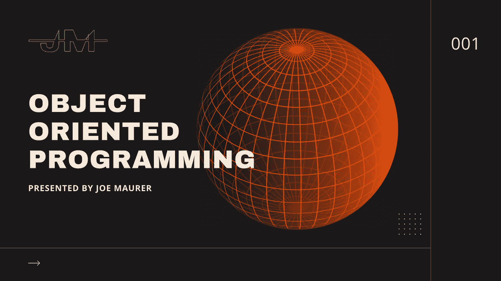
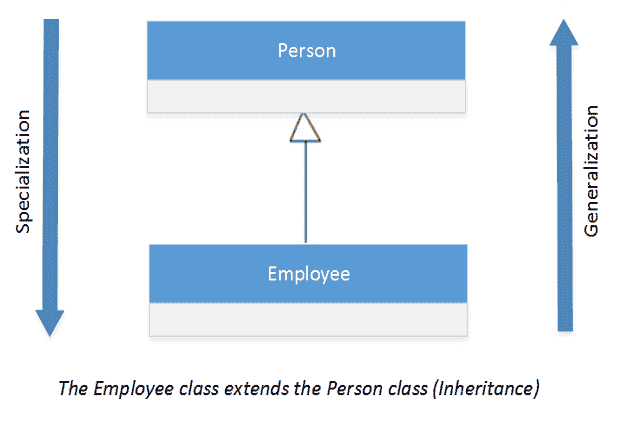
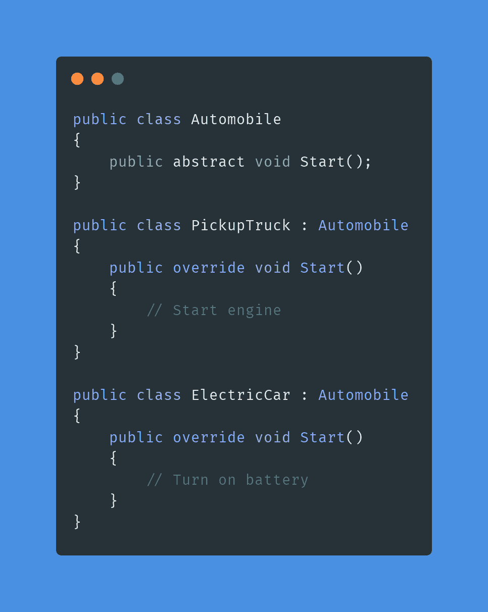

# OOP:面向对象编程

> 原文：<https://medium.com/geekculture/oop-object-oriented-programming-1bc86ce772c6?source=collection_archive---------35----------------------->

面向对象编程( [OOP](https://www.educative.io/blog/object-oriented-programming) )是一种编程范例，是现代软件开发的基石。虽然 OOP 并不是唯一存在的编程范例，但我认为最重要的是要有一个坚实的基础，并且当正确使用时，可以产生更强大、更健壮的软件。但是 OOP 是什么，你如何确保很好地理解它？我们来探索一下。

# **高水平**

概括地说，在 OOP 中，要理解 OOP 的三个主要支柱:

*   用类封装
*   遗产
*   多态性(目前最重要的)

# **封装**

封装是将描述对象的数据和用于操作该数据的函数封装到一个模块容器中的能力。

在 OOP 中，这些通常被称为类，是范例的中心。当变量被声明时产生的变量被称为一个*对象*。一个重要的部分是抽象，以便只暴露必要的特性。

*   **私有/内部:**方法和属性可以从同一个类的其他方法中访问。类之外的任何东西都不应该能够访问这些成员/方法。这通常用 Private 或 Protected 表示。
*   **公共/外部**:方法和属性可以从类外部访问。

举个例子，如果你正在编写一个纸牌游戏。在您的卡片 dec 类中，您希望其他人修改卡片组中的卡片数量吗？大概不会。

# **继承**

继承是获取现有类并扩展其功能以形成另一个类的能力。

为什么这很重要？因为它支持代码重用的可重用性。这是因为新类可以访问父类的所有功能。子类只需要添加特定于其需求的新属性和方法。

*   泛化是这样一种关系，子类是父类的变体。即皮卡是一种汽车。
*   专门化是一种关系，使得类“有-a”子类。即汽车“具有”发动机。

# **多态性**

多态性是相似对象对同一消息做出不同响应的能力。

OOP 的最后一个支柱与继承密切相关，但也可能更重要。前缀 poly 表示许多；morph 的意思是形式。多态指的是单一类型或类采取多种形式的能力。

这是怎么做到的？使用方法覆盖:

在上面的例子中，您可以看到电动汽车和皮卡都继承了 Automobile，并且都覆盖了 Start 行为，因为它们都有非常不同的需求。电动汽车不需要启动发动机，而皮卡车则需要(假设它是汽油型的)。

**关键要点**

1.  设计良好的对象通过对象接口传递消息来操作对象的数据或状态。
2.  通过接口控制对象可以保证它以安全的方式运行，并且内部状态保持有效。
3.  对真实世界建模的能力是 OOP 的一个重要优势。
4.  对象必须是独立的，这样它们才能独立存在。

OOP 并不是唯一的编程范例。你能说出其他人的名字吗？ [**在 twitter 上关注我**](https://twitter.com/maurerpwer) **获取更多编程帖子！**