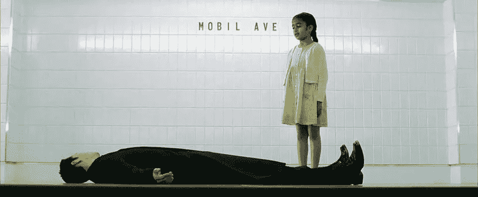

# OOP 系列—继承

> 原文：<https://medium.com/geekculture/oop-series-inheritance-1c8e99553d12?source=collection_archive---------13----------------------->

Neo trapped in a subway station named Mobil Ave.

你好。这是 OOP 系列的第二篇文章。在这篇文章中，我们将学习什么是继承。如果你是第一次接触 OOP 系列，请先查看之前关于[构造](https://order66.medium.com/construct-e770fd6fe053)和 [OOP 系列的帖子——什么是对象？](https://order66.medium.com/oop-series-what-is-an-object-b22fa34933f3)如果你准备好了，让我们开始建造吧。

> ***什么是传承？***

假设你是动物园的软件开发人员。由于新冠肺炎高管决定…