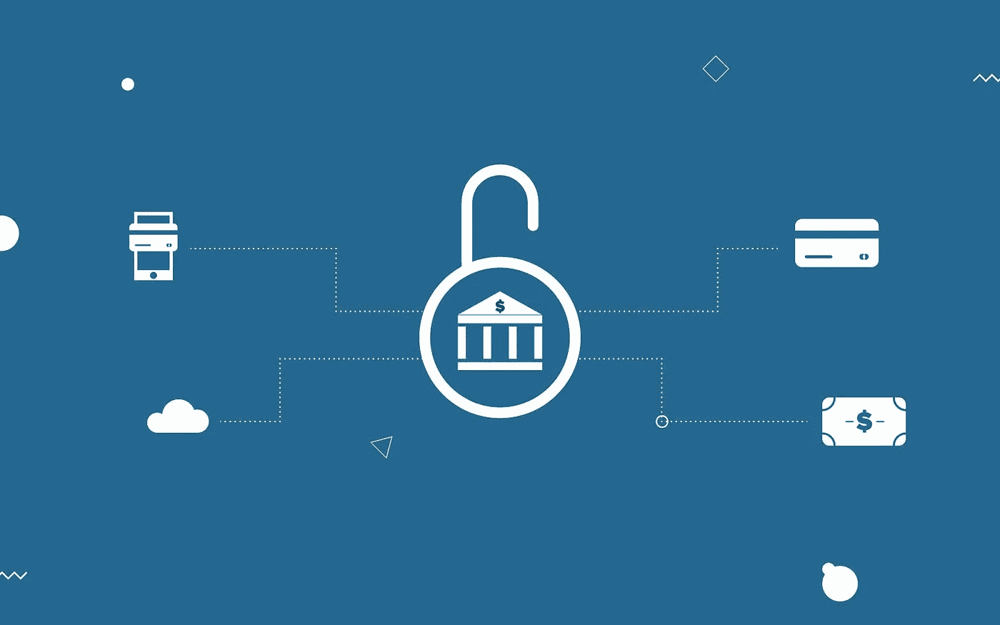
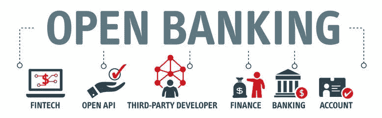

# 用 API 和 iPaaS 开放银行业务:通向未来之路！

> 原文：<https://medium.com/geekculture/open-banking-with-apis-and-ipaas-pathway-to-the-future-c0442195c221?source=collection_archive---------27----------------------->

互联网和新技术的出现极大地改变了金融和银行业。它在不断发展，并在未来几年吸引众多客户。

这场数字化转型中的主要障碍是整合。由于银行系统和所使用的应用程序是独立的，因此将新技术集成到现有基础设施中既费钱又困难。

为了解决这个问题，并启用像开放银行这样的服务系统，我们可以使用 API。

# 什么是开放式银行？

开放银行业务是一个创新的概念，其中银行提供对第三方金融服务提供商的访问。开放式银行体系结构主要由 API 组成。

例如，让我们假设一个客户想知道他的账户余额。在这种情况下，客户将使用开发人员的应用程序从银行或金融科技公司请求这些信息。然后，应用程序会将请求重定向到 API 提供者。第三方将接收请求，并使用 API 自动发回所请求的信息。

这些 API 是使用 API 的银行和创建 API 的第三方公司之间的安全通信媒介。通过使用 API，银行将能够在自己的平台上组合不同公司提供的在线服务。根据[埃森哲](https://www.accenture.com/_acnmedia/pdf-77/accenture-brave-new-world-open-banking.pdf)的一份报告，大约。20%的银行投资了开放式银行计划，预计这一数字在未来几年还会上升。

**了解开源银行软件的功能**

开放银行的概念基于两个机构之间的合作关系。一般这些机构都是传统银行和第三方服务商(TPP)。

API 允许该 TTP 有效地访问财务信息。客户需要以某种形式表示同意，以允许这种访问。一旦提供了访问权限，就可以创建一个统一的平台。该平台汇集所有金融信息，并促进创新服务和应用的开发。

**什么是开放式银行 API？**

API 代表应用程序编程接口。API 充当两个独立应用程序共享信息和相互通信的模式或通道。

简而言之，API 允许两个或多个应用程序使用一种通用语言相互交流。开放银行的概念是标准化的，并使用 API 进行管理。

开放银行系统的透明度取决于所用 API 的类型。

***API 类型***

***公共 API:***第三方服务提供商使用这些 API 提取数据并进行商业化。这些 API 促进了外部创新。

***合作伙伴 API:***合作的商家之间共享合作伙伴 API。这些 API 促进了共同创新，并通过扩展分销和新的商业模式提供了额外的收入。

***私有 API:****该 API 在公司内部使用。它们安全、敏捷，并且操作有效。这些 API 促进了公司中的系统集成。*

***谁受益于开放银行 API？***

*开放的银行系统对消费者非常有利。然而，受益的不仅仅是消费者。服务提供商和所有其他与之相关的人也有优势。*

***客户:***

*开放式银行系统允许客户从不同的选项中选择他们想要接受的服务。它还使客户能够通过内部信用评分服务或外部税务申报系统处理他们的财务数据，从而使银行系统更加创新和高效。*

*在一项对 5000 名欧盟客户进行的调查中，69%的客户表示拥有一家创新的银行对他们来说很重要，只有 12%的客户认为他们自己的银行是创新的。为了寻求最新的技术，33%的客户也准备更换他们的银行。此外，通过开放的银行 API，客户不必排长队等待付款，这大大减少了等待/非生产时间。因此，这表明，在开放银行业务的帮助下，传统银行已经能够在很大程度上为其客户提供创新能力。*

*客户获得的其他一些好处包括:*

*定制选项和增强的个性化服务。*

*负担得起的国际货币兑换和汇款。*

*更高的透明度和在单一位置访问多个帐户的能力。*

*只需在智能手机上点击一下，即可查看财务状况。*

***服务提供商:***

*传统银行和服务提供商在开放的银行系统中获得合作优势。他们可以在竞争中保持领先，并遵循创新和未来的方法来定制客户体验和服务。根据一份[企业开源状况报告](https://www.redhat.com/en/enterprise-open-source-report/2021)，93%的金融服务机构认为开源技术将有助于满足当前和未来在创新和利用云架构方面的计划。开放式银行系统为银行和服务业提供了一个机会，使其在以下方面更加以客户为导向:*

1.  *开放式银行将权力交到了客户和小企业手中。它使他们能够安全地与第三方和服务提供商共享数据，并减少对银行运作的依赖。*
2.  *创建单一平台，让客户可以轻松处理多个账户。*
3.  *开放的银行系统建立了信任、透明度和可操作性。随着 [20%的金融交易发生在网上，这一数字预计将在 2021 年增长 12.7%。这个数字描述了客户和服务提供商之间信任向开放关系的转变。](https://towardsdatascience.com/identity-trust-and-value-s-the-future-of-open-banking-7926e22f085b)*
4.  *允许客户比较不同服务提供商提供的产品，并根据自己的喜好进行选择。*
5.  *随着市场竞争的加剧，提高客户满意度和长期盈利能力。 [35%](https://www.forbes.com/sites/tomgroenfeldt/2019/01/15/bankers-expect-a-profit-bump-from-open-banking/?sh=5cdd201c27b7) 的商业客户已经参与了开放银行业务，42%[计划在 2021 年参与。](https://www.forbes.com/sites/tomgroenfeldt/2019/01/15/bankers-expect-a-profit-bump-from-open-banking/?sh=5cdd201c27b7)*

# *开放银行 API 和 iPaaS 将如何改变银行业的未来？*

*全面的 API 管理对于构建开放银行业务的稳健创新生态系统至关重要。*

> *iPaaS 非常适合构建这个系统。*

*iPaaS 代表集成平台即服务。它为数据、流程和应用集成提供基于云的服务。*

*因此，借助 iPaaS，我们可以在一个云中或者在云和企业之间构建和部署集成。iPaaS 是建立开放银行概念生命周期的动态基础。*

***开放 API 改变银行业面貌的 5 种方式:***

***更好的以客户为中心的服务:**通过开放式银行，客户可以联系多家服务提供商，这些提供商可以根据客户的偏好和信用记录提供定制服务。*

***促进良性竞争:**随着竞争的加剧，许多银行开始寻求利用金融科技和第三方服务提供商为客户提供创新产品。*

***建立一个包容性的生态系统:**定制服务结合日益激烈的竞争将吸引越来越多的消费者成为这一创新的一部分。*

*透明交易:开放的银行体系在提高金融机构透明度的同时保护消费者权益。银行必须向客户披露他们的信息，这将有助于他们评估所提供的服务质量。*

***扩大创新范围。使技术向所有人开放和开放可以带来新的成果。合作机构的创造性努力可以带来颠覆性的商业变革。***

*因此，使用这种方法，金融机构可以遵循更加以客户为中心的服务。开放式银行和 iPaaS 将提高客户参与度，并将提供全新的数字体验。*

# *开放银行:目前发生了什么？*

*根据联合市场研究公司的数据，公开银行市场上升了 24.4%。%并预计到 2026 年底增长 431.5 亿美元。*

1.  *随着新冠肺炎疫情的出现，开放银行业的影响成倍增加。[OBIE 和益普索莫里的研究表明，自全球疫情启动以来，50%的中小企业](https://www.openbanking.org.uk/about-us/latest-news/adapting-to-survive-uks-small-businesses-leverage-open-banking-as-part-of-their-covid-19-crisis-recovery/)已经开始使用开放式银行。*
2.  *根据 2019 年的开放银行[报告](https://thepaypers.com/reports/the-open-banking-report-2019-insights-into-the-global-open-banking-landscape-2/r780814)，世界上 87%的国家目前拥有某种类型的开放 API。*
3.  *OBIE 的开放银行系统中有超过 135 个受监管实体，30%的银行已经将开放银行纳入其运作中。*

***金融科技应用编程接口的创新***

*与其他行业相比，金融行业更早采用银行自动化产品和升级。可以说 API 正在推动金融科技的大部分创新。根据[世界零售银行报告](https://worldretailbankingreport.com/)，75%的金融科技公司计划整合银行 API，以确保客户体验顺畅。大多数金融科技公司现在都使用云服务来将他们的产品放在一个分散的数据库中。*

*API 正在帮助银行整合银行数据，以创建一个经济高效的模型。这种模式使银行能够在几秒钟内获取任何账户的详细信息。API 也给金融科技带来了更多的开放性和透明度。*

*通过将银行转变为基于平台的模式，金融科技可以向银行展示新的功能，使它们能够参与市场，确定它们在价值链中的位置，并保持它们的地位。*

# *开放银行业对印度有意义吗？*

*印度银行业已经进入数字时代，并在过去几年中转变了其职能。网上银行和手机银行让客户更容易获得银行服务。到目前为止，促进 P2P 资金转移的数字钱包、合众国际社和 SBI 领导的区块链平台的兴起是印度开放银行生态系统历史上的一次重大演变。*

*合众国际社是印度支付加速数字化的最伟大的例子之一，在过去几年里，印度支付增长了约 [10.5%](https://www.livemint.com/companies/start-ups/indian-fintechs-raised-nearly-10-bln-in-the-last-decade-credit-suisse-11616487897600.html) ，约占印度零售交易总额的 30%。开放银行的概念将极大地改变现有的体系，使其更加平易近人和透明。这有望成为金融业的一大进步。*

# *开放式银行的 Quickwork 平台*

*金融机构的数字化转型是通向无限可能性的大门。如今，金融科技中心必须允许银行、客户和第三方网站轻松合作创建数字产品和服务。*

*为了实现这一目标，金融公司需要一种全面的方法来实时集成公共和私有 IT 基础架构。*

*然而，实时集成公共和私有 IT 基础架构是一项繁琐的任务，需要庞大的 IT 团队和业务专家。这就是 Quickwork 发挥作用的地方。*

*Quickwork 是一个统一的平台，为金融科技公司提供高级基础设施服务，主要专注于集成、API 管理和对话管理。*

***集成即服务:**集成功能附带了大量预连接的应用程序，包括各种金融和非金融系统，如业务、合规、消息传递、人工智能、分析等。*

***API 管理即服务:**使用 Quickwork，您只需点击几下鼠标，即可创建、管理和发布 API，并与其他系统有效连接。*

***对话管理即服务:**它再次使金融科技能够实时地在各种消息平台之间顺利进行金融交易，并使客户能够用多种语言与联合国代理和聊天机器人进行互动。*

*Quickwork 以云、内部、混合和嵌入式的形式提供这些服务。由于这种多功能性，它已经成为金融自动化和集成的广泛流行的选择。*

***结论***

*开放银行有一些陷阱，主要是安全问题。然而，由于其未来的能力，它被积极地看待。它有潜力克服市场障碍，将银行业带到一个更高的水平。*

*例如，开放银行可以带来投资银行自动化。从依赖银行获取每一个小细节，到在智能手机上几秒钟内获取信息，我们已经走过了漫长的道路。金融领域的创新还有很长的路要走。*

*开放的银行业将导致银行业时代的复兴。它有能力吸引大批顾客。这种基于平台的银行方法可以扩展和繁荣业务。*

# *[日程演示](https://calendly.com/quickwork/demo)*