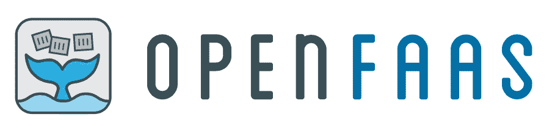
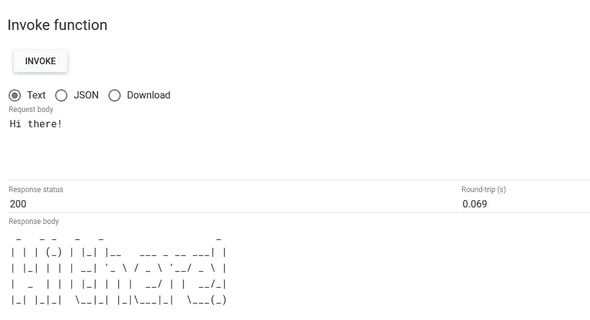
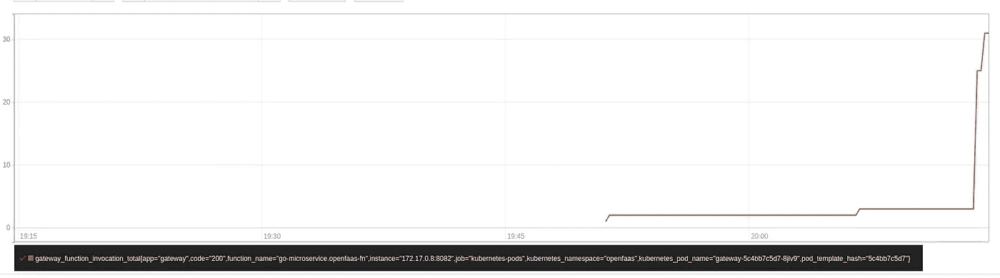
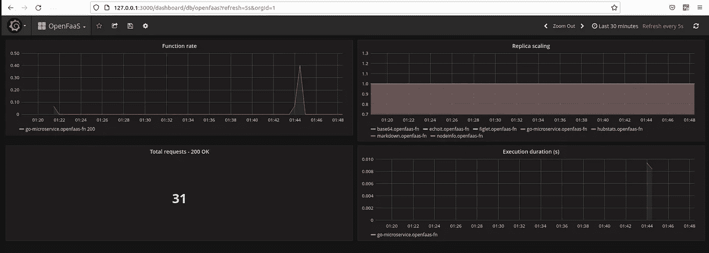

# Centos 7 上的开放式 Faas

> 原文：<https://medium.com/geekculture/open-faas-on-centos-7-c4dc629f28fe?source=collection_archive---------13----------------------->

你好，在本文中，我将介绍使用 minikube 集群在 centos 7 机器上安装 OpenFaas 的步骤，然后在此设置的基础上部署和运行 go-microservice。



对于这个设置，我一直在关注 [OpenFaas 研讨会](https://github.com/openfaas/workshop/)的文档，以及 [OpenFaas 博客](https://www.openfaas.com/blog/golang-serverless/)。

## 先决条件

1.  Docker:说明可以从官方 [Docker 文档](https://docs.docker.com/engine/install/centos/)中找到。
2.  OpenFaas CLI:来自[官方 github 文档](https://github.com/openfaas/workshop/blob/master/lab1.md#openfaas-cli)。
    $ curl-sLSf[https://cli.openfaas.com](https://cli.openfaas.com)
3.  Minikube:我遵循了本文档中[的步骤。](https://phoenixnap.com/kb/install-minikube-on-centos)
4.  docker 注册中心:在这种情况下，我使用了我的 Harbor image 注册中心，但是你可以按照我的前一篇文章创建你自己的 docker 注册中心。(可以使用 minikube Docker 注册表:`eval $(minikube docker-env)`)
5.  Helm: [官方安装指南](https://helm.sh/docs/intro/install/)。
6.  去

## 装置

现在我们已经收集了我们的先决条件，让我们继续部署 OpenFaas。

首先让我们开始 minikube。

```
minikube start
```

我已经为 OpenFaas 安装使用了舵图。

```
helm repo add openfaas [https://openfaas.github.io/faas-netes/](https://openfaas.github.io/faas-netes/)kubectl apply -f [https://raw.githubusercontent.com/openfaas/faas-netes/master/namespaces.yml](https://raw.githubusercontent.com/openfaas/faas-netes/master/namespaces.yml)helm repo update \
 && helm upgrade openfaas --install openfaas/openfaas \
    --namespace openfaas  \
    --set functionNamespace=openfaas-fn \
    --set generateBasicAuth=true
```

这将在 kubernetes 集群中创建两个名称空间，名为 openfaas 和 openfaas-fn。我们可以通过检查下面的 pod 状态来检查我们的安装是否成功。

```
kubectl get pods -n openfaas -w
```

所有单元都应处于运行状态。

我们可以通过下面的命令检查网关是否准备好了。

```
kubectl rollout status -n openfaas deploy/gateway
```

现在，我们将从集群中获取我们的身份验证详细信息。下面的命令将打印 openfaas 登录的管理员密码。

```
PASSWORD=$(kubectl -n openfaas get secret basic-auth -o jsonpath="{.data.basic-auth-password}" | base64 --decode) && \
echo "OpenFaaS admin password: $PASSWORD"
```

然后我们需要端口转发这个端口，从我们的机器访问。

```
export OPENFAAS_URL=[http://127.0.0.1:](http://127.0.0.1:31112)31112
kubectl port-forward -n openfaas svc/gateway 31112:8080 &
```

为了添加普罗米修斯(metrics)，我们可以运行下面的命令。

```
kubectl --namespace openfaas port-forward deployment/prometheus 31119:9090
```

为了添加 grafana 监控，让我们运行下面的命令。

```
kubectl -n openfaas run \
--image=stefanprodan/faas-grafana:4.6.3 \
--port=3000 \
grafanakubectl -n openfaas expose pod grafana \
--type=NodePort \
--name=grafanaGRAFANA_PORT=$(kubectl -n openfaas get svc grafana -o jsonpath="{.spec.ports[0].nodePort}")
GRAFANA_URL=[http://127.0.0.1:$GRAFANA_PORT/dashboard/db/openfaas](http://IP_ADDRESS:$GRAFANA_PORT/dashboard/db/openfaas)kubectl port-forward pod/grafana 3000:3000 -n openfaas
```

现在我们可以访问 openfaas ui 的 url http://127.0.0.1:31112(管理员/生成的密码)，Prometheus ui 的 [http://127.0.0.1:31119](http://127.0.0.1:31119) 和 Grafana ui 的[http://127 . 0 . 0 . 0 . 1:3](http://127.0.0.1:31119)000(管理员/管理员)。

为了进行测试，我们可以转到 openfaas ui 并点击 deploy new function。在列表中选择“figlet”。在将它添加到左窗格之后，将任何文本添加到请求正文空间并点击 invoke 按钮。



很酷吧！

## 部署 Go-微服务

现在我们已经完成了安装，让我们在 OpenFaas 中部署一个简单的 go-microservice。

OpenFaas 有几个模板可以用于我们的任务。他们在自己的模板库中维护模板。

```
faas-cli template pull
```

我们可以用下面的命令检查可用的模板。

```
faas-cli template store pull
```

然后，我们可以拉任何模板，我们需要如下。这将提取 golang-http 的模板。我们可以使用这些模板，并根据需要进行相应的更改。

```
faas-cli template store pull golang-http
```

或者，我们可以创建自己的函数，如下一节所述。

首先我们必须用 Dockerfile 创建我们的函数 yaml 文件。

```
faas-cli new --lang dockerfile go-microservice
```

你会得到一个 go-microservice.yaml 文件，和 go-microservice 目录。在 yaml 文件中，您可以随意更改内容。我的 yml 文件如下。我已经相应地添加了我的网关和图像 URL。

```
version: 1.0
provider:
  name: openfaas
  gateway: [http://127.0.0.1:31112](http://127.0.0.1:31112)
functions:
  go-microservice:
    lang: dockerfile
    handler: ./go-microservice
    image: localhost:5000/go-microservice:1.0
```

我们可以为生成的 docker 文件添加任何内容，以便在我们的函数中使用。我使用了下面的内容，这些内容摘自[这里的](https://www.openfaas.com/blog/golang-serverless/)。

```
FROM *golang:1.10.4-alpine3.8 as build*

RUN mkdir -p /go/src/handler
WORKDIR */go/src/handler*
COPY *. .*

RUN CGO_ENABLED=0 GOOS=linux \
    go build --ldflags *"-s -w"* -a -installsuffix cgo -o handler . && \
    go test *$(*go list ./... | grep -v /vendor/*)* -cover

FROM *alpine:3.9*
*# Add non root user and certs*
RUN apk --no-cache add ca-certificates \
    && addgroup -S app && adduser -S -g app app \
    && mkdir -p /home/app \
    && chown app /home/app

WORKDIR */home/app*

COPY *--from=build /go/src/handler/handler    .*

RUN chown -R app /home/app

RUN touch /tmp/.lock *#  Write a health check for OpenFaaS here or in the HTTP server start-up*

USER *app*

CMD *["/home/app/handler"]*
```

然后我们必须为此添加中间件。在 go-microservice 目录中，添加 main.go 类。

```
package main

import (
	*"fmt"*
	*"log"*
	*"net/http"*
	*"time"*
)

func addServedHeader(w http.ResponseWriter, r *http.Request) {
	w.Header().Add(*"X-Served-Date"*, time.Now().String())
}

func makeRequestHandler(middleware http.HandlerFunc) func(http.ResponseWriter, *http.Request) {
	return func(w http.ResponseWriter, r *http.Request) {
		middleware(w, r)

		w.Write([]byte(*"OK"*))
	}
}

func main() {
	s := &http.Server{
		Addr:           fmt.Sprintf(*":%d"*, 8080),
		ReadTimeout:    3 * time.Second,
		WriteTimeout:   3 * time.Second,
		MaxHeaderBytes: 1 << 20, *// Max header of 1MB*
	}

	next := addServedHeader
	http.HandleFunc(*"/"*, makeRequestHandler(next))
	log.Fatal(s.ListenAndServe())
}
```

我们可以通过下面的命令来运行它。

```
faas-cli up -f go-microservice.yml
```

—你的回答会是这样的。

```
$  faas-cli up -f go-microservice.yml
[0] > Building go-microservice.
Clearing temporary build folder: ./build/go-microservice/
Preparing: ./go-microservice/ ./build/go-microservice/
Building: localhost:5000/go-microservice:1.0 with dockerfile template. Please wait..
Sending build context to Docker daemon   7.68kB
Step 1/13 : FROM golang:1.10.4-alpine3.8 as build
 ---> bd36346540f3
Step 2/13 : RUN mkdir -p /go/src/handler
 ---> Using cache
 ---> 41771b742138
Step 3/13 : WORKDIR /go/src/handler
 ---> Using cache
 ---> ac151ca23319
Step 4/13 : COPY . .
 ---> Using cache
 ---> 0a3341d2af2e
Step 5/13 : RUN CGO_ENABLED=0 GOOS=linux     go build --ldflags "-s -w" -a -installsuffix cgo -o handler . &&     go test $(go list ./... | grep -v /vendor/) -cover
 ---> Using cache
 ---> 92991031eb2b
Step 6/13 : FROM alpine:3.9
 ---> 78a2ce922f86
Step 7/13 : RUN apk --no-cache add ca-certificates     && addgroup -S app && adduser -S -g app app     && mkdir -p /home/app     && chown app /home/app
 ---> Using cache
 ---> 0859da0160a9
Step 8/13 : WORKDIR /home/app
 ---> Using cache
 ---> 5f1498c7bbb0
Step 9/13 : COPY --from=build /go/src/handler/handler    .
 ---> Using cache
 ---> 232b70435105
Step 10/13 : RUN chown -R app /home/app
 ---> Using cache
 ---> d45c326c6576
Step 11/13 : RUN touch /tmp/.lock #  Write a health check for OpenFaaS here or in the HTTP server start-up
 ---> Using cache
 ---> 1f8118c3b271
Step 12/13 : USER app
 ---> Using cache
 ---> 616b2b430d95
Step 13/13 : CMD ["/home/app/handler"]
 ---> Using cache
 ---> 4f002caa7740
Successfully built 4f002caa7740
Successfully tagged localhost:5000/go-microservice:1.0
Image: localhost:5000/go-microservice:1.0 built.
[0] < Building go-microservice done in 0.30s.
[0] Worker done.Total build time: 0.30s[0] > Pushing go-microservice [localhost:5000/go-microservice:1.0].
The push refers to repository [localhost:5000/go-microservice]
84b6a101f13e: Layer already exists 
24bb6e3aa142: Layer already exists 
8f7644cfa0e9: Layer already exists 
f67c1d81b066: Layer already exists 
89ae5c4ee501: Layer already exists 
1.0: digest: sha256:47c504fea63aecbd70b6f29f41d18f9b6ac3e36b0bf74b6a3e9e86072cdf6628 size: 1367
[0] < Pushing go-microservice [localhost:5000/go-microservice:1.0] done.
[0] Worker done.Deploying: go-microservice.Deployed. 202 Accepted.
URL: [http://127.0.0.1:31112/function/go-microservice](http://127.0.0.1:31112/function/go-microservice)
```

我们可以通过尝试以下命令来检查该功能是否部署正确。它将显示我们部署的状态。(状态应为正在运行)。或者我们可以从用户界面检查状态。

```
$ kubectl get pods -n openfaas-fn 
NAME                              READY   STATUS    RESTARTS      AGE
go-microservice-8466b7fdb-l9lwb   1/1     Running   0             12m
```

然后我们可以弯曲我们的端点并得到响应。

```
curl -i [http://127.0.0.1:31112/function/go-microservice](http://127.0.0.1:31112/function/go-microservice) ;echo
HTTP/1.1 200 OK
Content-Length: 2
Content-Type: text/plain; charset=utf-8
Date: Mon, 09 May 2022 20:06:38 GMT
X-Call-Id: e9b5af76-2a95-4107-8d7c-e51c752d3005
X-Served-Date: 2022-05-09 20:06:38.482143283 +0000 UTC m=+465.848986153
X-Start-Time: 1652126798479241355OK
```

这个调用可以像前面的例子一样使用 ui 来完成。

我们可以在 OpenFaas UI 中检查我们的部署，也可以在我们之前公开的 Prometheus UI 中检查指标。



Prometheus Graph



Grafana Graph

现在，我们已经设置了 openfaas 环境，并部署了简单的 go-lang 微服务。

我们将在接下来的帖子中介绍一些其他与 OpenFaas 相关的学习内容。😁