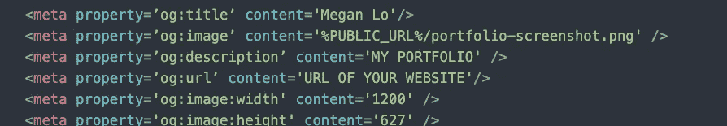
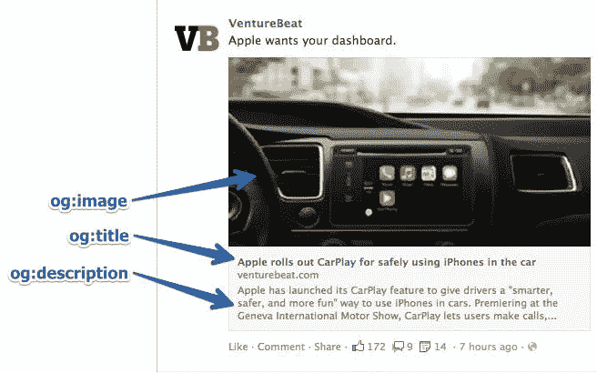
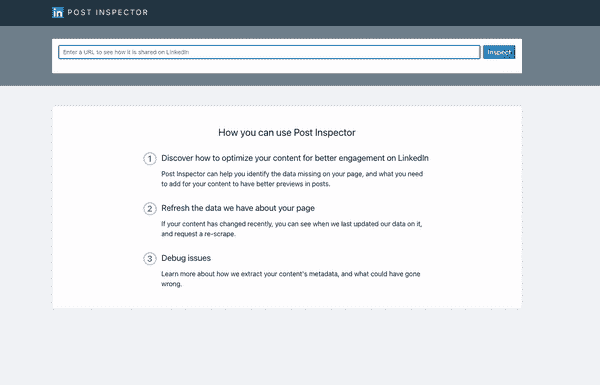
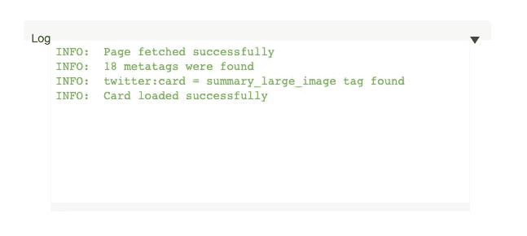
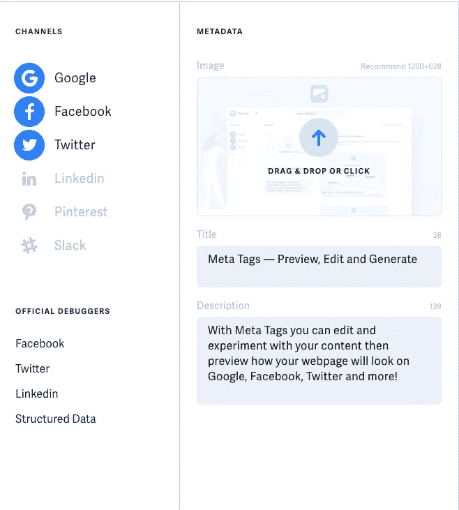
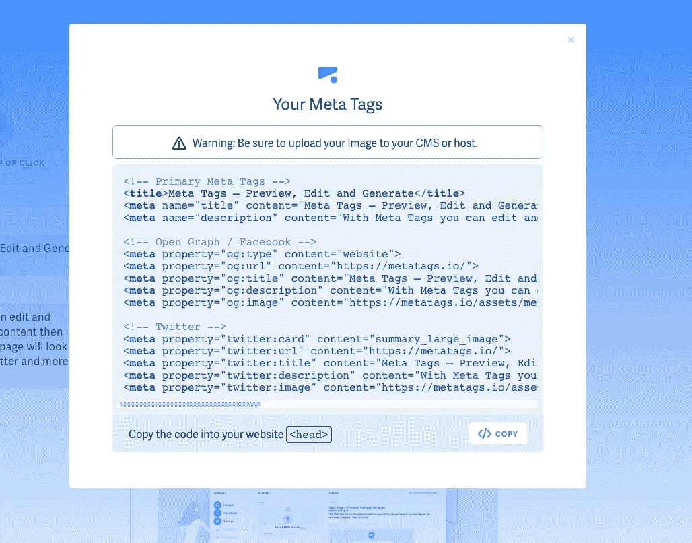

# 在 HTML 101 中打开图形标签

> 原文：<https://medium.com/geekculture/open-graph-tags-in-html-101-5d470bbdb78a?source=collection_archive---------12----------------------->

## 教程没有告诉你的 HTML 标签



今天，我想介绍一下 open graph 标签。

说实话，我也是几天前才知道的。我总是想知道，当人们在社交媒体上分享时，他们的网站预览是如何显示的，而当我分享我的网站时，却不是这样？你知道吗，神奇之处在于这个`og` meta 标签。我注意到教程中没有提到这一点，至少在我看过的所有教程中没有。所以，希望你能找到这篇文章，因为你对“开放图形标签”很好奇。

开放图标签是由脸书在 2010 年推出的。它的创建是为了帮助优化脸书的帖子，当帖子在脸书上被分享时(例如，当帖子被喜欢或分享时)，它可以对来自第三方网站的信息传播提供更多的控制。

所有 open graph meta 标签都应该在 HTML 的`<head>`部分，以便将信息发送到 DOM。

## 为什么开放图标签很重要？

如前所述，创建开放图形元标签是为了让信息在社交媒体上更容易控制，比如脸书。从营销的角度来看，开放图元标签对转化率和点击率有巨大的影响。

想想看，你会点击一个既没有网站预览，标题，也没有描述的链接吗？你可能会认为这些要么是诈骗链接，要么你只是不感兴趣。这就是为什么开放图形元标签对特别是营销人员很重要！

在下一节中，我们将探索如何使用开放图标签。

## 如何使用开放图形标签？

在我们开始之前，让我们快速浏览一下你的 open graph 标签需要包含的内容:



Credit: [Neil Patel](https://neilpatel.com/blog/open-graph-meta-tags/)

在我们开始之前，你需要知道对于`og`来说，Twitter 的标签是不同的，我们一会儿就来看看。

这里是你从上图中看到的一些你必须放进去的东西:`og:image`、`og:title`、`og:description`，当然根据你的需要还有更多。

让我们来分析一下他们是怎么做的，我将使用上图中的例子来帮助您理解发生了什么:

`**og:title**` **:** 还挺自明的。这就是你定义内容标题的方式。在`<head>`部分，它看起来像这样:

```
<meta property="og:title" content="Apple rolls out CarPlay for safely using iPhones in the car" />
```

`**og:image**` **:** 这是你分享时确保网站缩略图显示在社交媒体上的方法。这是至关重要的！

这将是它的样子:

```
<meta property=”og:image” content=”http://www.yourdomain.com/image-name.jpg” />
```

您可以从您的 CMS(内容管理系统)或任何开源软件中获取您的图像，或者您可以从您的本地文件中获取图像，并将`http://www.yourdomain.com/`替换为`%PUBLIC_URL%/the-name-of-your-image.(whatever source your image is from).`

OG 图像最常要求的分辨率是 1200 px 627 px。在这个尺寸，你的缩略图将完全适合大图像缩略图或小图像。

`**og:description**` **:** 这应该包含了你网站的描述，类似于`og:title`。它帮助人们理解你的网站是做什么的。

这将是它的样子:

```
<meta property=”og:description” content=”Apple has launched its Carplay...” />
```

还有两个标签不在图片中，您还必须包括:

1.`**og:type**` **:** 这告诉 DOM 你如何描述你正在分享的对象，无论是博客文章、网站还是视频等等。

以下是可以放入`og:type`标签的常见例子:

*   网站
*   文章
*   博客
*   书
*   比赛
*   电影
*   城市
*   国家

```
<meta property=”og:type” content=”website” />
```

2.`**og:url**` **:** 这是你粘贴你的网站的 URL 到这个 meta 标签的地方。

```
<meta property=”og:url” content=”http://www.yourdomain.com” />
```

这就是你现在需要的！

正如我前面提到的，Twitter 的 open graph 标签看起来略有不同。让我们在下一节探讨这个问题！

## Twitter 开放图形标签

至于推特，就叫“卡”。由于我们必须探索开放图标签的主要部分，我将简短地给出标签名称作为参考:

*   `twitter:card`:与`og:type`的工作非常相似。当你在你的推文中分享一个 URL 时，Twitter 会查看你的文件并寻找`twitter:card`，并且知道这是你想要在 Twitter 上展示你的网站的方式！(我一会儿分享个截图，到时你就知道有多酷了！)

```
<meta name=”twitter:card” content=”summary” />
```

*   `twitter:title`:与`og:title`类似。最多使用 70 个字符。

```
<meta name=”twitter:title” content=”Your title here” />
```

*   `twitter:description`:与`og:description`类似。最多使用 200 个字符。

```
<meta name=”twitter:description” content=”description here” />
```

*   `twitter:url`:与`og:url`类似

```
<meta name=”twitter:url” content=”http://www.yourdomain.com” />
```

*   `twitter:image`:与`og:image`类似

```
<meta name=”twitter:image” content=”http://www.yourdomain.com /image-name.jpg” />
```

但是等等！怎么知道有没有用！？在下一节中，我们将讨论“调试器”。

## 打开图形调试器

作为一名优秀的开发人员，我们总是通过使用调试器来确保一切正常。开放图形标签也不例外！脸书专门为脸书创建了一个[分享调试器](https://developers.facebook.com/tools/debug/)(不幸的是——对我来说——你需要登录才能使用调试器)，同样， [Twitter](https://cards-dev.twitter.com/validator) ，以及 [LinkedIn](https://www.linkedin.com/post-inspector/) 也有一个！

(由于我没有脸书账户，我将以 LinkedIn 为例！)这三个网站都非常用户友好(或者我应该说是开发者友好？？).你所要做的就是将网站的 URL 复制到页面上，如果你在各自的社交媒体上分享它们，它应该能够向你展示你的网站是什么样子的。

在这一点上，我建议将您的网站部署到一个主机上(如 Netlify 或 Heroku ),这样您就可以获得一个链接。老实说，我从来没有尝试过本地主机，所以我不知道它是如何工作的。

让我以我的投资组合为例:



正如你所看到的，它显示缩略图，标题，网站的网址显示在页面上。然而，我忘了放`og:description` meta 标签，因此下面有一个反馈。很酷，对吧？:)

使用 Twitter 调试器/卡验证器，您会看到:



From Twitter’s Card Validator

这意味着你已经在你的网站中包含了 Twitter open graph 标签。即使你不使用 Twitter，我认为将这些标签放在`<head>`部分是一个很好的经验法则，谁知道你有一天会需要它们，对吗？

## 元标签生成器

在我们走之前，我想分享一下这个工具，它帮助我为我的网站生成了元标签。有时打字太多，有一个工具来复制和粘贴所有内容总是很有帮助的。 [Meta Tags](https://metatags.io/) 会为你的 URL 生成你需要的 open graph 标签。你要做的就是



输入元数据，选择你要分享的频道，点击右上角的“生成元标签”。它将为您生成元标记，如下所示:



很酷，对吧？:)

当我分享我的作品集时，我的推特看起来是这样的:

## 在你走之前…

这是一篇比较短比较甜的文章。我希望这足以让你开始使用 open graph 标签！如果你想学习更高级的开放图形元标签和快乐编码，我在下面链接了一些资源！


# 资源

[](https://ogp.me/) [## 开放图协议

### 开放图协议使得任何网页都能够成为社交图中的丰富对象。例如，这用于…

ogp.me](https://ogp.me/) [](https://neilpatel.com/blog/open-graph-meta-tags/) [## 你需要知道的关于完全掌握脸书和 Twitter 的开放图形元标签

### 我希望你喜欢阅读这篇博文。如果你想让我的团队为你做营销，请点击这里。营销人员…

neilpatel.com](https://neilpatel.com/blog/open-graph-meta-tags/) [](https://ahrefs.com/blog/open-graph-meta-tags/) [## 开放图形元标签:你需要知道的一切

### 你是否想知道如何让你的内容在社交媒体上更易点击、分享、引人注目？打开图形元…

ahrefs.com](https://ahrefs.com/blog/open-graph-meta-tags/) 

调试器:

[](https://developers.facebook.com/tools/debug/) [## 共享调试器-开发人员的脸书

### 共享调试器允许您预览您的内容共享到脸书时的外观，并调试与…有关的任何问题

developers.facebook.com](https://developers.facebook.com/tools/debug/)  [## 邮政检查员

### 使用帖子检查器深入了解您的内容在 LinkedIn 上的显示方式。

www.linkedin.com](https://www.linkedin.com/post-inspector/) [](https://cards-dev.twitter.com/validator) [## JavaScript 不可用。

### 编辑描述

cards-dev.twitter.com](https://cards-dev.twitter.com/validator) 

发电机:

[](https://metatags.io/) [## 元标签—预览、编辑和生成

### 什么是元标签元标签是为网页提供摘要的文本和图像内容的特定片段…

metatags.io](https://metatags.io/)