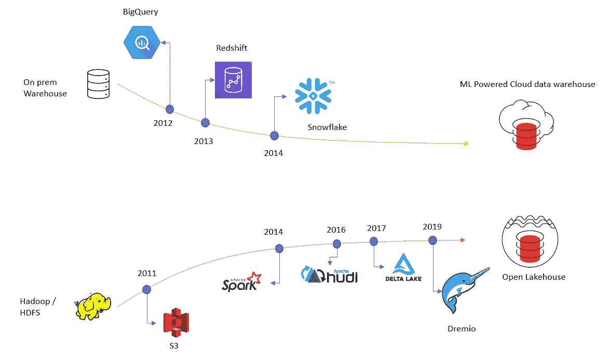
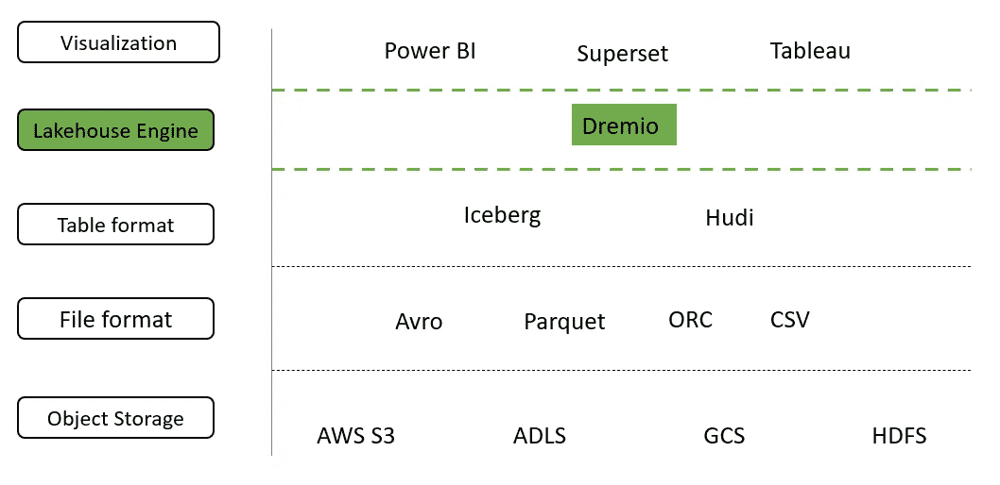
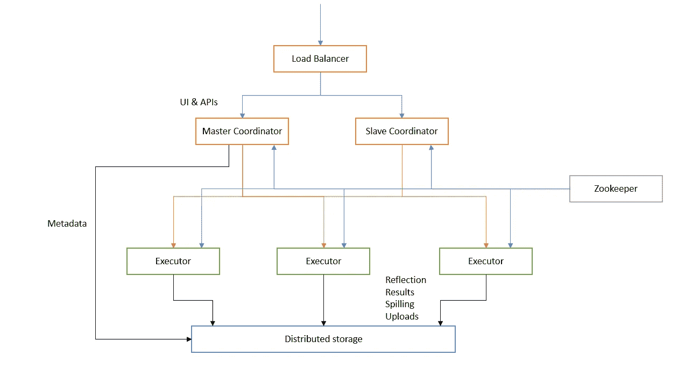
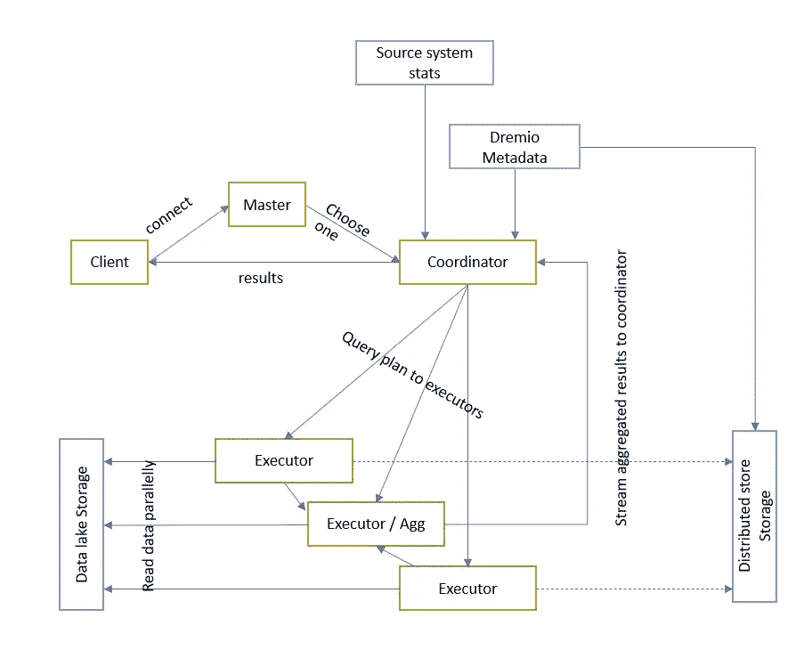

# 开放的湖边小屋——一次旅行

> 原文：<https://medium.com/geekculture/open-lakehouse-a-journey-9c9dd59914d4?source=collection_archive---------1----------------------->

Photo by [janer zhang](https://unsplash.com/@janerzhang?utm_source=unsplash&utm_medium=referral&utm_content=creditCopyText) on [Unsplash](https://unsplash.com/s/photos/lakehouse?utm_source=unsplash&utm_medium=referral&utm_content=creditCopyText)

关于 Dremio 的任何 SQL

现在每个公司都依靠数据来做决策。因此，每个公司都需要一个数据基础设施来处理他们的用例。用例也随着时间的推移而发展。随着用例的变化，我们看到了不同的解决方案，如数据仓库、Hadoop、数据集市、数据湖、云数据仓库和 lakehouse。

# 本地数据仓库

数据仓库是帮助将分散的数据孤岛集成到一个平台中的第一次尝试，作为事实的单一来源。它使用历史交易、记录、操作和其他应用程序，使数据可供业务用户分析使用。

随着时间的推移，公司意识到每个 OU(销售、营销、财务)都需要一个定制的数据视图，这为数据集市带来了生机。这导致了不同 BI 数据集和报告工具的多个数据副本。

扩展本地数据仓库是一个巨大的挑战。这些数据仓库的许可和运营成本超过了它们的回报。

# 数据湖

它最初是作为一种经济高效的替代存储解决方案在内部部署的，以替代数据仓库，用于具有大量、快速和多种数据的数据源。数据湖优先考虑分析方法的灵活性。Hive 试图提供一种在数据湖上高效运行 SQL 的方法。它提供了数据库、模式和表的概念，以某种方式描述数据湖的结构，让 BI 工具有效地遍历数据。Hive 在仓库竞赛中胜出。但是很快这个解决方案开始遇到基础设施的缺点，如数据仓库。

# 云数据湖+数据仓库

BigQuery 首次尝试降低运营成本，其基础设施由 GCP 管理。很快，AWS 提供了 Redshift，并主导了云数据仓库市场，直到雪花的推出。所有这些产品都使用托管存储提供了更快的查询速度。在所有这些产品中，ETL 过程会将源数据移动到云数据湖中，并在仓库中加载一个经过管理和修整的版本。像 S3 这样的云对象存储充当了一个经济高效的数据湖。但这里我们也有数据副本的问题。此外，仓库中加载的一个数据只能从产品中查询。

# 数据网格和数据结构

数据网格和数据结构都试图克服数据湖的缺点。

Data Mesh 是一种分析数据架构，它通过将数据组织成产品并以分布式方式将其划分到各个领域来尝试这一点。治理和架构是联合的。它有一个不同数据产品的集中目录。

与数据网格不同，数据结构采用集中的元数据驱动和以技术为中心的方法。治理和架构是集中的。部分数据被虚拟化。大多数数据都是集中的，并且使用 API 来交付。参见[开放式数据结构](https://github.com/open-data-fabric/open-data-fabric)。

# 开放式湖边小屋

[开放表格格式](/geekculture/open-table-formats-delta-iceberg-hudi-732f682ec0bb)的推出开启了数据管理领域的新篇章。这些文件格式为数据湖带来了仓库的高性能 SQL 功能。开放文件格式为数据湖引入了以下功能:

*   数据作为产品—版本化数据，回滚
*   事务一致性—通过完全读取隔离对文件进行原子更新。
*   模式演变，以跟踪表随时间的变化。
*   时间旅行来查询历史数据。

## 开放性支柱

*   开放格式—非专有格式
*   开放接口— ANSI SQL、JDBC/ODBC 连接
*   与云无关—使用容器进行部署
*   开源—软件的非专有代码

# 德雷米奥

利用这些功能，Dremio 推出了一个开放的 lakehouse 平台。该平台具有以下优势

*   任何数据上的 SQL
*   降低基础设施管理成本
*   查询您的数据所在的位置
*   没有不必要的数据移动和拷贝
*   没有供应商限制，因为它使用开源组件

## Dremio 的技术组件

*   [Apache 箭头](https://asrathore08.medium.com/apache-arrow-2d72137d9e84) —柱状内存数据处理和交换
*   [Apache Arrow Flight](https://asrathore08.medium.com/apache-arrow-2d72137d9e84) —基于 gRPC 和 HTTP/2 的数据互操作性
*   Apache 方解石— SQL 解析器和 CBO
*   RocksDB —协调器上的元数据存储
*   Gandiv — (LLVM 内核)
*   Apache parquet —一种用于磁盘溢出的文件格式
*   尼斯——冰山目录
*   Kubernetes 上的生产部署—弹性扩展平台

## Dremio 的逻辑组件

*   协调者—为 UI 提供服务，为 API 连接提供动力，管理元数据
*   执行者—执行查询
*   分布式存储—使用外部，如 HDFS/S3
*   管理员—执行日常管理和后台任务
*   动物园管理员—集群协调(使用外部)

## Dremio 的整体工作流程

在上面的图片中，我展示了两种不同的存储，因为 Dremio 以两种关键方式利用存储:[数据湖](https://docs.dremio.com/data-sources/)和[分布式存储](https://docs.dremio.com/deployment/distributed-storage.html)。

## 从 5000 英尺高度进行 Dremio 优化

*   数据反映
*   超高性能的矢量拼花阅读器
*   柱状云缓存(C3)(位于 NVMe)
*   预测流水线
*   用于 S3 兼容存储的高性能并行读取器

*注:我碰到了* [*LakeSoul*](https://github.com/meta-soul/LakeSoul) *，一种新的表格格式。但是找不到太多关于它的文档。此外，它的目标是 Spark 引擎，而不是 SQL 引擎。这里只是提一下，供以后参考。*

## 使用 Dremio 时的注意事项

*   原生于拼花文件格式，具有查询 ORC 文件的挑战性(通过 Hive)
*   旧版本的 Hive ( <1.x) is not supported
*   It follows Storage based auth models, and does allow impersonation
*   Be consistent with hardware selection, don’t mix different hardware for same query.
*   Their is no auto submit of queries when partial node failure happens, user will need to resubmit
*   Reflection management needs to be planned well.

## Features only available in Enterprise Edition

*   User management
*   LDAP & Ranger Integration,
*   SSL connection
*   WLM

## Appendix

**数据架构演进**

> 运营数据存储→数据仓库→数据集市→多维数据库(Oracle Express、Hyperion Essbase)→设备(Teradata、Netezza)→数据湖(S3)→数据结构(HPE Ezmeral)→数据虚拟化(Denodo)→湖屋→三角洲湖(Databricks)→数据网格(ThoughtWorks)

快乐阅读！！