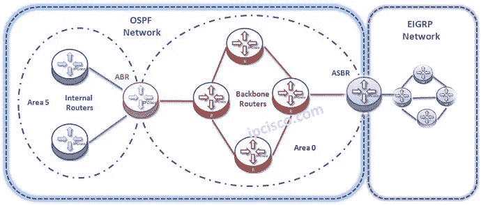
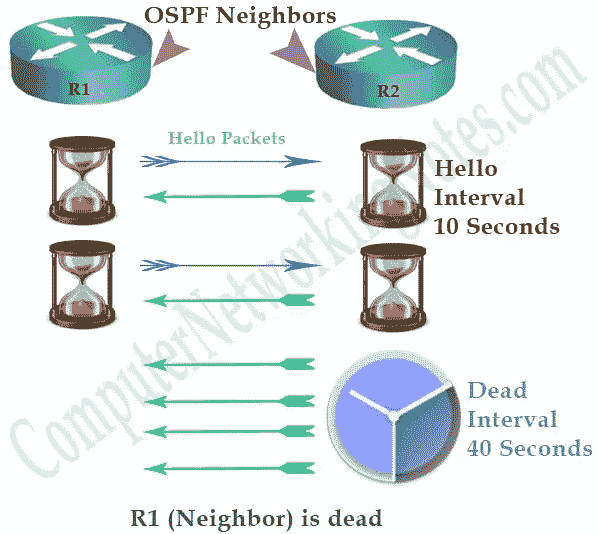
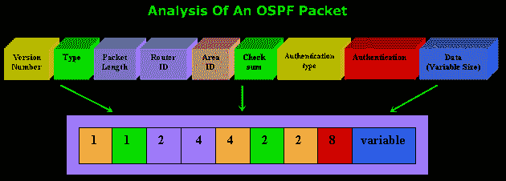
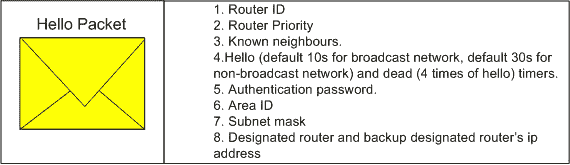

# 首先打开最短路径

> 原文：<https://medium.com/geekculture/open-shortest-path-first-4c3f01de489c?source=collection_archive---------29----------------------->

**OSPF(开放最短路径优先)**

OSPF 是一种标准化的链路状态路由协议，旨在有效扩展以支持更大的网络。

**OSPF 特色**

*   OSPF 采用了使用区域的分层网络设计。
*   OSPF 会与同一区域的相邻路由器形成邻居关系。
*   OSPF 不是通告到相连网络的距离，而是使用链路状态通告(LSA)通告直连链路的状态。
*   OSPF 仅发送触发的更新和仅发送更改
*   LSA 另外每 30 分钟刷新一次。
*   OSPF 流量组播到地址 224.0.0.5(所有 OSPF 路由器)或 224.0.0.6(所有指定路由器)。
*   点对点仅使用多播地址 224.0.0.5
*   OSPF 使用 Dijkstra 最短路径优先算法来确定最短路径。
*   OSPF 是一种无类协议，因此支持 VLSMs。
*   OSPF 仅支持 IP 路由。
*   OSPF 路由有一个管理距离是 110。
*   OSPF 使用开销作为度量，开销是根据链路带宽计算的。
*   ***OSPF 代价=参考带宽/链路带宽***
*   OSPF 没有跳数限制。
*   OSPF 与同一区域的其它路由器形成邻居关系，称为邻接。
*   所有路由器都必须连接到区域 0(主干区域)
*   一个区域中的所有路由器都有相同的拓扑表
*   OSPF 在 ABR(区域边界路由器)中总结网络
*   一个区域包含本地化的更新。
*   ASBR(自治系统边界路由器)将 OSPF 与 EIGRP 或 RIP 等其它动态协议连接起来
*   OSPF 只有阿伯和 ASBR 可以总结
*   OSPF 只与同一区域的路由器成为邻居
*   在 OSPF 拥有共享网段的每个网络中，都会有 DR 和 BDR
*   在共享以太网网段中，只有 DR 和 BDR 处于完全状态，其他可能处于双向状态

**OSPF 进程构建并维护三个独立的表:**

*   邻居表—包含所有邻居路由器的列表。
*   拓扑表—包含区域内所有已知网络的所有可能路由列表。
*   路由表—包含每个已知网络的最佳路由。

**OSPF 不同类型的路由器**

*   主干区域(区域 0)的路由器称为**主干路由器**。
*   两个区域之间的路由器(如区域 0 和区域 1 之间的路由器)称为**区域边界路由器(ABR)**
*   运行 OSPF 并连接到运行另一种路由协议(例如 RIP)的另一个网络的路由器称为**自治系统边界路由器(ASBR)**

**每个 OSPF 路由器由唯一的路由器 ID 标识。路由器 ID 可以通过以下三种方式之一确定:**

*   可以手动指定路由器 ID。
*   如果没有手动指定，路由器上任何环回接口上配置的最高 IP 地址将成为路由器 ID。
*   如果不存在环回接口，任何物理接口上配置的最高 IP 地址将成为路由器 ID

**Hello / Dead 区间**

*   非广播和点到多点接口的 OSPF hello/Dead 间隔时间。:30/120 秒
*   广播和点对点接口的 OSPF hello/Dead 间隔时间。:10/40 秒
*   请注意，默认情况下，停滞间隔计时器是 Hello 间隔的四倍。

[**和**选举博士和博士](http://sysnetnotes.blogspot.com/2013/07/ospf-dr-and-bdr-election.html)

*   首先，他们查看路由器优先级。默认情况下，路由器优先级为 1。如果需要，我们可以更改它
*   如果路由器优先级相同，OSPF 将查看最高的路由器 ID 以进行 DR BDR 选举
*   如果我们将路由器优先级设置为 O，该路由器将不会参与 DR/BDR 选举
*   在帧中继(NBMA-非广播多路访问)网络中，集线器必须被选为 DR。我们可以通过改变路由器优先级来做到这一点

[**OSPF LSA 类型**](http://sysnetnotes.blogspot.in/2013/09/ospf-lsa-types.html)

*   **类型 1** —代表路由器
*   **类型 2** —代表多路访问链路的伪节点(指定路由器)
*   **类型 3** —网络链路总结(内部路由)
*   **类型 4** —代表 ASBR
*   **类型 5**—OSPF 域之外的路由
*   **7 型** —用于存根区域，代替 5 型 LSA

**OSPF 地区类型**

*   主干区域(区域 0)
*   标准区域
*   存根区域
*   完全短粗的区域
*   不太短的地区(NSSA)

**OSPF 网络类型**

1.  **点对点** —表示两台路由器直接相连的拓扑结构。

没有 DRs 和 BDR。

所有 OSPF 流量都组播到 224.0.0.5。

不需要手动指定邻居。

**2。点对多点** —表示一个接口可以连接到多个目的地的拓扑。源和目的地之间的每个连接都被视为点对点链路。

OSPF 不会选举 DRs 和 BDR。

所有 OSPF 流量都组播到 224.0.0.5。

不需要手动指定邻居。

**3。广播多路访问** —表示发生广播的拓扑。

OSPF 将选举 DRs 和 BDR。

到 DRs 和 BDR 的流量组播到 224.0.0.6。从 DRs 和 BDR 到其它路由器的流量被组播到 224.0.0.5。

不需要手动指定邻居。

以太网示例

**4。非广播**

**5。非广播多路访问网络(NBMA)** —表示一个接口可以连接到多个目的地的拓扑结构；但是，广播不能通过 NBMA 网络发送。

帧中继就是一个例子。

OSPF 将选举 DRs 和 BDR。

OSPF 邻居必须手动定义，因此所有 OSPF 流量都是单播而不是多播。

*   **记住:**在非广播网络中，必须手动指定邻居，因为不允许多播问候。

# OSPF 博士和 BDR 选举

OSPF 为每个多路访问网络选举一个指定路由器(DR ),通过组播地址 224.0.0.6 访问。出于冗余目的，还会选择备用指定路由器(BDR)。

**博士和 BDR 选举**

*   优先级最高的路由器成为 DR；第二高的成为 BDR。如果存在搭配优先级，则具有最高路由器 ID 的路由器将成为 DR。
*   默认情况下，路由器优先级相同。如果需要，我们可以更改它
*   Cisco 路由器的默认优先级是 1。如果我们将路由器优先级设置为 O，该路由器将不会参与 DR/BDR 选举
*   在帧中继(NBMA-非广播多路访问)网络中，集线器必须被选为 DR。我们可以通过改变路由器优先级来做到这一点

**更改接口的优先级:**

路由器(配置)#接口 fa 0/0
路由器(配置-if)# ip ospf 优先级 125

OSPF 路由器将与 DR 和 BDR 形成邻接关系。如果链路发生变化，更新仅转发给 DR，然后由 DR 转发给所有其它路由器。这大大减少了 LSA 的泛滥。

**注意:**灾难恢复选举过程不是抢占式的。因此，如果具有更高优先级的路由器被添加到网络中，它不会自动取代现有的灾难恢复。我们需要为另一次灾难恢复/BDR 选举清除 OSPF 进程，这在生产环境中并不好。

# OSPF 邻居

在 OSPF，路由器在交换链路状态通告之前必须先成为邻居(LSA)。在路由器上配置 OSPF 后，它将开始互相发送 hello 数据包。Hello 数据包还可以保持活动状态，使路由器能够快速发现邻居是否停机。Hello 数据包还包含一个邻居字段，其中列出了路由器所连接的所有邻居的路由器 id。

只有当 Hello 数据包中的以下参数在每台路由器上都相同时，OSPF 路由器才会成为邻居:

*   区域 ID
*   子网掩码
*   你好间隔
*   停滞区间
*   证明

# 《OSPF 议定书》的 7 大好处

OSPF(开放式最短路径优先)是一种内部网关协议(IGP)。它用于自治系统中的决策路由。它实现链路状态路由协议，属于 IGP，使其工作在内部系统。作为一个常见的协议，让我们知道它的 7 个好处。

1.OSPF 是一种真正的无环路(无路由环路)路由协议。它来源于算法本身的优点。

2.OSPF 的快速收敛:路线的变化可以在最短的时间内传送到整个自治系统。

3.提出了区域划分的概念。自治系统划分为不同区域后，采用区域间路由信息汇总，大大减少了路由信息的传输量。也使得路由信息不会随着网络规模的增大而迅速膨胀。

4.协议本身最小化了开销。见下文:

(1)为了邻居关系的发现和维护，不包含路由信息的 hello 消息定期发送，并且非常短。包含路由信息的消息是触发更新的机制。(路线变更时发送)。但为了增强协议的健壮性，每隔 1800 秒重发一次。

(2)在广播网络中，使用组播地址而不是广播来减少对其它不支持 OSPF 的网络设备的干扰。

(3)在可多次接入的各类网络(广播、NBMA)中，通过选举 DR，同一网段内路由器之间的路由交换(同步)次数由 O (N*N)次减少到 O (N)次。

(4)提出了 NSSA 区域的概念，使得引入的 ASE 路由不再在 NSSA 区域内传播。

(5)支持 ABR(区域边界路由器)上的路由聚合，进一步减少区域间的路由信息传递。

(6)在点对点接口类型中，OSPF 随需应变电路配置为不再定期发送 hello 数据包，而是定期更新路由信息。只有当网络拓扑真正发生变化时，才会发送更新。

5.通过对路由级别的严格划分(共四点)，它提供了更可靠的路由。

6.安全性好。OSPF 支持基于接口的明文和 md5 身份验证。

7.OSPF 适应各种规模的网络，高达数千单位。

# OSPF 的劣势

→非常密集的处理器
→维护路由信息的多个副本，增加所需的内存量
→ OSPF 可以通过使用不像某些其他协议那样容易学习的区域进行逻辑分段

→如果整个网络都在运行 OSPF，并且其中的一个链路每隔几秒钟就“跳动”一次，那么 OSPF 更新将通过在每次链路改变状态时通知所有其他路由器来控制网络。

**谢谢你！继续学习！继续成长！继续分享！**

克里蒂卡·夏尔马
如果你喜欢这个就鼓掌吧，关注我的 [Medium](https://krithikasharma2129.medium.com/) 了解更多
让我们在 [LinkedIn](https://www.linkedin.com/in/sevda-krithika-sharma-8087671b3/) 上联系