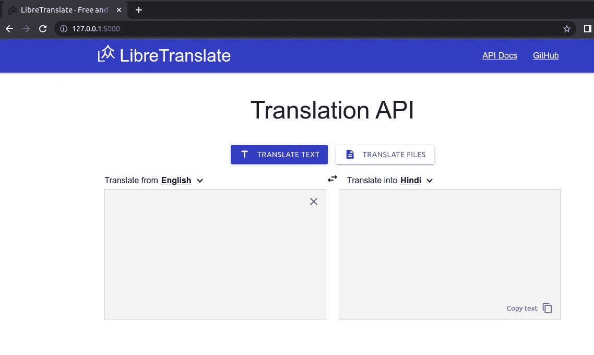
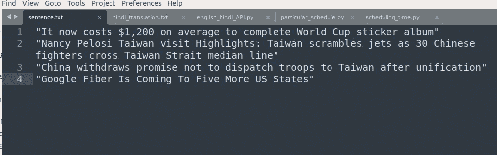
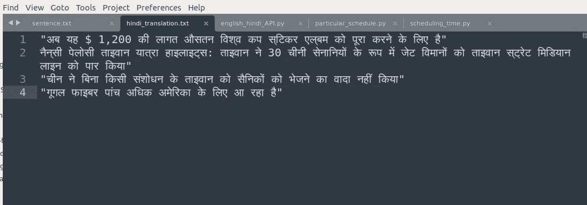

# 使用 libretranslate 进行开源语言翻译

> 原文：<https://medium.com/geekculture/open-source-language-translate-by-using-libretranslate-59d245294c17?source=collection_archive---------4----------------------->

# 什么是意译？

简单地说，它是一个开源的机器翻译 API，完全自托管。
是的，这意味着您可以在没有连接到互联网的情况下在自己的场所运行它。
*这甚至可能吗？是的，这都要感谢运行其翻译引擎的 Argos Translate。*

想试试吗？[网上试试！](https://libretranslate.com/)

**注:本指南是在 Ubuntu 上写的。**

# 装置

官方 LibreTranslate 的 Python(建议 3.8 以上)。

1.  创建一个名为 py38 的 conda 环境
2.  激活 py38 环境
3.  安装 libretranslate …⏳

```
conda create — name py38 python=3.8
conda activate py38
pip install libretranslate
```

如果在安装 libretranslate 时遇到任何问题，并且在`pyicu,`失败，则[参考](https://stackoverflow.com/a/41766057/5305748)。

# 替代方式

直接构建表单 git。我更喜欢这种方法

```
git clone [https://github.com/LibreTranslate/LibreTranslate](https://github.com/LibreTranslate/LibreTranslate)
cd LibreTranslate
pip install -e .
```

## 让我们启动 libretranslate 服务器。

要找出语言代码[参考](https://www.andiamo.co.uk/resources/iso-language-codes/)

```
python main.py --load-only en,hi
# en,hi change these language code according to your need.
```

*   英语
*   嗨:印地语



你可以在 [http://127.0.0.1:5000](http://127.0.0.1:5000) 看到它在运行。如果你不相信我，关掉你的网络连接，自己去看看吧。

# 在 Python 中编程使用 API 的演示

1.  创建了一个带有几个新闻标题名的文本文件` sentence.txt '



2.运行如下所示的脚本。

```
python english_hindi_API.py 
```

[要诀链接](https://gist.github.com/mrtushartiwari/4b3afee38edab1552843d4ceb3e88193)， [Sentence.txt](https://gist.github.com/mrtushartiwari/b55061246964b89ad6cde32ef57e316d)

3.结果转换为 hindi_translation.txt 文件。



这些成绩相当不错。随着机器翻译领域的不断进步，我们可能会在未来取得一些伟大的成果。

## 感谢 LibreTranslate 和 Argos Translate。

# 参考:

1.  【https://github.com/LibreTranslate/LibreTranslate】
2.  [https://github.com/argosopentech/argos-translate](https://github.com/argosopentech/argos-translate)