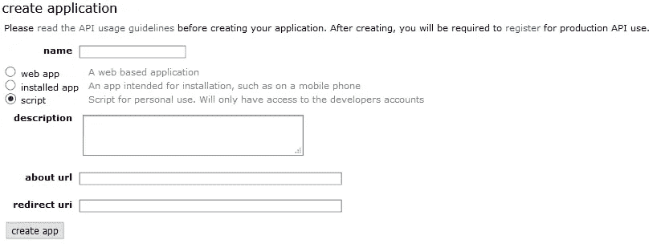
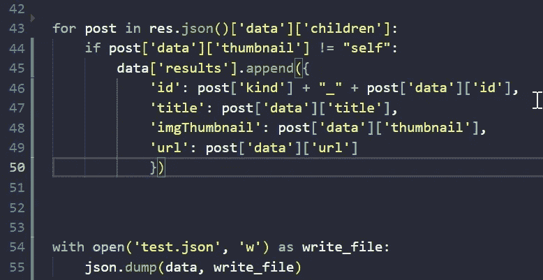

# 开源 Reddit API &用 Python 构建自定义 JSON 对象

> 原文：<https://medium.com/geekculture/open-source-reddit-api-building-a-custom-json-object-with-python-b8561a7fb9e1?source=collection_archive---------16----------------------->


最近我发现自己需要一些开源信息。有多种方法可以在网上收集信息。您可以使用 Selenium 来清理网页(尽管网站让这一工作一年比一年难)。最有效的方法之一是使用 API，最好用的方法之一是 Reddit 的。

Reddit 本身已经从网上收集了各种信息。子主题和话题是无穷无尽的。这是你想研究的任何课题的一站式商店。最近发现自己很需要这样的资料，真的很欣赏 Reddit 的开源心态。所以让我来和你分享一下。

首先登录您的 Reddit 帐户，导航到应用程序的设置(www.reddit.com/prefs/apps)，滚动到底部，在您看到开发者部分的地方单击按钮创建应用程序。



填写适当的信息。我选择了“脚本”,因为这是一个 python 脚本。在**重定向 URL 中，**我输入了我的 Twitter 账户，以防 Reddit 觉得有必要找到我。作为回报，你将得到一个个人使用的*脚本密钥*和那个甜蜜的超级*秘密密钥*。

辛苦工作之后，让我们开始写代码吧。打开您喜欢的 IDE，并导入该项目的需求。因为我们要调用一个 API，所以我们需要使用请求模块，而且因为我要创建自己的 JSON 数据库，所以我需要熊猫。

```
import pandas as pd
import requests
```

那些是我们唯一需要的工具。接下来，让我们设置我们的变量，这样我们就可以通过 python 向 Reddit 的 API *发出请求调用，在它让我们提取任何信息*之前获取我们的令牌。我将把我的个人脚本密钥和密钥加载到 CLIENT_ID 和 SECRET_KEY 中。这些将是我将在 Python 的请求模块后面使用的认证凭证。

```
CLIENT_ID = 'script_key_here'
SECRET_KEY = "secret_key_here"auth = requests.auth.HTTPBasicAuth(CLIENT_ID, SECRET_KEY)
```

现在，在我们使用请求从 Reddit 获取访问令牌之前，我们需要发送一个包含用户名和密码的数据对象。为了更好地实践，我们应该将密码保存在一个单独的文本文件中，并将其加载到一个 PW 变量中。

```
with open('pw.txt', 'r') as f:
 pw= f.read()
```

我们的数据对象将如下所示:

```
data = {
 'grant_type' = 'password',
 'username': = 'your_username_here'
 'password': = "pw"
```

很好，随着我们发送的请求，我们需要 headers 对象。

```
headers = {'User-Agent": "MyAPI/0.0.1'}
```

好了，现在我们可以创建我们的 post 变量发送到 Reddit 的 API。作为回报，我们希望将它给出的令牌保存在一个令牌变量中，并将其添加到我们的 headers 对象中，因为它丢失了。我们需要它来从 Reddit 获取信息。

要发出 post 请求并获取我们的令牌:

```
res = requests.post('http:/www.reddit.com/api/v1/access_token', auth=auth, data=data, headers=headers)
```

从那里加载令牌，我们得到一个令牌变量。

```
TOKEN= res.json(['access_token']
```

并从上面将其添加到我们的 header 对象。

```
headers['Authorization'] = f'bearer {TOKEN}'
```

最后，这就是所有这些看起来的样子。


咻…他们从没说过编码很容易。

现在我们有了令牌，我们可以从 Reddit 的 *OAuth 的 URL* 发出 get 请求。作为一名技术爱好者，我将探索技术子领域。我只需要附上我的头，和一个参数来限制返回数据的大小。

```
res = requests.get('https://oauth.reddit.com/r/technology/hot', *headers*=headers, *params*={'limit': '50'})
```

从这里开始，我可以用这些信息构建我的 JSON 对象。首先，让我初始化我的数据对象，就像格式化 JSON 文件一样。

```
data={"results": []}
```

好的，在打印出 **res.json()** 来查看 Reddit 返回的信息后，我知道我想要的数据在**[‘数据’][‘孩子’]**中。特别是，我正在为自己的技术网站寻找每个技术帖子的**标题**、**图片**和 **URL** 。我也看到一些 Reddit 上的帖子是自我提问，而不是真正的新闻帖子。在我的 for 循环中，我将创建一个条件来跳过这些，这样我的 JSON 就尽可能干净。

是时候使用 for 循环了，并把它添加到我的数据对象中。



现在我的数据已经填写完毕，我可以使用 JSON.dump()编写一个 JSON 文件。

嘣，我有了自己的 JSON 文件，里面有我想要的直接来自 Reddit 自己的 API 的信息！

如果你正在寻找一种简单的方法来清除网上的一些信息，我希望这能对你有所帮助。有了 python 的力量，网络就是你的了。不要让他们告诉你不同的答案。