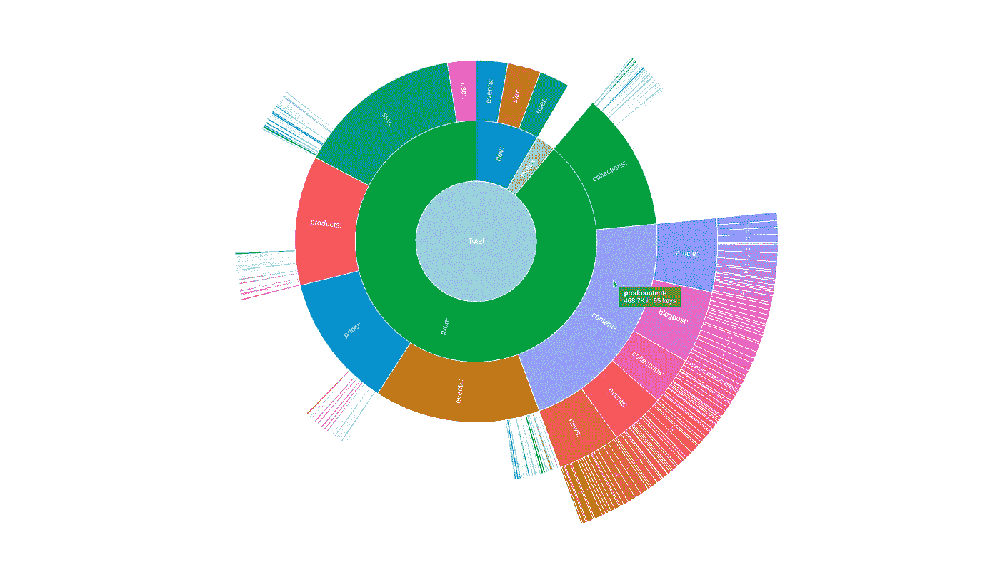

# 开源 Redis 库存工具使用 AnyChart JS 分层可视化 Redis 内存使用情况

> 原文：<https://medium.com/geekculture/open-source-redis-inventory-tool-visualizes-redis-memory-usage-hierarchically-using-anychart-js-e92ef38b838e?source=collection_archive---------16----------------------->

众所周知，未燃图对于可视化分层数据结构非常有用。所以毫不奇怪，在我们[将](https://www.anychart.com/blog/2018/03/27/javascript-chart-libraries-anychart-anygantt-anystock-anymap-8-2-0/)添加到 [AnyChart](https://www.anychart.com) JavaScript 库之后，这种图表类型立即在我们的用户中大受欢迎。因为我们全球[客户群](https://www.anychart.com/company/customers/)的核心是企业客户，我们的 JS sunburst 图表的大多数真实用例都隐藏在内部企业应用程序中。但是 AnyChart 也经常被用于开放项目中的数据可视化，我们邀请您来看看我们最近发现的一个超级酷的例子—[**Redis Inventory**](https://github.com/obukhov/redis-inventory)。这是一个开源工具，可以很容易地通过关键模式以分层的方式查看 Redis 内存使用情况，并带有一个交互式 sunburst 图表。

通过我们对 Redis Inventory 的创建者 Aleksandr Obukhov 的快速采访，了解更多关于 Redis Inventory 和 AnyChart 如何在那里使用的信息。(堆栈:Go/Cobra/Redis。)

## 嘿亚历山大！让我们从一个简单的介绍开始。你能告诉我们关于你自己和你做什么的社区吗？

亚历山大·奥布霍夫:我叫亚历山大·奥布霍夫，是一名软件工程师。目前，我位于德国柏林，在一家名为 AMBOSS 的公司工作，该公司是德国医学生和执业医生在线教育的领导者。

我来自俄罗斯。我出生在附近的一个小镇，在莫斯科学习计算机科学，然后在职业生涯的头十年在那里生活和工作。

我主要在在线教育网络服务的后台领域工作。我目前的职位是工程经理，但我会尽可能地让自己参与到技术中。

## **A:你是怎么想出 Redis 库存这个主意的？**

AO:我们在我们的技术堆栈中广泛使用 Redis，一旦我们面临存储在 Redis 中的数据量增加的问题，很难追溯原因。工具的想法就是这样出现的。

我已经有了通过编写一个名为 [go-redis-migrate](https://link.medium.com/VLC1HaoQYib) 的开源工具来高效解决与 Golang 相关的 Redis 问题的经验。我想创建这个新的 [Redis Inventory](https://github.com/obukhov/redis-inventory) 工具，作为另一个有益于他人的开源项目。我看到其他潜在用户有同样的问题，调查数据缓存策略的健康状况。我相信，这个问题对于 web 应用程序来说是很常见的。

## **答:这个工具目前的功能是什么，你打算如何进一步开发它？**

AO:该工具索引 Redis DB，记录值和相应键的大小。它试图识别关键模式，并构建一个称为“前缀树”的结构来分层表示数据。更多细节你可以参考我在 Medium 上的博客文章——我试图涵盖所有的细节。

我已经在一些数据集上进行了测试，结果和我想象的完全一样。当然，进一步的使用表明需要一些改进。

我有一些还没有实现的想法，比如收集关于 TTL 的数据。我可能最终会开发它们，但它们不是“核心”功能的一部分。当然，如果有人缺少某些功能，我也欢迎贡献。

## **答:数据可视化在 Redis 库存中起什么作用？**

AO:该工具支持两种主要的表示格式:文本格式和图形格式(用 AnyChart 实现的旭日图),文本格式很方便，您可以直接在终端上看到。我认为，可视化使浏览数据变得更容易，因为与文本输出不同，您可以立即看到某些关键前缀的比例。下钻功能有助于获取详细信息，如有必要，可以“放大”。

## **答:你为什么决定在旭日图中显示数据，而不是其他类型的可视化？**

AO:我考虑了两种图表类型:[旭日图](https://www.anychart.com/chartopedia/chart-type/sunburst-chart/)和[树形图](https://www.anychart.com/chartopedia/chart-type/treemap/)。两者都很好，都很适合这个目的。第一种用在 Ubuntu Disk Analyzer 中，后者用在 Disk Inventory X 中，我用那两个软件作为我项目的参考。到目前为止，我只实现了一个旭日图，因为它更适合部分数据。但也许我会添加一个树形图。

## **答:您能分享一下 Redis 库存技术方面的更多细节吗？你的筹码是多少？使用这种技术运行任何图表是否足够简单？**

AO:软件的技术栈是 Go。它简单、功能强大，并且可以针对不同的平台进行交叉编译。我使用 Cobra 框架构建 CLI 界面，Radix 作为 Redis 客户端，go-pretty 格式化文本输出。我已经编写了自己的 trie 数据结构实现；我找到了一个库，但由于特定的聚合逻辑，它并不合适。数据结构要么保存在内存中，要么保存到临时文件中/从临时文件中加载。AnyChart [整合](https://www.anychart.com/technical-integrations/)相当顺利——最初的整合用了不到一个小时。

## **A:你为什么在你的项目中选择 AnyChart 进行数据可视化？你最喜欢什么？**

AO:老实说，前端技术并不是我的强项。所以对我来说，主要原因是简单集成和定制能力之间的平衡。正如我所说的，我能够在不到一个小时的时间内通过编写几乎没有过程性的代码(只有初始化，大部分是声明性的)来连接它。然后我使用方便的回调来定制标签、工具提示和颜色。

## 从你的角度来看，我们的 JavaScript 图表库应该改进什么？

AO:我不能建议任何特别的代码改进。但是从“用户”的角度来看，我认为这个库可以改进视觉主题，不仅包括调色板，还包括为特定图表分配颜色的逻辑。我不得不为嵌套的扇区想出自己的着色逻辑，因为标准解决方案没有足够的颜色。但是，由于回调，集成变得很容易，尽管弄清楚实际的逻辑并不容易。

## 你能推荐一张图表吗？

AO:当然，AnyChart 有很多内置特性，并且易于使用和集成。对于和我类似的项目，开源的或者教育类的，绝对是一个很棒的选择。当然，商业产品必须考虑[许可](https://www.anychart.com/buy/)成本，我相信 AnyChart 可以很好地满足那些需要在实现中保持一致的大量图表的产品。在这种情况下，使用这样一个成熟的库很可能比内部开发和维护更便宜。

## 亚历山大，谢谢你抽出时间和我聊天！万事如意！

***想分享你的 AnyChart 故事？*** [***联系我们***](https://www.anychart.com/support/) ***。***

***另见:*** [***AnyChart 客户成功案例***](https://www.anychart.com/company/success_stories/) ***。***

*原载于 2021 年 9 月 29 日 https://www.anychart.com***。**