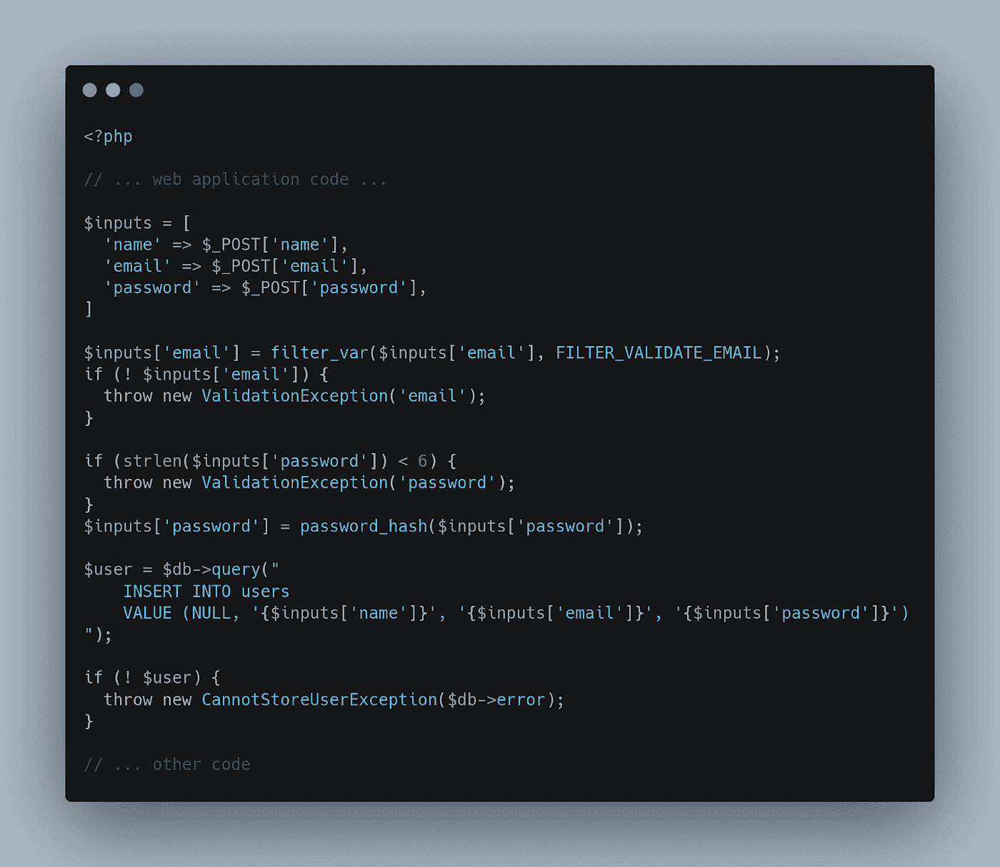

# Web 开发中的开源漏洞

> 原文：<https://medium.com/geekculture/open-source-vulnerabilities-in-web-development-f55fecbc766a?source=collection_archive---------33----------------------->

Photo by [Nahel Abdul Hadi](https://unsplash.com/@nahelabdlhadi?utm_source=medium&utm_medium=referral) on [Unsplash](https://unsplash.com?utm_source=medium&utm_medium=referral)

你刚收到一封电子邮件:你的一个网络应用程序坏了。您的客户数据已经泄露，加密密钥也不见了。当局正在去你公司的路上。你准备好去墨西哥了吗？那就是你突然醒悟的时候。那是一场噩梦，但它可能会成真。因此，如果您的 web 应用程序已经投入生产，那么是时候进行安全审计了。

开发 web 应用程序有许多理念和实践——k . I . s . s(“保持简单，愚蠢”)、设计安全、设计隐私等等。所有这些策略和实践都是为了让您在 web 应用程序开发阶段保持专注。

例如，欧洲 GDPR 的出现打破了许多开发者和公司的开发过程和惯例。开发人员并不总是关注隐私和安全，然而现在，这些原则在开发过程中被例行考虑。

在本文中，我们将了解提高软件安全性的不同方法。我们还将讨论像这样的工具，以及如何使用它们为您的应用程序开发流程设计更强大的安全框架。

# 漏洞就在拐角后面

即使没有安全工程师，保护 web 应用程序的方法也有很多。根据您的资源，您可以通过以下 5 种方式之一来实现。您可以以某种组合方式实现它们，也可以全部实现。

1.  **设计回顾**:在设计应用程序时，您还应该考虑应用程序可能面临的所有威胁，并将系统设计得具有弹性。
2.  **白盒安全审查(代码审查)**:除非你是一名安全工程师，而且你是一个人在设计和编码你的项目，否则这个步骤应该两人一组进行，一名安全工程师在你的代码中寻找缺陷。即使你是一名安全工程师，获得第二种意见也不是一个坏主意。
3.  **黑盒安全审计**:获取你的源代码，并把它收起来。然后运行 web 应用程序，检查它在使用过程中是否安全。你甚至可以让别人来做这件事。让其他人审核您的应用程序将会通过排除您在测试时的无意识偏见来改进审核。
4.  自动化工具制作:这是我的最爱之一。即使在开发项目的过程中，也有许多工具可以用来扫描代码，查找更常见的错误、模式或与安全相关的问题。
5.  **协同漏洞平台**:这种方法简单但功能强大。一旦你完成了你的测试和审计，你可以付钱给一个高度专业化的白帽黑客公司来攻击你的 web 应用程序，并生成一份关于它的错误/漏洞和问题的报告。

现在你知道了可以采取什么步骤来保证你的软件安全，但是如果你想写一个“更少 bug 的软件”呢？

# 知识就是力量:资源和工具

让我们深入一下第一步，设计阶段。在设计过程中，您可以查看一些著名的资源，如 [OWASP](https://owasp.org/www-project-top-ten/) ( *开放 web 应用安全项目*)十大风险，以了解哪些是 Web 应用安全中最常见的风险。例如，根据 OWASP 基金会，web 应用程序安全的第一个风险是**注入缺陷**。

让我们休息一下，分析一下使用 SQL 语言的注入有哪些。根据 [2020 StackOverflow 开发者调查](https://insights.stackoverflow.com/survey/2020#technology-programming-scripting-and-markup-languages)，SQL 是现在最常用的查询语言之一，使其成为第三大最专业使用的语言(基于 47，000 名专业开发者提取的统计数据)。

考虑这样一段代码:

[Checkout this code snippet](https://carbon.now.sh/?bg=rgba%28171%2C+184%2C+195%2C+1%29&t=seti&wt=none&l=auto&ds=true&dsyoff=20px&dsblur=68px&wc=true&wa=true&pv=56px&ph=56px&ln=false&fl=1&fm=Hack&fs=14px&lh=133%25&si=false&es=2x&wm=false&code=%253C%253Fphp%2520%250A%2520%2520%250A%252F%252F%2520...%2520web%2520application%2520code%2520...%250A%2520%2520%250A%2524inputs%2520%253D%2520%255B%250A%2520%2520%27name%27%2520%253D%253E%2520%2524_POST%255B%27name%27%255D%252C%250A%2520%2520%27email%27%2520%253D%253E%2520%2524_POST%255B%27email%27%255D%252C%250A%2520%2520%27password%27%2520%253D%253E%2520%2524_POST%255B%27password%27%255D%252C%250A%255D%253B%250A%250A%2524inputs%255B%27email%27%255D%2520%253D%2520filter_var%28%2524inputs%255B%27email%27%255D%252C%2520FILTER_VALIDATE_EMAIL%29%253B%250Aif%2520%28%21%2520%2524inputs%255B%27email%27%255D%29%2520%257B%250A%2520%2520throw%2520new%2520ValidationException%28%27email%27%29%253B%250A%257D%250A%250Aif%2520%28strlen%28%2524inputs%255B%27password%27%255D%29%2520%253C%25206%29%2520%257B%250A%2520%2520throw%2520new%2520ValidationException%28%27password%27%29%253B%250A%257D%250A%2524inputs%255B%27password%27%255D%2520%253D%2520password_hash%28%2524inputs%255B%27password%27%255D%29%253B%250A%250A%2524user%2520%253D%2520%2524db-%253Equery%28%2522%250A%2509INSERT%2520INTO%2520users%250A%2520%2520%2520%2520VALUE%2520%28NULL%252C%2520%27%257B%2524inputs%255B%27name%27%255D%257D%27%252C%2520%27%257B%2524inputs%255B%27email%27%255D%257D%27%252C%2520%27%257B%2524inputs%255B%27password%27%255D%257D%27%29%250A%2522%29%253B%250A%250Aif%2520%28%21%2520%2524user%29%2520%257B%250A%2520%2520throw%2520new%2520CannotStoreUserException%28%2524db-%253Eerror%29%253B%250A%257D%250A%250A%252F%252F%2520...%2520other%2520code)

如您所见，输入被直接传递给 SQL 引擎，没有适当的绑定或转义。使用基于错误的攻击，攻击者可以发现关于您的代码运行的架构的敏感信息，或者使用 SQL 过程存储文件来存储反向外壳！

这显然是最糟糕的情况，但你不会想接近这种情况。如果你不知道这种注射，跑到你旁边的第一个终端，尽快解决这个问题！

现在转到另一种验证。让我们看看**静态应用程序安全测试** (SAST)，这代表了我们清单的第四点。这种方法包括使用工具对您的代码或整个项目进行安全性测试。

让我们看一些例子。如果你有一个 composer 项目，你可以使用像[本地 PHP 安全检查器](https://github.com/fabpot/local-php-security-checker)这样的工具。它是一个命令行工具，可以审计您的应用程序依赖性，并检查您所依赖的东西是否损坏或有已知的缺陷或错误(它不总是在您身上，您的依赖性也可能是您的缺陷)。

或者您可以使用 Phan 之类的东西来审计您的应用程序，检查从弃用到不安全访问等各种问题。如果你正在使用一个框架，你应该检查一下专门的工具，比如用于 Laravel 的 [Larastan](https://github.com/nunomaduro/larastan) 。

Photo by [Pankaj Patel](https://unsplash.com/@pankajpatel?utm_source=medium&utm_medium=referral) on [Unsplash](https://unsplash.com?utm_source=medium&utm_medium=referral)

如果你已经在编码领域工作了足够长的时间，你可能已经理解了整个验证过程会很快成为大型项目的噩梦，在大型项目中，三个以上的开发人员相互交谈并使用相同的编码风格和约定。即使您使用具有强提交策略的 git 存储库，也可以通过忽略钩子的强制推送来轻松绕过它。

因此，如果您无法检查本地策略或将策略转移到其他地方，您可以使用免费应用程序，如 [WhiteSource Bolt](https://www.whitesourcesoftware.com/free-developer-tools/bolt) 来扫描您的代码，并在代码中出现常见错误时自动打开问题。Bolt 是一款免费工具，旨在帮助您找到并修复开源漏洞。多语言开发人员可能会对这个工具非常感兴趣，因为它支持多种语言。

如果你是一个白天编写 C 代码的嵌入式软件开发人员，晚上编写 PHP 代码的 web 开发人员，那么你可以使用一个工具就可以对你的整个存储库进行审计。

# 结论

既然您已经知道了一些可以用来保护您的 web 应用程序的最佳实践，那么就全靠您了。请记住:在开发过程中花费更多的时间在安全性上，可以显著减少您稍后在生产上花费的时间。不要忽视那些可以用静态分析器解决的常见问题。

为了你和一个更好的互联网，在设计软件，尤其是网络应用时，永远把安全放在第一位！