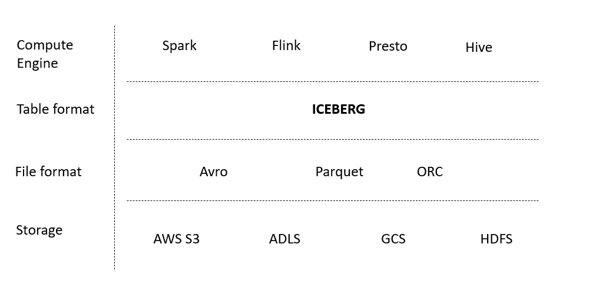
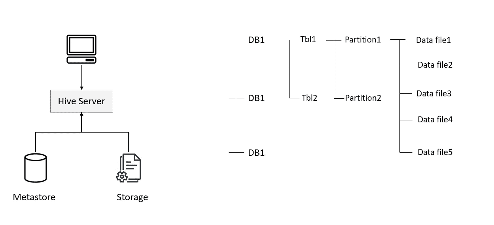
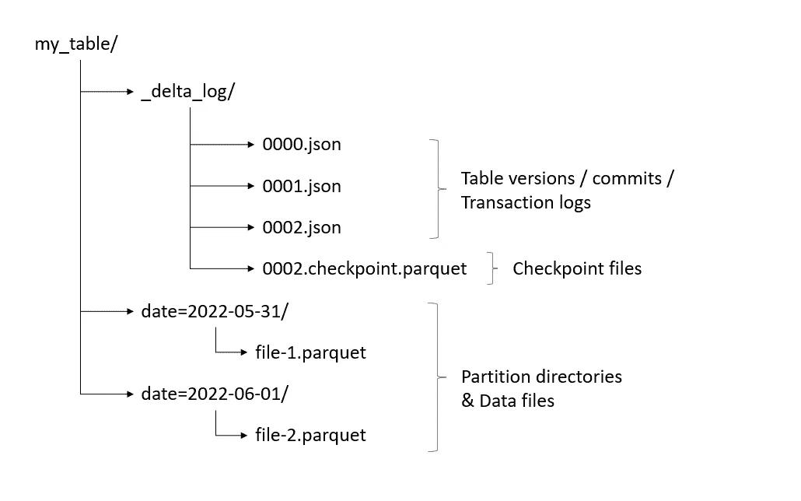
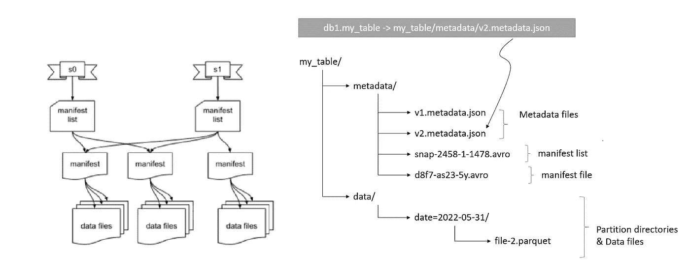
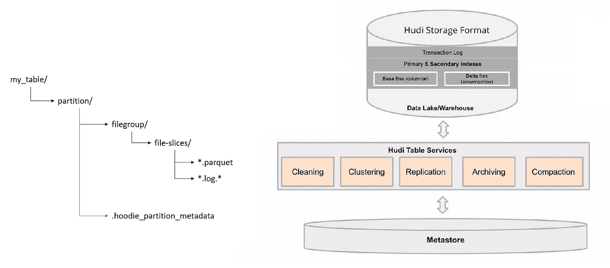
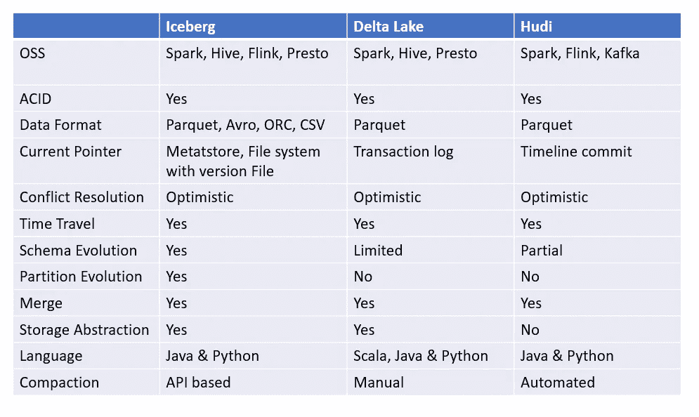

# 开放式表格格式—德尔塔、冰山和胡迪

> 原文：<https://medium.com/geekculture/open-table-formats-delta-iceberg-hudi-732f682ec0bb?source=collection_archive---------0----------------------->

关于新表格格式的介绍文章

## 什么是表格格式？

表格格式是组织数据文件的一种方式。他们试图给数据湖带来类似数据库的特性。



Apache Hive 是最早和最常用的表格式之一。



Hive Table format

hive 表格式存在以下问题:

> 陈旧表统计数据(分区生命周期)
> 强迫用户了解物理数据布局
> 缺乏沿袭/历史
> 缺乏模式进化

Hive 是前云时代写的。它不是为对象存储而写的(hive 的数据组织结构是一种对象存储的反模式)。因此，当新的使用模式出现在云中时，它的性能开始受到影响。Hive 中的元数据表增长迅速，降低了其性能。

随着 data domain 的增长，新的使用情形出现了，要求从当前的数据湖中获得一组新的功能。新系统主要要求数据湖具有以下特性:

> 事务(ACID)
> 统一批处理&流式传输
> 数据突变(针对延迟数据到达的合并/纠正选项)
> 模式实施、进化&版本控制
> 元数据缩放

除此之外，还需要支持新的用例:

> 时间旅行
> 并发读取&写入
> 独立消耗来自存储
> 数据质量
> 可插拔存储

为了解决这些问题，社区开始创建新的开放表格格式。在这篇博客中，我们将讨论以下三点:

> 三角洲表—数据块
> 冰山—网飞
> 胡迪—优步

## 增量表

增量表是带有事务日志的拼花表。



Delta table format representation

**增量日志—** 它是对增量表上执行的所有操作的变更日志。这些动作就是 1。添加文件 2。删除文件 3。更新元数据 4。设置交易 5。改变协议和 6。提交信息。增量日志包含 JSO 文件，这些文件存储反映增量表在任何给定时间的状态。

**数据文件—** 保存实际数据的拼花文件。这些在本质上是不可改变的。如果在提交中，文件的行将受到影响，那么当前文件中的所有行都将被加载到内存中，应用更新，并作为新文件写出。在此之后，当旧的拼花文件从状态中移除并且新的拼花文件被添加到状态中时，提交被记录在增量日志中。

如果您投资了 Databrick 的产品，这种表格格式是一个很好的选择。

```
from pyspark.sql import SparkSession
from delta import DeltaTable

spark = SparkSession.builder \
    .appName("Delta with PySpark") \
    .config('spark.jars.packages', 'io.delta:delta-core_2.12:2.1.1') \
    .config("spark.sql.extensions", "io.delta.sql.DeltaSparkSessionExtension") \
    .config(
        "spark.sql.catalog.spark_catalog",
        "org.apache.spark.sql.delta.catalog.DeltaCatalog",
    ) \
    .config("spark.sql.warehouse.dir", "spark-warehouse") \
    .master("local[*]") \
    .enableHiveSupport() \
    .getOrCreate()

df_sales = spark.read.parquet("dataset/sales.parquet/*parquet")
df_sales.write \
    .format("delta") \
    .mode("overwrite") \
    .option("mergeSchema", True) \
    .saveAsTable("sales_delta_managed_delta")

dt = DeltaTable.forName(spark, "sales_delta_managed")
dt.history().select("version", "timestamp").show(truncate=False)

%%sparksql
select * from default.sales_delta_managed limit 5;
update default.sales_delta_managed set amount = 428 where trx_id = 123

dt.history().select("version", "timestamp").show(truncate=False)
```

## 冰山

> 在 Iceberg 中，元数据在三个文件中被跟踪:1 .元数据文件 2。清单 3。清单文件。



## 元数据. json

此文件包含有关表的元数据的信息。它包含以下小节:

*   **快照** —快照表中所有文件的完整列表。它包含关于表模式、分区规格 T24 清单位置的信息。
*   **模式** —它跟踪表模式。所有表模式更改都在 schemas 数组中进行跟踪。
*   **分区规格** —跟踪分区信息。
*   **分拣订单**

**清单列表** —包含所有清单及其指标(清单文件为分区列跨越的值范围)的文件。充当清单&快照之间的链接。

**清单** —数据文件、其格式、位置和指标的列表(文件的每列界限或文件级别，如行数)

**数据文件** —实际的物理文件。

Iceberg 将有助于解决与 S3 对象列表或 Hive Metastore 分区枚举相关的性能问题。

注意:有一个插件叫做 ***Hiveberg*** 可以让我们从 Hive metastore 中读取冰山表。

```
from pyspark.sql import SparkSession

spark = SparkSession.builder \
    .appName("Icerberg with PySpark") \
    .config("spark.jars.packages", "org.apache.iceberg:iceberg-spark-runtime-3.2_2.12:1.0.0") \
    .config("spark.sql.extensions", "org.apache.iceberg.spark.extensions.IcebergSparkSessionExtensions") \
    .config("spark.sql.catalog.spark_catalog", "org.apache.iceberg.spark.SparkSessionCatalog",) \
    .config("spark.sql.warehouse.dir", "spark-warehouse") \
    .config("spark.sql.catalog.spark_catalog.type", "hive") \
    .config("spark.sql.catalog.demo", "org.apache.iceberg.spark.SparkCatalog") \
    .config("spark.sql.catalog.demo.warehouse", "path/to/warehouse")
    .config("spark.sql.catalog.iceberg.type", "hadoop") \
    .config("spark.sql.defaultCatalog", "demo")
    .master("local[*]") \
    .enableHiveSupport() \
    .getOrCreate()

df_sales = spark.read.parquet("dataset/sales.parquet/*parquet")
df_sales.write \
    .format("iceberg") \
    .mode("overwrite") \
    .saveAsTable("sales_delta_managed_iceberg")
```

用于 Nessie 的配置

```
org.projectnessie:nessie-spark-extensions-3.3_2.12:0.44.0 # Library for working with Nessie-based catalogs like Dremio Arctic
org.projectnessie.spark.extensions.NessieSparkSessionExtensions
spark.sql.extensions="org.apache.iceberg.spark.extensions.IcebergSparkSessionExtensions,org.projectnessie.spark.extensions.NessieSparkSessionExtensions" \
spark.sql.catalog.nessie.uri=$ARCTIC_URI \
spark.sql.catalog.nessie.ref=main \
spark.sql.catalog.nessie.authentication.type=BEARER \
spark.sql.catalog.nessie.authentication.token=$TOKEN \
spark.sql.catalog.nessie.catalog-impl=org.apache.iceberg.nessie.NessieCatalog \
spark.sql.catalog.nessie.warehouse=$WAREHOUSE \
spark.sql.catalog.nessie=org.apache.iceberg.spark.SparkCatalog \
spark.sql.catalog.nessie.io-impl=org.apache.iceberg.aws.s3.S3FileIO
```

## Iceberg 中的文件格式

> 数据— parquet
> 元数据— JSON
> 清单列表— avro
> 清单— avro

**冰山酸支持:**

在 Iceberg 中，编写器启动更新，创建元数据文件，并尝试通过将元数据文件指针从当前版本交换到新版本来提交更新。但是，如果编写器发现更新所基于的快照不再是最新的，则编写器必须基于新版本重试更新。

> 一个表元数据文件与另一个表元数据文件的原子交换为可序列化隔离提供了基础。

读取与并发写入相隔离，并且总是使用表数据的已提交快照。

## 胡迪



**索引** —记录关键字和文件组/文件 id 之间的映射

**时间线** —不同时刻在桌子上执行的所有动作的事件顺序。

**数据文件**——拼花格式的实际数据文件。

如果您有各种各样的数据湖文件消费工具，并且需要管理不断变化的数据集，这似乎是一个不错的选择。

```
from pyspark.sql import SparkSession

spark = SparkSession.builder \
    .appName("Hudiwith PySpark") \
    .config("spark.jars.packages", "org.apache.hudi:hudi-spark3.2-bundle_2.12:0.11.1") \
    .config("spark.sql.extensions", "org.apache.spark.sql.hudi.HoodieSparkSessionExtension") \
    .config("spark.sql.catalog.spark_catalog", "org.apache.spark.sql.hudi.catalog.HoodieCatalog",) \
    .config("spark.sql.warehouse.dir", "spark-warehouse") \
    .config("spark.sql.catalog.spark_catalog.type", "hive") \
    .master("local[*]") \
    .enableHiveSupport() \
    .getOrCreate()

df_sales = spark.read.parquet("dataset/sales.parquet/*parquet")
df_sales.write \
    .format("hudi") \
    .mode("overwrite") \
    .saveAsTable("sales_delta_managed_hudi")
```

## 摘要



快乐阅读！！