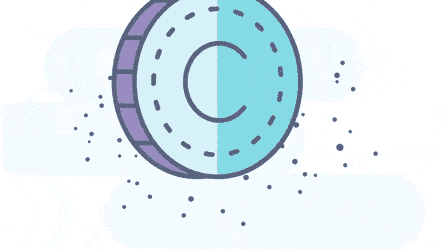
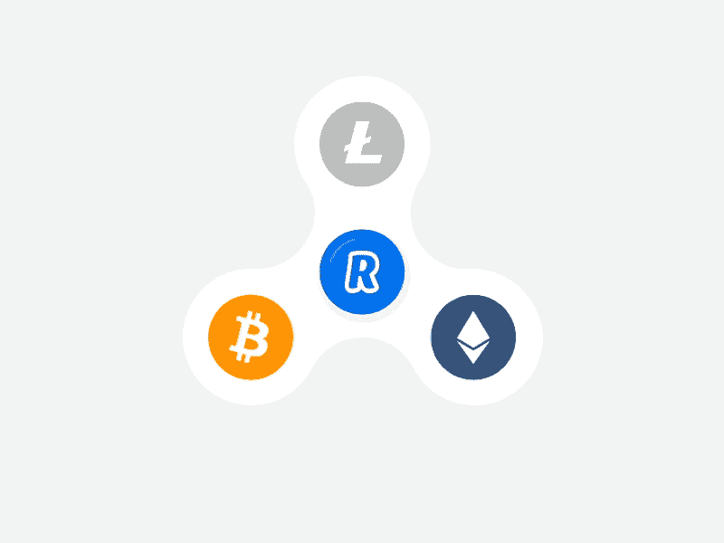

# 打开来见证 5 大加密货币交易平台开发公司的至高无上

> 原文：<https://medium.com/geekculture/open-up-to-witness-the-supremacy-of-the-top-5-cryptocurrency-exchange-platform-development-1010451ed78c?source=collection_archive---------18----------------------->

什么是密码？是什么让这些术语在市场和环境中占据主导地位？这些问题可能会闪过你的脑海，也可能是你开车来这里的原因。自从密码进化以来，近年来一直在蓬勃发展。许多大人物和商界人士都将 cryptos 作为二次收入的领域。但是 cryptos 能够产生比预期条款更多的收入。cryptos 的热点是加密交换平台，它吸引用户参与到他们可以交换他们想要的硬币的活动中。我们希望提供关于五大加密货币交易平台开发公司的信息，以启发您选择最佳公司。

**什么是加密货币交易平台？**

该公司是通过 cryptos 创收的主要媒介。 [**加密货币交易平台**](https://www.inoru.com/cryptocurrency-exchange-script) 是区块链的竞技场，加密创业者将在这里入侵并参与硬币交易。用户可以将他们的法定货币兑换成想要的货币，如比特币、以太币、莱特币、Dogecoins 等。所有平台用户必须拥有一个数字加密钱包，这将是所有硬币和货币以及进一步加密数据的存储点。

加密货币交易平台让参与论坛的全职和兼职交易者都感到宽慰。凭借聚合的安全功能，该平台在将所有信息置于安全的保护之下以避免网络钓鱼攻击和黑客攻击方面占据优势。提供多种支付选项，如卡支付、网上银行和支付方式，使交易变得轻松快捷。支付方式被配置为方便具有不同途径的用户。

一个基于区块链的加密交换平台

正如我们已经提到的，加密货币交易平台是基于理想的区块链技术开发的。以太坊、币安和多边形等各种区块链是有效的加密货币交易平台的基础，其中区块链因素影响平台的工作。NFT 和加密货币平台建立在这些有影响力的技术之上，使平台更加有趣，具有多样化的智能合约。此外，钱包必须注入区块链技术，以简化的方式保存和储存硬币。此外，投资于 arena 的智能合约负责平台内的所有操作，如交易、交换和存储。所有这些品质使它成为一个稳定的密码交换平台，这是一个著名的开发公司必须开发的。由于区块链是复杂的，它需要适当的知识；占主导地位的加密货币开发公司解释了它，并使它变得优雅。开发公司可以将理想的区块链技术与加密货币交换平台结合起来，形成一个引人入胜的交换平台。

**加密交换平台版本**

由于存在不同种类的加密货币，因此存在不同类型的加密交换平台，这些平台展现出独特的品质和特征，从而使得平台多样化。我们将提供不同种类的场地，这将启发你选择和发展所需的舞台。

**集中交易所(CEX)**

顾名思义，这个平台盛行的是集中化，专注于安全，阻碍没有注册就进入的人。这个平台增加了先进的流动性。

**分散交换(DEX)**

DEX 平台运行在智能合约上，使得平台具有先进性。此外，所有的行动都由区块链控制，资产和硬币都存储在区块链的存储分类账中。

**即时交换**

该应用程序允许用户进行即时交换，从而节省了时间并增加了交易便利。

**混合交易所**

这个交换平台结合了 CEX 和 DEX，为用户提供了综合的用户体验。

**排名前五的加密货币交易平台开发公司**

现在我们已经谈到了这个博客的主题。在对加密货币交易平台及其品种有了足够的了解后，我们在此讨论排名前 5 位的最高加密货币交易平台开发公司。

**INORU**

凭借多年的应用开发经验，INORU 已经涉足区块链分类，他们非常擅长开发面向平台，如 [**加密交换脚本**](https://www.inoru.com/cryptocurrency-exchange-script) 和 NFT 市场。INORU 提供钱包开发和 MLM 开发服务，这是为各种新手和有经验的交易者开放的设施。

**AppDupe**

一家总部位于印度的开发公司在开发与区块链相关的平台方面拥有丰富的知识和经验。他们还为 NFT 的发展提供各种服务。除此之外，他们还有经验丰富的开发人员来抑制对密码的狂热

有了新的加密交换平台。

**区块链 App 工厂**

以区块链的名字命名，这家公司是区块链领域的前戏。他们在开发面向平台方面有丰富的经验和更广泛的知识。他们的总部在印度，在英国等国家有分公司。

**安铁**

这家总部位于印度的开发公司在开发各种数字领域(如加密货币、NFTs 以及钱包、硬币和货币等相关产品)和去中心化金融平台方面拥有令人振奋的 6 年经验。据报道，他们在开发面向加密的平台方面经验丰富。

**CES**

Cryptocurrency Exchange Script 是一家总部位于印度的开发公司，由开发人员组成，他们为流行的加密交换平台开发脚本，并根据业务需求定制脚本。这促使全球见证了新的定制加密交换平台。

**总结**

密码每天都在变大，这使得企业家和商业头脑进入密码领域并增加收入变得非常必要。我们已经提到了加密货币交换平台和渲染开发的前 5 名公司；你可以很快接触到最好的公司，并建立一个无可挑剔的加密货币交换平台。