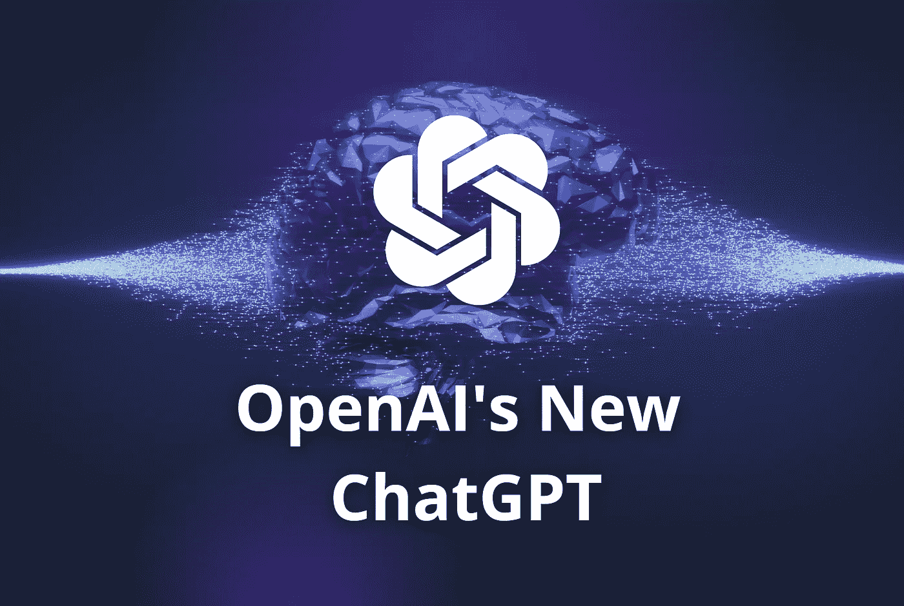

# OpenAI 发布了 chat GPT——一个非常智能的聊天机器人

> 原文：<https://medium.com/geekculture/openai-released-chatgpt-an-incredibly-smart-chatbot-889b59968383?source=collection_archive---------3----------------------->

Image by [Jim Clyde Monge](https://medium.com/u/819323b399ac?source=post_page-----889b59968383--------------------------------)

随着最近 [ChatGPT](https://openai.com/blog/chatgpt/) 的发布，人工智能世界又向前迈出了一大步，这是由 [OpenAI](https://openai.com/) 开发的一种新的人工智能对话语言模型(LM)。

## 什么是 ChatGPT？

简而言之，ChatGPT 是一个基于文本的人工智能模型，它利用自然语言处理的能力来产生类似人类的对话。模型可以回答…