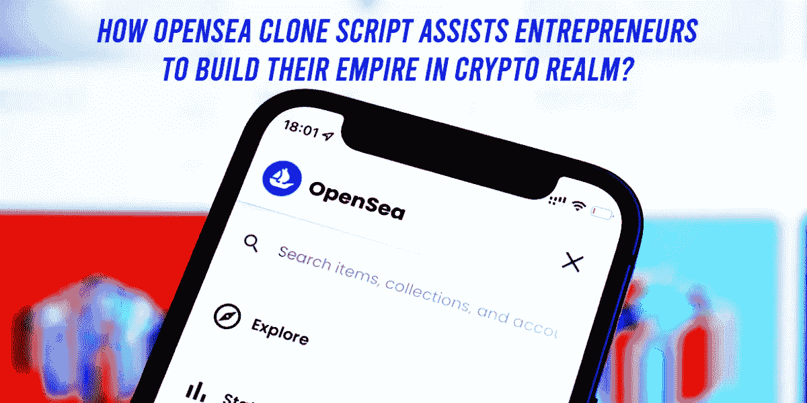
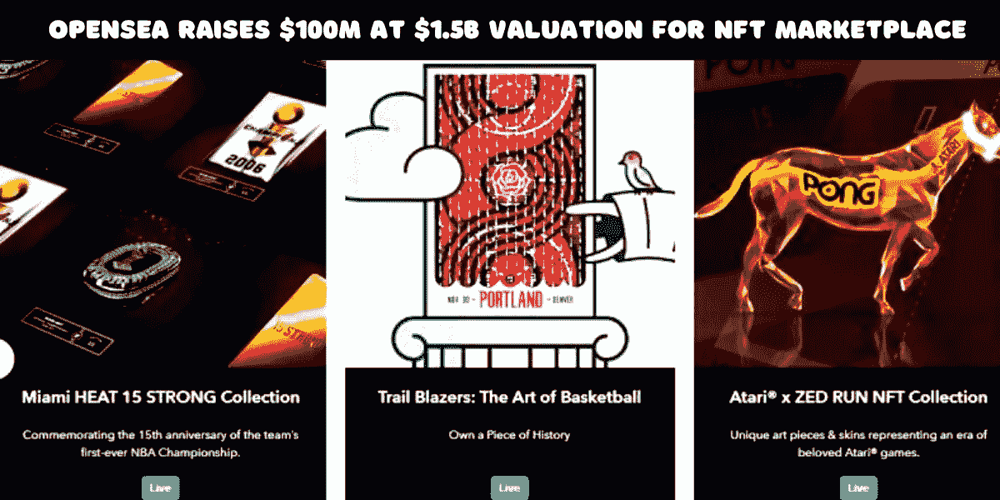

# OpenSea 克隆-企业家在密码领域建立他们的帝国？

> 原文：<https://medium.com/geekculture/opensea-clone-entrepreneurs-to-build-their-empire-in-crypto-realm-d17ffd1b1a41?source=collection_archive---------17----------------------->

**OpenSea Clone — Entrepreneurs To Build Their Empire In Crypto**

NFT 市场是 NFT 世界中最重要的部分。它是艺术家和世界各地收藏家之间的桥梁。当买家购买 NFT 时，他们拥有该资产的全部所有权，可以在多个二级市场上下注或出售以获得激励。数字资产的所有权无法伪造，因为它存储在区块链上。区块链网络用于在市场上交易不可替代的代币。

OpenSea NFT 市场 是业界第一个也是最受欢迎的平台。这个 [***NFT 交易所***](https://www.cryptocurrencyexchangescript.com/nft-exchange-development?utm_source=medium&utm_medium=guestblog&utm_campaign=vigneshraju) 是一个开放式交易所，交易图像文件、视频剪辑、域名、交易卡、艺术品收藏等不可替代的代币。开放海洋克隆人市场建立在以太坊区块链上，就像其他市场一样。OpenSea 市场是目前最受欢迎和使用最广泛的市场。因此，一些公司投入时间和资源开发自己的*[***NFT 市场，如 OpenSea***](https://www.cryptocurrencyexchangescript.com/opensea-like-platform-development?utm_source=medium&utm_medium=guestblog&utm_campaign=vigneshraju) 。然而，像 OpenSea 一样建立一个不可替代的令牌市场是一个耗时的过程。因此，采用了 OpenSea 克隆方法。预计它将为采用这一开发过程的组织提供所有的基本特性和好处。*

# ****Opensea 克隆脚本—简介****

*OpenSea 克隆版是一个*[***分散的白牌 NFT 市场***](https://www.cryptocurrencyexchangescript.com/white-label-nft-marketplace?utm_source=medium&utm_medium=guestblog&utm_campaign=vigneshraju)*，它在区块链网络上进行交易，购买和出售数字资产。OpenSea 克隆脚本解决方案的每个功能都建立在 OpenSea 平台的基础上，包括从区块链的采用到仪表板前端风格的一切。这些技术特性和特征与在 OpenSea 市场上发现的相同。***

# ***Opensea Clone 的突出特点***

******

*****OpenSea raises $100M at $1.5B valuation*****

******诱人用户界面:******

**用户界面是 NFT 市场的一个主要特征，它容纳了所有的细节，如出价、预览、所有者、价格历史等。它让用户深入了解市场中的所有资产。**

*****高级滤镜:*****

**让用户更容易浏览市场，尤其是因为有很多收藏品。用户可以根据定价、列表状态、收藏和其他标准轻松使用搜索过滤器来查找资产。**

*****资产清单:*****

**NFT 市场有一个选项，允许用户创造和上传收藏品，给出令牌信息，如名称，标签，描述等。**

*****采购与拍卖:*****

**NFT 市场的一个重要方面是具有买和买的功能。投标特征可以显示诸如投标截止日期、投标当前状态等细节。**

*****钱包实现:*****

**NFT 市场必须嵌入一个钱包选项，让用户存储，发送和接收不可替代的令牌。它还允许用户整合他们已经在这个市场中使用的钱包。**

*****互操作性:*****

**在 OpenSea 克隆版中，用户可以与众多使用不同区块链网络的市场交换数字资产。**

** [## NFT 市场平台开发，如 OpenSea

### 世界在挑战中前进，像 OpenSea 这样的 NFT 市场对即将到来的……

www.cryptocurrencyexchangescript.com](https://www.cryptocurrencyexchangescript.com/blog/make-your-business-goals-a-reality-with-nft-marketplace-like-opensea/?utm_source=medium&utm_medium=guestblog&utm_campaign=vigneshraju) 

# 为什么 Opensea 是创业者的最佳选择？

**Best Choice For Entrepreneurs — OpenSea**

目前，最流行的 NFTs 市场是 OpenSea 克隆。Opensea 克隆的迅速采用是因为从头开始建立一个 NFT 市场需要大量的时间和金钱。因此，克隆脚本被用于开发和启动市场。

克隆脚本是一种独特且相对较新的技术，用于复制数字程序的功能并创建一种全新的程序。OpenSea 克隆版是原版的复制品。它可以进一步调整以满足业务平台的需求。克隆脚本允许企业家以低成本快速启动他们的 NFT 市场。

 [## OpenSea Clone——为密码创业者开启新机遇

### NFTs 是 2021 年加密领域的最新趋势，它见证了许多里程碑式的事件，涉及到不可阻挡的增长…

www.blogsbinder.com](https://www.blogsbinder.com/opensea-clone-the-art-of-becoming-a-top-player-in-the-crypto-space/?utm_source=medium&utm_medium=guestblog&utm_campaign=vigneshraju) 

# Opensea 克隆脚本的优势:

**OpenSea Clone — Twitter Spaces**

***简化的框架和用户界面—*** 我们的技术团队 [***开发了 Opensea 克隆脚本***](https://www.cryptocurrencyexchangescript.com/opensea-like-platform-development?utm_source=medium&utm_medium=guestblog&utm_campaign=vigneshraju) ，让投资人和项目负责人更轻松地导航平台。

***更好的分类—*** 平台拥有艺术、音乐、图片、视频等多个类别。投资者可以根据自己的兴趣轻松购买代币。

***有效跟踪—*** 数字资产建立在区块链网络上，因此可以轻松跟踪。它们在分散的网络上注册，所有用户都可以访问。

***NFT 的标准排名—***NFT 根据其受欢迎程度及其在实时市场中的价值显示在列表中。

***钱包整合—*** 钱包是交易平台最重要的元素。它允许用户和投资者使用数字货币购买或出售他们的 NFT。

***包含多个 API—***客户可以将不同的 API 和软件集成到他们的平台中，因为交换是通用的。

**客户可以更快地建立和运营他们的市场。**

***技术支持—*** 市场上可用的开发公司将为客户提供技术支持，以进行必要的更改，并提供与 Opensea 克隆相关的其他指导。

***管理面板—*** 它有一个强大的界面，供网络管理员监控网络及其成员。

建立市场有多种选择。建设 NFT 市场和有效开展业务的理想方式是采用克隆开发模式。这种开发方法有望在不久的将来被许多公司采用。

保持联系！

谢谢**