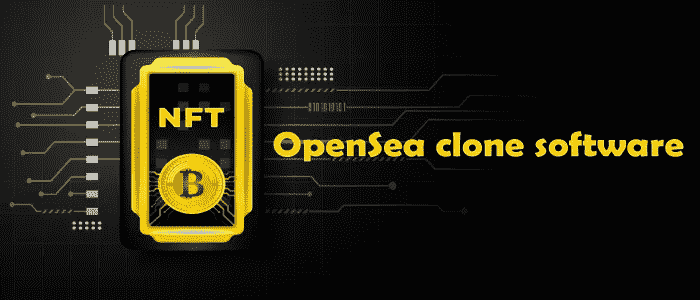
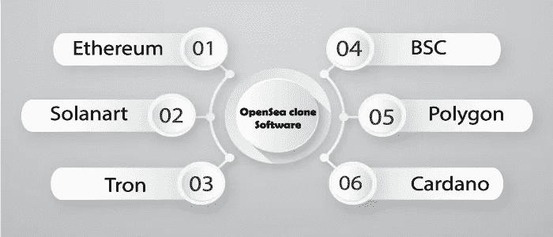

# OpenSea 克隆脚本——创建 NFT 市场业务的最快方法

> 原文：<https://medium.com/geekculture/opensea-clone-script-a-perfect-solution-for-starting-nft-marketplace-business-6093a491578f?source=collection_archive---------16----------------------->

区块链和密码产业日益增长，因此许多新的商业服务贸易协定对商业阶层的人开放。在名单上，一个新兴的盈利企业是 NFT 市场。

NFT 市场是一个数字化的市场中心，用户可以将他们的财产(如艺术、音乐、游戏中的物品和与所有权证明相关的视频)转换为虚拟资产，在这里可以存储、显示和交易 NFT。谈到 NFT 市场，OpenSea 是一个引人注目的 NFT 市场，许多企业家都有兴趣像 OpenSea 一样开始他们的市场。

让我们来深入了解一下 [**OpenSea 克隆软件开发**](https://radindev.com/opensea-clone-script/) ，

**我为什么要创建像 OpenSea 这样的 NFT 市场？？？**

OpenSea 是当今最受欢迎和最大的 NFT 市场之一，NFT 市场始于 2018 年，在 2019 年之前，OpenSea 仅创造了 200 万美元的收入。2020 年晚些时候，他们创造了 9480 万美元的收入。在接下来的一年中，他们在 2021 年创造了 275 亿美元的销售额，平均每天的费用收入达到 420 万美元。

这可能是为什么初创公司愿意建立像 OpenSea 这样的 NFT 市场。如果你是一个对启动像 OpenSea 这样的 NFT 市场感兴趣的人，这个博客是为你准备的。

**数字钱包**

NFT 市场的数字钱包整合非常重要。通过加入数字钱包，用户将无法发送、接收和存储。

**赏金**

如果你的市场被推荐给其他的市场列表，这将会给用户一个奖励。

**评级**

我们奉行数字收藏品战略。这一功能授权用户查看他们需要购买的数字产品，并允许他们在数字世界中购买最可爱的数字收藏品。

**拍卖和投标**

拍卖方法被认为是 opensea 克隆软件中可用的特性之一。这将为用户提供一个易于使用和万无一失的投标人 NFT 购买平台。拍卖观察列表帮助用户查看关于当前状态出价的细节。

**清单**

数字收藏品的编译和提交必须是无缝的。所以要交付一个伟大的工作流程。这将保持收藏品的列表，并允许它们是持久的。

**店面**

店面是 NFT 市场的一个重要特征。该功能为用户提供了他们所需要的关于他们正在购买的资产的所有详细信息。它同时提供了关于出价、所有者和价值历史的数据。

**过滤选项**

OPenSea 克隆版中的过滤器使用户在浏览网站时更容易，没有任何问题，尤其是当收藏品数量非常多的时候。该功能允许用户通过付款方式、选择和列表状态来浏览元素。

## 【OpenSea 克隆软件带来的利润率

初始入场费

私人销售

铸造费

投标费用

上市费用

交易费用

成套销售

# **什么是 OpenSea 克隆软件区块链？**

**以太坊**

以太坊区块链被称为可以执行任何代码的网络。OpenSea 克隆平台集成了众多行业级功能，以吸引主要人群。

**索拉纳**

Solana 区块链支持超过 50，000 TPS(代表每秒的事务处理)的能力，是运行中最快的区块链。

**电子管**

由于 Tron 提供零交易费和相对较高的 TPS，它已经发展成为最受欢迎的区块链网络之一。

**币安智能链**

币安智能链具有跨链兼容性属性，这使得该网络成为领先的区块链网络之一。唯一一个为许多问题提供解决方案并且在加密货币排名中上升更快的区块链生态系统是币安智能链。

**多边形**

Polygon 是一个分散的以太坊扩展平台，它使开发人员能够创建可扩展的和用户友好的 dApps，这些 dApps 具有较低的交易费用，而不会损害安全性。由于其特点，Polygon 吸引了来自世界各地的投资者。

**卡尔达诺**

Cardano 区块链采用同行评议的研究，避免了其前辈的潜在陷阱。据报道，第三代区块链网络 Cardano 正处于这一早期阶段，采用双层架构来降低网络延迟。

# **OpenSea Clone 软件上有哪些收藏品？**

艺术

比赛

虚拟空间

音乐

录像

公用事业和其他

摄影

运动

域名

# OpenSea 克隆软件是如何工作的？

Tron 提供零交易费和相对较高的 TPS，它已经发展成为最受欢迎的区块链网络之一。将集成在区块链 Tron 上开发的具有众多行业属性的 OPenSea 克隆平台。

买家将连接他们的钱包来购买数字资产。

卖家可以制作他们的作品，并通过完成必要的细节(如价格、描述以及购买和投标所需的任何其他信息)来列出它们。

买家有两种选择:参加拍卖并开始出价，或者他们可以以固定价格购买 NFT。卖家在 OpenSea 克隆版上市时挑选这些商品。

一旦收到付款。买家将可以保留 NFT。平台所有者将对每笔交易收取额外费用，如燃气费。

# **我们的 OpenSea 克隆脚本的优势**

**高度可定制**

OpenSea 克隆脚本由我们的专业开发人员开发，可以根据您的特定需求进行定制。克隆脚本中可以包含其他功能，以构建像 OPenSea 这样功能丰富的 NFT 市场。

**创收**

OpenSea 克隆脚本允许以极其安全的方式产生大量收入。由于 OPenSea clone 脚本是最好的 NFT 收藏品的集散地，因此它创造了多种收入来源。

**最低交易费用**

这是一个最重要的优势:最小的交易成本。

# **OpenSea 克隆软件有哪些特点？**

简单设计架构

高效分类

用户活动跟踪

足够的上市资产

排名和性能统计

赏金和各种过滤器

数字钱包和店面

# **开发一个像 OpenSea 这样的 NFT 市场需要多长时间？**

利用完美的 OpenSea 克隆脚本开发像 OpenSea 这样的 NFT 市场可能需要几周时间。尽管开发时间完全取决于每个 NFT 市场想要的特性和功能。

# 开发一个类似于 OpenSea 的 NFT 市场需要多少成本？

与从头开始开发相比，使用克隆脚本开发像 OPensea 这样的 NFT 市场的开发成本要低得多，但这将根据每个公司想要添加到其市场的功能而有所不同。但是它的价格大约在**10，000 美元到 18，000 美元**之间，但可能会根据平台上将要执行的操作而有所不同。