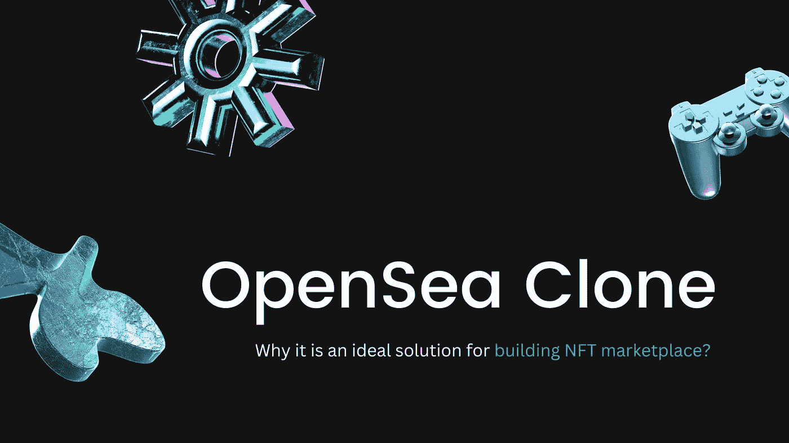

# Opensea 克隆脚本——创建像 Opensea 一样的 NFT 市场

> 原文：<https://medium.com/geekculture/opensea-clone-script-an-ideal-solution-to-create-nft-marketplace-like-opensea-b4d44aa454c?source=collection_archive---------14----------------------->

## 为什么 OpenSea 克隆脚本非常适合密码创业者创建像 Opensea 这样的 NFT 市场？在这个博客里知道！

Know why in this intriguing blog!

由于其受欢迎的程度，新的商业风险在区块链和密码行业中每天都在急剧增加。而 NFT 商场业务是其中高利润的领域之一。NFT 市场是一个数字化的市场中心，用户可以在这里存储和交易数字物品，如艺术、音乐、视频和游戏中的物品，这些物品被转换为虚拟资产(NFT)，作为所有权的证明。作为一项新兴业务，像 OpenSea 这样的 NFT 市场在企业家中越来越受关注。OpenSea 是 NFT 市场中值得注意的一个，它不仅受欢迎，而且产生高收入，许多企业家都表示有兴趣开始像 OpenSea 这样的 NFT 市场。让我告诉你为什么许多人都在努力开创像 OpenSea 这样的 NFT 市场。

## 我为什么要推出像 OpenSea 这样的 NFT 市场？？？

如上所述，作为一个 NFT 市场，OpenSea 在数字世界越来越受欢迎，它也是其中最大的一个。NFT 市场始于 2018 年，截至 2019 年初，他们仅创造了约 200 万美元。但在 2020 年晚些时候，他们的收入飙升了近 50%，达到约 9480 万美元。第二年，他们平均每天产生高达 420 万美元的费用收入，使其销售额在 2021 年达到 275 亿美元。

这一巨大的成功促使企业家们开始创建像 OpenSea 这样的 NFT 市场。如果你有兴趣创建一个像 OpenSea 这样的 NFT 市场，但不知道如何去做，不要担心，我会帮助你推出一个像 OpenSea 这样的 NFT 市场。让我们开始讨论这个话题，不要再拖延了。

## 为什么 OpenSea 克隆脚本是创业公司和企业家的理想选择？？？

像 OpenSea 这样的 NFT 市场可以用不同的方式构建，但是选择一个 OpenSea 克隆脚本是最安全的方式。是的，使用 OpenSea 克隆脚本构建像 OpenSea 这样的 NFT 市场很容易。 [**OpenSea 克隆脚本**](https://coinsqueens.com/opensea-clone-script?utm_source=openseaclsctop&utm_medium=mediumGC&utm_campaign=RJ) 是一款量身定制的软件，有了它，你可以像 OpenSea 一样毫不费力地马上部署你的 NFT 市场。在使用 OpenSea 克隆脚本时，您还将获得许多业务优势和好处。

## OpenSea 克隆脚本的商业优势:

1.  **高可扩展性** — OpenSea 克隆脚本允许对功能和视觉效果进行可行的定制。等等。这种高修改范围允许您根据业务需求集成所有功能和更改，从而实现高可伸缩性。
2.  **高效的监控/跟踪**—OpenSea 克隆脚本支持市场中的精确跟踪和参与。
3.  **ROI 特性**—OpenSea 克隆脚本使您能够实现众多高 ROI 特性。
4.  **测试模块** —使用测试模块，您可以针对您的 NFT 市场进行多次测试。
5.  **低成本** —与其他方法相比，开发成本非常低。
6.  **省时** —使用 OpenSea 克隆脚本部署 NFT 市场可以让您节省时间，因为只需很短的时间就可以启动 NFT 市场。

虽然这些好处对你的业务很重要，但你也需要小心这些特性。克隆脚本应该具有基本的特性，

## **OpenSea 克隆脚本的基本特性:**

*   吸引人的店面
*   用户和管理面板
*   多个过滤器选项
*   分类选项
*   列表和统计
*   投标和拍卖(荷兰和英国拍卖
*   排名统计
*   评级和活动统计
*   钱包
*   用户概要
*   安全功能

它们是您需要在客户中保留的必要特征。现在，您已经了解了启动 NFT 市场的要求。下一步是选择一个著名的 OpenSea 克隆脚本提供商。

## **如何找到一个优秀的 OpenSea 克隆脚本提供商？**

事实上，这是所有企业家和初创公司的一个关键问题，只有少数可靠的 NFT 市场克隆脚本和克隆脚本提供商。发现一个突出和有前途的可能是一场噩梦，但它不是。我会协助你，我已经做了一些工作，找到最好的 NFT 市场克隆脚本提供商。CoinsQueens 就是这样一个供应商，它有成功的项目和有希望的结果。有了他们的服务，你可以让你的竞争对手相形见绌。他们的 OpenSea 克隆脚本可以根据您的业务需求进行高度定制。

从 CoinsQueens 这里获得免费的 Opensea 克隆脚本演示。