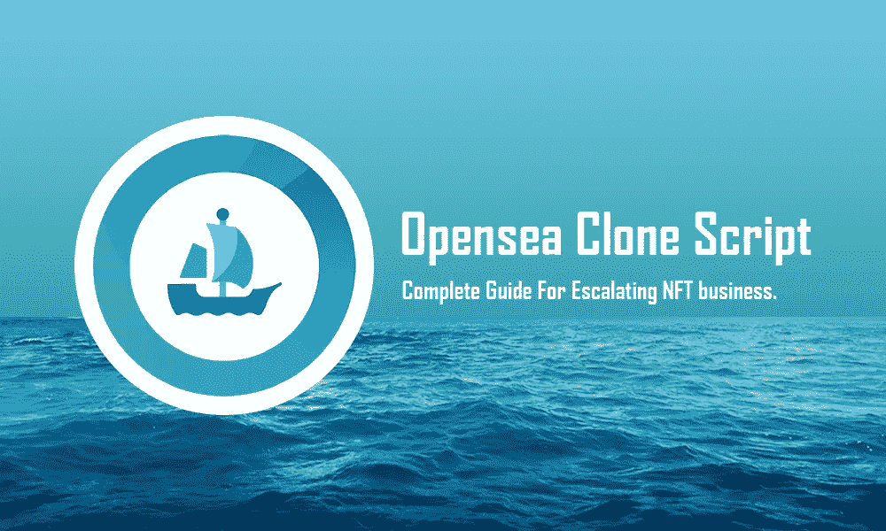

# Opensea 克隆脚本——升级 NFT 业务的完整指南。

> 原文：<https://medium.com/geekculture/opensea-clone-script-complete-guide-for-escalating-nft-business-8039d2e28e70?source=collection_archive---------4----------------------->

Opensea 于 2017 年由**大卫·芬奇**和**亚历克斯阿塔拉**成立，位于旧金山加州。投资者包括 a16z crypto、EQT Ventures 和 MetaKoven，他们为 OpenSea 的种子轮融资贡献了 240 万美元。他们在 2019 年推出了 NFT 市场平台，允许用户买卖 NFT。

世界上第一个也是最大的 NFT 市场叫做 **Opensea** 。它们提供了从收藏品到游戏中物品的各种各样的数字资产，并支持 20 多种不同的区块链。任何人都可以通过 OpenSea 购买、销售或查找数字商品，包括加密艺术品、NFT 艺术品、视频游戏项目等。Opensea 是在以太坊区块链网络上创建的，它使智能合约能够铸造 NFT 令牌。这使得 Opensea 能够提供一系列安全、透明、防篡改的 NFT 资产。Opensea 也是独一无二的，它允许每个人创建一个 NFT 市场。因此，用户可以定制他们的体验，设计与他们的兴趣相关的空间。如果你是一个收藏家，一个游戏玩家，或者只是对 NFTs 世界好奇，Opensea 是一个很好的起点。

# NFT 市场平台

NFT 并不等同于我们现在所知的比特币或以太网。它们不能在加密货币交易所立即兑换。销售或购买 NFT 需要一个专用平台。 [**Opensea 克隆**](https://www.alwin.io/blog/opensea-clone-script) 提供一个 NFT 市场。NFT 可以在那里交易或储存。NFT 可以在平台上以固定价格出售，也可以通过拍卖出售。NFT 行业有各种各样的 NFT 市场平台。

促进购买、销售或获取 NFTs 的专门平台之一是——open sea。重要性将取决于你使用的 NFT 市场。

最受欢迎的 NFT 市场包括 Opensea 和 Rarible。Opensea 是一个在线的 NFT 市场，在这里创作者可以将他们的作品和音乐转化为有形的商品并出售。没有任何停顿，让我们看看像 open sea NFT 市场。

# 你为什么要建立像 Opensea 这样的 NFT 市场？

像 OpenSea 这样的 NFT 市场现在越来越受欢迎，因为它提供了传统市场所没有的优势。

2019 年之前，Opensea 只赚了 200 万美元。截至 2020 年末，他们已经赚了 9480 万美元。第二年，他们将在 2021 年创造 275 亿美元的销售额，平均每天的费用收入为 420 万美元。

这就是为什么初创公司愿意推出像 Opensea 这样的 NFT 市场。如果你有兴趣开始像 Opensea 这样的 NFT 市场？然后继续读这篇博客，这会打开你的思维！

# Opensea 克隆脚本概述

Opensea clone script 是一个完全可定制的即用型软件解决方案，其性能类似于 Opensea 平台，因为它是以公开或拍卖的方式在平台上列出和创建 NFT 的。Opensea clone 同意不同类型的非艺术作品，如图像、视频、艺术品、元宇宙和其他数字化收藏品。开发自己的 Opensea 克隆脚本开发人员可以创建不同的区块链网络在当前的趋势和首选的区块链专家，如币安智能链，索拉纳，多边形马蒂奇，卡尔达诺，等等。同样，可以在链间功能中创建 Opensea clone。

# 如何创建像 Opensea 这样的 NFT 市场？

如果你想建立一个像 Opensea 一样的 NFT 市场，你需要记住一些事情来利用 NFT 市场开发服务的力量。看看下面关于如何创建像 Opensea 这样的 NFT 市场的一些提示，

1.  确定你的定位
2.  选择合适的区块链平台
3.  为 mint NFTs 创建智能合同
4.  NFT 市场开发-前端和后端
5.  创造代币经济
6.  提供各种各样的商品
7.  启动您的 Opensea 克隆脚本
8.  发起营销活动。

# Opensea 克隆脚本的突出特点

要在 NFT 市场业务中获得成功，您需要将 NFT 市场中流行和最新的功能结合起来。您在 NFT 市场实施的功能将帮助您吸引更多 NFT 交易员，并提供无缝的 NFT 交易体验。让我列出您可以从打包的 Opensea 克隆脚本中获得的独有特性。

*   用户友好的界面
*   各种数字收藏品
*   高级过滤
*   令牌搜索
*   多语言支持
*   内置钱包
*   购买和出价
*   店面
*   高度安全的管理面板
*   活动跟踪
*   高效上市
*   所有权转移
*   多语言帮助。

您可以获得所有这些功能，作为一个完整的软件包，可以根据您的需要进行定制。

现在，让我们进入更令人兴奋的话题…

# Opensea 克隆脚本开发要多少钱？

在购买这个克隆脚本之前，你还应该了解从零开始建立一个 NFT 市场的成本的发展。因此，你可以获得清晰的见解和特征。从头开始建立一个 NFT 市场平台将花费你大约 6 万到 10 万美元。

同时，使用无缺陷的白标 Opensea 克隆软件建立一个像 Opensea 一样的 NFT 市场将花费你大约 7K 到 12K 美元。反正我这里说的开发成本是不可持续的。此外，Opensea 克隆脚本的价格根据您想要使用的技术、您在 NFT 市场上实现的功能以及您集成的附加模块而有所不同。但是，这主要取决于您的业务需求和紧急需求。因此，上述品质清楚地表明，按照您的预算计划，Opensea 克隆脚本是创建一个像 Opensea 一样的超级 NFT 市场的一种经济有效的方式。

# 包扎

在当今的密码世界中，NFT 生态系统已经吸引了很多关注，并且是许多新项目的主题。我们可以说创建一个像 Opensea 这样的 NFT 市场是有益的。你可以收到 Opensea 克隆脚本，并开始你的 NFT 创业，但是，如果你能与一个经验丰富的 NFT 市场发展公司握手，该公司以可承受的价格提供与 NFT 相关的项目。