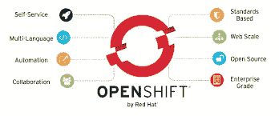

# OpenShift — SaaS(软件即服务)

> 原文：<https://medium.com/geekculture/openshift-saas-software-as-a-service-d1bd30be051e?source=collection_archive---------33----------------------->

open shift…嗯…这是像夜班、白班那样的轮班吗？嗯…..不要！但是不要担心，如果你不知道。这个博客将帮助你了解 OpenShift 的方方面面。所以我们走吧！

# 什么是 OpenShift —

OpenShift 包括一个企业级 linux 操作系统[、](https://www.redhat.com/en/technologies/linux-platforms/enterprise-linux2)容器运行时、联网、监控、注册以及认证和授权解决方案。自动化生命周期管理，以获得更高的安全性、定制的运营解决方案、易于管理的集群运营和应用程序可移植性。它的全栈自动化操作、跨所有环境的一致体验以及面向开发人员的自助服务配置，让团队能够协同工作，更高效地将想法从开发转移到生产。它可以作为领先公共云上的完全托管云服务，也可以作为需要更多定制的组织的自我管理软件产品。

容器是在自己的环境中运行的独立进程，独立于操作系统和底层基础设施。OpenShift 帮助您开发、部署和管理基于容器的应用程序。它为您提供了一个自助式平台，可以按需创建、修改和部署应用程序，从而加快开发和发布生命周期。

# 它和 Kubernetes 有什么不同—

OpenShift 和 vanilla Kubernetes 之间的主要区别是与构建相关的工件的概念。在 OpenShift 中，这样的工件被认为是标准 Kubernetes 操作可以应用的一级 Kubernetes 资源。OpenShift 的客户端程序被称为“oc ”,它提供了捆绑在 Kubernetes 的主线“kubectl”客户端程序中的标准功能的超集。使用这个客户端，用户可以使用子命令(例如“新建-构建”或“开始-构建”)直接与构建相关的资源进行交互。除此之外，一种名为源到映像(S2I)的 OpenShift 原生 pod 构建技术也是现成可用的，尽管这种技术正逐渐被淘汰，转而支持 Tekto，这是一种构建和部署到 Kubernetes 的云原生方式。对于 OpenShift 平台，这提供了相当于 Jenkins 所能做的功能。

与 Kubernetes 相比，OpenShift 还有其他一些不同之处:

1.  v4 产品线使用 CRI-O 运行时，这意味着 docker 守护进程不存在于主节点或工作节点上。这提高了群集的安全性。
2.  OpenShift 的开箱即用安装带有一个图像存储库。
3.  ImageStreams(指向可以与部署相关联的图像的指针序列)和 Templates(应用程序组件的打包机制)是 OpenShift 独有的，可以简化应用程序部署和管理。
4.  可用于启动应用程序部署的“new-app”命令会自动将应用程序标签(标签的值取自 name 参数)应用于作为部署结果而创建的所有资源。这可以简化应用程序资源的管理。
5.  在平台方面，OpenShift 过去仅限于 Red Hat 自己的产品，但现在支持其他产品，如 AWS、IBM Cloud 和 vSphere with OpenShift 4。
6.  与 Kubernetes 基于控制器的部署对象相比，OpenShift 的部署实现 DeploymentConfig 是基于逻辑的。从 v4.5 开始，OpenShift 通过改变其 CLI 的默认行为，更加倾向于部署。
7.  嵌入式 OperatorHub。这是一个 web GUI，用户可以在其中浏览和安装 Kubernetes 操作符库，这些操作符被打包以方便生命周期管理。这些包括红帽授权运营商，红帽认证运营商和社区运营商。

Openshift 还严格控制所使用的操作系统。主组件必须运行 Red Hat CoreOS。这种级别的控制使集群能够以最少的工作量支持主节点的升级和修补。工作节点可以运行其他版本的 Linux 甚至 Windows。

# 现实生活中的应用—

塞内加尔领先的电信服务提供商 Orange Sonatel 需要加快服务交付速度，以保持其竞争优势。服务提供商认为，基于云的原生开发运维方法可以提供所需的效率和规模。通过使用 OpenShift 和 Ansible Automation 构建新平台 Malaw，Orange Sonatel 可以快速迁移和构建核心应用。使用 Openshift 的好处如下:

*   将应用程序部署时间从几天或几周缩短到几分钟
*   借助自助式 IT 环境和自动化提高开发人员的工作效率
*   计算资源需求减少 66%

与 Ansible 一起，Red Hat OpenShift 帮助开发人员使用新的 DevOps 方法来专注于有价值的创新，而不是管理 Kubernetes 集群所需的底层基础设施和计算资源。通过采用由 OpenShift 容器存储支持的 Red Hat OpenShift，服务提供商降低了其计算资源需求。通过有效管理内存和 CPU(中央处理器)资源，Orange Sonatel 只需要三分之一的资源就可以运行其基础设施，相比之下，它以前的方法是直接在虚拟机(VM)上运行部署。因此，服务提供商预计将在未来两年内实现投资回报(ROI)。在成功迁移到 Red Hat OpenShift 之后，Orange Sonatel 正在将更复杂的应用程序迁移到环境中。服务提供商计划在未来两年内将至少 60 个应用程序迁移到。

谢谢大家！！