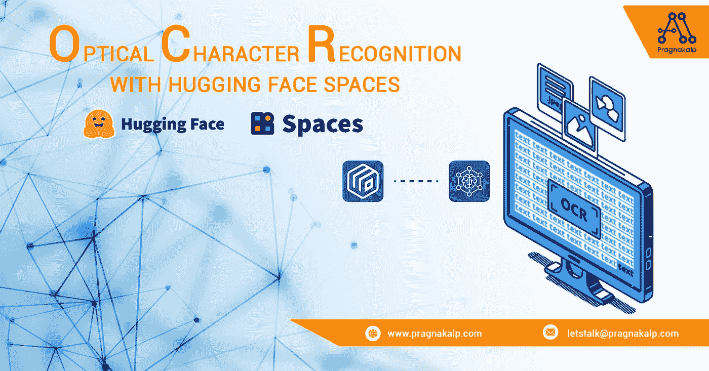
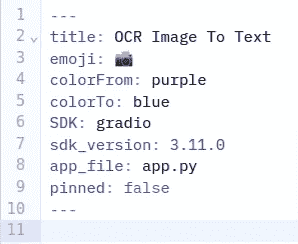
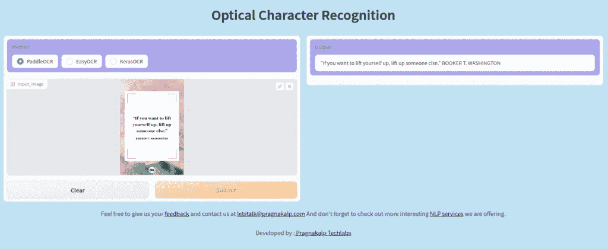
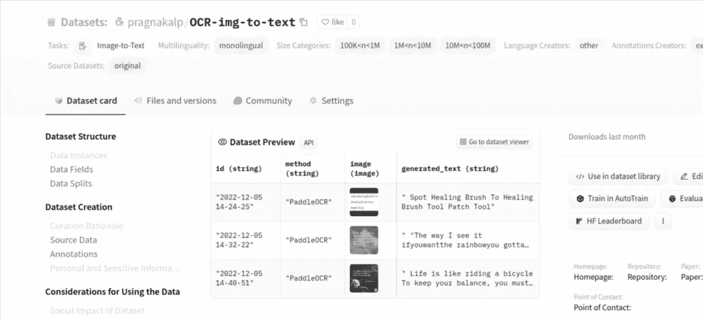

# 具有拥抱面部空间的光学字符识别

> 原文：<https://medium.com/geekculture/optical-character-recognition-with-hugging-face-spaces-467714dfade2?source=collection_archive---------23----------------------->



# 什么是拥抱脸枢纽？

HuggingFace Hub 是一个平台，允许开发人员存储和共享代码，以及在机器学习项目上进行合作。它托管基于 Git 的存储库，这是一种版本控制的存储，开发人员可以在其中保存他们所有的项目文件。开发人员可以在 Hub 上上传和访问自然语言处理、计算机视觉和音频任务的前沿模型。它还为各种领域和模态提供了各种数据集。最后，开发人员可以研究直接在浏览器中展示 ML 模型的交互式应用程序。
要了解更多关于抱抱脸中枢的信息，查看[文档](https://huggingface.co/docs)。

# 什么是拥抱脸空间？

Spaces 是一个中心平台，允许开发者快速创建和展示 ML 演示应用。它与两个 Python 软件开发工具包(SDK)兼容，即 [Gradio](https://gradio.app/) 和 [Streamlit](https://streamlit.io/) ，这两个工具使得在短时间内创建应用程序变得简单。此外，用户能够创建静态空间，即空间中托管的 HTML、CSS 和 JavaScript 网页。如果您想了解更多关于共享空间以及如何创建自己的共享空间的信息，请访问[共享空间文档](https://huggingface.co/docs/hub/spaces)。您还可以升级您的空间，以便在 GPU 或其他加速硬件上运行。

让我们快速了解一下光学字符识别(OCR)。

# 光学字符识别

光学字符识别(OCR)是一种深度学习方法，用于从扫描的文档和照片等图像中识别文本。它使用卷积神经网络分析图像并从中提取文本。之后，提取的文本被输入到一个 OCR 引擎，该引擎已经被训练来识别单词和字符。然后，OCR 引擎的输出用于生成原始图像的文本版本。为了自动化数据输入和文档管理过程，通常使用 OCR 从图像中提取文本。


有许多用于 OCR 的库和技术。在这里，我们将为文本识别实现 3 种 OCR 技术 PaddleOCR、KerasOCR 和 EasyOCR。

在本教程中，我们将了解如何在拥抱面部空间上托管 OCR 应用程序。为此，首先你需要在拥抱面部空间创建一个存储库，如下步骤所示。

# 在拥抱脸上创建存储库的步骤(🤗)空间:

**第一步:**在上创建帐户🤗枢纽，打造[新空间](https://huggingface.co/spaces)。转到文件和版本。您将看到为项目生成的 README.md 文件。


**第二步:**目前，我们已经在 README.md 文件中设置了如下元数据，如图所示。您可以根据需要替换元数据值并保存它们。有关元数据配置参考的更多信息，请访问🤗[空间配置](https://huggingface.co/docs/hub/spaces-config-reference)。



**步骤 3:** 现在您可以创建新文件或者从您的本地系统上传项目文件，如下所示。您需要在 requirement.txt 文件中添加所有需要的库，🤗服务器将自动下载所有的库。另一种上传整个项目的方法是使用 [huggingface_hub](https://huggingface.co/docs/huggingface_hub/how-to-upstream) ，为此请确保您登录到🤗从你的系统里。然后你可以按照 [huggingface_hub](https://huggingface.co/docs/huggingface_hub/how-to-upstream) 的步骤上传你的本地文件夹到🤗空间。

**第四步:**现在让我们从代码开始，我们将在 app.py 文件中编写我们的代码。

# 让我们开始代码实现

1.导入所有库

```
import os
import cv2
import json
import easyocr
import datasets
import socket
import requests
import keras_ocr

import numpy as np
import gradio as gr
import pandas as pd
import tensorflow as tf
import re as r

from PIL import Image
from datasets import Image
from datetime import datetime
from paddleocr import PaddleOCR
from urllib.request import urlopen
from huggingface_hub import Repository, upload_file
```

2.我们为这三种方法分别编写了 OCR 生成函数。

Paddle OCR 的代码:

```
"""
Paddle OCR
"""
def ocr_with_paddle(img):
    finaltext = ''
    ocr = PaddleOCR(lang='en', use_angle_cls=True)
    # img_path = 'exp.jpeg'
    result = ocr.ocr(img)

    for i in range(len(result[0])):
        text = result[0][i][1][0]
        finaltext += ' '+ text
    return finaltext
```

Keras OCR 的代码:

```
"""
Keras OCR
"""
def ocr_with_keras(img):
    output_text = ''
    pipeline=keras_ocr.pipeline.Pipeline()
    images=[keras_ocr.tools.read(img)]
    predictions=pipeline.recognize(images)
    first=predictions[0]
    for text,box in first:
        output_text += ' '+ text
    return output_text
```

轻松 OCR 的代码:

```
"""
easy OCR
"""
# gray scale image
def get_grayscale(image):
    return cv2.cvtColor(image, cv2.COLOR_BGR2GRAY)

# Thresholding or Binarization
def thresholding(src):
    return cv2.threshold(src,127,255, cv2.THRESH_TOZERO)[1]

def ocr_with_easy(img):
    gray_scale_image=get_grayscale(img)
    thresholding(gray_scale_image)
    cv2.imwrite('image.png',gray_scale_image)
    reader = easyocr.Reader(['th','en'])
    bounds = reader.readtext('image.png',paragraph="False",detail = 0)
    bounds = ''.join(bounds)
    return bounds
```

3.为所有 OCR 方法创建了一个公共函数，该函数将输入作为图像，并从输入图像返回生成的文本。

```
"""
Generate OCR
"""
def generate_ocr(Method,input_image):
    text_output = ''
    if (input_image).any():
        print("Method___________________",Method)
        if Method == 'EasyOCR':
            text_output = ocr_with_easy(input_image)
        if Method == 'KerasOCR':
            text_output = ocr_with_keras(input_image)
        if Method == 'PaddleOCR':
            text_output = ocr_with_paddle(input_image)

        flag(Method,input_image,text_output,ip_address,location)
        return text_output
    else:
        raise gr.Error("Please upload an image!!!!")
```

4.完成所有这些功能后，让我们使用 gradio 应用程序将我们的代码与用户界面集成起来。

# 格拉迪欧

Gradio 对于开发人员来说是一个有用的工具，因为它允许他们快速而轻松地为他们的机器学习模型构建交互式用户界面。这对于向其他人展示模型的功能，或者收集用户对模型性能的反馈特别有用。此外，由于 Gradio 使用 Jupyter 笔记本，开发人员可以轻松地与其他人分享他们的工作，这使其成为一个很好的协作工具。如果你想了解更多关于 Gradio 应用的信息，请点击[链接](https://gradio.app/getting_started/)。



This is the UI for our demo using Gradio app

基本上，我们可以用两种方式启动 Gradio 演示，使用`gr.blocks`和`gr.interface.`

Gradio 中有三个主要参数:
1。功能:处理用户界面主要功能的进程
2。输入:输入部件
3 的类型。输出:输出组件的类型

代码的最后一部分涉及启动界面。它由各种组件组成，如功能、输入、输出、标题、描述等等。这个[链接](https://www.gradio.app/docs/)包含了所有的接口组件。

```
image = gr.Image(shape=(300, 300))
method = gr.Radio(["PaddleOCR","EasyOCR", "KerasOCR"],value="PaddleOCR",elem_id="radio_div")
output = gr.Textbox(label="Output",elem_id="opbox")

demo = gr.Interface(
    generate_ocr,
    [method,image],
    output,
    title="Optical Character Recognition",
    css=".gradio-container {background-color: #C0E1F2} #radio_div {background-color: #ADA5EC; font-size: 40px;} #btn {background-color: #94D68B; font-size: 20px;} #opbox {background-color: #ADA5EC;}",
    article="""<p style='text-align: center;'>Feel free to give us your <a href="https://www.pragnakalp.com/contact/" target="_blank">feedback</a> and contact us at 
                    <a href="letstalk@pragnakalp.com" target="_blank">letstalk@pragnakalp.com</a> And don't forget to check out more interesting 
                    <a href="https://www.pragnakalp.com/services/natural-language-processing-services/" target="_blank">NLP services</a> we are offering.</p>
                    <p style='text-align: center;'>Developed by :<a href="https://www.pragnakalp.com" target="_blank"> Pragnakalp Techlabs</a></p>"""

)
demo.launch()
```

# 在 Hugging Face Hub 数据集上保存数据和日志

创建应用程序后。如果您想记录用户输入和结果，那么您可以遵循以下步骤。这里，我们使用了拥抱脸数据集来存储日志。

**步骤 1:** 要保存/存储日志或数据，请在🤗[数据集](https://huggingface.co/datasets)。详细信息可以参考[数据集文档](https://huggingface.co/docs/datasets/index)。

**步骤 2:** 要与数据集建立连接，请遵循下面的代码片段。

```
HF_TOKEN = os.environ.get("HF_TOKEN")
DATASET_NAME = "OCR-img-to-text"

DATASET_REPO_URL = f"https://huggingface.co/datasets/pragnakalp/{DATASET_NAME}"
HF_TOKEN = os.environ.get("HF_TOKEN")
DATASET_REPO_ID = "pragnakalp/OCR-img-to-text"
print("is none?", HF_TOKEN is None)
REPOSITORY_DIR = "data"
LOCAL_DIR = 'data_local'
os.makedirs(LOCAL_DIR,exist_ok=True)

repo = Repository(
    local_dir="ocr_data", clone_from=DATASET_REPO_URL, use_auth_token=HF_TOKEN
)
repo.git_pull()
```

在这里，HF_TOKEN 被称为用户访问令牌的[🤗，以下哪种是对应用程序或笔记本电脑进行身份验证的最常用方法🤗服务。注意:保存令牌时，将角色保持在“写入”模式。生成访问令牌后，将其复制并保存到您的空间的设置→存储库机密，保留名称为“HF_TOKEN”。](https://huggingface.co/docs/hub/security-tokens)

DATASET_REPO_ID 将是您的数据集路径。
REPOSITORY_DIR 将是您保存数据的文件夹名称。

**第三步:**写一个保存数据的函数。

```
"""
Save generated details
"""
def dump_json(thing,file):
    with open(file,'w+',encoding="utf8") as f:
        json.dump(thing,f)

def flag(Method,input_image,text_output,ip_address,location):
    try:
        print("saving data------------------------")
        adversarial_number = 0
        adversarial_number = 0 if None else adversarial_number
        metadata_name = datetime.now().strftime('%Y-%m-%d %H-%M-%S')
        SAVE_FILE_DIR = os.path.join(LOCAL_DIR,metadata_name)
        os.makedirs(SAVE_FILE_DIR,exist_ok=True)
        image_output_filename = os.path.join(SAVE_FILE_DIR,'image.png')
        try:
            Image.fromarray(input_image).save(image_output_filename)

        except Exception:
            raise Exception(f"Had issues saving PIL image to file")
        # Write metadata.json to file
        json_file_path = os.path.join(SAVE_FILE_DIR,'metadata.jsonl')
        metadata= {'id':metadata_name,'method':Method,
                   'File_name':'image.png','generated_text':text_output,
                    'ip_address': ip_address,'loc': location}        
        dump_json(metadata,json_file_path)  

        # Simply upload the image file and metadata using the hub's
          upload_file
        # Upload the image
        repo_image_path = os.path.join(REPOSITORY_DIR,os.path.join
                          (metadata_name,'image.png'))

        _ = upload_file(path_or_fileobj = image_output_filename,
                    path_in_repo =repo_image_path,
                    repo_id=DATASET_REPO_ID,
                    repo_type='dataset',
                    token=HF_TOKEN
                ) 
        # Upload the metadata
        repo_json_path = os.path.join(REPOSITORY_DIR,os.path.join
                        (metadata_name,'metadata.jsonl'))
        _ = upload_file(path_or_fileobj = json_file_path,
                    path_in_repo =repo_json_path,
                    repo_id= DATASET_REPO_ID,
                    repo_type='dataset',
                    token=HF_TOKEN
                )        
        adversarial_number+=1
        repo.git_pull()    
        return "*****Logs save successfully!!!!"
    except Exception as e:
        return "Error whils saving logs -->"+ str(e)
```

您可以在下图中看到日志数据集预览。



*最初发表于 2022 年 12 月 30 日* [带有拥抱人脸空间的光学字符识别](https://www.pragnakalp.com/optical-character-recognition-with-hugging-face-spaces/) *。*