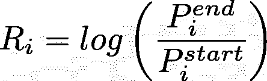
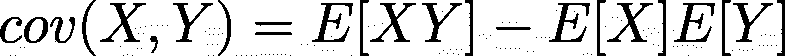
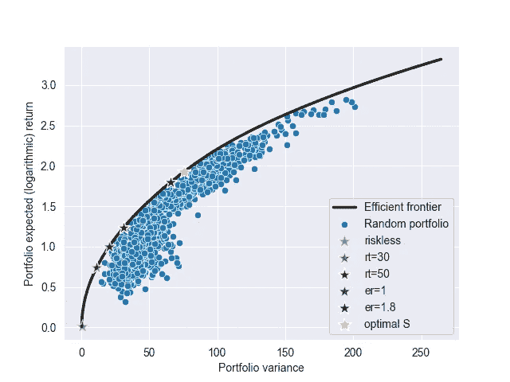
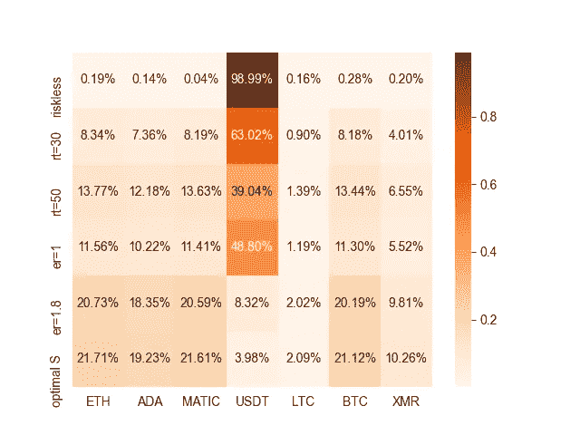

# 基于现代投资组合理论的最优加密货币投资组合分配，Python 语言

> 原文：<https://medium.com/geekculture/optimal-cryptocurrencies-portfolio-allocation-with-modern-portfolio-theory-in-python-66a0dc98ed65?source=collection_archive---------9----------------------->

## 让我们了解如何使用 Python 来优化我们的加密产品组合！

Photo by [Executium](https://unsplash.com/@executium?utm_source=unsplash&utm_medium=referral&utm_content=creditCopyText) on [Unsplash](https://unsplash.com/s/photos/cryptocurrency?utm_source=unsplash&utm_medium=referral&utm_content=creditCopyText)

众所周知，投资加密货币可能非常有利可图，但同样众所周知的是，市场的波动可能会面临巨大风险，价格波动可能会很快达到价值的一半，就像最近发生的那样。

那么，一个人如何才能在不承担过高风险的情况下，从投资中获得最大回报呢？嗯，答案是**最优投资组合分配**:风险和回报之间总是有一个权衡，所以*给定固定金额的资金和一组资产，我们希望根据我们想要的目标找到每种资产的最佳购买比例*。虽然存在不同的工具，但在本 Python 教程中，我们将重点关注众所周知的**现代投资组合理论(MPT)** ，这是一种统计方法，它让我们能够快速洞察我们的资金投向。

特别是，我们将理解 MPT 是如何工作的，并实现一个程序来自动获取历史数据和分析任意的投资组合。有兴趣的话继续看！:)本教程的完整代码可以在我的 GitHub 上找到:

 [## thelearningwolf/mpt_medium

### 媒体出版物代码:“使用现代投资组合理论的最优加密货币投资组合分配，Python 语言”。…

github.com](https://github.com/thelearningwolf/mpt_medium) 

***免责声明*** *:本文仅出于教育目的，不构成理财建议。我不是一个合格的顾问，我对这篇手稿中提供的代码的不正确使用不承担任何责任。*

(一个小的旁注:我们将把 MPT 应用于加密货币，但它将适用于任何一组资产，前提是我们可以获得一段时间内的价格。)

# MPT 入门

现代投资组合理论(MPT)是由经济学家 Harry Markowitz [1]早在 50 年代提出的，作为一种客观地寻找最佳投资组合配置的方法。因此，它可以用于构建投资组合，使给定预期回报的风险最小化，或给定风险水平的回报最大化。

简言之，该理论基于以下概念:

*   两个关键数量:投资组合在考虑期内的**预期收益**和**方差**(波动性以及风险的代表)；
*   **有效边界**:风险收益权衡意义上的一组最优投资组合，其中对于给定的收益，风险最小化；
*   *多样化*:虽然单一资产可能波动性特别大，但有效地组合多种资产可以使投资组合的整体波动性由于相关性的影响而大大降低；

投资组合的预期收益被定义为一个随机变量 *R* ，作为每项资产的预期收益的*加权和*获得(如果我们有 *N* ) 在一段考虑的时期内(在本教程中我们将选择一年):

资产 *i* 的预期收益也是一个随机变量，而 *w_i* 是投资组合中分配给资产 I 的部分，因此

*剧透预警*:这些权重就是我们要优化的！；).为了得到期望回报，通过期望算子的线性，我们简单地得到

这可以矢量化为

如果我们将 *w* 视为权重向量，将 R 视为(各自的)资产回报向量。这里“ *return* ”的概念有点模糊，存在不同的有效公式来正式定义它。我们将使用在所考虑的时间段内结束价格和开始价格之比的对数，这意味着

此时，我们需要对我们正在考虑的资产的值 *s E[R_i]* 进行近似:MTP 是基于收益是独立同分布的假设，因此我们可以计算每日收益的期望值，然后只需将其乘以该期间的交易日数。由于加密市场总是上涨，这只是 365。

根据我们投资组合的*方差*，首先，我们需要记住，对于两个随机变量 X 和 Y，协方差定义为

这可以从收集的数据中计算出来。事实上，假设 *X* 和 *Y* 在这种情况下是成对资产的价格，第二项可以很容易地从上面的考虑中获得，而第一项是通过将所有每日收益的乘积的平均值乘以交易日减去 1 的平方而得到的。因此，总投资组合方差如下:

(关于计算的细节见[2]，我从那里得到了一些灵感)。同样，该表达式可以矢量化，引入协方差矩阵*适马*如下

定义了预期(对数)回报和方差之后，我们现在可以将它们之间的权衡定义为一个要最小化的成本函数。如果我们对*设置风险*感兴趣，我们可以得到最优权重为

其中 *r* 为风险容忍度(越高，方差和收益越高)。相反，如果我们想要*确定一个预期收益*，我们可以求助于

其中 *k* 是我们想要期望的(对数)回报。注意，在这两种情况下，我们都需要求解*约束的*最小化(由于对权重的约束，在第二种情况下，是对预期收益的约束)，这在 *scipy* 中非常容易。

在继续 Python 实现之前，我们可以定义一个在 MPT 环境中经常被考虑的附加量:夏普比率。它被定义为投资组合相对于“无风险”投资(例如，美国国库券)的表现，由投资组合的方差(风险)标准化。它可以容易地作为权重 w 的函数获得，并且因此它也可以被优化。事实上，

# Python 实现

在程序的第一部分，我们将编写实际实现上面介绍的计算所需的所有代码:我们为单一资产和投资组合定义两个主要类。资产类允许从作为*熊猫数据帧传递的价格时间序列中获取所需的值。*注意，协方差矩阵的计算被缓存，因为它非常昂贵，我们需要多次调用它。

一旦定义了所有的基本构件，我们需要基于从 web 收集的真实数据实例化资产对象。为此，我们可以使用由 https://coincap.io/*公开的 RESTful API，任何人都可以免费使用。为了简单性和可重用性，编写一些小的助手函数，我们可以用几行代码轻松完成任务。*

*我们现在准备总结一切，利用 MPT 的力量来深入了解我们的投资组合。出于教程的考虑，我们将考虑一小组流行的货币(以太坊、卡尔达诺、多边形、系绳、莱特币、比特币和 Monero)。我们首先绘制几个随机(非最优)投资组合，使用随机初始化的权重获得。然后，我们对选定的风险容忍度、预期收益和夏普比率进行一些优化。请随意使用参数和货币！*

*以下是结果，由于固定的随机种子，您应该获得完全相等的结果:)*

**

*(picture by the author)*

*我们可以看到，更高的风险对应着更高的回报，反之亦然，而这绝不可能比有效边界做得更好。特别地，所选择的最优投资组合仅仅是由所选择的权衡所确定的有效边界上的点。*

**

*(picture by the author)*

*在这里，我们可以看到低风险投资组合如何赋予 USDT(一种稳定的硬币)特权，而如果我们想获得更高的回报，我们需要更多地投资于替代硬币，当然，替代硬币更不稳定，但利润丰厚。*

*这就是本文的全部内容，如果您想了解更多关于 Python 的内容，请告诉我！:)*

## *关于这个主题的参考资料和进一步的阅读材料:*

*[1]耶鲁大学考尔斯经济学研究基金会。"[投资组合选择，高效分散投资](https://cowles.yale.edu/sites/default/files/files/pub/mon/m16-all.pdf)"
【2】[https://medium . com/analytics-vid hya/modern-Portfolio-theory-model-implementation-in-python-e 416 facabf 46](/analytics-vidhya/modern-portfolio-theory-model-implementation-in-python-e416facabf46)*

*[https://en.wikipedia.org/wiki/Modern_portfolio_theory](https://en.wikipedia.org/wiki/Modern_portfolio_theory)
[https://www . investopedia . com/terms/m/modernportfoliotheory . ASP](https://www.investopedia.com/terms/m/modernportfoliotheory.asp)*