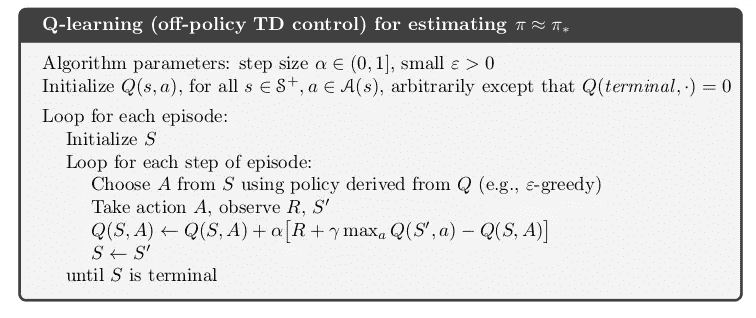
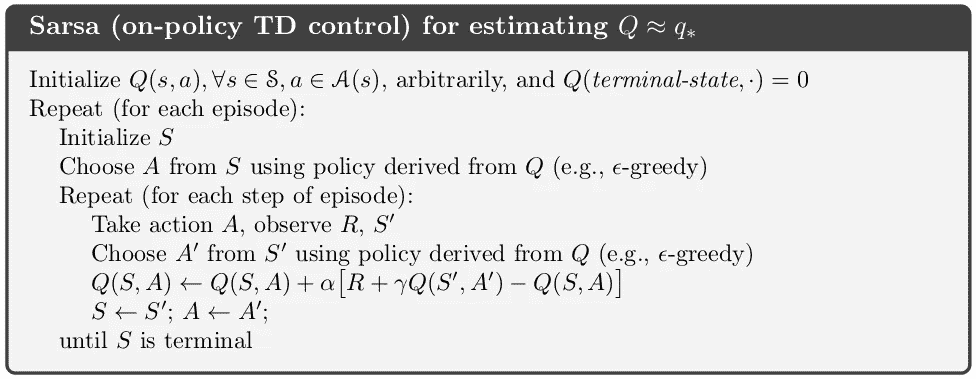
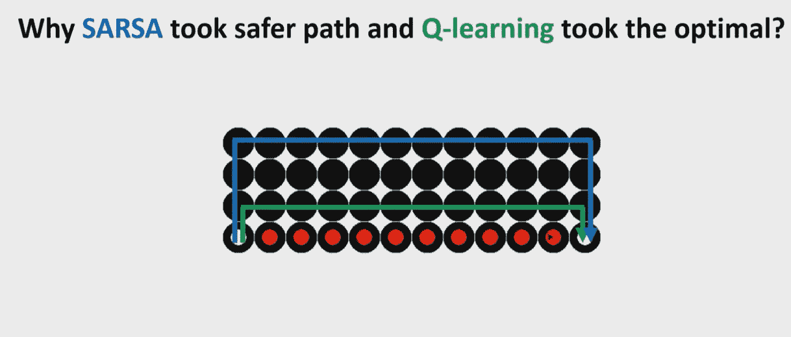
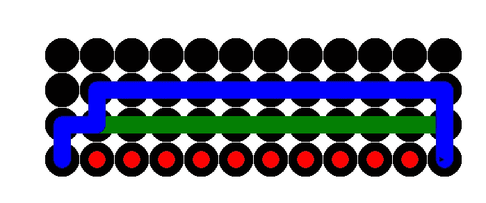
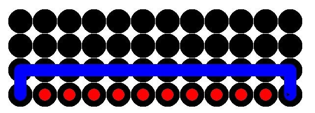

# 最优还是最安全？Q-learning 和 SARSA 在悬崖行走问题中选择不同路径的简要原因

> 原文：<https://medium.com/geekculture/optimal-or-safest-q-learning-vs-sarsa-in-cliff-walking-problem-f1e7d77dcc5?source=collection_archive---------5----------------------->

## 假设你需要从 A 点到 b 点，你会选择最优但最危险的路径吗？还是宁愿选择最安全但最耗时的路径？

Photo by [Joseph Pearson](https://unsplash.com/@josephtpearson?utm_source=unsplash&utm_medium=referral&utm_content=creditCopyText) on [Unsplash](https://unsplash.com/s/photos/seven-sister?utm_source=unsplash&utm_medium=referral&utm_content=creditCopyText)

# 探索与利用

在强化学习的背景下，开发是指主体选择最佳行动，而探索是指主体随机行动以探索是否有其他更好的方式来达到目标。

# 什么是政策？

强化学习中的策略指的是决定采取什么行动的方法。强化学习中最常见的策略是ε贪婪策略，其中ε指的是探索的概率。因此，ε-贪婪策略将使代理能够在百分之*ε*的时间内执行探索，并在百分之*1ε*的时间内执行开发。

# 为什么 SARSA 和 Q-learning 的思考方式不同？

首先让我们谈谈主要的相似之处。SARSA 和 Q-learning 都采取一些行动，获得即时奖励，并观察给定环境中的新状态，以便学习行动-值函数或 Q-表中的 Q 值。Q-table 的维度是动作的数量乘以状态的数量，其中 Q 值是给定状态时动作的好坏程度。

使 SARSA 和 Q-learning 做出不同决定的唯一区别是，SARSA 使用策略上的方法，而 Q-learning 使用策略外的方法。给定策略是ε贪婪的，非策略是当代理不从策略学习动作值函数时，而策略上是当代理从策略学习动作值函数时。

image from [Google](https://www.google.com/search?q=q+learning+pseudcode&tbm=isch&ved=2ahUKEwigso_m9uLyAhWTnUsFHZD9AfoQ2-cCegQIABAA&oq=q+learning+pseudcode&gs_lcp=CgNpbWcQAzoICAAQgAQQsQM6BAgAEAM6BQgAEIAEOgYIABAFEB46BggAEAgQHjoECAAQGFDangdY-dcHYObYB2gBcAB4AIABkAGIAc4NkgEEMTguM5gBAKABAaoBC2d3cy13aXotaW1nsAEAwAEB&sclient=img&ei=gSUyYeBtk7uu2g-Q-4fQDw&bih=837&biw=1707#imgrc=FoBJBlwFaLBqMM)

用于 Q 学习的当前状态和当前动作的 Q 值的更新等式是基于用 max 函数表示的下一个状态的最佳动作，其根本没有考虑ε-贪婪策略。

image from [Google](https://www.google.com/search?q=sarsa++pseudcode&tbm=isch&ved=2ahUKEwii5uCi9-LyAhXgn0sFHRZ0BWQQ2-cCegQIABAA&oq=sarsa++pseudcode&gs_lcp=CgNpbWcQA1Cq6QFY-u8BYKbyAWgAcAB4AIABAIgBAJIBAJgBAKABAaoBC2d3cy13aXotaW1nwAEB&sclient=img&ei=ACYyYaLmCuC_rtoPluiVoAY&bih=837&biw=1707#imgrc=1kGHFqEPlyFmeM)

而 SARSA 的更新规则不是基于下一个状态的最佳动作，而是基于由ε-贪婪策略决定的动作。这就是 SARSA 被称为 on-policy 的原因，它使两种方法的行为不同。

# 悬崖行走问题

在悬崖问题中，代理需要从左边的白点行进到右边的白点，红点是悬崖。达到目标的代理人将获得 10 英镑的奖励，如果掉下悬崖，将受到-100 英镑的惩罚。代理在网格中移动的时间越长，代理得到的惩罚就越多，每个网格的惩罚为-1。

Q 学习代理由绿线表示，而 SARSA 代理由蓝线表示。完整的 python 代码可以在文章末尾找到。

My screen shot

毫无疑问，Q-learning 为什么选择最优路径，因为该方法只学习最优动作。

但 SARSA 选择最安全路径的原因是因为驱动 SARSA 的行动价值函数学习的策略是ε贪婪的，其中,*ε%的时间代理采取随机行走。这意味着，学习是由 epsilon 策略驱动的，即大多数时间随机行走，为了通过接受长时间旅行的小惩罚来避免智能体掉下悬崖的大惩罚而靠近悬崖行走根本不安全。*

这意味着ε值减少得越多，SARSA 选择的路径就越接近悬崖。

如果我们将ε指定为 0.8，这意味着 80%的时间代理将执行随机动作。

SARSA took safest path while Q-learning took optimal path (My screen shot)

这就是为什么从政策中学习的 SARSA 试图远离悬崖，以尽可能地防止巨大的负回报，因为它的政策将在 80%的时间里采取随机移动。即使代理人在网格中行进的时间越长，代理人将获得越多的负回报(-1)，但让“ε贪婪策略驱动”的代理人呆在悬崖附近仍然太危险，因为它有很多机会掉下来。

然后，如果我们将探索度降低到 0.2，这意味着只有 20%的时间代理会执行随机动作。

SARSA’s path move closer to optimal path (My screen shot)

因此，SARSA 选择的路径更接近悬崖，更接近最优路径，因为与以前相比，现在的策略不采取那么多随机移动。

然而，如果我们把ε设为 0，你可能会猜到…

Optimal path by SARSA (My screen shot)

SARSA 采取了与 Q-learning 相同的路径，因为 SARSA 现在学习的策略是最优策略，而不再是贪婪的。