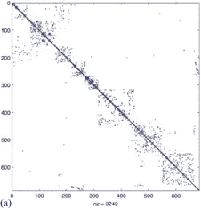
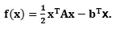
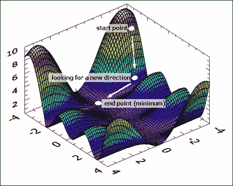
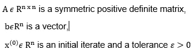
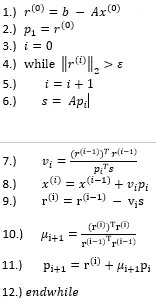
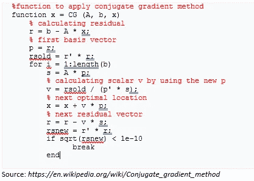

# 深度神经网络的优化算法:共轭梯度法

> 原文：<https://medium.com/geekculture/optimization-algorithm-for-deep-neural-networks-conjugate-gradient-method-d17e25068775?source=collection_archive---------8----------------------->

深度神经网络成为解决图像分类、文本分类、自然语言处理、计算机视觉等不同问题的标准方法之一

**Figure 1** *Image classification example 1*

深度学习问题需要一些特征来解决，如损失函数或优化器。为了求解，我们必须像往常一样首先定义一个损失函数。在这个操作之后，优化算法准备好最小化损失函数。让我们继续优化部分。

**Figure 2** *Image classification example 2*

优化器有时是算法或方法。它们是在深度神经网络训练阶段改变一些属性如权重、学习速率的非常有效的方法。选择正确/最佳的优化技术对于减少损失非常重要。其主要思想是以最少的损失提供最准确的结果。但是，容易吗？

目前，最大的问题之一是处理大型稀疏数据矩阵。

**Figure 3** *Sparse matrix*

寻找这些矩阵的逆也是另一个难题。经典的迭代方法不能解决这些矩阵。幸运的是，Krylov 子空间方法是处理这类问题的有用方法。Krylov 子空间方法的基础是 20 世纪 10 大算法思想之一。它们用在算法中，通过变换计算近似解。这些算法通过使用降维(从 n 维向量空间到更低的 m 维向量空间，m 小于 n 或等于 n)找到 x 的近似值。利用这些算法，不需要显式地估计矩阵 A 的逆矩阵。

Arnoldi，Lanczos，共轭梯度，广义最小剩余法是流行的 Krylov 子空间方法。我们将集中讨论共轭梯度法。

共轭梯度法是一种优化线性和非线性系统的数学方法。Hestenes 和 Stiefel 把这种方法介绍给我们用于最小化凸二次函数，

**Figure 4** *Conjugate Gradient Algorithm Visualization*

这是一种处理对称稀疏线性系统的有效方法，并且易于使用。一般来说，共轭梯度法是求解带有 s.p.d 矩阵的线性方程组的最佳迭代格式，无需多重网格分量。

Ax=b

首先，算法为每一步选择一个初始位置并沿着一个方向行走。CG 算法将下一个方向向量确定为前一个方向向量的共轭版本。在每一步中顺序确定相关方向。在步骤 I，在找到当前负梯度向量之后，该算法将先前方向向量的线性组合加到它上面。

它们如何选择下一步的搜索方向和步长属于不同的方法。但是，我们特别知道 CG 算法的两个重要优点。其中一个是寻找新方向向量的简单公式。另一个是统一进度。

**算法:共轭梯度法**

**共轭梯度成本**

o 一次 CG 迭代

*一个矩阵向量乘法(第 6 行)*

*(第 8、9、11 行)中向量的三次加法*

*向量与标量的三次乘法运算(第 8、9、11 行)*

*向量的两个内积(第 7，10 行)*

o 存储四个向量

**MATLAB 中共轭梯度法的代码**

共轭梯度法的缺点是它只对对称正定矩阵有用。对于非对称矩阵，还有其他方法/途径，我将在后面提到。然而，该算法是性能最好的 Krylov 子空间方法之一。

**参考文献**

[https://d2l.ai/chapter_optimization/optimization-intro.html](https://d2l.ai/chapter_optimization/optimization-intro.html)

[https://towards data science . com/optimizer-for-training-neural-network-59450d 71 caf 6](https://towardsdatascience.com/optimizers-for-training-neural-network-59450d71caf6)

[http://www . maths . lth . se/na/courses/num 115/num 115-05/krylov . pdf](http://www.maths.lth.se/na/courses/NUM115/NUM115-05/krylov.pdf)

[https://arxiv.org/pdf/1811.09025.pdf](https://arxiv.org/pdf/1811.09025.pdf)

[https://en.wikipedia.org/wiki/Conjugate_gradient_method](https://en.wikipedia.org/wiki/Conjugate_gradient_method)

[https://web . cs . I astate . edu/~ cs 577/讲义/conjugate-gradient.pdf](https://web.cs.iastate.edu/~cs577/handouts/conjugate-gradient.pdf)

[https://www.wias-berlin.de/people/john/LEHRE/lehre.html](https://www.wias-berlin.de/people/john/LEHRE/lehre.html)