# 更好更快模型训练的优化技术。

> 原文：<https://medium.com/geekculture/optimization-techniques-for-better-and-faster-model-training-44b41ef7bd31?source=collection_archive---------12----------------------->

模型训练基本上包括学习一个使实际值和预测值之间的损失最小化的等式。通过学习方程，意味着调整方程中的各种参数/权重。这就是优化发挥作用的地方。

> 优化器是一种更新各种参数的方法或算法，可以以更少的努力减少损失。

*让我们直接进入不同的优化技术:*

G**radient Descent***(1874 年由柯西提出)*

这是最早出现的优化算法。使用以下等式更新权重:

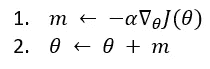

Figure 1: Gradient Descent algorithm , *Image by author*

GD 通过直接减去成本函数 *J(θ) w.r.t* θ乘以学习率α的梯度(导数)来更新权重θ。但是为什么成本函数是梯度的呢？成本函数是我们要最小化的函数，它的导数基本上是斜率的方向。因此，GD 以速率α沿斜坡下降，直到收敛并达到最小值。

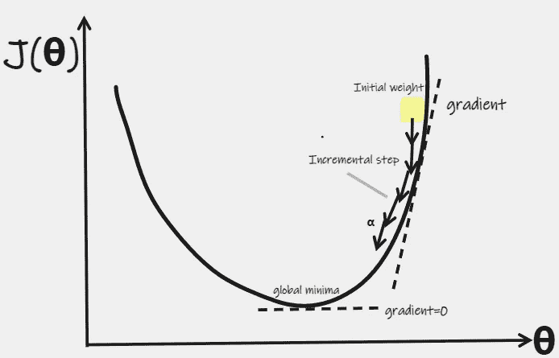

Figure 2: Gradient Descent Illustration, *Image by author*

α，是这里的超参数，叫做学习率。它决定了步长的大小。

1.  如果α很大，可能无法收敛，会超调最小值。
2.  如果α非常小，则需要很长时间才能收敛，并且计算量很大。

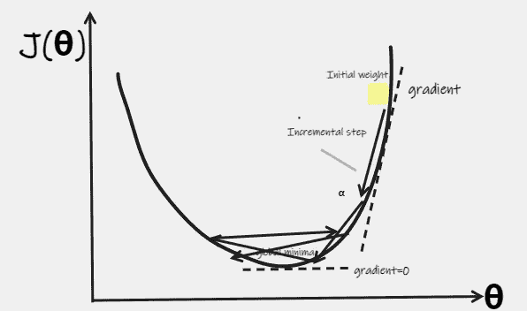

Figure 3: When, α is very large and the steps keep on oscillating instead of reaching the minima and diverge. *Image by author*

让我们看看在不同学习速率的情况下，w.r.t .对各代的损失。


Figure 4: Gradient descent with different learning rates. [Source](http://cs231n.github.io/neural-networks-3/)

G***(鲍里斯·波亚克于 1964 年提出)***

**传统梯度下降算法的问题是，它没有考虑先前的梯度是什么，如果梯度很小，它下降得非常慢。**

**当存在多个局部最小值或具有近似零梯度的鞍点时，这产生了问题，这又导致权重没有更新或更新很少，并且学习停止。**

**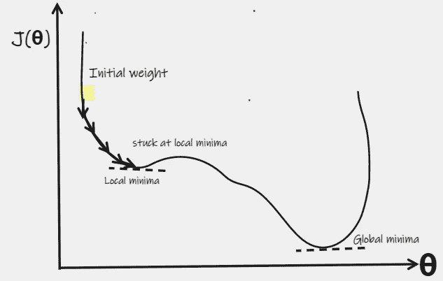**

**Figure 5: Gradient Descent stuck at local minima instead of going down to global minima. *Image by author***

**另一方面，动量优化非常关心先前的梯度。它考虑了上一次迭代中步长的变化(动量增加),并使用它来更新下一步。我们可以想象一个滚动的球，它开始很慢，但很快获得动量，直到它到达底部(全局最小值)。使用以下等式更新权重:**

**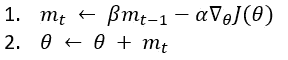**

**Figure 6: Momentum Optimization algorithm. *Image by author***

**β，称为动量，是调整前面的变化，设置在 *0(高摩擦)*到 *1(低摩擦)*之间。建议值为 0.9。**

**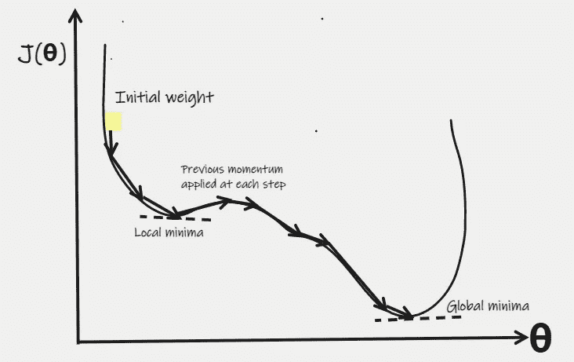**

**Figure 7: Gradient Descent with Momentum Illustration, doesn’t get stuck at local minima and reach the global minima using the momentum gained from previous iterations. *Image by author***

**N埃斯特罗夫加速梯度 (由尤里·内斯特罗夫于 1983 年提出)**

**它是动量优化的一个小更新，不是计算局部位置的梯度，而是计算动量方向稍微靠前的梯度。这个调整是有效的，因为即使动量优化也指向正确的方向，所以在稍远的点测量梯度是有意义的，反过来它会收敛得更快一些。**

**权重使用以下公式更新:**

**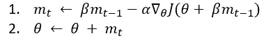**

**Figure 8: Nesterov Accelerated Gradient algorithm. *Image by author***

**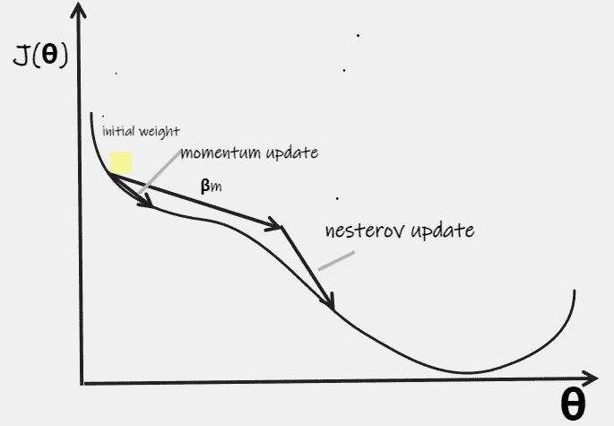**

**Figure 9: Nesterov Accelerated Gradient, converges much faster than Momentum optimization. *Image by author***

**阿 **达格拉德** *(约翰·杜奇于 2011 年提出)***

**当我们有多个参数/权重并且函数是非凸的而不是凸的时，我们可能在不同的点需要不同的学习速率。**

**在 AdaGrad 优化中，学习速率根据梯度进行调整。使用以下等式更新权重:**

**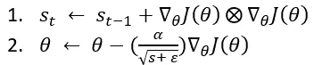**

**Figure 10: AdaGrad algorithm. *Image by author***

**这里，学习速率α除以参数 s，它累加梯度的平方。这意味着，当斜率较小时，α将较大，反过来，当我们接近最小值且斜率较陡时，将出现较大的台阶。**

**我们先考虑一个梯度下降的情况。**

**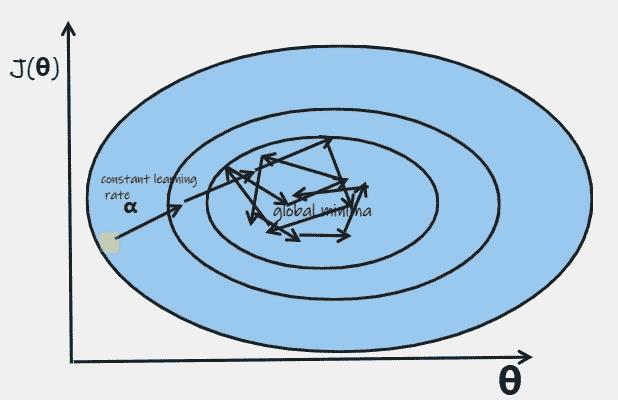**

**Figure 11: GD oscillating around global minima, until it reaches there after a lot of iterations, with a constant learning rate, α. *Image by author***

**然而，如果使用非常小学习速率来防止其振荡，它仍将花费更多的迭代，且在计算上将是昂贵的。**

**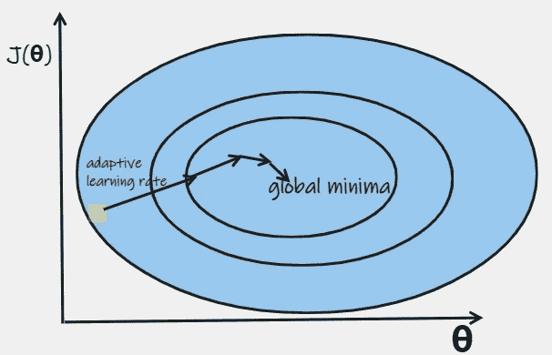**

**Figure 12: AdaGrad Illustration. Global Minima is reached much faster with the slower learning rate near the minima than at beginning. *Image by author***

**R**ms prop***(Geoffrey hint on&Tijmen tie leman 于 2012 年提出)***

**由于在极小值附近收敛较慢，AdaGrad 可能会遇到速度降得太快而永远无法收敛到全局最优的风险。RMSProp 通过在第一步中使用指数衰减来解决这个问题，并减少斜率对学习速率的影响。**

**权重使用以下公式更新:**

**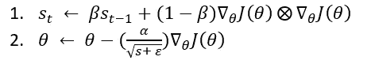**

**Figure 13: RMSProp algorithm. *Image by author***

**衰减率β通常设置为 0.9，适用于大多数问题。**

**A**dam***(Diederik 和 Jimmy 于 2014 年提出)***

**它代表自适应动量估计，结合了*动量优化*和 *RMSProp* 的思想。**

**权重使用以下公式更新:**

**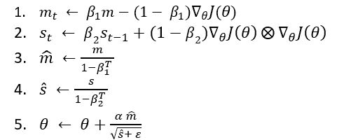**

**Figure 14: Adam algorithm. *Image by author***

**步骤 1、2 和 5 与动量优化和 RMSProp 非常相似。**

**动量衰减参数 *β1* 通常初始化为 *0.9* ，而比例衰减参数*β2* 初始化为 *0.999* 。**

> **在实践中，Adam 可以很好地解决几乎所有问题，并且通常比 RMSProp 稍好一些。因此，我们可以在所有的深度学习模型中使用 Adam 作为默认优化器。但是，在一些数据集中，我们可以尝试使用内斯特罗夫加速梯度作为替代。**

**亚当有 2 个变种，分别是 **AdaMax** 和 **Nadam。****

****阿达马克斯** : 它将等式的第 2 步替换为**

**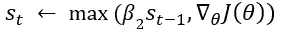**

**Figure 15: change in Step 2 in AdaMax algorithm. *Image by author***

**此外，它省略了步骤 4，并直接按系数 ***s*** 降低学习速率。在某些情况下，AdaMax 比 Adam 更稳定，但这取决于数据集。**

****那达慕**:是亚当+内斯特罗夫加速梯度，有助于其收敛速度略快于亚当。同样，这取决于手头的数据集。**

**让我们看看如何在 Keras，tensorflow 中实现每个优化器。我们可以拿 fashion_mnist 作为样本数据集。数据集中有 10 个类:`*[‘top’, ‘trouser’, ‘pullover’, ‘dress’, ‘coat’, ‘sandal’, ‘shirt’, ‘sneaker’, ‘bag’, ‘ankle boot’]*`**

```
import tensorflow as tf
from tensorflow import keras
fashion_mnist = keras.datasets.fashion_mnist
(X_train, Y_train), (X_test, Y_test) = fashion_mnist.load_data()
X_valid, X_train = X_train[:5000]/255.0, X_train[5000:]/255.0
Y_valid, Y_train = Y_train[:5000] , Y_train[5000:]
```

**我们将创建一个简单的顺序模型。**

```
model = keras.models.Sequential()
model.add(keras.layers.Flatten(input_shape=[28,28]))
model.add(keras.layers.Dense(300, activation="relu"))
model.add(keras.layers.Dense(100, activation="relu"))
model.add(keras.layers.Dense(10, activation="softmax"))
```

**定义 SGD(梯度下降)优化器**

```
optimizer = keras.optimizers.SGD(learning_rate=0.001)
model.compile(loss="sparse_categorical_crossentropy", optimizer = optimizer, metrics=["accuracy"])
history = model.fit(X_train, Y_train, epochs=20, validation_data=(X_valid, Y_valid))
```

**类似地，我们可以定义各种其他优化器，并在 *model.compile* 中传递它们**

```
# Momentum Optimization
optimizer = keras.optimizers.SGD(learning_rate=0.001, momentum=0.9)# Nesterov Accelerated Gradient
optimizer = keras.optimizers.SGD(learning_rate=0.001, momentum=0.9,nesterov=True)# AdaGrad
optimizer = keras.optimizers.Adagrad(learning_rate=0.001)#RMSProp
optimizer = keras.optimizers.RMSprop(learning_rate=0.001, rho=0.9)#Adam
optimizer = keras.optimizers.Adam(lr=0.001, beta_1=0.9, beta_2=0.999)#AdaMax
optimizer = keras.optimizers.Adamax(lr=0.001, beta_1=0.9, beta_2=0.999)#Nadam
optimizer = keras.optimizers.Nadam(lr=0.001, beta_1=0.9, beta_2=0.999)
```

**完整的代码可以在 [**这里找到**](https://github.com/GoyalShreya/keras-tf2-notebooks/blob/main/comparing%20_optimizers8.ipynb) 。**

**各种优化器在给定模型上的性能如下:**

**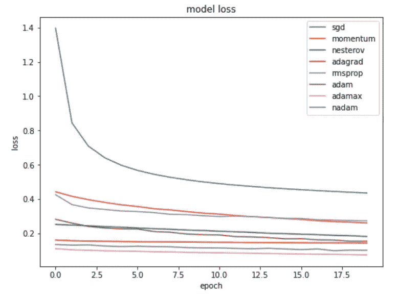**

**Figure 16: Comparison of different Optimizers on Fashion Mnist Data classification Model. *Image by author***

**从图表中可以得出以下结论:**

1.  **正如我们所看到的，后面的优化技术比 **SGD** 收敛得更快，甚至在很少的时期内达到全局最小值。**
2.  ****亚当变体**超越所有，并在更短的时期内达到最小值。**
3.  **同样，在这种情况下，**内斯特罗夫**的表现优于 **RMSProp** 。**
4.  ****AdaGrad** 开始时达到最小值，之后就没有太多更新了。**
5.  **因此，在大多数情况下，我们可以很容易地使用 Adam 作为默认的优化器。**