# ML 模型的优化技术

> 原文：<https://medium.com/geekculture/optimization-techniques-for-ml-models-bd500c8398ce?source=collection_archive---------13----------------------->

对于许多机器学习算法和深度学习网络，我们可以优化两个主要领域。一个是超参数，第二个是神经网络架构。

超参数的选择有时对确定模型的收敛性至关重要。优化技术用于确定学习算法的最佳超参数。选择对应于用户定义的度量的最佳超参数。通常优化是为了最小化模型的损失或最大化精度。这一过程被称为**超参数优化(HPO)。**

超参数优化是在固定的架构上完成的，但我们也可以执行一种称为**网络架构搜索(NAS)** 的技术，如果模型在单独 HPO 之后似乎仍然不收敛，则在 ML 模型或深度学习网络的架构空间上执行搜索。很多时候，寻找最佳架构需要领域专业知识，并且考虑到训练和评估被测试的 ML 模型的多个版本，这可能是耗时的。例如，确定是通过添加更多隐藏节点来扩展网络的宽度，还是通过添加更多层来增加网络的深度，这是 NAS 可以解决的问题。

HPO 和 NAS 算法可以使用白盒和黑盒方法来找到最佳的超参数和架构。白盒方法使用内部梯度进行优化，因此它们通常只能用于具有连续超参数空间的模型。黑盒方法探索超参数/架构空间，而不关心内部梯度，因此它们可以用于任何超参数或架构空间。下面介绍的两种黑盒方法是[贝叶斯优化](https://arxiv.org/abs/1206.2944)和 [DeepSwarm](https://arxiv.org/pdf/1905.07350.pdf) 。

# **贝叶斯优化**

下面是[实用贝叶斯优化机器学习算法](https://papers.nips.cc/paper/2012/file/05311655a15b75fab86956663e1819cd-Paper.pdf)的总结。

贝叶斯优化的目标是找到机器学习模型的最优超参数。简单地说，这是找到损失函数 *f(x)的最小值的唯一方法。*

该学习算法的泛化性能被建模为来自高斯过程(GP)的样本。每个 GP 由内核和超参数指定，并且它还考虑了可变成本和运行时间，以用于将来的计算并行化。

贝叶斯优化对于调整具有高计算成本的算法的参数是有用的。

贝叶斯优化的目标是使用概率模式找到 *f(x)* 的最小值，使用 *f(x)* 的所有先前评估来确定接下来评估的位置，而不是局部梯度，因为 *f(x)* 的评估是昂贵的。

我们需要选择的两个组件是高斯先验和采集函数。

## 高斯过程

我们选择一个损失函数

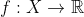

其中 X 是超参数设置的集合。

然后，我们在有限的 N 个点的集合上定义多元高斯分布:

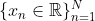

这导致分布在

由均值函数和正定协方差函数确定。

## 获取功能

对于采集功能，我们假设数据点来自

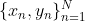

其中 *y* 由正态分布得到

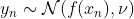

和

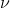

是函数值的方差。为了找到下一个数据点以计算最小值 f(x ),我们定义

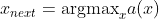

其中 **a** 代表采集功能。

采集功能有多个选项可供选择，例如

*   **改进概率—** 最大化获得比最佳当前值更好的值的概率

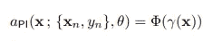

*   **预期改进—** 在当前最佳水平的基础上最大化预期改进

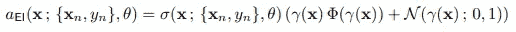

*   伽马被定义为

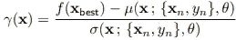

## 建模成本

我们需要快速找到超参数的最佳设置——我们更关心挂钟时间，而不是函数进度。

我们用**每秒的预期改进**进行优化——这些点可能是好的，并且可能被快速评估(例如，从一组较快的学习速率中选择，而不是较慢的)

## 用于并行贝叶斯优化的蒙特卡罗获取

不仅仅是并行化批处理，我们还想弄清楚 x_next 是什么。

这种顺序策略利用高斯过程来计算待定位置上的采集函数的蒙特卡罗估计。评估的数据是

未决数据是

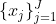

我们可以使用基于 J 维高斯分布来表征 **a** 的期望的采集函数。

# **深虫群**

以下是 [DeepSwarm 的总结:利用群体智能](https://arxiv.org/pdf/1905.07350.pdf)优化卷积神经网络。

## 使用 ACO 的动机

*   像 ACO 这样的群体智能算法由于容错性、分散性、可伸缩性以及知识共享和组合而适合于神经架构搜索
*   ACO 擅长解决具有图形表示的离散问题，并能适应动态变化的图形
*   神经网络是一种图形，这是使用 ACO 背后的直觉

## 深水群

1.  创建开始时有 1 个输入节点的内部图

2.放在输入节点上的每只蚂蚁

3.用蚁群系统选择规则为下一层神经网络选择节点

*   边上的信息素值(r，u)= 1

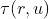

*   边上的启发式值(r，u)= 1

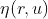

*   Jk(r) =可从 r 访问的节点
*   *q* = random # from [0，1]
*   *q0* in (0，1] =控制算法的贪婪性
*   *Beta* in (0，inf) =启发式信息的相对重要性
*   **选择规则如下:**

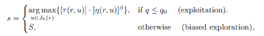

*   其中 S 是选自以下分布的随机变量:

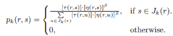

*   如果该节点是一个新的节点，并且在图上不存在，则将其添加为邻居

4.在为节点选择规则后，每个蚂蚁将使用相同的规则选择节点属性，如过滤器大小、内核大小等

5.两次选择后，节点被添加到该蚂蚁的路径中

6.当蚂蚁到达最大深度时，评估神经网络架构

7.**局部信息素更新**——每只蚂蚁完成一次行走后，更新其路径上的每一条边

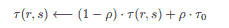

*   Rho 是信息素衰减因子——当 rho 为 1 时，100%衰减，因此仅基于起始值；当ρ为 0 时，信息素不断增加，使得最强路径更强。
*   这条规则允许腐烂，这鼓励蚂蚁寻找其他路径

**8。全局信息素更新**

*   在所有蚂蚁(评估神经网络)之后，找到最佳蚂蚁(最佳神经网络准确度)
*   通过以下方式增加最佳路径/路线中的信息素值:

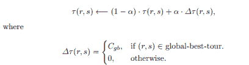

*   α是来自(0，1)的信息素蒸发率
*   Cgb 是最佳旅行的成本=最佳模型精确度

9.当前最大深度增加后，新的蚂蚁群体产生了

*   重复这个过程，直到达到全局最大深度

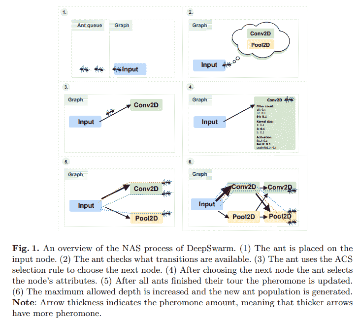