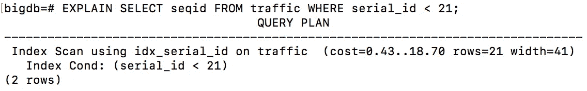
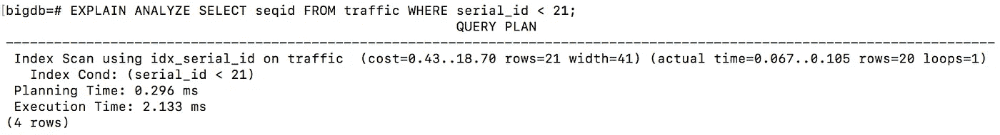
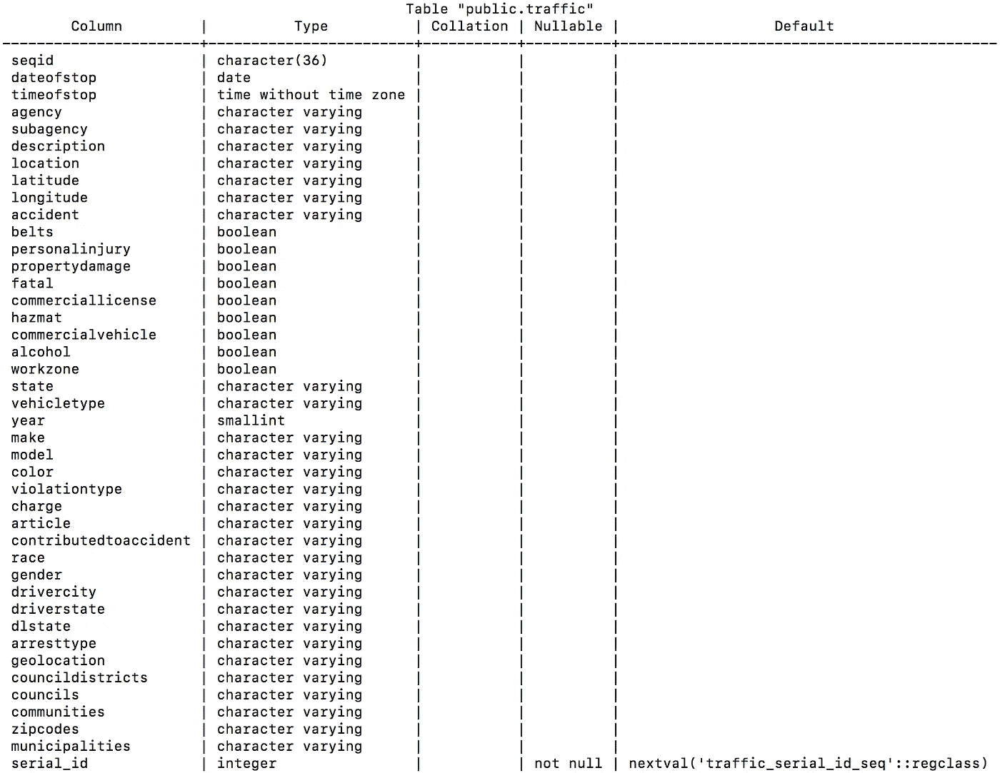
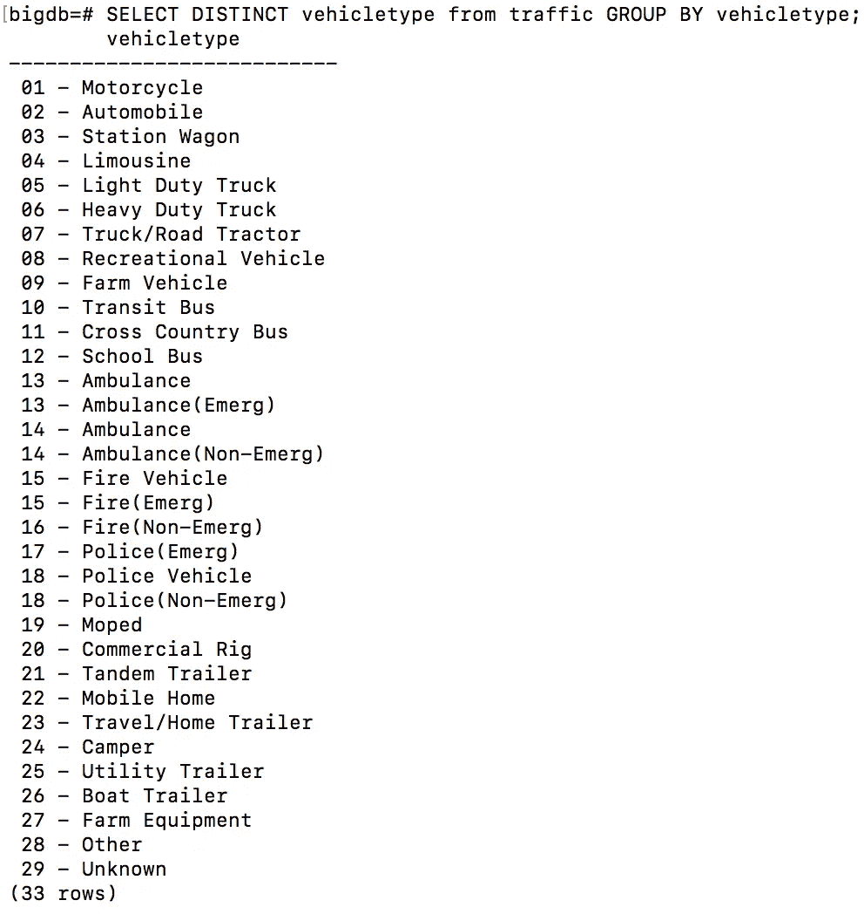
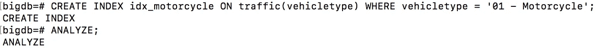
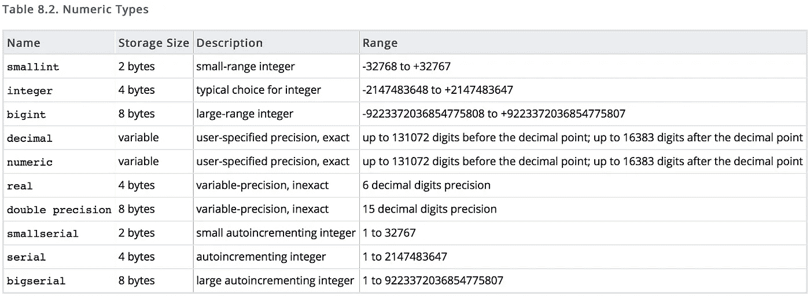
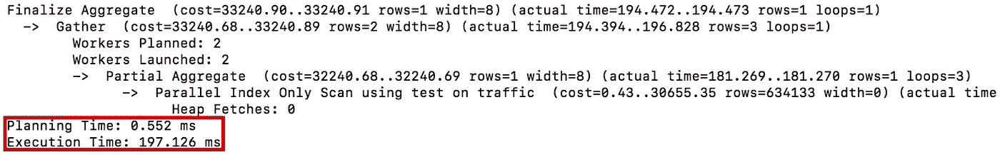
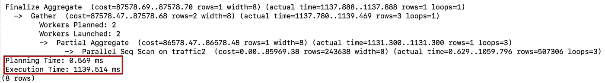

# 使用解释分析进行优化

> 原文：<https://medium.com/geekculture/optimization-with-explain-analyze-1f8e396b7131?source=collection_archive---------28----------------------->

在[之前的](https://jayprakashstar.medium.com/indexing-in-postgres-db-4cf502ce1b4e)文章中，我们讨论了什么是索引，以及为什么它是我们数据库的重要部分。现在让我们看一个实际的例子，如何有效地创建索引可以帮助我们，以及我们如何找出相同的。

查询 Postgres 数据库，如果操作得当，可以产生非常高效的结果，并提供强大的洞察力。然而，有时查询不是以最佳方式编写的，导致响应时间很慢。因此，能够分析查询如何执行并找到运行查询的最佳方式非常重要。

优化查询的一种方法是检查查询计划以了解查询是如何执行的，并调整查询以使其更有效。使用查询计划可以深入了解查询运行效率低下的原因。

**什么是查询计划**

查询计划是数据库为了对数据执行查询而需要遵循的指令列表。

## 解释和解释分析

在 PostgreSQL 中，可以使用 ***解释*** 命令来检查查询计划:

```
**EXPLAIN** **SELECT** seqid **FROM** traffic **WHERE** serial_id**<**21;
```



此命令显示生成的查询计划，但不运行查询。为了查看实际执行查询的结果，您可以使用 ***解释分析*** 命令:

```
**EXPLAIN** **ANALYZE** **SELECT** seqid **FROM** traffic **WHERE** serial_id**<**21;
```



**警告:**添加 ***分析*** 到 ***解释*** 将运行查询并提供统计数据。这意味着如果你使用 ***解释*** 对一个 ***DROP*** 命令(比如解释分析 DROP TABLE table)，指定的值将在查询执行后被删除。

# 使用的数据

用于演示优化的数据是关于交通违规的数据表，可在[这里](https://data.montgomerycountymd.gov/api/views/4mse-ku6q/rows.csv?accessType=DOWNLOAD)找到。它是从可供下载的 CSV 文件中导入的，删除了几个值的几列，并修改为一个名为 serial_id 的串行行。该表的详细信息如下所示:

\d+流量



# 指数

[索引](https://jayprakashstar.medium.com/indexing-in-postgres-db-4cf502ce1b4e)对于 SQL 的效率至关重要。它们可以极大地提高查询速度，因为它将查询计划改为更快的搜索方法。将它们用于大量查询的列是很重要的。

例如，示例数据中 serial_id 列上的索引会对执行时间产生很大影响。在添加索引之前，执行以下查询最多需要 13 秒钟，如下所示:

```
**EXPLAIN** **ANALYZE** **SELECT** ***** **FROM** traffic **WHERE** serial_id **=** 1;
```


在这种规模的数据库上，13 秒返回一行绝对不是最佳结果。在查询计划中，我们可以看到该查询正在对整个表运行并行顺序扫描，这是低效的。此操作具有很高的启动时间(1000 毫秒)和执行时间(13024 毫秒)。

通过创建索引并对其进行分析，可以避免并行顺序扫描，如下所示:

```
**CREATE** **INDEX** idx_serial_id **ON** traffic(serial_id);
**ANALYZE**;
```


这表明当使用索引时，执行时间从 13024.774 毫秒减少到 0.587 毫秒(即减少了 99.99549 **%** )。这大大减少了执行时间。规划时间确实增加了 3.72 毫秒，因为查询规划器需要访问索引，并在开始执行之前决定使用索引是否有效。然而，与执行时间的变化相比，计划时间的增加可以忽略不计。

并非所有索引对查询的影响都是一样的。在实施指数之前和之后，使用**解释分析**来查看影响是什么是很重要的。

索引并不总是答案。有时顺序扫描比索引扫描更好。对于小表、大数据类型或已经有足够的指定查询索引的表，情况就是如此。

# 部分索引

有时最好使用部分索引，而不是完整索引。部分索引是存储查询结果的有序数据的索引，而不是存储列的索引。当您希望特定的筛选器快速运行时，部分索引是最佳选择。例如，在该表中，记录了多种类型的车辆:

```
**SELECT** **DISTINCT** vehicletype **FROM** traffic
**GROUP** **BY** vehicletype;
```



许多研究都是关于摩托车安全的。对于这些研究来说，明智的做法是只对摩托车使用部分指数，而不是包括其他车辆类型的不必要信息的指数。若要创建仅索引涉及摩托车的行的部分索引，可以运行以下查询:

```
**CREATE** **INDEX** idx_motorcycle **ON** traffic(vehicletype)
**WHERE** vehicle **=** '01 - Motorcycle';
**ANALYZE**;
```



该索引将只存储与摩托车违章相关的数据，这比搜索整个表要快得多。

以下是关于索引的一些最终提示:

1.  切记 ***分析*** :重要的是运行 ***分析；*** 创建索引后为了更新索引上的统计数据。这使得查询规划器可以在何时使用索引方面做出最明智的决定)
2.  记住 ***真空*** :对工作台进行重大修改后，运行 ***真空分析*** 是很重要的。该命令将清理索引的统计数据，丢弃旧值并添加新值。此命令将定期自动运行，但是在大量修改后运行此命令对于更快获得结果非常有用。
3.  确保您的查询可以使用索引:避免使用在开头带有通配符的[正则表达式模式](https://dataschool.com/learn/how-regex-in-sql-works)如 ***像“%[模式]%'*** 这样会使查询规划器无法使用索引。您可以使用结尾带有通配符的正则表达式模式，如 ***，就像“[pattern]%”***。

# 数据类型

效率的另一个重要方面是所使用的数据类型。数据类型对性能有很大的影响。

不同的数据类型可以有完全不同的存储大小，如 PostgreSQL 文档中关于**数字类型**的表格所示:



交通违规数据集包含 1，521，919 行(使用**计数** [聚合](https://chartio.com/learn/sql/aggregate/?__hstc=113363352.94e82591ed64b2e1586ce498b9a712d4.1620292938473.1620292938473.1620292938473.1&__hssc=113363352.1.1620292938474&__hsfp=1637581693)找到)。我们需要考虑需要最少空间来存储我们想要的数据的数据类型。我们向数据中添加了一个串行列，从 0 开始，每行递增 1。由于数据长度为 1，521，919 行，我们需要一种至少可以存储该数据量的数据类型:

*   **如果行数在 32768 行以下，smallserial** 是最佳选择。
*   **如果行数大于小序列的最大值或小于大序列的最小值，则序列**是最佳选择。
*   如果行数超过 2，147，483，647，bigserial 是合适的选择。

1，521，919 大于**小序列**极限(32，768)，小于**序列**极限(2，147，483，647)，所以应该使用**序列**。

如果我们为该列选择 **bigserial** ，它将使用两倍的内存来存储每个值，因为 bigserial 的每个值都存储为 8 个字节，而不是 serial 的 4 个字节。虽然这对于*流量*或更大的表上的非常小的表来说不是非常重要，但是这可以产生很大的不同。在流量数据集中，这将是额外的 6，087，676 字节(6MB)。虽然这不太重要，但它确实会影响扫描和插入的效率。同样的原则也适用于较大的数据类型，如 char(n)、文本数据类型、日期/时间类型等。

例如，如果创建了一个流量副本，其中用 **bigserial** 替换了 **serial** ，则扫描时间会增加。通过比较解释分析结果，我们可以看到这一点:

原始表的结果:

```
**EXPLAIN** **ANALYZE** **SELECT** **COUNT**(*****) **FROM** traffic;
```



复制的结果:

```
**EXPLAIN** **ANALYZE** **SELECT** **COUNT**(*****) **FROM** traffic2;
```



从上面的图片中我们可以看到，在原始表上聚合的时间是 197 毫秒，即 0.2 秒。低效拷贝的聚合时间为 1139 毫秒或 1.1 秒(慢 5.5 倍)。这个例子清楚地表明，数据类型对效率有很大的影响。