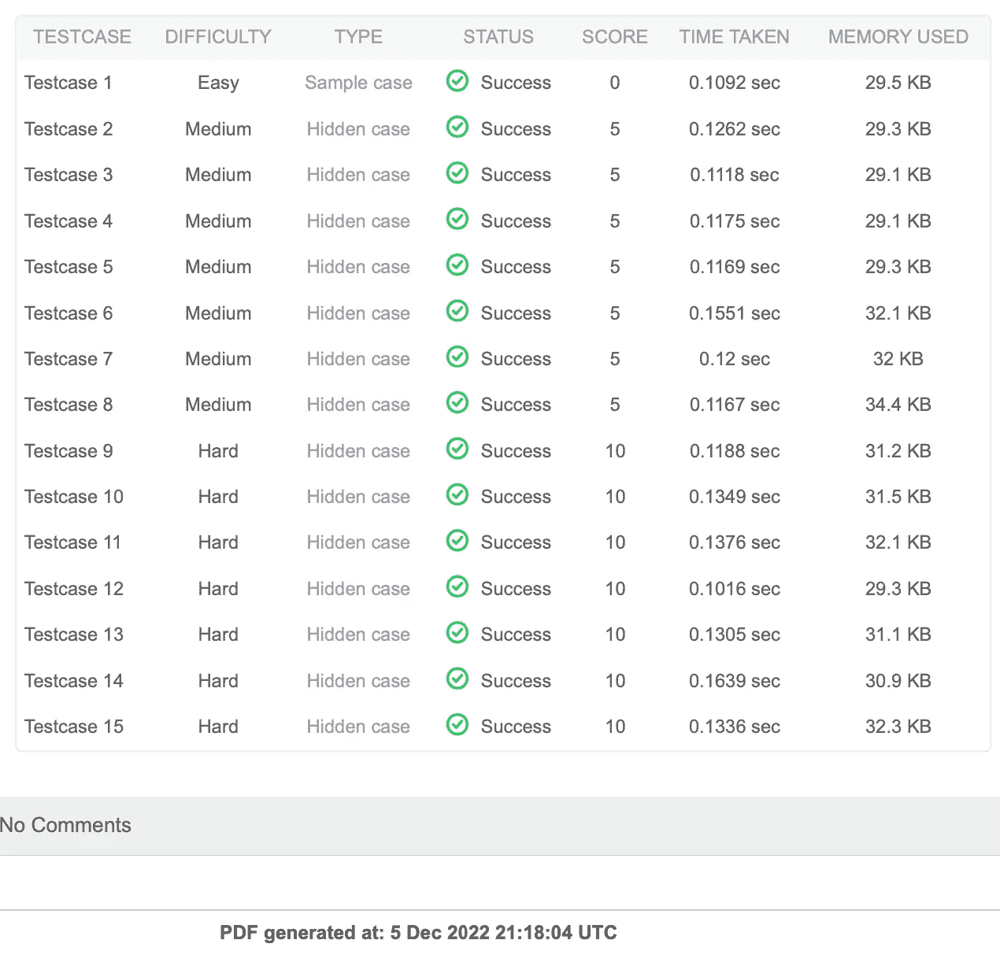

# 优化回文索引 HackerRank 解决方案

> 原文：<https://medium.com/geekculture/optimize-palindrome-index-hackerrank-solution-ceeb5bc91e1d?source=collection_archive---------4----------------------->

## 回文索引优化的 Java 解决方案


Photo by [Dell](https://unsplash.com/@dell?utm_source=medium&utm_medium=referral) on [Unsplash](https://unsplash.com?utm_source=medium&utm_medium=referral)

HackerRank 回文索引是一个基本问题，但很难通过所有测试用例。这里将举例说明如何在 Java 中求解和优化，这样可以很容易理解并扩展到其他问题。

## 问题

给定 ascii[a-z]范围内的一串小写字母，确定一个字符的索引，该字符可以被移除以使该字符串成为[回文](https://en.wikipedia.org/wiki/Palindrome)。可能有不止一种解决方法，但任何一种都可以。如果单词已经是回文或者无解，返回-1。否则，返回要删除的字符的索引。

**举例**

```
s = "bcbc"
```

请移除索引 0 处的“b”或索引 3 处的“c”。

**功能描述**

在下面的编辑器中完成回文索引函数。

回文索引有以下参数:

*   字符串 s:要分析的字符串

**返回**

*   int:要移除的字符的索引或-1

以下是 HackerRank 的问题陈述:

[](https://www.hackerrank.com/challenges/palindrome-index/problem) [## 回文索引| HackerRank

### 给定 ascii[a-z]范围内的一串小写字母，确定可以移至…

www.hackerrank.com](https://www.hackerrank.com/challenges/palindrome-index/problem) 

## 优化解决方案

使用一个循环来检查子串是否是回文是很简单的。时间复杂度为 O(n)。但它在许多 HackerRank 测试案例中都会失败。

在 Java 中，可以通过两种方式进行优化:1 .由于 Java 字符串是不可变的，所以在从字符串转换后对 char 数组进行操作；2.从两端检查 char 数组来加速。请参见下面的优化 Java 解决方案。

```
import java.io.*;
import java.math.*;
import java.security.*;
import java.text.*;
import java.util.*;
import java.util.concurrent.*;
import java.util.function.*;
import java.util.regex.*;
import java.util.stream.*;
import static java.util.stream.Collectors.joining;
import static java.util.stream.Collectors.toList;

class Result {

    /*
     * Complete the 'palindromeIndex' function below.
     *
     * The function is expected to return an INTEGER.
     * The function accepts STRING s as parameter.
     */

    public static int palindromeIndex(String s) {
        // Write your code here
        if (s == null || s.length() < 2) return -1;
        char [] ss = s.toCharArray();
        int l = 0, r = ss.length - 1;

        if (isPal(ss, l, r)) return -1;
        while (l < r) {
            if (isPal(ss, l+1, r)) return l;
            if (isPal(ss, l, r-1)) return r;
            if (ss[l] != ss[r]) return -1;
            l++;
            r--;
        }

        return -1;
    }

    static boolean isPal(char [] s, int l, int r) {
        if (s == null || l > r) return false;
        while (l < r) {
            if (s[l] != s[r]) return false;
            l++;
            r--;
        }

        return true;
    }

}

public class Solution {
    public static void main(String[] args) throws IOException {
        BufferedReader bufferedReader = new BufferedReader(new InputStreamReader(System.in));
        BufferedWriter bufferedWriter = new BufferedWriter(new FileWriter(System.getenv("OUTPUT_PATH")));

        int q = Integer.parseInt(bufferedReader.readLine().trim());

        IntStream.range(0, q).forEach(qItr -> {
            try {
                String s = bufferedReader.readLine();

                int result = Result.palindromeIndex(s);

                bufferedWriter.write(String.valueOf(result));
                bufferedWriter.newLine();
            } catch (IOException ex) {
                throw new RuntimeException(ex);
            }
        });

        bufferedReader.close();
        bufferedWriter.close();
    }
}
```

请看下面的测试结果。


但是在一个特殊的测试案例中仍然失败。如果你做了 HackerRank 模拟测试，你将会失败它的第 15 个测试用例。下面我们进一步优化或者简化一下。

```
class Result {
    /*
     * Complete the 'palindromeIndex' function below.
     *
     * The function is expected to return an INTEGER.
     * The function accepts STRING s as parameter.
     */
  public static int palindromeIndex(String s) {
        // Write your code here
        if (s == null || s.length() < 2) return -1;
        char [] ss = s.toCharArray();
        int l = 0, r = ss.length - 1;
        if (isPal(ss, l, r)) return -1;
        while (l < r) {
            if (ss[l] != ss[r]) {
                if (isPal(ss, l+1, r)) return l;
                if (isPal(ss, l, r-1)) return r;
            } 
            l++; 
            r--;
         }

         return -1; 
    }

    static boolean isPal(char [] s, int l, int r) {
        if (s == null || l > r) return false;
        while (l < r) {
            if (s[l] != s[r]) return false;
            l++;
            r--;
        }
        return true;
    }
}
```

就是这样。假设可能有一个回文，并保持循环运行。上述解决方案可以通过硬模拟测试。请看下文。



编码快乐！

*问题，想法？请在下面的回复中留下评论。与我联系，成为解决有趣问题之旅的一部分。*