# 优化模型组合

> 原文：<https://medium.com/geekculture/optimizing-a-portfolio-of-models-f1ed432d728b?source=collection_archive---------0----------------------->

在这个 [colab 笔记本](https://github.com/microprediction/precise/blob/main/examples_colab_notebooks/lazypredict_model_portfolio.ipynb)中，我提供了一个使用 [precise](https://github.com/microprediction/precise) Python 包(和 [PyPortfolioOpt](https://github.com/robertmartin8/PyPortfolioOpt) )创建一个多样化的 scikit-learn 模型组合的例子，这些模型使用 [LazyPredict](https://github.com/shankarpandala/lazypredict) 。

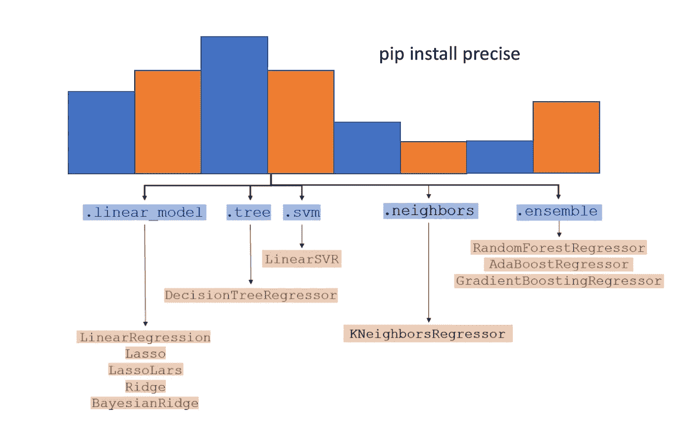

# 背景

目前，我满足于将读者的注意力吸引到金融投资组合构建和模型集合之间的密切相似之处。模型的线性组合当然类似于资产组合，因为评估在数学上是相似的，有时甚至是相同的。

在假设模型是无偏的情况下，我们对组合模型的平方误差(或一些类似的度量)感兴趣。同样，在金融领域，我们有时会对最小化线性证券组合(或者类似的目标)的方差感兴趣。

有趣的是，预测文献和金融文献都用不同的术语提出了同样严厉的实证警告。过度集中会损害投资组合的长期回报，就像过度依赖单一模型会损害样本外表现一样。

我们还在文献中发现了关于投资组合构建过于花哨的实证警告(类似地，专家意见、预测模型或模型输出的组合)。你会经常听到这样一句话:在一个看似很低的标准(同等重量)上取得进步有着惊人的困难。

这是一个合理的担忧，作为一个例子，协方差的点估计的危险得到了很好的理解——如果你愿意，你可以花几个小时阅读这个主题(这里有一个论文列表)。

然而，理论和实践都在进步，所以在我看来，聪明弊大于利的观点可能有些过头了，当然也不应该阻止人们在数据丰富的领域工作。我的意图是，通过创建 precise 包以及与 AutoML 的一些互操作性，温和地反击这种看法。

特别是，我怀疑自动机器学习的“混合”阶段将开始更多地借鉴金融。

# 这个计划

我在这里的适度目标是从货架上取下一个标准的 sklearn 数据集，看看我们是否可以轻松地构建一个“相当好的”自主创建的模型组合，比选择最佳模型更好地为您服务。对各种交叉验证进行更仔细的比较还需要等待，但是如果你选择这样做的话，我将为你提供继续进行的要素。

为此，我们将把数据分成三个部分，称为“训练”、“测试”和“验证”。这里的“测试”有点用词不当，因为我们将执行以下操作:

1.  X 列车，y 列车上的列车
2.  基于样本性能的 X_test，y_test 选择最佳模型
3.  同时使用 X_test、y_test 和标准投资组合构建技术的模型残差来估计*模型投资组合权重*。
4.  在 X_train+X_test 上重新训练模型
5.  使用步骤 3 中的权重，将最佳模型的性能与加权组合进行比较。

(撇开语义不谈，我们注意到，选择上面确定的“*最佳”模型*当然是投资组合的一个特例——所有的质量都在一个模型上。我可能应该把它加到精确包装里！)

# 预赛

开始具体工作，我们需要精确的包装。如果你使用 colab 或者一个预先提供熊猫的环境，省掉你自己可能的烦恼。例如在 colab 上:

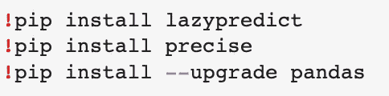

然后重新启动环境。我们将使用:

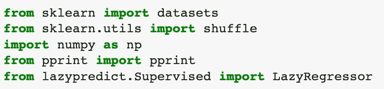

同样的 *sklearn* 例子，你会在 LazyPredict [自述文件](https://github.com/shankarpandala/lazypredict)、波士顿数据集[中找到。](http://lib.stat.cmu.edu/datasets/boston)

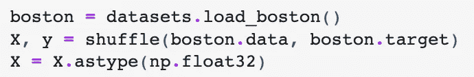

仔细阅读 sklearn 文档提醒我们，这个数据集有*伦理问题*并且不应该使用，除非目的是教育人们关于数据伦理。当然，当然，那是我的意图。你们都应该购买和阅读我即将出版的精彩书籍“*微预测:建立一个开放的人工智能网络”*将于秋季由麻省理工学院出版社出版。在那里你会发现一个关于模型公平性的长时间讨论，以及为什么它只能通过一个预测网络来解决。

不管怎样，回到我们花了半天时间来打败企业号的事情上来...

# lazy 预测包

我猜它被称为 LazyPredict 是有原因的。这个漂亮的小软件包为您节省了相当多的代码行，这些代码用于编组 scikit-learn 模型和它们的预测。例如，使用下面的 LazyRegressor 为在 X_train 上训练和在 X_test 上测试的模型创建了一个性能表:

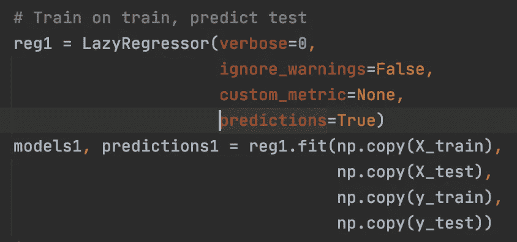

(你可以用 [pycaret](https://github.com/pycaret/pycaret) 或 [autoviml](https://github.com/AutoViML/AutoViz) 或类似的包做同样的事情，我开始走这条路。然而，pycaret 的交互性假设减慢了我的速度，足以切换到这个特定实验的目的。我将很快为流行的选择写一些改编本)。

*预测 1* 输出给了我们需要的数据，现在我们将转向**精确**包来推断模型的组合。

# 精确的包装

确切地说，这个包包括一个“经理”的集合。经理是接收向量(可能是几只股票同期收益的集合，但这里包括模型残差)并更新投资组合权重的人。

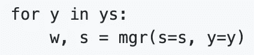

Using a “manager” to update weights

这个包包含了一些完成这个任务的新方法，并且调用了优秀的 [PyPortfolioOpt](https://pyportfolioopt.readthedocs.io/en/latest/) 和 [Riskfolio-Lib](https://riskfolio-lib.readthedocs.io/en/latest/) 包。在文件[中有一个经理的完整列表，你相信吗？](https://github.com/microprediction/precise/blob/main/LISTING_OF_MANAGERS.md)

在波士顿数据集中，我假设这些行是非时态的。precise 包主要针对实时时态问题，但这在这里并不重要。

对于一些经理，我们让 [Riskfolio-Lib](https://riskfolio-lib.readthedocs.io/en/latest/) 做所有的工作，从历史数据的累积缓冲开始。对其他人来说，投资组合经理可能是两种选择的组合:

1.  一种在线估计协方差的方法，结合
2.  根据协方差预测确定投资组合的方法(有时使用 [PyPortfolioOpt](https://pyportfolioopt.readthedocs.io/en/latest/) )。

恐怕，可能性的爆炸会导致完全自主的管理者的名字变得相当长。如果您仔细阅读下面的导入，然后参考精确的[自述文件](https://github.com/microprediction/precise)，您可能会推断我正在使用 PyPortfolioOpt 的最小波动率投资组合和图形套索的实现，并对协方差估计进行交叉验证。

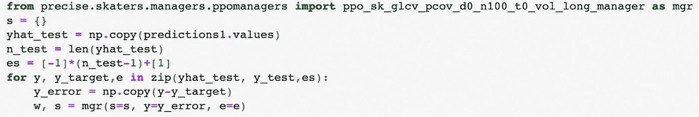

如果我把字体变大…

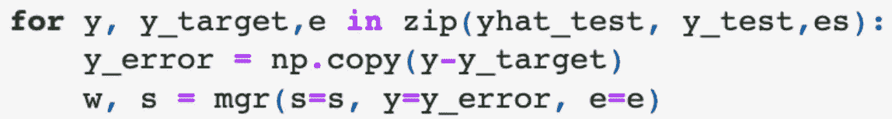

你也可以观察给经理打电话的方式。我一次给它一个模型残差向量，并且从一次调用到下一次调用，我代表它保存状态 s。一旦你明白了笑话的那部分，精确包装的使用就变得微不足道了。

(这里不用担心 **e** 的使用。这是一个小的性能黑客。它告诉投资组合经理，我们只关心最后的 **w.** 我建议你参考[文档](https://github.com/microprediction/precise)，因为它是关于“滑冰”的更多解释。)

# 投资组合和组合模型

测试数据集上模型残差的协方差向经理建议多样化的投资组合如下:

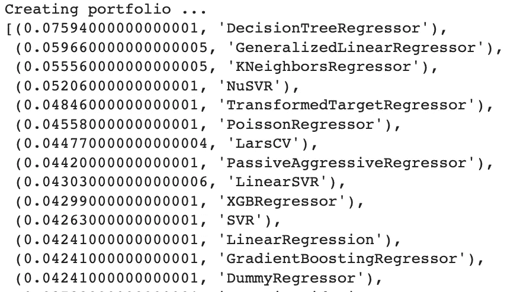

一旦我们为这些模型生成了样本外预测，我们只需使用线性组合。

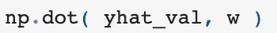

Linear combination of models

另外，用金融术语来说，为了稳定，我使用了一个“只做多”的经理。在某些情况下，人们可能希望适当放松这一限制。

# 样本外性能

显然，我们没有水晶球来告诉我们哪个模型在样本中表现最好，但我还是制作了事后误差平方和排行榜作为参考。

我已经在不可能排行榜中插入了我们的加权模型组合，以及最佳模型(在本例中为正交匹配追踪)。如你所见，这种情况下投资组合更好。

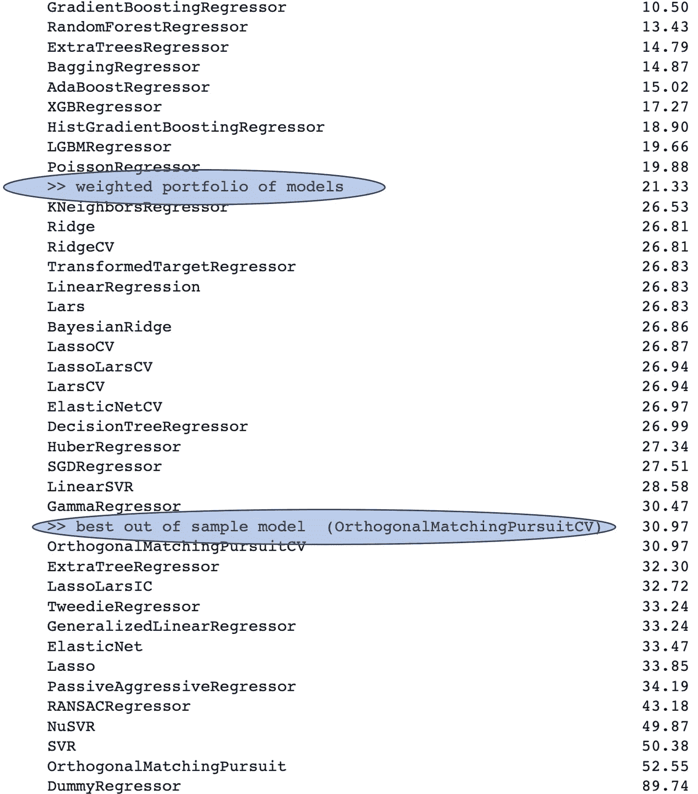

Out of sample performance of a portfolio of sklearn models, set against the selected “best” model

如果你看一下[precise/examples _ ensembles _ lazy predict](https://github.com/microprediction/precise/tree/main/examples_ensembles_lazypredict)中的脚本版本，有一点蒙特卡洛研究。它强烈表明，使用模型组合优于选择最佳模型，至少对于波士顿数据集来说是这样。(我还包括了没有在测试集上重新训练的最佳模型，以预测该评论。)

# 选择模型投资组合:一个开放性问题？

有一个健康的堆积，专家的混合，和集合文献，然而我认为在这种情况下最好的使用金融投资组合理论的问题是一个开放的问题。

有人可能会反驳说，实证金融文献可能无法很好地回答这一问题，因为投资组合方法及其样本外表现在很大程度上取决于数据生成过程的性质，而且金融投资组合的一些特征不一定适用于残差模型。

然而，我们很快就会知道了。你可以期待在精确的 GitHub repo 中看到更多的 Elo 评级类别。这些将试图弄清在不同的模型组合环境中，哪种类型的投资组合结构更受青睐。

如果你想合作，在这里找到我。例如，如果你有剩余的模型(你会分析你的剩余，不是吗？).与流行的 AutoML 软件包的集成也可能取得成果。