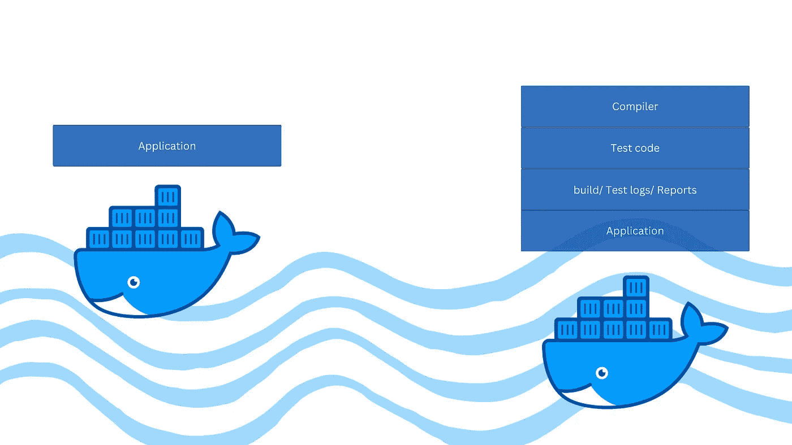
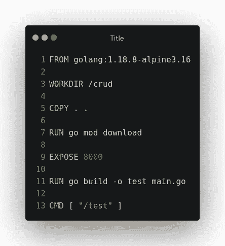
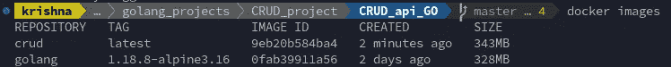
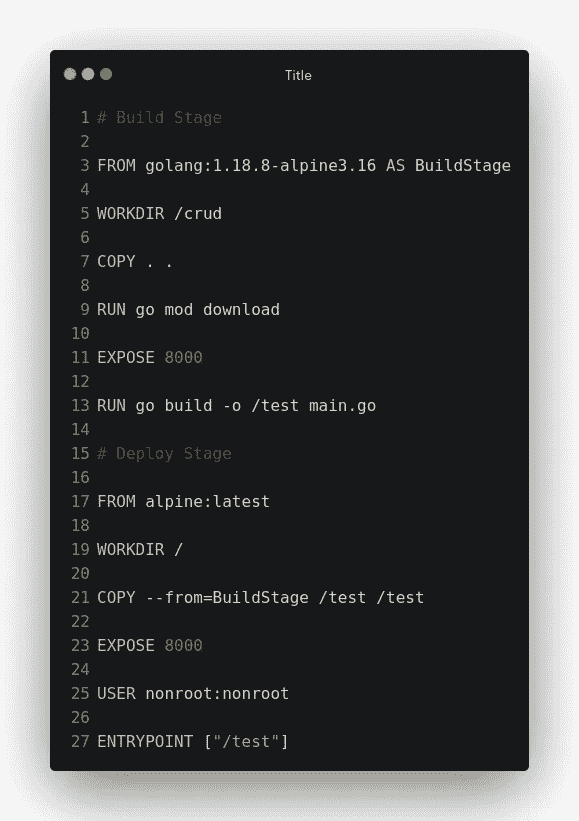
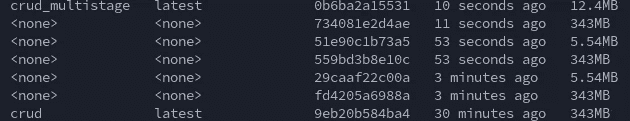

# 使用多阶段构建优化 Golang Docker 图像

> 原文：<https://medium.com/geekculture/optimizing-golang-docker-images-with-multi-stage-builds-ca7b305faa?source=collection_archive---------0----------------------->

## 戈朗-多克尔公司

## 创建你的码头工人形象，使之轻盈，码头工人鲸鱼不会游泳，它会飞！

随着构建一个产品所需的开发规模越来越大，需要大量的开发人员来开发、共享和维护代码。由于每个开发人员的环境互不相同，用相似的库版本创建相似的环境变得相当麻烦。为了解决这个问题，我们使用 Docker，它为所有开发人员创造了相似的环境体验。当使用 docker 时，我们经常面临创建一个大的 docker 图像的问题，有时会占用几个 GBs 的空间。这种想法极大地挫败了 Docker 已经超越了传统虚拟机的想法——“创建开发人员可以轻松工作的轻量级和资源轻量级映像”

为了解决 docker 映像膨胀的问题，我们有几种解决方案，例如使用 dockerignore 来避免添加不必要的文件，使用 distrolles/minimal 基本映像或最小化层数。但是当我们构建一个应用程序时，我们会使用不同的工具来排除使用发行版映像的可能性。在构建时，我们会处理几个步骤，所以有这么多的可用性来减少 dockerfile 文件中的层。

我们用来构建应用程序的工具在运行应用程序时经常不被使用。那么，如果我们能够以某种方式分离/移除这些构建工具，只拥有运行应用程序的工具，会怎么样呢？在 docker 中输入*多阶段*构建。

# Docker:多阶段构建

多阶段构建是 Docker 文件中构建器模式的实现，有助于最小化最终容器的大小，提高运行时性能，允许更好地组织 Docker 命令。多阶段构建是通过将单阶段 done 文件分成同一个 done 文件中的不同部分(您可以将它们视为不同的作业，如构建、阶段等)来完成的，从而创建环境的分离。由于每个步骤都将使用只对该步骤有用基本图像，同时将其输出传递给下一个步骤，因此我们可以保持 docker 图像精简。这也可以通过在 CI(持续集成管道)中使用不同的 done 文件，将一个阶段的输出传递给另一个阶段来完成。但是 docker 的多阶段特性消除了创建所有这些管道步骤的需要，并有助于保持管道的整洁。

# 创建多阶段 Docker 文件

为了解释这一点，我们将构建并运行一个用 Golang 编写的电影应用程序，它执行基本的 crud 操作。该应用程序的代码可以在[这里](https://github.com/krishnaduttPanchagnula/Golang_projects/tree/main/CRUD_api_GO)找到。

正如我们在 Go 中所知道的，为了让应用程序运行，我们需要编译它。在编译时，它将创建一个可执行文件(属于该操作系统),只有这个可执行文件是运行应用程序所必需的。为了说明多阶段构建的强大功能，让我们首先将它构建为一个单阶段 Docker 文件。

一旦我们在上面的文件上运行 docker build，我们会得到下面这个大约 350 MB 的可执行文件。

现在让我们将构建阶段和执行阶段分成两个不同的环境。对于构建阶段环境，让我们使用基于 alpine 的 Golang 映像，它装载了运行、测试、构建和验证 Golang 所需的所有工具。我们使用这个环境工具来构建我们的应用程序。完成后，我们将可执行文件传递给环境，即运行可执行文件的执行/生产环境。

由于创建了可执行文件，我们不需要太多以前的环境工具，并且可以使用基本的 alpine 映像。一旦我们在这个文件上运行 docker build，我们观察到这个文件的大小大约是 13 MB(在下图中被命名为 **crud_multistage** ),而单级 Dockerfile 的大小是 350 MB(在下图中被命名为 **crud** )。这种多阶段构建将 docker 映像的总体 sie 降低了约 95%

由于此映像非常小，因此更易于移植，并且可以在生产中轻松部署。虽然多阶段构建听起来是一个很棒的想法，但是在某些情况下应该使用它，在某些情况下应该避免使用它。

**何时不使用多阶段构建:**

*   当你编写的语言将需求完全打包成一个文件(比如 GO 等)或者至少打包成一组文件(比如 JavaScript 等)。
*   如果您不打算在最终工件上运行 docker exec 命令来研究应用程序代码。
*   如果您不需要在构建阶段使用的工具和文件，那么可以进一步调试最终的工件。

**何时使用多阶段构建:**

*   当您希望最小化部署到生产环境中的最终 Docker 映像的总大小时。
*   当您希望通过并行运行 Docker 文件中的步骤/阶段来加速 CI/CD 流程时。
*   当您的 Docker 文件中的不同层是直截了当和标准化的。
*   当您不介意失去构建中介并且只想要最终的 docker 工件时。