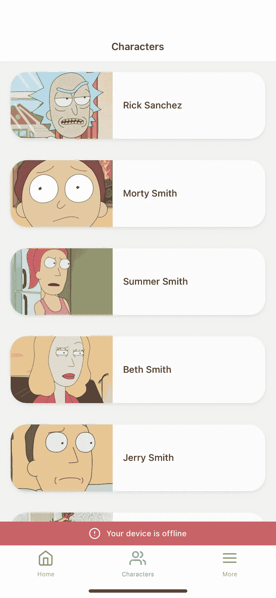

# 使用 Apollo 缓存持久化优化 React 本机离线模式

> 原文：<https://medium.com/geekculture/optimizing-react-native-offline-mode-using-apollo-cache-persist-a7723c7e8416?source=collection_archive---------23----------------------->


离线模式对于市面上大多数手机 app 来说都是极其重要的。例如，拥有与旅游、天气、游戏或金融相关应用的不同公司发现，允许用户随时随地访问特定数据至关重要。在这篇博文中，我们将探讨如何使用 React Native 和 Apollo 创建无缝的离线体验。



Example App linked at the bottom of blog post

## 背景

在过去，我们已经探索了不同的选择，包括可能是最流行的方法是使用 SQLite。这是一个很好的解决方案，但是从额外的配置和需要直接从这个数据库手动读写的角度来看，它可能会变得非常乏味。

在这个取自 [**Expo**](https://github.com/expo/examples/tree/master/with-sqlite) 的简单 todo 应用程序示例中，我们需要手动读写初始渲染:

```
useEffect(() => {   
   db.transaction((tx) => {
      tx.executeSql("create table if not exists items (id integer       primary key not null, done int, value text);");    
   }); 
}, []);
```

在这里，我们需要初始化我们的表，如果我们还没有这样做。

这同样适用于任何其他需要写入数据库的函数。下面我们来看看添加一个 todo。

```
const add = (text) => {
   if (text === null || text === "") {
      return false;    
   }        db.transaction((tx) => {        
      tx.executeSql("insert into items (done, value) values (0, ?)", [text]);        
      tx.executeSql("select * from items", [], (_, { rows }) =>          console.log(JSON.stringify(rows)));      
   }, null, forceUpdate);  
};
```

在这个函数中，我们直接调用数据库来插入新的 todo 项，然后读取它们。

虽然所有这些都有效地工作，但是您可以很快看到对于较大的应用程序来说，这是如何变得难以维护的。

## 阿波罗客户端

使用我们当前的架构，我们有超过 40 个联合 GraphQL 微服务。因此，我们在所有客户之间共享这些 API，包括 web 和移动设备。我们使用 Apollo 客户端来消费这些 API。“Apollo Client 是一个全面的 JavaScript 状态管理库，使您能够使用 GraphQL 管理本地和远程数据。使用它来获取、缓存和修改应用程序数据，同时自动更新您的用户界面。”出于这篇博文的目的，我不会详细讨论 Apollo 为我们实现了什么，但是你可以在他们的 [**文档**](https://www.apollographql.com/docs/react/) 中了解更多。

Apollo 的主要优势之一是其开箱即用的缓存实现。它们将您的所有查询结果存储在一个本地的、规范化的内存缓存中。这对您的移动应用程序意味着，如果您导航到一个屏幕，获取数据，然后返回到该屏幕(所有这些都是在您的应用程序仍然打开的情况下)，您将无需再次从网络中重新获取所有数据。相反，Apollo 非常聪明，可以从内存缓存中获取数据。

使用 Apollo 客户端正确缓存数据有很多不同的策略。您可以通过 Apollo 的 [**fetchPolicies**](https://www.apollographql.com/docs/react/data/queries/#supported-fetch-policies) 配置如何平衡从缓存中获取数据。确保您的数据被正确缓存也非常重要。Apollo 通过使用 typename 和数据对象上的“id 或 id”字段生成缓存 ID 来实现这一点。因此，在您的每个数据模型上指定一个惟一的标识符是至关重要的，否则，您可以指定您计划如何在您的 [**类型策略**](https://www.apollographql.com/docs/react/caching/cache-configuration/#customizing-cache-ids) 中合并那些对象。

## 阿波罗缓存持久化

所以现在我们应该让缓存正常工作了，但是我们注意到，一旦你关闭应用程序，你将被迫再次从网络获取，因为 Apollo Client 只是提供了一个内存缓存。回到更早的时候，这对于某些行业是行不通的。旅途中的旅行者需要能够离线访问他们的数据，这意味着一旦他们关闭他们的应用程序，他们将无法从网络上获取数据，他们也不会在内存中有可用的缓存。那我们该怎么办？

我们可以用 [**阿波罗缓存持久化**](https://github.com/apollographql/apollo-cache-persist) ！Apollo Cache Persist 是一个库，可以无缝地保存和恢复持久存储中的 Apollo 缓存。

设置非常简单。首先，我们需要决定要添加哪些配置。例如，如果我们想改变 maxSize，默认为 1MB，我们可以在这里设置它。这里 可以参考 [**的附加配置。对于我们的示例，我们将只关注提供我们的存储提供商，这将是一个 AsyncStorage。**](https://github.com/apollographql/apollo-cache-persist/blob/master/docs/advanced-usage.md#additional-options)

```
import { ApolloClient, InMemoryCache } from "@apollo/client";
import AsyncStorage from "@react-native-async-storage/async-storage";
import { AsyncStorageWrapper, CachePersistor } from "apollo3-cache-persist";
import { useEffect } from "react";const cache = new InMemoryCache({
   // your cache configuration
});const persistor = new CachePersistor({
   cache,
   storage: new AsyncStorageWrapper(AsyncStorage),
});// then later when initializing your AppuseEffect(() => {
   async function initializeCache() {
      await persistor.restore();
      const client = new ApolloClient({
         // your Apollo Client initialization
      });
      client.onClearStore(async () => {
         await persistor.purge();
      });
   }
   initializeCache();
}, []);
```

首先，我们从 apollo-cache-persist 中设置初始化 CachePersistor。我们通过传入缓存来引用它，我们确定我们的存储，并用来自`@react-native-async-storage/async-storage`的 AsyncStorage 初始化我们的 AsyncStorageWrapper。然后，在我们的应用程序初始化中，我们使用`persistor.restore()`恢复我们的缓存。通过检查异步存储并查看是否有任何数据需要作为缓存的一部分进行恢复，这为我们完成了繁重的工作。一旦我们设置好这一部分，我们就可以关闭我们的应用程序，您会注意到您无需发出网络请求就可以获得数据(假设您之前已经至少获取过一次数据，并将其保存在您的缓存中)。您可以切换到飞行模式来正确测试这一点。

既然我们有了正确的身份验证，我们还有一个步骤。出于安全考虑，我们需要确保这些数据在注销时从存储器中清除，并防止使用同一设备登录的任何其他用户的数据出现任何错误。在您的应用程序初始化中，我们可以添加`client.onClearStore(async () => { await persistor.purge() });`，它现在允许我们在清除 Apollo 客户端存储时清除我们的异步存储。所以现在，当我们签出我们的用户时，我们可以简单地清除商店。

```
<Button
   title="Sign out"
   onPress={async () => {
      await client.clearStore();
   }}
/>
```

就是这样！现在，我们的用户很高兴能够在旅途中访问他们的数据，让用户体验变得更好。

## 回购示例

你可以在这里找到一个工作演示。它的制作是为了让你可以看到一个我们在这篇博文中概述的例子的工作应用。

[https://github.com/nicobermudez/expo-offline-app-example](https://github.com/nicobermudez/expo-offline-app-example)

## 感谢阅读👋

如果你有任何问题，欢迎在下面评论或亲自联系我。