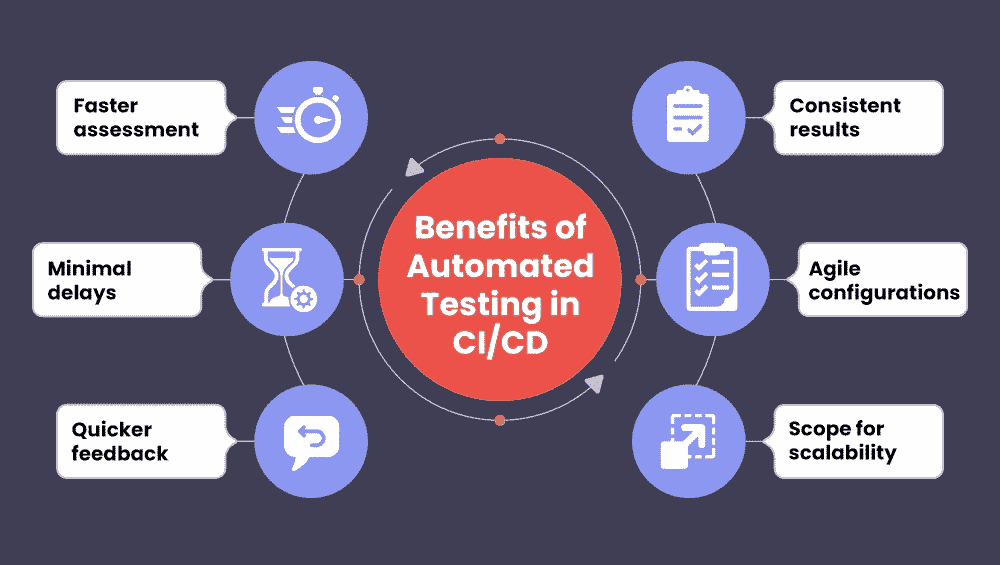

# 优化 QA 在持续交付中的角色

> 原文：<https://medium.com/geekculture/optimizing-the-role-of-qa-in-continuous-delivery-51b15bafc2f8?source=collection_archive---------4----------------------->

软件开发领域正在快速发展，带来了更多的灵活性和可访问性。长期以来，软件测试对工程师来说是一个重大的挑战。过去，这是一件乏味的事情，通常在开发完成后才开始。测试人员不得不手动构建测试用例。因此，它可能会延迟应用程序的启动。

除了实际制作和后期制作问题，应用程序阶段的可用性和跟踪变得很困难。这导致了所有阶段的混乱。

DevOps 对那些陷入古老实践的开发人员来说是一种喘息。DevOps 允许开发和运营团队协作和工作，而不是各自为政。

CI/CD 管道已经成为现代软件开发过程中不可或缺的一部分。由于连续交付需要频繁的代码变更，QA 在连续交付中的作用变得不可或缺。

# 质量保证在持续交付中的重要性

随着激烈的竞争和不断发展的软件开发过程，降低风险和为最终用户提供突出的功能对企业来说已经变得至关重要。对来自客户的持续反馈的需求导致了持续交付中持续测试的集成。它有助于降低整体开发成本，同时加快发布周期。

持续测试允许开发人员将注意力集中在产品周期上，而不是一直担心修复 bug。他们可以提交代码变更，而其他人负责代码的测试和实际发布。

# 在连续交付中需要自动化测试

持续的测试文化提高了发布质量，并且给你的企业带来了竞争优势。这是现代软件开发的一个重要方面。

1.  持续的测试为持续的反馈让路。使用[自动化测试](https://marutitech.com/automation-testing-quality-assurance/?utm_source=medium&utm_medium=content_promotion&utm_campaign=qa_in_cicd_pipeline)，您可以提交更改、测试它们并实时共享用户的输入。利益相关者获得洞察力，使他们能够立即做出明智的决策。最终，它有助于更快的发布和高质量的输出。
2.  无论您是在进行负载测试还是性能测试，测试案例和过程都会有所不同。手动操作将花费大量时间。您需要研究测试类型，然后计划测试过程。当您自动化测试时，他们会负责测试程序和过程。因此，只需最少的努力，您就可以跨浏览器和平台进行测试。
3.  早些时候，开发和测试团队通常在筒仓中工作。这导致了治理和质量问题。持续测试有助于克服这些阻碍协作的障碍，并有助于更快的发布。
4.  使用[测试自动化框架](https://marutitech.com/test-automation-frameworks/?utm_source=medium&utm_medium=content_promotion&utm_campaign=qa_in_cicd_pipeline)，你可以在当前的操作系统和浏览器上测试你的代码。因此，您不必拥有这些设备或寻找版本。它节省您的时间，并确保完整的测试过程。
5.  企业面临的最大风险是他们发布代码时没有正确检查它。您可以通过持续测试来避免这种风险。它在开发阶段的早期识别错误。因此，您节省了时间和金钱。
6.  当您关注安全性时，理想情况下应该在代码中检查安全性。持续测试已经设置了安全参数，帮助您确保应用程序的一致性和安全性。自动化的 [QA 服务](https://marutitech.com/quality-engineering-services/?utm_source=medium&utm_medium=content_promotion&utm_campaign=qa_in_cicd_pipeline)还可以帮助您在不妨碍业务的情况下扩展应用程序。

尽管实现了自动化，但仍有一些测试需要您手动进行。然而，在连续交付中实现 QA 有助于加速发布周期。

# 关于如何优化连续交付中的质量保证的提示

1.  **实现硒工具**

作为自动化的一部分，您还需要计划跨浏览器测试。值得注意的是，不同的浏览器使用不同的协议和引擎。在单个平台上测试你的代码是很麻烦的。Selenium 允许您自动化这个过程并提供一致性。因此，实现的第一步应该包括使用 [Selenium](https://www.selenium.dev/) 工具。

**2。连续交付工具的选择**

**COMMON CI/CD TOOLS**

增强 QA 测试的工具并不缺乏。您将发现执行不同任务和处理管道各个方面的工具。你可能会感到困惑，做出错误的选择。在规划阶段，定义您的目标，并确定符合您需求的工具。如果您已经确定了需要测试的平台，那么您应该相应地选择工具。

**3。团队协作**

一旦您选择了工具，定义了目标，甚至实现了 Selenium 工具，就该调整负责 CI 和 CD 的不同团队了。一旦提交了代码，就应该对其进行测试以识别错误。这应该是一个同步的过程。因此，您将在早期识别问题，从而加快发布的速度。它还将确保项目的灵活性和可伸缩性，而不会影响质量。

**4。监测和报告**

监控连续交付的每个阶段以注意结果是必要的。这个想法是发布一个稳定的、无 bug 的版本用于部署。考虑通读每一份测试报告并找出问题。深入了解特定测试结果的原因。例如，如果出现负载冲突，请确定其原因。一旦你有了一份详细的报告，进行必要的修改就变得容易了。

**5。创建详细的文档**

当您自动化测试时，记得创建单元测试所有方面的完整文档。这将有助于提高解决方案的质量。它还有助于代码增强和维护。它让开发人员对存在问题的代码有所了解。您可以使用这个文档来确保您传递的是准确的变更，并减少与开发相关的整体风险。

# 在连续交付中设置自动化测试——最佳实践

当通过连续交付进行自动化测试时，有一些事情需要考虑。

1.  **增量变化**

第一种选择是一次性实现该特性。但是，识别该功能的小问题可能会变得很困难。如果功能的实现存在问题，您就无法隔离出确切的问题。

设置自动化的另一种方法是引入较小的特性变化。不要一次实现所有功能。把它分解成子特性，一个一个地执行。一旦测试了所有提交的代码，您就可以将它们合并成一个单一的特性。

因此，您不会有任何测试问题。你甚至不会面临集成特性的挑战。它还帮助您及时识别 bug，并将其传达给开发团队。

**2。识别自动化组件**

对于特定的软件应用程序，您需要处理几个测试。然而，您不能自动化所有的测试。同时，几乎不可能知道哪些测试优先运行。

因此，确定您需要自动化的过程和测试是至关重要的。将测试分为自动测试和手动测试。它将帮助您认识到有多少测试需要自动化。一旦这一部分完成了，您需要将这些自动化测试分成优先级。例如，功能测试非常重要。接下来是 UI 测试。

**3。合并并行测试**

一旦您将自动化测试整合到您的管道中，并对这些测试进行优先级排序，就该引入并行测试了。这将有助于节省时间，并导致更快的发布。

通过并行测试，您可以确保两个自动化测试同时进行。如果它们彼此独立，不需要类似的工具，这可以加快整个过程。

你不能考虑在一台机器上设置并行测试。您必须建立基础设施，使您能够在不消耗资源的情况下实现并行测试。市场上有不同的工具来帮助基础设施。

**4。检查关键功能**

您必须按照代码的要求进行所有的自动化测试。但是，有必要检查关键功能及其运行情况。为此，您需要启用冒烟测试。

这是对软件解决方案的初步检查，检查所有关键方面。完成初步检查后，您可以继续进行其他测试。它将确保代码包含原始功能，尽管有多次更改。

**5。整合反馈**

我们正在自动化测试环境，以改善反馈，更快地整合新版本，并确保稳定的环境。以一种提供可靠修复和快速发布的方式启用输入是至关重要的。

在实施反馈之前对其进行规划。你将更深入地了解用户，获得他们互动的细节，创造更好的空间。这些观察可以帮助您构建符合需求的代码。

# 测试自动化对于连续交付的优势

*   测试自动化有助于更快地发现故障，从而确保更快的发布速度。通过自动化，您将确保合并、测试和部署代码的过程是连续的。代码总是处于发布就绪状态，这对开发人员来说更容易。
*   如果您采用了反馈最佳实践，您将深入了解客户的需求。它将最终帮助你按照用户声明的标准发布代码。
*   敏捷性和可伸缩性是您可以通过测试自动化获得的两个因素。您可以适应这些变化，重新调整您的工具，并重新定义您的测试环境来满足代码的需求。
*   您可以使用在线工具诱导并行测试。它有助于确保稳定和更快的发布。你花很少的时间来测试和更快地发布你的代码。

# 结论

如果你计划进行频繁的发布，[在连续交付中自动化 QA](https://marutitech.com/automation-testing-quality-assurance/?utm_source=medium&utm_medium=content_promotion&utm_campaign=qa_in_cicd_pipeline) 可以帮助更快更高质量的发布。持续交付是一件紧密结合的事情，其中每个组件都是必不可少的，并且有单独的角色。如果您实现了健壮的反馈，您可以保证发布与需求一致。

持续测试是更顺利的发布和增加业务灵活性的方法。在[马鲁蒂技术实验室](https://marutitech.com/?utm_source=medium&utm_medium=content_promotion&utm_campaign=qa_in_cicd_pipeline)，我们提供卓越的持续测试服务，牢记我们最终客户的需求。我们帮助您管理开发测试周期，从而确保最大产出。如果你有兴趣与我们在[的质量保证服务](https://marutitech.com/quality-engineering-services/?utm_source=medium&utm_medium=content_promotion&utm_campaign=qa_in_cicd_pipeline)上合作，请在这里给我们留言[，](https://marutitech.com/contact-us/?utm_source=medium&utm_medium=content_promotion&utm_campaign=qa_in_cicd_pipeline)，我们将从那里取走。