# 优化 WordPress 网站的 A 级速度指数

> 原文：<https://medium.com/geekculture/optimizing-wordpress-websites-for-a-grade-speed-index-c7a3ac6f3337?source=collection_archive---------18----------------------->

在这篇文章中，我将分享我在 WordPress 性能/速度改进方面的知识和专长。WordPress 是一个免费的开源内容管理系统，用 PHP 编写，配有 MySQL 或 Maria DB 数据库。特色包括插件架构和模板系统，在 WordPress 中称为主题。

如今，保持一个好的网站速度等级以在搜索引擎上获得更高的排名是非常重要的。据说，网页加载时间超过 5 秒就会在热门搜索引擎中排名靠后，因此，保持较高的页面加载速度至关重要。

许多方法可以用来提高你的网站的速度。许多人认为增加硬件规格可能有助于在搜索引擎上获得好的排名，这种方法可能并不总是有效，应该只在系统资源耗尽的最后阶段使用。在做任何硬件优化之前，优化网站的重要性就显现出来了。

下面我们来看看一些重要的优化和网站审计方法。

**网站绩效审计**

在你应用任何优化之前，需要做一个网站审计来检查页面速度排名。通过这样的审计，您将能够分析每个组件加载所需的持续时间。通过这样做，可以更容易地调试是什么使你的网页变慢。可能是图像、字体、页面渲染问题，或者是服务器响应时间(也称为到达第一个字节的时间(TTFB))问题。此阶段分析的所有问题都有解决方案。

现在，让我们学习如何生成审计报告。您只需访问 https://gtmetrix.com/的[并在提供的文本字段中输入您的网站 URL，即可生成审计报告。只需点击几下，你就可以在你的网站上生成一份详细的报告。](https://gtmetrix.com/)

正如你在上面的截图中看到的，他们给出了你的网站性能的准确基准。这种内容似乎是用户友好的，任何人都可以阅读。但是有些部分你需要注意。当您访问此处的瀑布选项卡时，它会为您提供一个详细的甘特图类型的时间表，其中包含所有要加载的组件。通过使用内容类型过滤器，您可以轻松地过滤和分析特定的内容类型。确保检查哪些元素需要很长时间来加载。

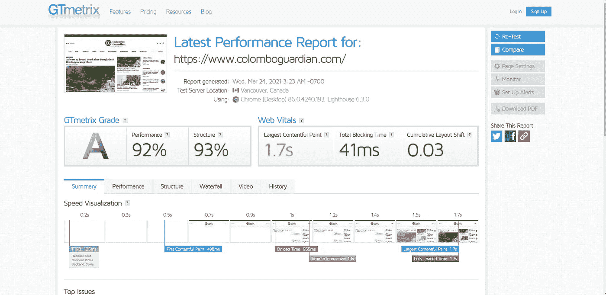

Gtmertix Report

除了 Gtmertix，Google 还提供了另一个工具，叫做 Google Page Speed Insights。当你用这个服务生成审计报告时，它会自动给你有用的建议，可以为你的网站做些什么。
简单地参观一下[https://developers.google.com/speed/pagespeed/insights/](https://developers.google.com/speed/pagespeed/insights/)

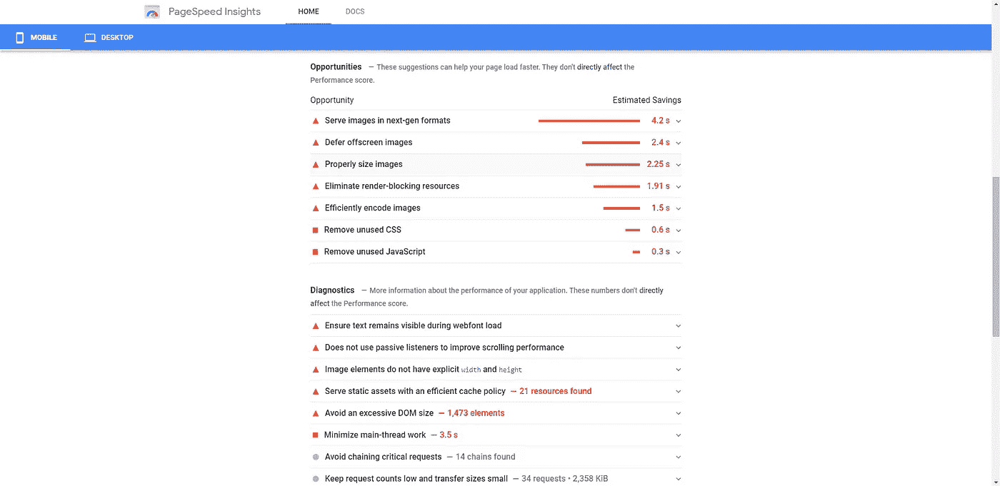

Google PageSpeed Insights Report

**服务器缓存/浏览器缓存**

缓存是减少初始服务器响应时间和总页面加载时间的方法之一。有两种主要的缓存方法。

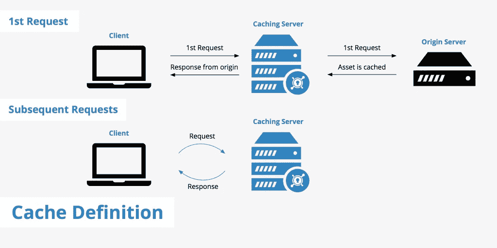

Workflow of a Cached System; Source:: [https://networkencyclopedia.com/cache-server/](https://networkencyclopedia.com/cache-server/)

服务器缓存:这是一种在服务器中缓存静态 HTML 格式的动态 PHP 页面的方法。当用户请求特定网页时，将向用户显示缓存的 HTML 页面。这个过程将防止大量请求对相同的数据执行 SQL 查询。因为它是一个静态 HTML，它将消除页面渲染和等待时间。

服务器缓存有很多插件和解决方案。为此，我个人推荐 [WP 超级缓存](https://wordpress.org/plugins/wp-super-cache/)插件。该插件自动生成静态 HTML 文件，并将它们驻留在服务器中。

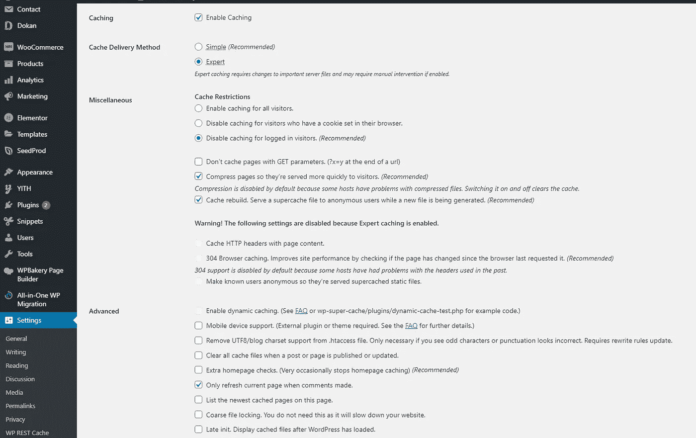

Common configs for WP Super Cache

浏览器缓存:这是一种防止冗余请求从您的浏览器发送到服务器的技术，相反，您的浏览器保留静态内容和媒体文件的本地缓存。您可以手动配置缓存文件的内容过期时间。

**图像优化/ WEBP 服务**

一般来说，图片是一个网站最重要的组成部分。你的网站越重，加载的时间就越长。因此，让你的页面尽可能的轻量级是明智的。有时你可能觉得大尺寸的图像应该有更好的分辨率。是的，这是真的，但是有更好的格式来提供大图像。这种格式被称为 [WEBP](https://developers.google.com/speed/webp) 。许多插件可以用来将你现有的重量级图像转换成 WEBP。Short Pixel 是最受欢迎的插件之一，可以完美地完成工作，但在免费层之后会有少量费用。[短像素](https://shortpixel.com/)作为 CDN 和批量图像转换工具提供。如果您使用 CDN，您的图像将通过自己的 CDN 网络显示，自动将照片格式更改为 WEBP。如果你使用标准版本，它将转换你自己服务器中的所有图像，并作为 WEBP，它可能会消耗大量的图形内存！选择权在你；)

Image Source: [https://www.wpblog.com/shortpixel-image-optimizer-review/](https://www.wpblog.com/shortpixel-image-optimizer-review/)

CDN 插件:[https://wordpress.org/plugins/shortpixel-adaptive-images/](https://wordpress.org/plugins/shortpixel-adaptive-images/)

转换器工具:【https://wordpress.org/plugins/shortpixel-image-optimiser/ 

更多信息请访问 https://shortpixel.com/

**静态文件优化**

除了图像，网站上还有许多静态文件，如 CSS、JavaScript 和字体。这些文件需要一个好的缓存策略。这意味着必须为服务器端和浏览器端编写缓存规则。此外，还有一个重要的过程叫做*缩小*，这意味着从解释编程语言或标记语言的源代码中删除所有不必要的字符而不改变其功能的过程。通过这样做，它有助于减少文件大小并提供更好的性能。

让我们来看看如何用一个叫做[自动优化](https://wordpress.org/plugins/autoptimize/)的插件来做这些，我强烈推荐这个插件。有了这个插件，这个过程变得容易多了，因为它为你处理多件事情。只需进入 WordPress 插件注册表，用以下设置安装插件。

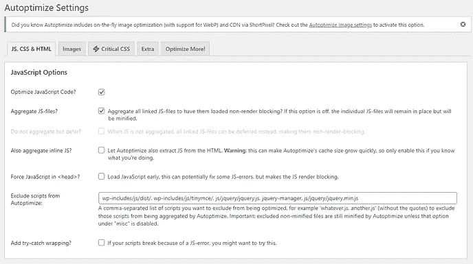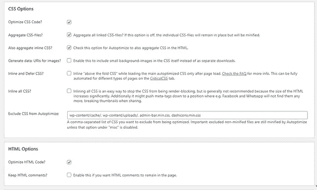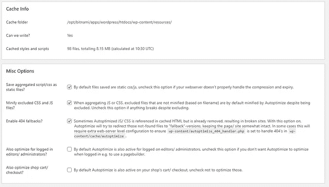

[Autoptimize](https://wordpress.org/plugins/autoptimize/) recommended settings

**内容交付网络(CDN)的使用**

“内容交付网络或内容分发网络(CDN)是代理服务器及其数据中心的地理分布网络。目标是通过相对于最终用户在空间上分布服务来提供高可用性和高性能。”—维基百科

如上所述，CDN 使你的网站加载速度比以往任何时候都快。有许多免费和付费的服务。选择取决于你的需求。一些 cdn 能够代表网站做许多事情，例如处理缓存、内容缩小、负载处理等等。

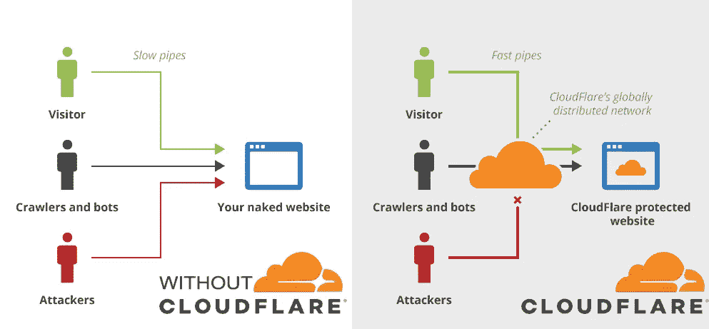

Image Source: [https://stackoverflow.com/questions/50789237/difference-between-cloudflare-cdn-and-nginx](https://stackoverflow.com/questions/50789237/difference-between-cloudflare-cdn-and-nginx)

我个人推荐使用 Cloudflare 作为主要的 CDN，因为它是世界上最受欢迎的免费服务。此外，他们还提供许多服务，如免费 SSL、页面规则、性能洞察、更高的安全性、高速 DNS 服务等。让我们来看看 WordPress 推荐的 Cloudflare 设置。

你可以下载 [Cloudflare WordPress 插件](https://wordpress.org/plugins/cloudflare/)并安装在你的 WP 网站上，它会给你如何连接 Cloudflare 和你的网站的说明。在 https://www.cloudflare.com/integrations/wordpress/[简单查看文件](https://www.cloudflare.com/integrations/wordpress/)

在安装插件之前，请确保您已经将 DNS 和主机设置与 Cloudflare 链接。参见[https://support . cloud flare . com/HC/en-us/articles/2017 20 164-Creating-a-cloud flare-account-and-adding-a-website](https://support.cloudflare.com/hc/en-us/articles/201720164-Creating-a-Cloudflare-account-and-adding-a-website)上的指南

**对象缓存**

让我们假设你正在建立一个拥有大量产品(> 10000)的在线商店，在这种情况下，你可能会注意到，添加的产品越多，你的网站就变得越慢。这是因为来自客户端的大量并发数据库调用。数据库调用是为客户机检索数据所必需的，但是为什么我们不能缓存这些数据库调用来获取相同类型的数据呢？是的，那也是可能的！这个过程被称为对象缓存，它必须从服务器端处理。

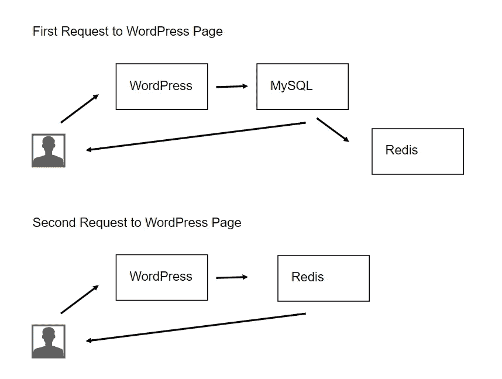

Image Source: [https://scalegrid.io/blog/using-redis-object-cache-to-speed-up-your-wordpress-installation/](https://scalegrid.io/blog/using-redis-object-cache-to-speed-up-your-wordpress-installation/)

作为先决条件，您需要在您的服务器上安装一个 Redis 服务器，并且您需要安装一个与您的 PHP 版本相关的 Redis 扩展。

如果你有一个专门的主机提供商(VPS)，你应该可以自己安装 Redis。逐步指南在[https://redis.io/topics/quickstart](https://redis.io/topics/quickstart)提供

另外，PHP Redis 扩展可以在 https://github.com/phpredis/phpredis 找到，所有的安装说明都在文档中。

最后，你需要安装 [WP Redis](https://wordpress.org/plugins/wp-redis/) 插件来连接你的 WordPress 网站到 Redis。按照 https://wordpress.org/plugins/wp-redis/[提供的说明去做并不难](https://wordpress.org/plugins/wp-redis/)

**内容加载顺序优化**

当您仔细分析 Gtmertix 报告中的瀑布选项卡时，您会发现一些资源被延迟加载，而那些资源能够在初始阶段加载，由于内部配置错误，有时不同的内容会延迟加载。这个问题可以通过确定组件装载顺序的优先级来解决。

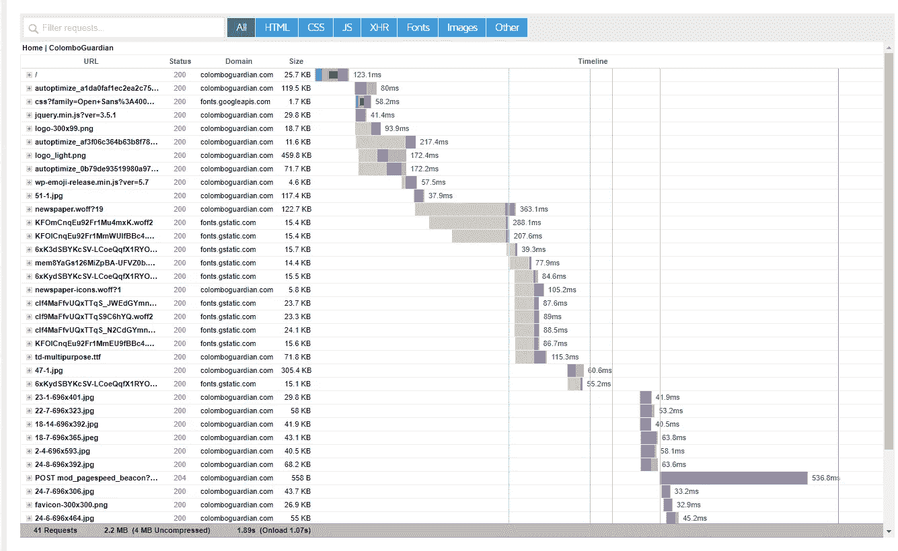

Gtmertix Waterfall

当你想使用谷歌分析、脸书像素、Hubspot 等原生服务时。允许嵌入 JavaScript 代码，为了方便使用，最好避免使用第三方插件。相反，你可以使用一个定制的 snippet 插件，直接在你的 WordPress 网站上嵌入你想要的服务。我强烈推荐 WordPress 的[代码片段](https://wordpress.org/plugins/code-snippets/)插件

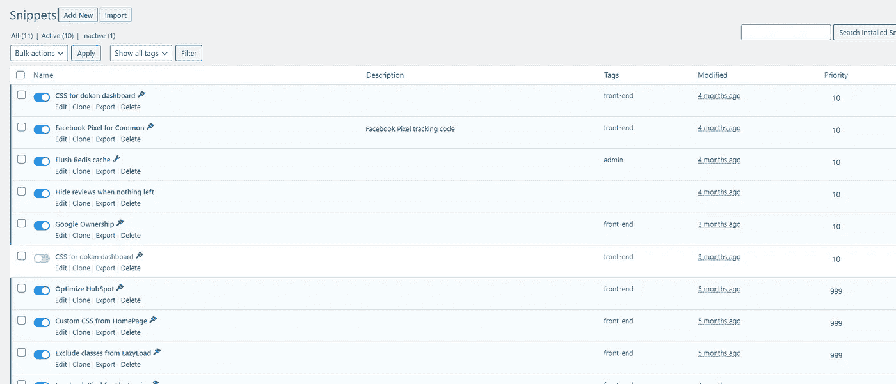

Sample Snippets on WordPress

**硬件/主机包升级**

如果您尝试了所有这些任务，仍然获得了更高的网站流量，并且毫无理由地变慢了，那么是时候检查服务器资源使用日志了。如果您看到峰值水平的高资源使用率，这可能是升级您的托管包或虚拟机硬件的最佳时机。这个过程因主机提供商而异，因此你可能需要咨询你的主机提供商。

如果没有解决办法，请拨打 suresh@inforwaves.com[的电话](mailto:suresh@inforwaves.com)联系我们，我们会以合理的价格随时满足您的技术需求。我们 Inforwaves 为您的所有技术需求提供大量服务。
在[https://inforwaves.com/](https://inforwaves.com/)拜访我们

另外，如果你想联系我，不要犹豫，在 LinkedIn[https://www.linkedin.com/in/sureshmichael/](https://www.linkedin.com/in/sureshmichael/)上留言