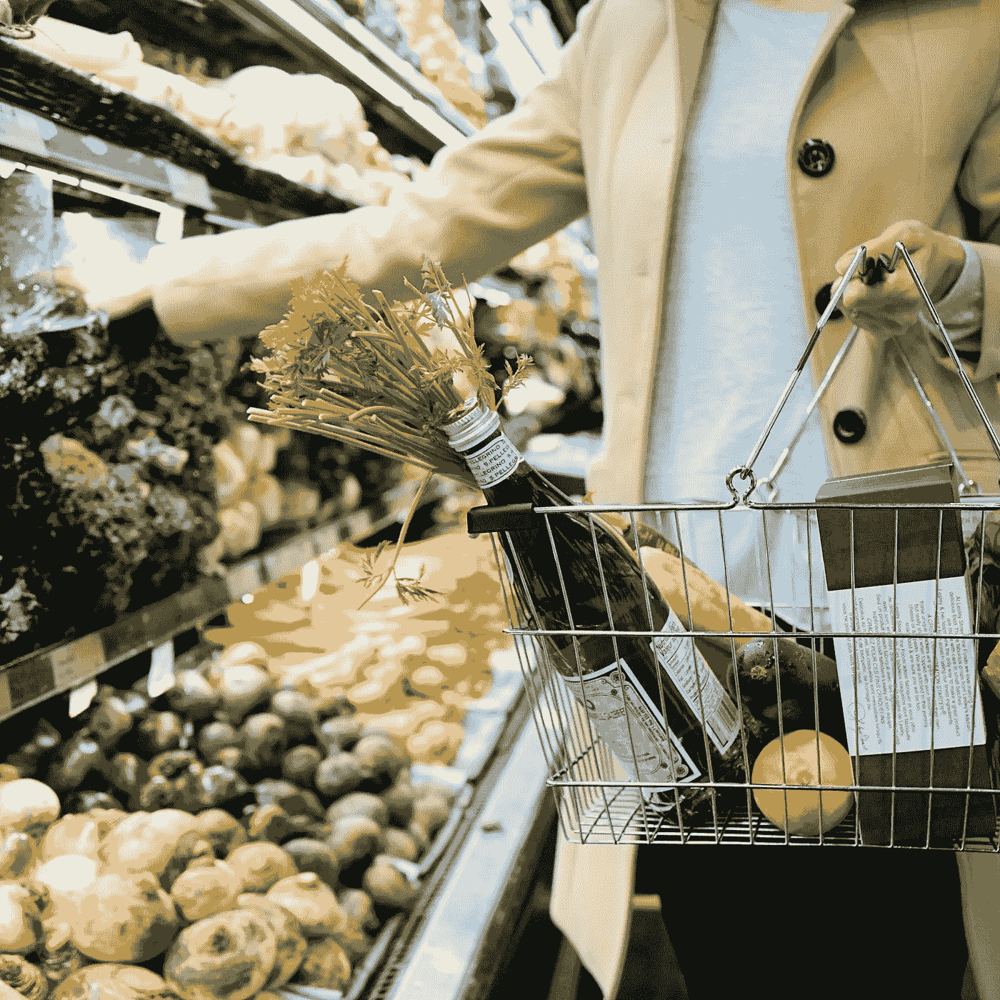

# 使用人工智能和 Python 优化您的杂货店购物

> 原文：<https://medium.com/geekculture/optimizing-your-grocery-shopping-using-artificial-intelligence-with-python-20f08e78b56b?source=collection_archive---------2----------------------->



Photo by [Tara Clark](https://unsplash.com/@socialtyvr?utm_source=unsplash&utm_medium=referral&utm_content=creditCopyText) on [Unsplash](https://unsplash.com/s/photos/grocery-store?utm_source=unsplash&utm_medium=referral&utm_content=creditCopyText)

## 以下是如何使用人工智能创建你的最佳购物清单

昨天我在克罗格买杂货。

我不得不买 30 片剃须刀片，每个月每天一片。尽管如此，我只能买 6/10/12/24 包刀片。另外，我有多个品牌。另外，我在克罗格，但我也可以去塔吉特或沃尔玛。

现在，我只需要买剃须刀片，但是你会得到你需要购买的每件物品有多少变量和多少选择。最后，人工智能只是一个工具，它应该可以帮助你让你的生活变得更简单。

发生在我身上的事情启发我写了一个小博客，讲述如何使用人工智能，用最少的钱完成你的杂货店购物。

所有这些中最令人兴奋的部分是所谓的**“最优证书”。**意思是没有办法花更少的钱买同样数量的物品。

作为我所有的文章，它将和动手一。这意味着你可以复制和我一样的代码，得到一样的结果。所以让我们开始吧！

# 1.图书馆

我用过的库没有什么特别的。我用 numpy 和 pandas 进行数据处理，用 PuLP 进行机器学习(实际上更优化)技术:

```
import pandas as pd
import numpy as np
import warnings
warnings.filterwarnings("ignore")
from pulp import *
```

# 2.数据集

我从[网站](https://koopy.com/blog/kroger-vs-walmart-price-comparison/)上提取了这个数据集。我不知道网站的刮擦政策，但没有必要刮擦它们，因为它不到 100 行，所以你可以复制粘贴它。

以下是记录的数据:

所以我们有三列。第一列是**产品的**名称，第二列是 **Kroger** 商店中产品的价格，第三列是 **Walmart** 商店中产品的价格。

# 3.数据处理

不幸的是，只有一个产品“类”,所以我们无法比较不同种类的“美国奶酪”或不同种类的“白鸡蛋”。尽管如此，每个产品都以一个**号**开始。我们将使用它来创建一个数量列。然后，我们将删除产品列中的第一个数字。

然后，我们将从列中删除**“$”**，这样我们就可以使用前两列作为“浮动”。

为了创建另一个“类别”的产品，我们将创建另一个产品，它将是原始数量的 **1/2、1/3** 或 **1/4** 。

价格虽然不会 **1/2、1/3、1/4** 但是会有**波动**。这意味着，例如，购买 4 包 6 片的奶酪可能比购买 2 包 12 片的奶酪便宜。

> *当然，它并不总是这样，因为它可能取决于您需要购买的产品的实际数量以及波动本身。这就是为什么它变得如此有趣！

这是数据集:

所以我们对同一产品有 A 级和 B 级。
现在我们已经做好了开始机器学习/线性优化部分的一切准备。

# 4.线性优化

从数学的角度来看，这是形式化:

> “在给定一组约束的情况下，找出函数的最小点”

**函数**是你在商店里买的所有东西的总和。你当然想**最小化**它。**约束**是您需要购买的所有商品(以及商品的数量):您的购物清单。当然，要给出约束条件:你确切知道自己需要什么，需要多少。然而，在我们的问题中，我们可以做一些合理的假设。

1.  你买超市里看到的东西的 30%。(你通常会忽略大部分内容)
2.  你买的不止是最大的一包。(你通常会得到超过一公升的牛奶)。

还是那句话，可能这些假设不是 100%准确，但这不是问题。在现实世界中，你有自己的购物清单，你知道你必须买什么，你不必编造和使用这些规则。

现在。为了找到这些最小值，有众所周知的线性模型可以做到这一点。同样，有趣的是你有一个**最优证书。这意味着你实际上没有办法得到比我们提议的更好的解决方案。**

为了用 Python 做到这一点，使用 [**浆**](https://coin-or.github.io/pulp/) **超级简单。**库做得很好，有据可查。[这个人](https://towardsdatascience.com/linear-programming-and-discrete-optimization-with-python-using-pulp-449f3c5f6e99)解释如何使用果肉并描述它，而在这个[的例子中](https://towardsdatascience.com/from-chicken-mcnuggets-to-data-science-using-python-78bd525338e2)我使用果肉来优化你的麦当劳订单中麦乐鸡的数量:)

但不管怎么说，用纸浆超级简单。你只需要定义问题和约束。你可以这样做:

然后，您只需键入:

```
prob.solve()
```

你会得到:

最佳购物清单可通过以下方式找到:

这是你的最佳购物清单

# 5.结论

我之前说过，人工智能是一种工具。我们应该用它来让我们的生活稍微好一点，我觉得这是一个例子:我们正在用人工智能省钱。:)

如果你喜欢这篇文章，你想知道更多关于机器学习的知识，或者你只是想问我一些你可以问的问题:

A.在 [**Linkedin**](https://www.linkedin.com/in/pieropaialunga/) 上关注我，在那里我发布我所有的故事
B .订阅我的 [**简讯**](https://piero-paialunga.medium.com/subscribe) 。这会让你了解新的故事，并给你机会发短信给我，让我收到你所有的更正或疑问。
C .成为 [**推荐会员**](https://piero-paialunga.medium.com/membership) ，这样你就不会有任何“本月最大数量的故事”，你可以阅读我(以及成千上万其他机器学习和数据科学顶级作家)写的任何关于最新可用技术的文章。