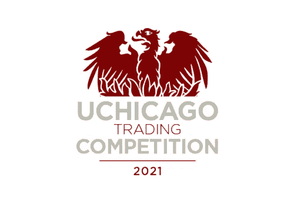

# 期权做市:Black-Scholes、Delta 对冲和 Vega 加权隐含波动率

> 原文：<https://medium.com/geekculture/options-market-making-black-scholes-delta-hedging-and-vega-weighted-implied-volatility-f155c30d6a51?source=collection_archive---------8----------------------->

## UChicago 中西部算法交易竞赛 Pt。2

今年春天，我带领弗吉尼亚大学的团队在一年一度的 UChicago Midwest 算法交易比赛中获得期权做市比赛的第三名。在这篇文章中，我将简要解释什么是做市期权，然后讨论我的策略及其组成部分。具体来说，我将涵盖实施布莱克-斯科尔斯，期权希腊，维加加权隐含波动率和三角洲对冲。我希望你喜欢！

## 案例描述和做市

在这种情况下，竞争对手在对应于相同基础的欧洲股票期权上扮演做市商的角色，并在遵守严格的风险限制的同时与对手做市商竞争。我们的目标是开发一种算法，它可以利用市场中遇到的任何和所有有利可图的机会，对期权进行有竞争力的定价和交易。

更一般地说，做市商通过不断提供买价和卖价，为双边市场提供流动性。作为对其流动性供应商角色的补偿，做市商从微小的买卖差价中获利，当与巨大的交易量相结合时，这种差价变得相当有利可图。因此，做市商是市场中立的，避免对单个证券或更广泛的市场进行方向性押注。相反，做市利润与通常与市场波动相关的高交易量相关。

## Python 中 Black-Scholes 实现和希腊计算

做市策略的支柱是布莱克-斯科尔斯期权定价模型。此外，该算法还依赖于希腊期权，特别是 delta(基础价格变化 1 美元时期权价格的变化)和 vega(隐含波动率变化 1%时期权价格的变化)。参见下面的函数来计算理论价格和希腊人。还有一个用于计算隐含 vol 的辅助函数，这将在下一节详细介绍。相关变量如下:

适马= *波动率* S = *标的现货价格* K *=履约价格* r = *无风险利率(0 为我们的目的)* t = *到期时间*

## 计算期权价格和隐含波动率的方法

下面的方法基于前面定义的函数来计算理论价格。这个方法和下面的方法是算法类的一部分，但是，不能描述整个类，因为它包括 UChicago 案例作者提供给竞争对手的专有代码部分。

该策略的一个组成部分涉及保持严格的风险限制，特别是关于极端的 delta 和 vega 值。下面的方法更新与期权链中的每个期权相关联的 delta 和 vega 字典，并且还计算总 vol。为了计算总 vol，该方法遍历整个期权链，并且使用先前定义的 implied_vol 函数对隐含波动率求和。

## Delta 套期保值和买卖订单法

本案的一个重要方面是对违反风险限制的竞争对手的处罚。具体来说，超过限制超过 5 秒的参赛者将被处以每秒 10，000 美元的罚款。因此，有必要制定一个全面管理 delta 和 vega 风险的策略。这种特殊的 delta 对冲策略使用线性模型计算的阈值来调整买价和卖价。目标是通过推高买入价格和拉低卖出价格来减少接近风险极限的正 delta，或者做相反的事情来抵消极端的负 delta。例如，如果期权链上的总 delta 接近上限，算法应该调整定价，以提供有吸引力的看涨期权要价和看跌期权出价。这将导致看涨期权的卖出量和看跌期权的买入量增加，从而减少 delta。变量 callbid_putask_threshold 和 callask_putbid_threshold 调整最终出价，并要求订单价格反映这一思维过程。特定的线性函数是通过对历史价格数据建模而得到的。

## 结论

在本文中，我使用 python 中的 Black-Scholes 和 delta 对冲概述了期权做市策略的框架。我希望你喜欢它，一如既往，我欢迎评论中的任何建议或问题。

*免责声明:本文并不构成实施任何投资或交易策略的建议。证券和衍生品交易存在巨大的损失风险。*