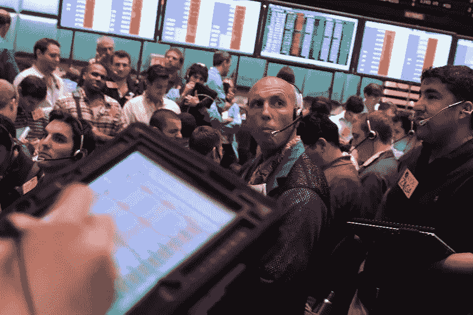

# 期权交易已经死了，但这些衍生品刚刚开始升温。

> 原文：<https://medium.com/geekculture/options-trading-is-dead-but-these-derivatives-are-just-heating-up-ce6dc3b84f91?source=collection_archive---------5----------------------->

2020 年和 2021 年对期权交易者来说是重要的一年，但随着这一年的结束，我们开始看到期权市场上输家多于赢家。

可以说，零售期权交易员最辉煌的时期是 GME 崩盘的那几个月，之前是特斯拉牛市的那几个月。当时，期权会在收盘时以低于 100 美元的价格买入，然后…