# 在 Linux 上安装 Oracle Database 19c

> 原文：<https://medium.com/geekculture/oracle-database-19c-installation-on-linux-e184dde4ce03?source=collection_archive---------1----------------------->

今天我们将在 OCI 的 Oracle Linux 7.9 上安装 Oracle Database 19c。如果你在 OCI 还没有一个运行中的 Linux VM，首先完成我写的博客中的步骤。如果您还没有这样做，请登录到您的 Linux 实例的 GUI。你的屏幕应该是这样的。

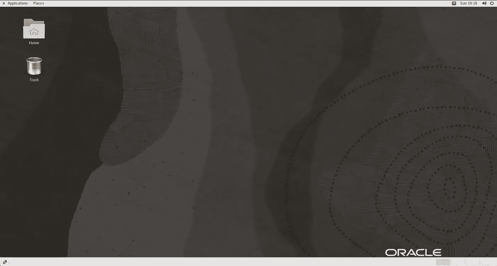

进入 Linux VM 实例后，打开一个新的终端窗口。您的终端屏幕应该是这样的。

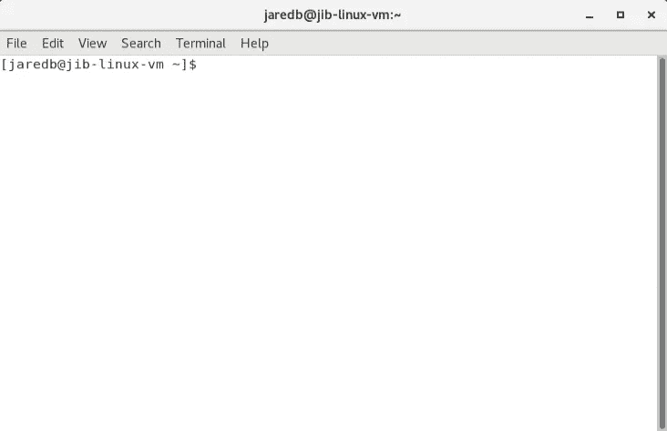

接下来，我们将作为 root 用户登录。为此，复制并粘贴以下命令，如果出现提示，请输入您的密码。

```
sudo su -
```


不是*格鲁特*——根。但是足够接近了。

您的终端屏幕现在应该看起来像这样。

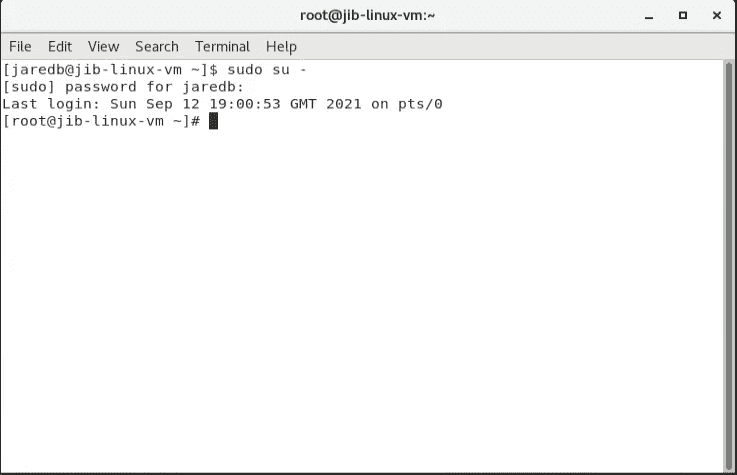

# 预安装

在下载和安装 Oracle Database 19c 之前，我们需要做一些预安装。我们将使用 yum 存储库来完成所有的预安装。在您的终端中，粘贴这行代码以完成预安装。

```
yum install -y oracle-database-preinstall-19c
```


预安装完成后，您的终端屏幕应该如下所示。

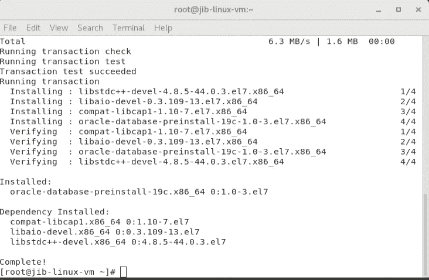

# 设置我们的 oracle 用户帐户

接下来，我们将为在预安装中创建的 oracle 用户设置密码。当我们进行数据库安装时，我们将使用 oracle 帐户。首先，我们需要以 root 用户的身份登录。然后，我们可以更改密码。我们可以通过运行以下命令来做到这一点。

```
passwd oracle
```

现在，我们将授予 oracle 用户 root 权限。为此，我们需要编辑/etc/sudoers 文件。不要在普通的文本编辑器中编辑 sudoers 文件。这可能导致同时编辑和损坏文件。我们可以使用 visudo 命令编辑 sudoers 文件。

```
sudo visudo
```

您的终端应该看起来像这样。

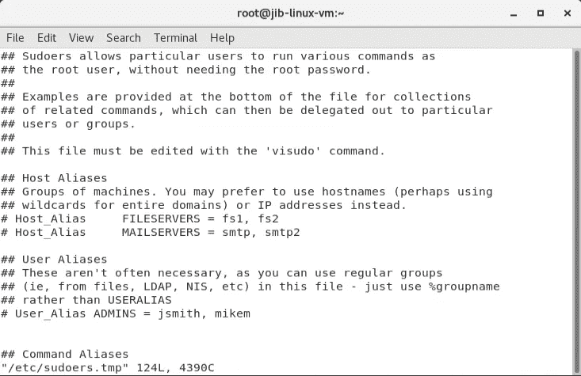

按 Shift+G 导航到文档的底部。按下键盘上的字母“I”开始编辑文档。然后，您会希望在文档中向上导航到这个文本片段。

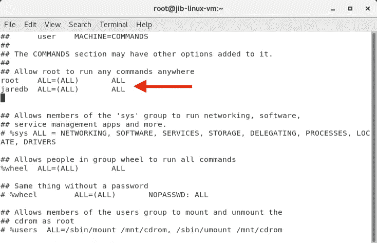

在 root 和/或 jaredb 下面，粘贴这段文本。

```
oracle  ALL=(ALL)       ALL
```

这段文本将授予 oracle root 权限。您的终端现在应该看起来像这样。

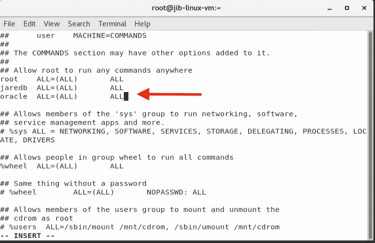

完成此任务后，点击 ESC 按钮，向下滚动到文档底部，键入以下文本。然后，按回车键。

```
:wq
```

这个序列将保存文件并退出编辑器。我们现在已经授予 Oracle sudo 特权。现在让我们在 GUI 中切换用户，以便我们在 oracle 下工作，而不是在 jaredb 下工作。关闭终端，按下屏幕右上角的电源按钮。如果显示您登录时使用的用户名，请选择该用户名。

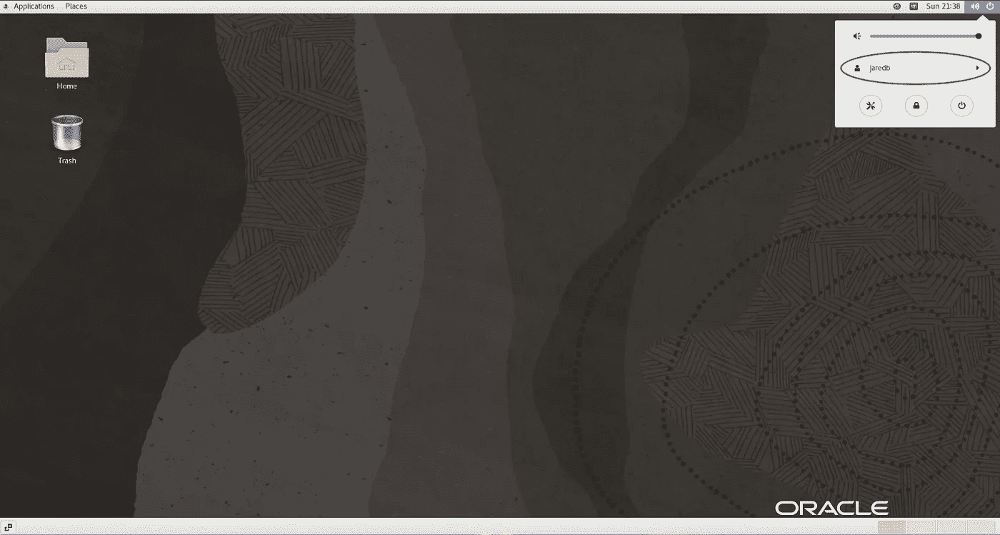

然后，选择“切换用户”，并以我们在上一步中创建的 oracle 用户身份登录。

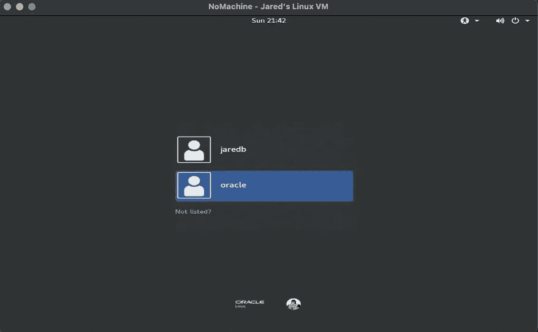

登录 oracle 帐户后，打开一个新的终端窗口。您的终端屏幕应该是这样的。

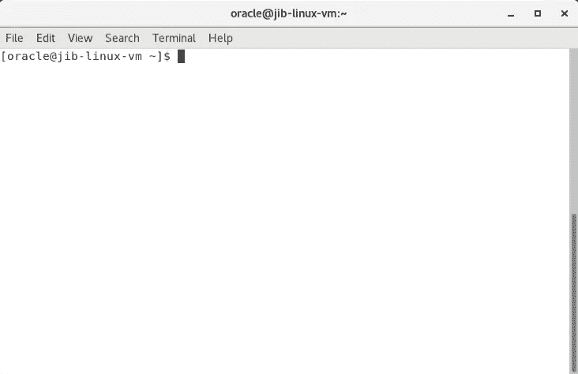

# 创建 Oracle 主目录

接下来，我们将创建一个 oracle 主目录，并将该目录的所有权授予用户 Oracle。首先，我们需要以 root 用户的身份登录。我们可以用下面的命令做到这一点。出现提示时，输入您的密码。

```
sudo su -
```

您的终端屏幕现在应该看起来像这样。


现在，我们将创建我们的主目录。将下面的代码复制并粘贴到您的终端来完成这个任务。

```
mkdir -p /u01/app/oracle/product/19.3/db_home
chown -R oracle:oinstall /u01
chmod -R 775 /u01
```

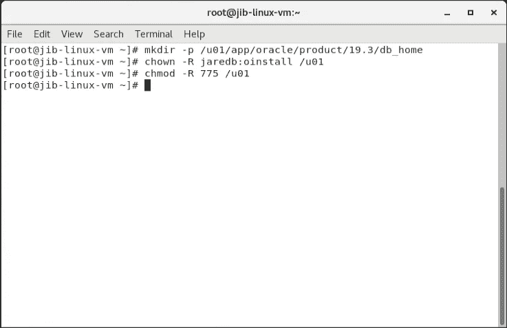

现在，我们将切换回 oracle 用户，并为他们设置一个 bash_profile。将下面的代码复制并粘贴到您的终端中。

```
su - oracle
vi .bash_profile
```

在您的终端中运行上面的代码行之后，您的终端屏幕应该是这样的。

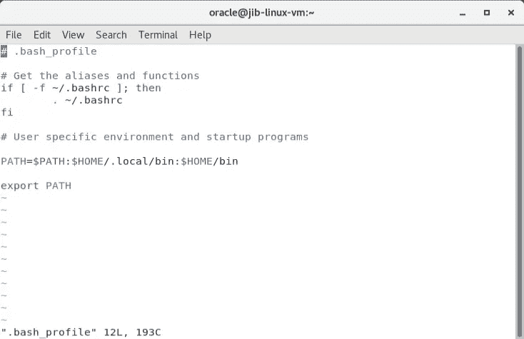

按 Shift+G 导航到文档的底部。按下键盘上的字母“I”开始编辑文档。按住键盘上的退格键，删除文档中的所有内容。删除所有内容后，您的终端屏幕应该是这样的。

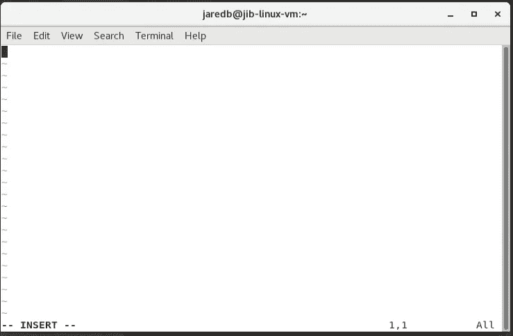

删除文件中的所有内容后，将下面的代码复制并粘贴到您的终端中。如有必要，更改下面代码块中的环境变量，使它们与您的环境相匹配。如果您一直遵循本教程，并且没有更改任何环境和/或目录名称和变量，那么您应该不需要更改下面代码中的任何内容。

```
# .bash_profile# Get the aliases and functions
if [ -f ~/.bashrc ]; then
	. ~/.bashrc
fi# User specific environment and startup programsexport ORACLE_BASE=/u01/app/oracle
export ORACLE_HOME=/u01/app/oracle/product/19.3/db_homeexport ORACLE_SID=CDBexport LD_LIBRARY_PATH=\$ORACLE_HOME/lib:/lib:/usr/lib
export CLASSPATH=\$ORACLE_HOME/jlib:\$ORACLE_HOME/rdbms/jlib
export NLS_LANG=american_america.al32utf8
export NLS_DATE_FORMAT="yyyy-mm-dd:hh24:mi:ss"PATH=$PATH:$HOME/.local/bin:$ORACLE_HOME/binexport PATH
```

将上面的代码块复制并粘贴到 bash_profile 中后，您的终端应该如下所示。

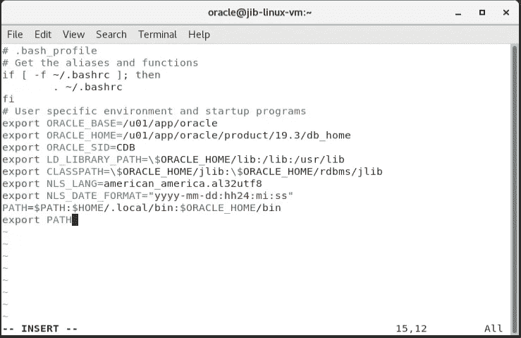

完成后，按 ESC 键，向下滚动到文档的底部，键入以下文本。然后，按回车键。

```
:wq
```

这个序列将保存文件并退出编辑器。我们现在需要导出 bash 概要文件。我们可以用下面的命令做到这一点。

```
. .bash_profile
```

您的终端屏幕现在应该看起来像这样。

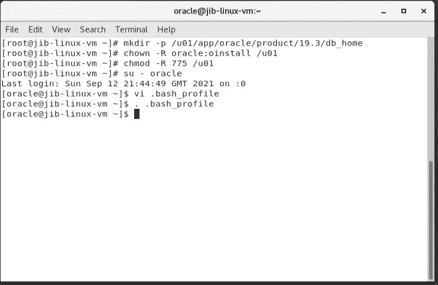

我们现在将开始安装 Oracle 数据库 19c。

# 安装 Oracle 数据库 19c


在您的 Linux 虚拟机中导航到[该网页](https://www.oracle.com/in/database/technologies/oracle-database-software-downloads.html)以下载 Oracle 19c。当你到达网页时，你会想要下载 Linux x86–64 的 19.3 zip 文件，就像我在下面用红色圈出的那样。

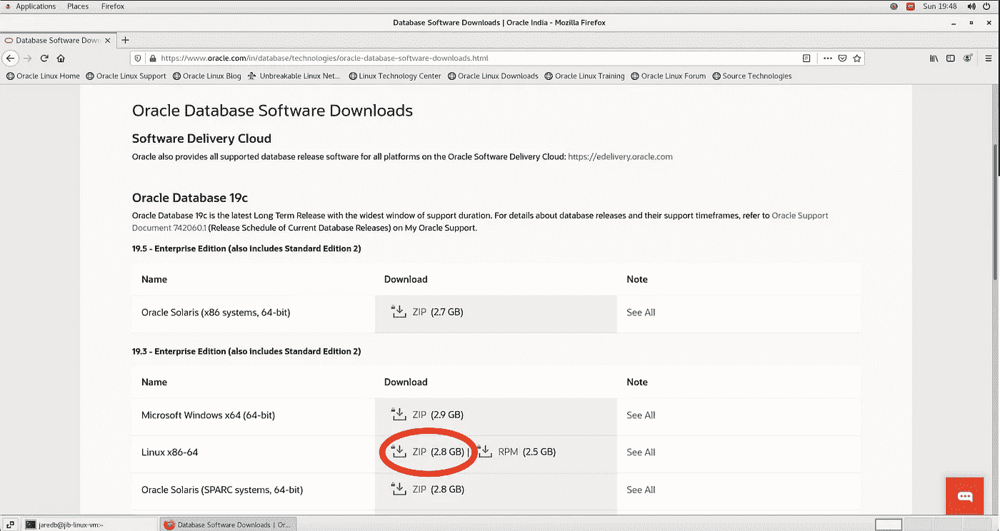

在下载开始之前，系统会提示您登录 Oracle SSO 帐户。成功登录后，系统会询问您是否要使用存档管理器(默认)打开下载文件，或者是否要保存文件。选择“保存文件”，然后点击“确定”记住这个 zip 文件保存的位置。默认情况下，它应该保存在您的下载文件夹中。

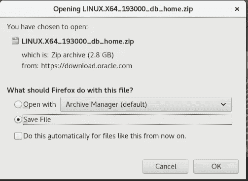

我们现在将安装文件复制到我们在上一步中创建的 ORACLE_HOME 位置，并解压缩它们。将下面的代码复制并粘贴到您的终端上，开始这个过程。第二行代码调用 zip 文件下载位置的路径。这就是你看到/下载的原因。这也是为什么我告诉你要记住这个文件被下载到哪里。如果您的文件下载到不同的位置，请确保在代码中对此进行相应的更改。此外，如果您下载了一个稍微不同的版本或一个稍微不同名称的文件，请确保在您的终端中输入这个代码时调用了正确的名称。

```
cd $ORACLE_HOME
unzip -qo /home/oracle/Downloads/LINUX.X64_193000_db_home.zip
```

这可能需要几分钟，请耐心等待。当解压缩完成时，你的屏幕上不会有任何输出。您可以通过输入 ORACLE _ HOME 目录并使用以下命令查看该目录的内容来检查解压缩是否成功。

```
ls
```

您的终端屏幕应该是这样的。

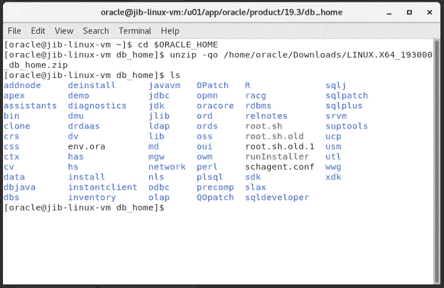

我们现在将正式安装软件。如果您希望在没有 GUI 的情况下运行安装，请将此代码复制并粘贴到您的终端中。

```
# For Silent Installation
./runInstaller -ignorePrereq -waitforcompletion -silent      \
-responseFile ${ORACLE_HOME}/install/response/db_install.rsp \
oracle.install.option=INSTALL_DB_SWONLY                      \
ORACLE_HOSTNAME=${HOSTNAME}                                  \
UNIX_GROUP_NAME=oinstall                                     \
INVENTORY_LOCATION=/u01/app/oraInventory                     \
SELECTED_LANGUAGES=en,en_GB                                  \
ORACLE_HOME=${ORACLE_HOME}                                   \
ORACLE_BASE=${ORACLE_BASE}                                   \
oracle.install.db.InstallEdition=EE                          \
oracle.install.db.OSDBA_GROUP=dba                            \
oracle.install.db.OSBACKUPDBA_GROUP=dba                      \
oracle.install.db.OSDGDBA_GROUP=dba                          \
oracle.install.db.OSKMDBA_GROUP=dba                          \
oracle.install.db.OSRACDBA_GROUP=dba                         \
SECURITY_UPDATES_VIA_MYORACLESUPPORT=false                   \
DECLINE_SECURITY_UPDATES=true
```

如果您希望使用 GUI 安装程序，请将这段代码复制并粘贴到您的终端中。

```
# For GUI installation
./runInstaller
```

我运行了静默安装，安装完成后，我的终端上出现了以下输出。

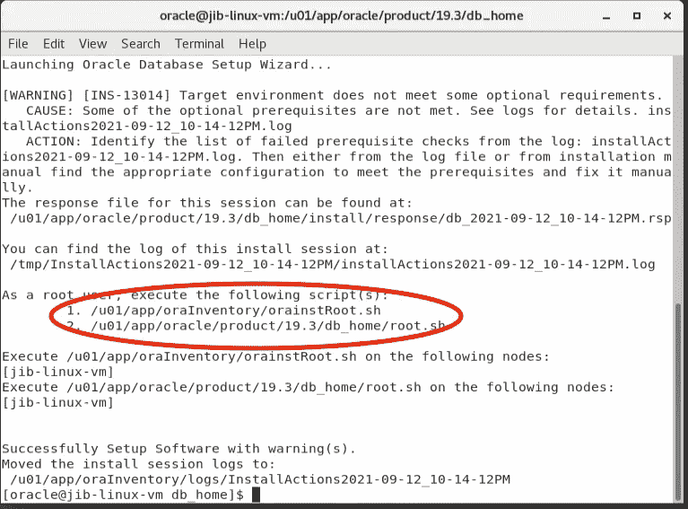

现在，我将忽略失败的先决条件。但是，系统提示我以 root 用户身份运行用红色圈出的脚本。我也会把这些脚本的名字放在下面。

```
As a root user, execute the following script(s):
1\. /u01/app/oraInventory/orainstRoot.sh
2\. /u01/app/oracle/product/19.3/db_home/root.sh
```

在我的终端中，我将使用下面的命令作为 root 用户登录。

```
sudo su -
```

您的终端现在应该看起来像这样。

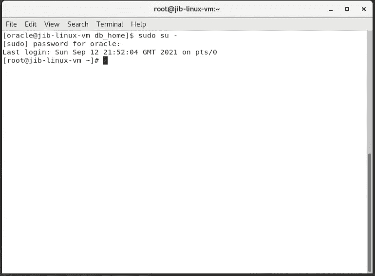

我现在将运行我用红色圈出的脚本。输出应该是这样的。

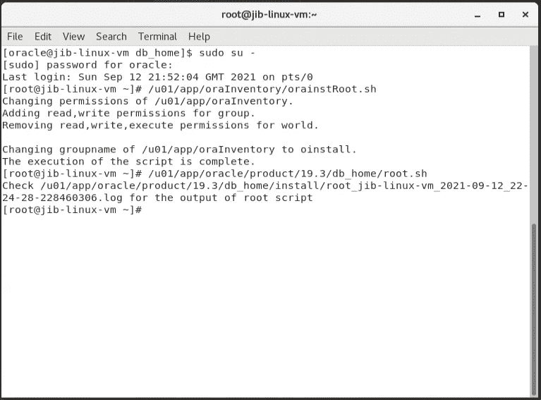

我们现在已经成功安装了 Oracle 数据库 19c。现在让我们创建一个 DBCA 19c 集装箱数据库。在您的终端中运行以下命令。

```
dbca -silent -createDatabase                                       \      -templateName General_Purpose.dbc                                  \      -gdbname ${ORACLE_SID} -sid  ${ORACLE_SID}                         \      -characterSet AL32UTF8                                             \      -sysPassword enterCDB#123                                          \      -systemPassword enterCDB#123                                       \      -createAsContainerDatabase true                                    \      -totalMemory 2000                                                  \      -storageType FS                                                    \      -datafileDestination /u01/CDB                                      \      -emConfiguration NONE                                              \      -numberOfPDBs 2                                                    \      -pdbName PDB                                                       \      -pdbAdminPassword enterPDB#123                                     \      -ignorePreReqs
```

这个过程完成后，您的终端应该是这样的。耐心点。这需要一些时间。

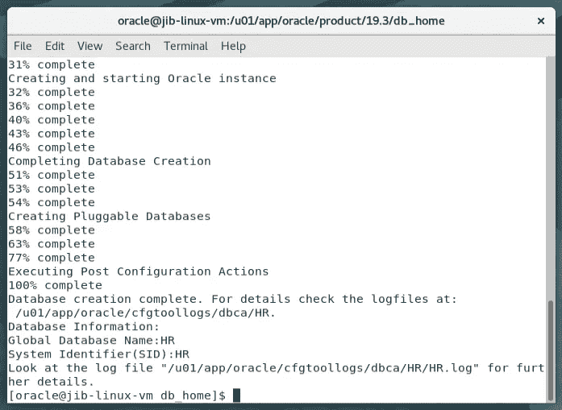

现在，让我们检查数据库中的所有容器。首先，登录 SQL Plus。

```
sqlplus "/ AS SYSDBA"
```

如果您需要重新连接到 ORACLE 实例(例如，您刚刚启动了一个新的虚拟机，并且在新实例中第一次连接到该引导卷)，请运行以下命令。

```
STARTUP FORCE;
```

然后，运行以下查询。

```
SELECT  NAME, OPEN_MODE, CDB FROM V$DATABASE;
```

终端应该是这样的。

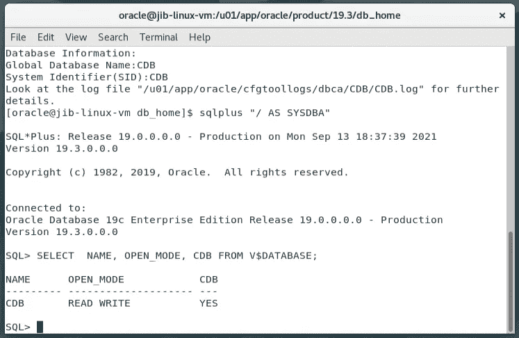

然后，运行以下查询。

```
SELECT CON_ID, NAME, OPEN_MODE FROM V$CONTAINERS;
```

终端应该是这样的。

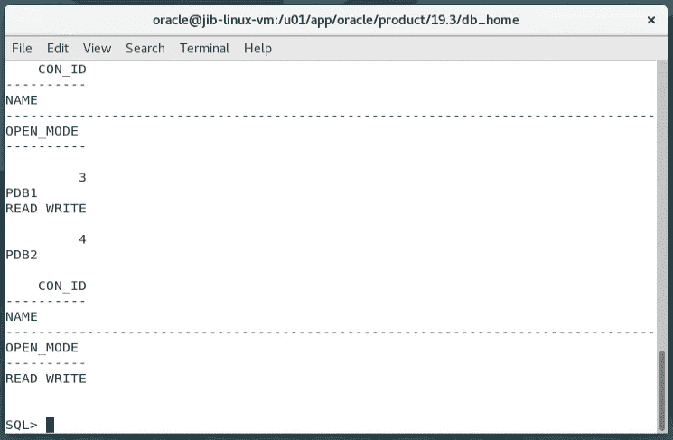

看起来一切正常。然而，我们还没有完成。我们需要检查我们与数据库的连接是否正常。我们可以使用 SQL Developer 来实现这一点。

在您的终端中键入 *exit* 并按 enter 键退出 SQL Plus 并返回到普通终端。

# 在 Linux 上安装 SQL Developer

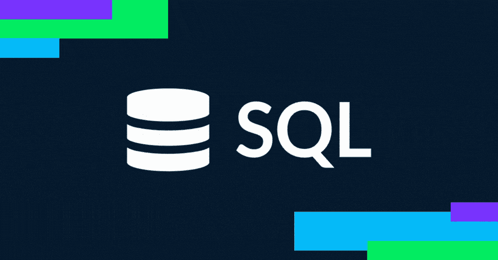

## 步骤 1:安装 JDK

在安装 SQL Developer 之前，我们需要确保安装了正确版本的 Java JDK。为了让 SQL Developer 正常工作，我们需要 JDK 8 或 11。导航到[此页面](https://www.oracle.com/java/technologies/javase/javase-jdk8-downloads.html)为您的机器下载 JDK 8。在页面上，向下滚动到 Linux x64 RPM 包并下载它。

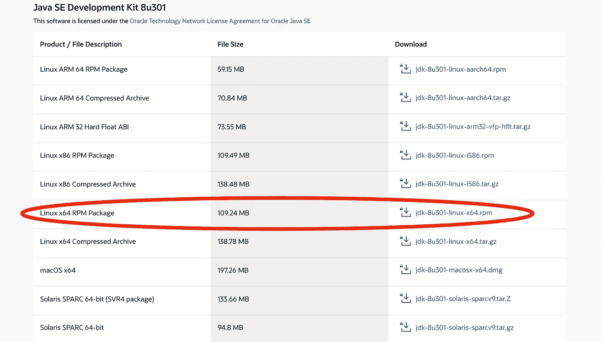

在下载开始之前，系统会提示您登录 Oracle SSO 帐户。成功登录后，系统会询问您是否要使用存档管理器(默认)打开下载文件，或者是否要保存文件。选择“保存文件”，然后点击“确定”记住这个 zip 文件保存的位置。默认情况下，它应该保存在您的下载文件夹中。下载完成后，导航回您的终端，并确保您以 root 用户身份登录。同样，您可以使用以下命令以 root 用户身份登录。

```
sudo su -
```

您的终端屏幕应该是这样的。

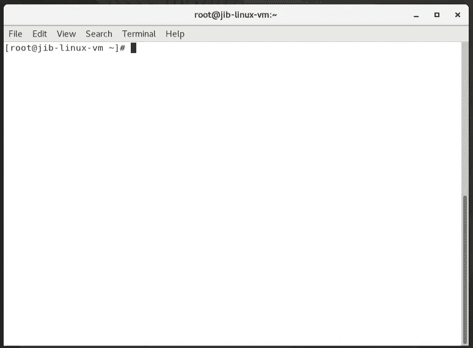

导航到您下载 RPM 的位置。默认情况下，它应该保存在下载文件夹中。使用以下命令导航到下载文件夹。

```
cd /home/oracle/Downloads
```

您的终端现在应该看起来像这样。


要安装 RPM 包，请运行以下命令。

```
rpm -ivh jdk-8u301-linux-x64.rpm
```

## 步骤 2:安装 SQL Developer

我们现在需要安装 SQL Developer。要安装 SQL Developer，[导航到此页面](https://www.oracle.com/tools/downloads/sqldev-downloads.html)并下载 Linux RPM 文件。再次提醒，记住你从哪里下载这个文件。

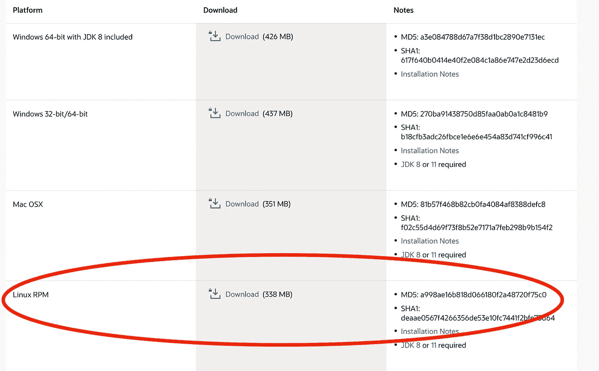

导航到您下载 RPM 的位置。默认情况下，它应该保存在下载文件夹中。使用以下命令导航到下载文件夹。

```
cd /home/oracle/Downloads
```

您的终端现在应该看起来像这样。同样，请记住以 root 用户身份登录。


要安装 RPM 包，请运行以下命令。

```
rpm -ivh sqldeveloper-21.2.1-204.1703.noarch.rpm
```

我们现在需要导航到 SQL Developer 文件夹。我们可以用这个命令来完成。

```
cd /opt/sqldeveloper
```

使用 *ls* 命令，我们可以看到 sqldeveloper 文件夹的内容。您的终端应该是这样的。

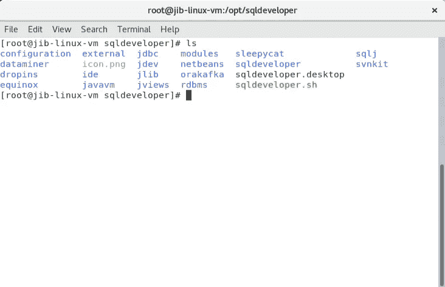

我们需要运行 sqldeveloper.sh 文件来完成安装和启动 sqldeveloper。为此，请运行以下命令。

```
./sqldeveloper.sh
```

您的屏幕现在应该看起来像这样。

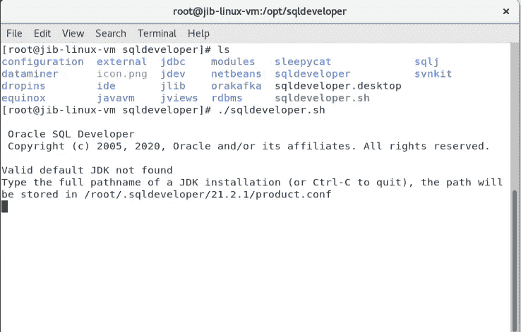

您将被询问我们安装的 JDK 的路径。将此粘贴到您的终端

```
/usr/java/jdk1.8.0_301-amd64
```

Oracle SQL Developer 现在应该已经成功加载并打开了。你的屏幕应该是这样的。现在最小化 SQL Developer。我们将回到这个话题。

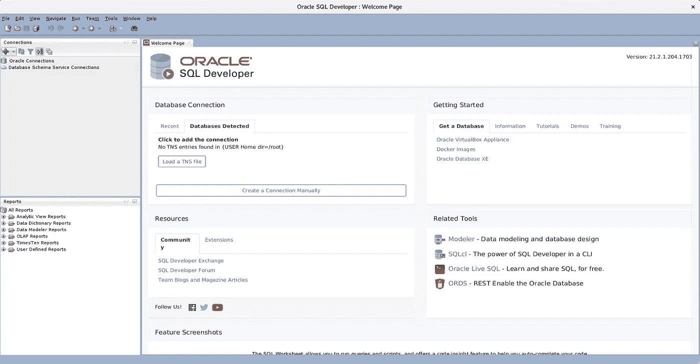

将来，当您想要启动一个新的 SQL Developer 会话时，可以在终端中运行以下命令来打开应用程序。

```
/opt/sqldeveloper/sqldeveloper.sh
```

如果您再次被提示，这是 JDK 路径。

```
/usr/java/jdk1.8.0_301-amd64
```

现在让我们连接到一个示例数据库。现在最小化 SQL Developer。

# 访问样本数据集

我们现在差不多完成了。此安装的最后一步是测试我们与 Oracle 19c 中数据库的连接。为了测试我们的连接，我们将使用 Oracle Database 19c 附带的一个样本数据集:HR 数据集。我们首先需要解锁这个数据库的示例 HR 用户。


请按照下面的步骤进行操作。在终端中运行以下命令，以 SYS 用户身份登录到 SQL Plus。

```
sqlplus "/ AS SYSDBA"
```

## **第一步:找到 PDB 的名字**

在 SQL 中执行以下命令。

```
SELECT name, con_id, open_mode FROM v$pdbs;
```

您的输出应该如下所示。

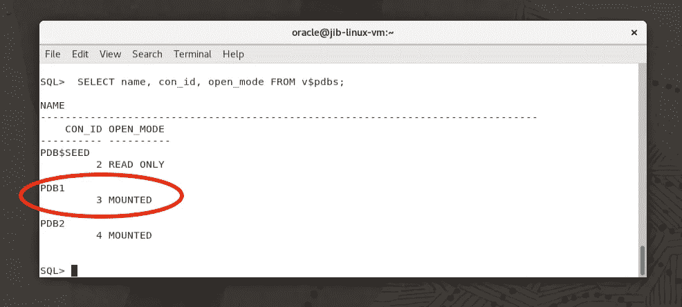

PDB 基地是 PDB1。此外，我们可以看到 PDB1 已装载，但它还没有读写权限。我们会解决这个问题的。

## **2。创建并更新 tnsnames.ora 文件**

tnsnames.ora 文件包含客户端网络配置参数。在 SQL Plus 之外的新终端选项卡中执行下面的代码行。这将把您带到 tnsnames.ora 文件所在的位置，或者应该所在的位置。如果这个位置没有 tnsnames.ora 文件，请不要担心。我们将创建一个。打开一个新的终端选项卡，输入以下命令来更改目录。

```
cd $ORACLE_HOME/network/admin
```

要创建和编辑 tnsnames.ora 文件，请运行下面的代码行。

```
sudo vi tnsnames.ora
```

您的终端屏幕现在应该看起来像这样。

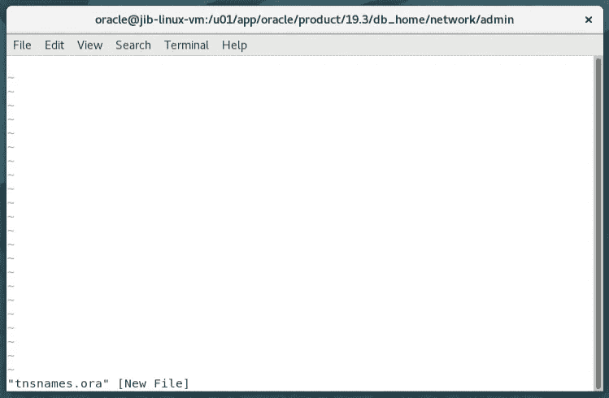

按下键盘上的字母“I”开始编辑文档。添加以下案文。

```
LISTENER_CDB =
  (ADDRESS = (PROTOCOL = TCP)(HOST = LOCALHOST)(PORT = 1521))

CDB =
  (DESCRIPTION =
    (ADDRESS = (PROTOCOL = TCP)(HOST = LOCALHOST)(PORT = 1521))
    (CONNECT_DATA = 
      (SERVER = DEDICATED)
      (SERVICE_NAME = CDB)
    )
  )

PDB1 = 
  (DESCRIPTION =
    (ADDRESS = (PROTOCOL = TCP)(HOST = LOCALHOST)(PORT = 1521))
    (CONNECT_DATA = 
      (SERVER = DEDICATED)
      (SERVICE_NAME = PDB1)
    )
  )
```

完成此任务后，点击 ESC 按钮，向下滚动到文档底部，键入以下文本。然后，按回车键。

```
:wq
```

这个序列将保存文件并退出编辑器。

## **3。创建并更新 listener.ora 文件**

listerner.ora 文件包含服务器端网络配置参数。要创建和配置 listener.ora 文件，请在我们刚刚使用的目录中运行下面的代码行。

```
sudo vi listener.ora
```

您的终端屏幕现在应该看起来像这样。

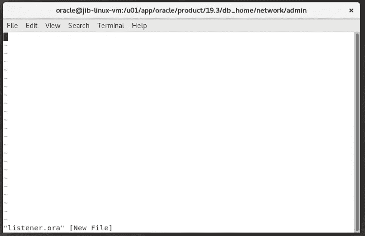

按下键盘上的字母“I”开始编辑文档。添加以下案文。

```
LISTENER =
  (DESCRIPTION_LIST =
    (DESCRIPTION =
      (ADDRESS = (PROTOCOL = TCP)(HOST = 0.0.0.0)(PORT = 1521))
      (ADDRESS = (PROTOCOL = IPC)(KEY = EXTPROC1521))
    )
  )

SID_LIST_LISTENER =
  (SID_LIST = 
    (SID_DESC =
      (GLOBAL_DBNAME = CDB)
      (ORACLE_HOME = /u01/app/oracle/product/19.3/db_home)
      (SID_NAME = CDB)
      (ENVS="TNS_ADMIN=/u01/app/oracle/product/19.3/db_home/network/admin")
    )
    (SID_DESC = 
      (GLOBAL_DBNAME = PDB1)
      (ORACLE_HOME = /u01/app/oracle/product/19.3/db_home)
      (SID_NAME = PDB1)
      (ENVS="TNS_ADMIN=/u01/app/oracle/product/19.3/db_home/network/admin")
    )
  )

ADR_BASE_LISTENER = /u01/app/oracle
```

完成此任务后，点击 ESC 按钮，向下滚动到文档底部，键入以下文本。然后，按回车键。

```
:wq
```

这个序列将保存文件并退出编辑器。使用以下命令停止然后启动监听器

```
lsnrctl stop
lsnrctl start
```

## **4。打开 PDB1**

我们现在要连接到 PDB1。导航回打开 SQL Plus 的终端。如果您需要使用 SQL Plus 重新打开终端，请运行以下命令。

```
sqlplus "/ AS SYSDBA"
```

您的终端屏幕应该是这样的。

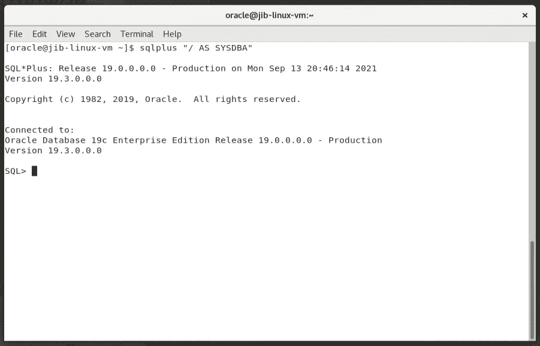

运行下面的命令来打开我们的容器数据库。

```
ALTER PLUGGABLE DATABASE ALL OPEN;
```

## **5。连接到容器 PDB1**

运行以下命令连接到 PDB1。

```
ALTER SESSION SET container=PDB1;
```

## **6。解锁人力资源模式**

最后，我们可以使用下面的命令解锁 HR 模式。

```
ALTER USER HR IDENTIFIED BY HR ACCOUNT UNLOCK;
```

如果您像我一样遇到这个错误，请不要担心。继续下一步。

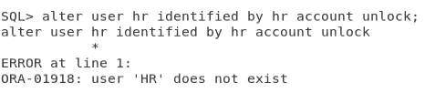

## **7。检查 tnsnames.ora 配置**

在 SQL Plus 之外的新终端中，通过执行以下命令来更改目录。

```
cd $ORACLE_HOME/bin
```

进入该目录后，执行下面的命令检查 tnsnames.ora 文件是否配置正确。

```
./tnsping pdb1
```

如果是，那么您的输出应该是这样的。

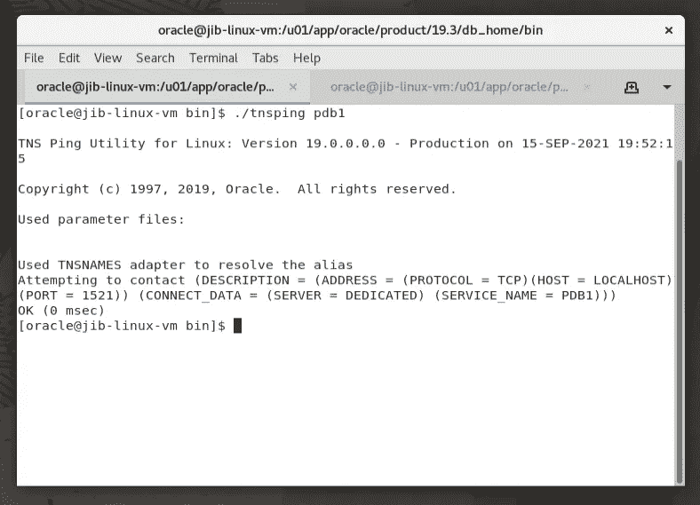

让我们进入下一步，我们将最终连接到 HR 数据集。

# 最终确定人力资源数据集连接

接下来，我们需要运行 hr_main.sql 文件来创建所有对象并加载数据。以下步骤将提供此安装过程的摘要。


在 SQL PLUS 的终端中运行这个命令。

```
@?/demo/schema/human_resources/hr_main.sql 
```

按照屏幕上的提示进行操作。使用下面的标准来指导你。

1.  在此输入*小时*。这是给用户 HR 的，这是我们用来访问数据库的。
2.  输入适当的表空间，例如，*用户*作为 HR 的默认表空间
3.  输入 *temp* 作为 HR 的临时表空间
4.  输入日志目录的目录路径，例如:

```
$ORACLE_HOME/demo/schema/log/
```

在脚本 hr_main.sql 成功运行并安装了模式 hr 之后，您将作为用户 HR 进行连接。

```
SELECT table_name FROM user_tables;
```

您应该得到类似这样的结果。

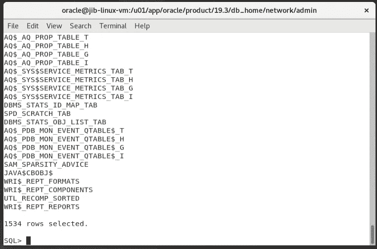

我们有所发现。让我们在 SQL Developer 中测试连接。

# 在 SQL Developer 中访问人力资源数据库

在本地虚拟机上打开 SQL Developer。如果需要重新打开它，请在终端中使用以下命令。

```
/opt/sqldeveloper/sqldeveloper.sh
```

如果您再次被提示，这是 JDK 路径。

```
/usr/java/jdk1.8.0_301-amd64
```

进入 SQL Developer 后，选择下面用红色圈出的“手动创建连接”按钮。

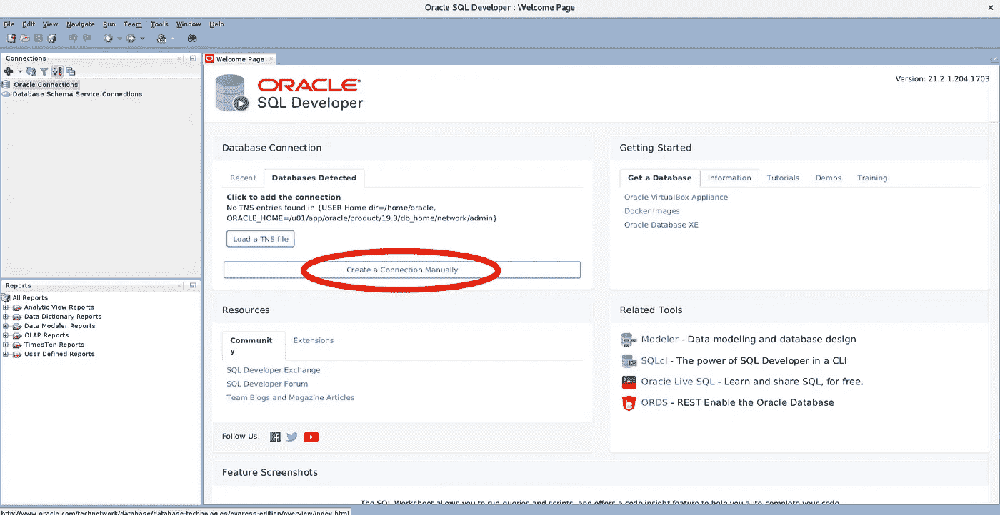

将会弹出一个如下所示的窗口。

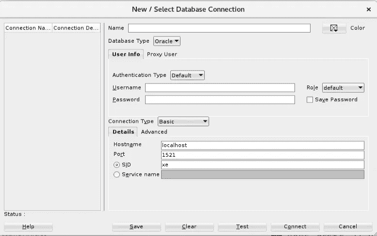

请按照以下标准填写:

*   **姓名:** *人力资源*
*   **用户名:** *hr*
*   **密码:** *hr*
*   **服务名称:**勾选此框，放入 *PDB1*

窗口现在应该看起来像这样。

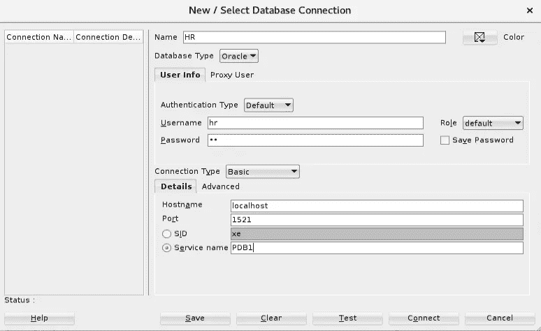

当你准备好了，点击“测试”——关键时刻。如果在“状态:”旁边的左下角显示“成功”，您将知道它是否成功。测试成功后，单击“保存”按钮，然后单击“连接”如果再次提示您输入密码，请输入 *hr* 。

您的屏幕现在应该看起来像这样。

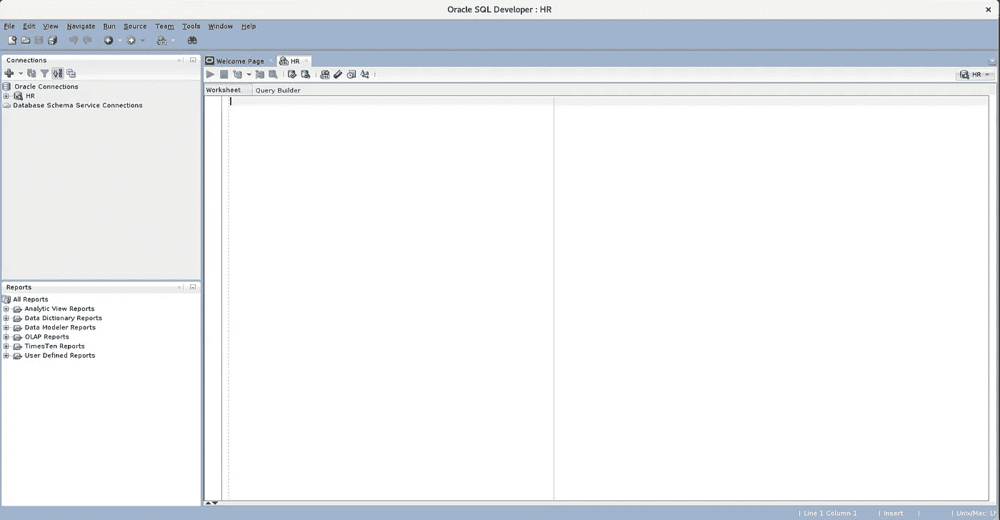

让我们运行一个快速查询来查看数据库的运行情况。让我们用下面的 SQL 命令看看数据库中有多少雇员。

```
select count(*) from employees;
```

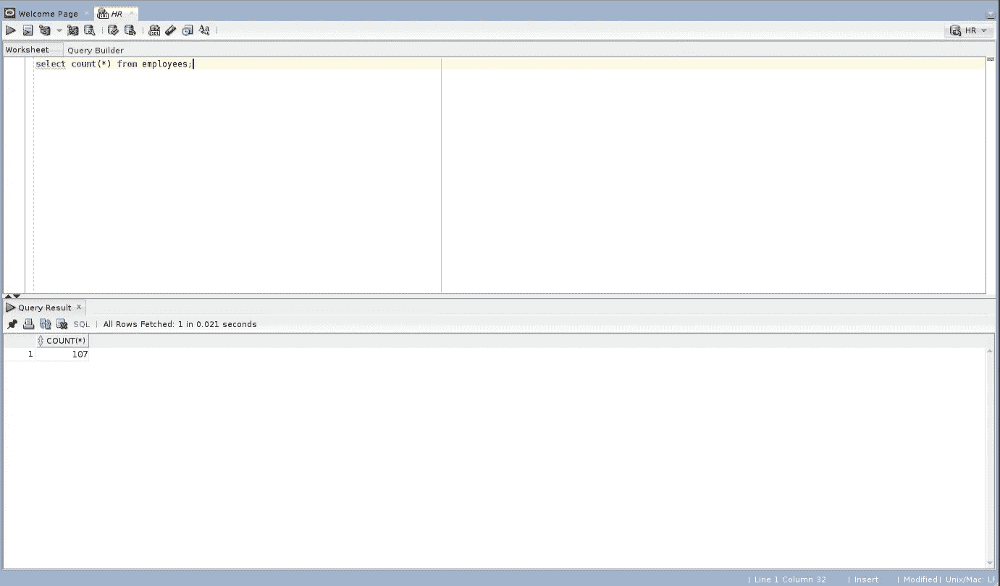

我考了 107 分——成功了。


# 计算机重新启动后启动数据库

最后一个注意事项—如果您重新启动计算机，您需要按照下面的步骤让您的数据库重新启动并运行。首先，用下面的命令启动监听器。

```
lsnrctl start
```

我们现在需要重新登录到 SQL Plus。使用下面的命令重新登录到 SQL Plus。

```
sqlplus "/ AS SYSDBA"
```

运行此命令启动数据库。

```
STARTUP FORCE;
```

如果容器数据库尚未打开，请运行以下命令打开它。

```
ALTER PLUGGABLE DATABASE ALL OPEN;
```

如果您尚未连接到 PDB1，请运行以下命令连接到 PD B1。

```
ALTER SESSION SET container=PDB1;
```

享受您的数据库。

