# 在 Windows 上安装 Oracle Database 19c

> 原文：<https://medium.com/geekculture/oracle-database-19c-installation-on-windows-5a0561843fbc?source=collection_archive---------3----------------------->


今天我们将在 OCI 的 Windows 2019 服务器上安装 Oracle Database 19c。如果你在 OCI 还没有一个可用的 Windows VM，首先完成我写的博客中的步骤。如果你和我在 OCI 使用相同的虚拟机，你不必担心检查任何先决条件——这应该已经解决了。尽管如此，以下是 Oracle Database 19c 系统的先决条件。

*   最小 2 GB 可用内存
*   硬盘上 10 GB 的空白空间
*   基于英特尔 EM64T 或 AMD64 架构的处理器
*   最低分辨率为 1024x768 像素的显卡

关于先决条件的更多细节，[查看 Manish Sharma 的博客](http://www.rebellionrider.com/how-to-install-oracle-database-19c-on-windows-10/)。他做得很好，比我更深入地解释了这一点和安装过程。事实上，我用他的博客指导我完成了 Oracle Database 19c 的安装和配置过程。如果您尚未登录，请登录到您的 Windows 实例的 GUI。你的屏幕应该是这样的。

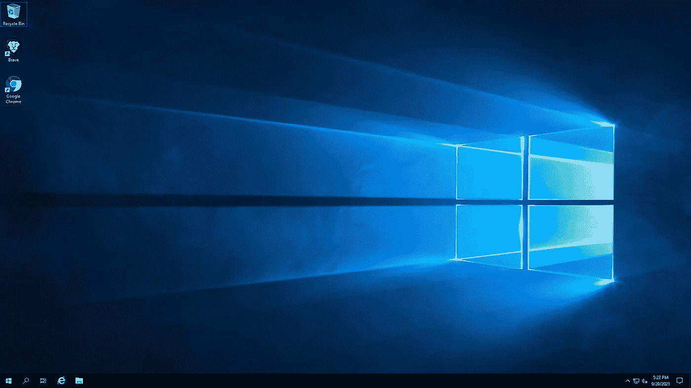

## 下载 Oracle 数据库 19c

打开我们在之前的博客中下载的勇敢浏览器，然后[导航到这个网站](https://www.oracle.com/database/technologies/oracle-database-software-downloads.html)。当你到达这个网页时，你会想要下载微软 Windows x86 (64 位)的 19.3 zip 文件，就像我在下面用红色圈出的那样。

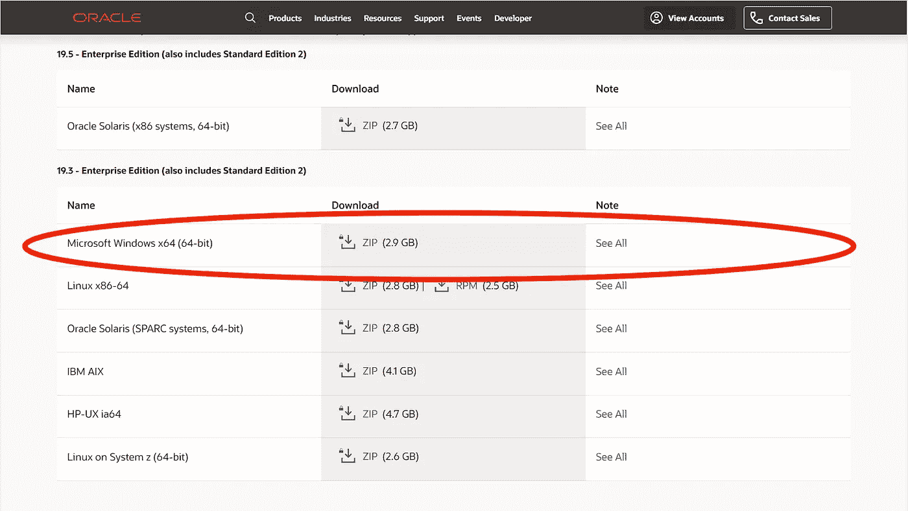

在下载开始之前，系统会提示您登录 Oracle SSO 帐户。成功登录后，系统会询问您要将 zip 文件保存在哪里。记住这个 zip 文件保存的位置。默认情况下，它应该保存在您的下载文件夹中。如果您打开文件浏览器并导航到 Downloads 文件夹，您应该会在那里看到 zip 文件。你的文件浏览器应该是这样的。

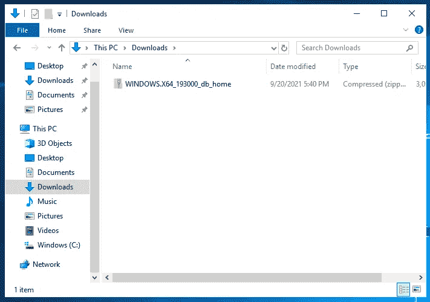

# 创建 Oracle 数据库主目录


我们不*也不*想在我们的下载文件夹中解压这个 zip 文件。相反，我们需要将这个 zip 文件移动到一个新的*目录中。我们现在将创建的这个新目录将是我们的 Oracle 主目录。首先，我们要导航到我们的 C: drive 文件夹。双击地址栏中显示的 *>这台电脑>在文件浏览器中下载>* 。我有你需要双击的地方，在下面用红色圈出。*

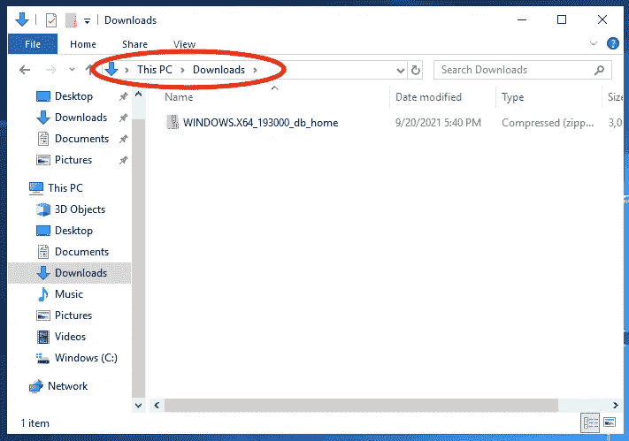

然后，将该命令复制并粘贴到地址栏中。

```
C:\
```

您的文件资源管理器现在应该看起来像这样。

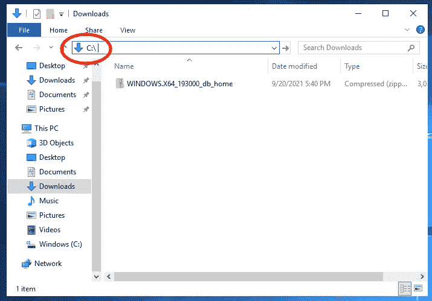

然后，按回车键。这将带你到你的 C:驱动器文件夹。您的文件资源管理器现在应该看起来像这样。

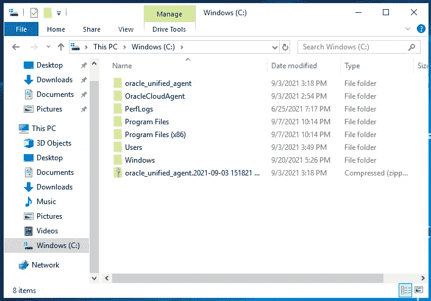

在 C: drive 文件夹中，用以下名称创建一个新文件夹。

```
App
```

您可以通过右键单击文件资源管理器中的任意位置来创建新文件夹。将弹出一个右键菜单，如下所示。

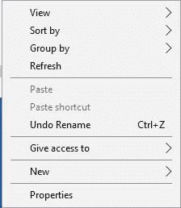

单击“新建”，然后单击“文件夹”然后，您应该能够重命名该文件夹。创建此文件夹后，双击 App 文件夹将其打开。您的文件资源管理器现在应该看起来像这样。这是我们将要构建 Oracle 主目录的地方

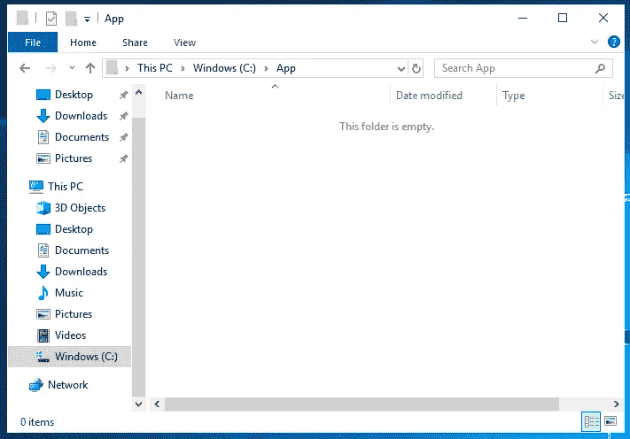

# 提取 zip 文件并最终确定 Oracle 主目录


接下来，我们将导航回我们的下载文件夹。你的文件浏览器应该是这样的。


右键单击 zip 文件，并在右键弹出菜单中选择“复制”按钮。现在，导航回我们刚刚在 C:目录中创建的 App 文件夹。将 zip 文件粘贴到应用程序文件夹中。将这个 zip 文件粘贴到这里后，我们现在就可以提取 zip 文件了。我们可以通过右键单击 zip 文件，然后在右键菜单中选择“Extract All…”选项来提取 zip 文件。应该会弹出一个新窗口，如下所示。

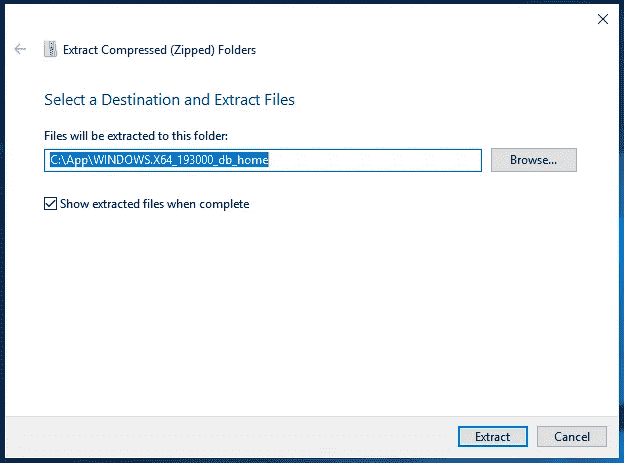

在显示“文件将被提取到此文件夹:”的地方，我们将把提取位置更改为。

```
C:\App\db_home
```

将上述目录路径复制并粘贴到地址栏中。窗口现在应该看起来像这样。

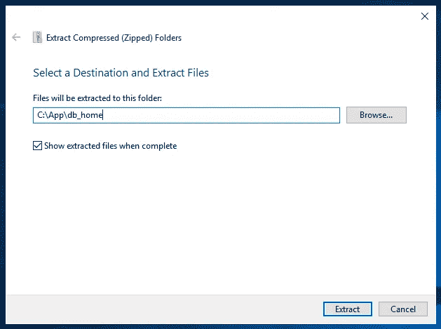

准备好后，点击“提取”耐心点——这需要一点时间。最终完成后，您应该会在我们在上一步中创建的 App 文件夹中看到一个名为 db_home 的新文件夹。你的应用文件夹应该是这样的。

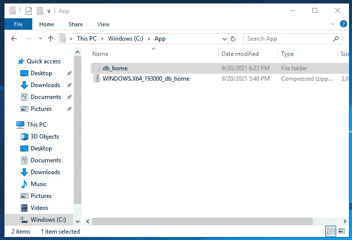

# 安装和配置 Oracle 数据库 19c


开始之前，请确保您使用具有管理权限的用户登录 Windows。我以管理用户的身份登录，所以可以开始了。现在让我们进入刚刚创建的 db_home 文件夹。找到名为“setup.exe”的应用程序文件。

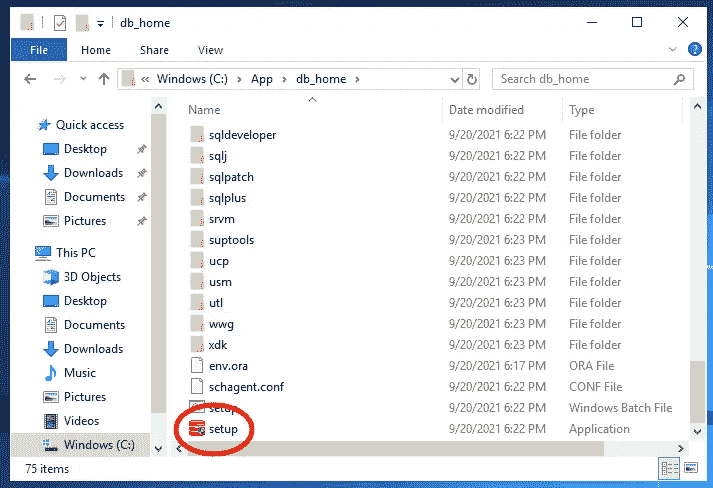

右键单击该文件，并在右键菜单中选择“以管理员身份运行”选项。如果您看到如下所示的弹出窗口，请单击“是”


Click “Yes”

现在，您的屏幕上会弹出一个 Oracle Database 19c 的 GUI 安装程序窗口。让我们来看一下安装过程。

## 步骤 1:配置选项

选择“创建和配置单实例数据库”选项，然后单击“下一步”

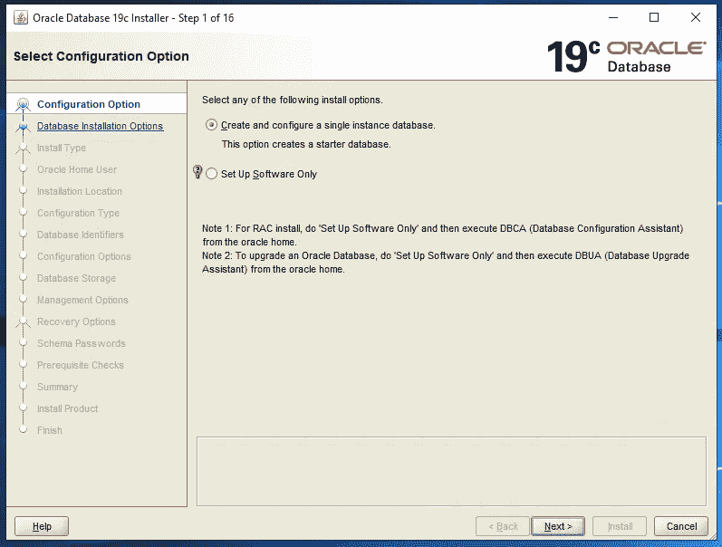

Click “Next”

## 第二步:系统类

选择“桌面类”选项，然后单击“下一步”

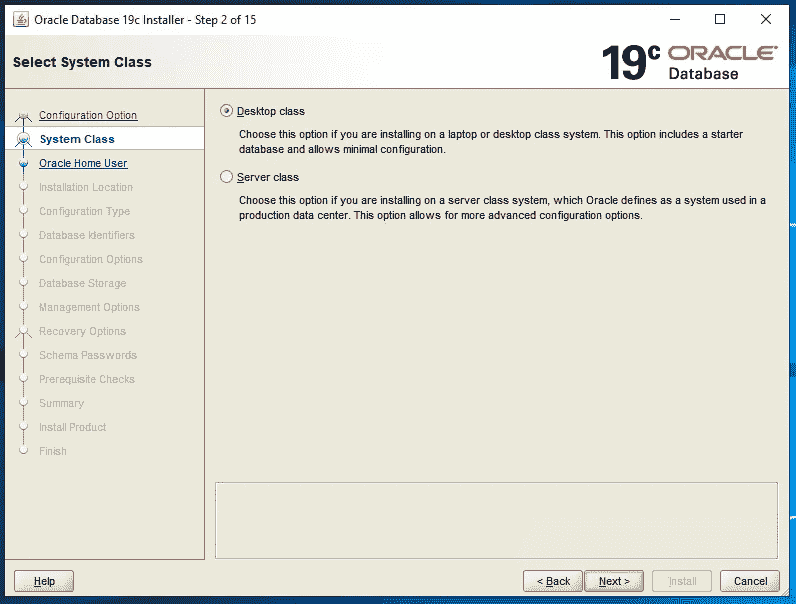

Click “Next”

## 步骤 3: Oracle 主目录用户

选择“创建新的 Windows 用户”,输入 oracle 作为用户名。把*你的*密码放在安全的地方。点击“下一步”

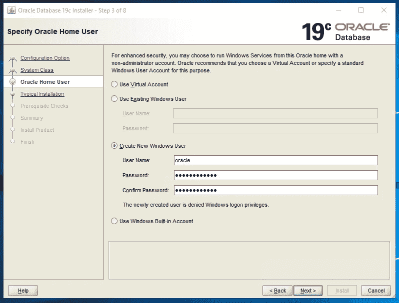

Click “Next”

## 步骤 4:典型安装

假设我们新窗口的用户是“oracle”，那么该窗口中的值应该如下所示。

*   **Oracle base:**C:\ App \ Oracle
*   **软件位置:** C:\App\db_home
*   **数据库文件位置:** C:\App\oracle\oradata
*   **数据库版:**企业版
*   **字符集:** Unicode (AL32UTF8)
*   **全局数据库名称:** orcl
*   **密码:**在此输入密码。把你的密码放在安全的地方。
*   **创建为容器数据库:**确保选中此框
*   **可插拔数据库名称:** orclpdb

你的窗口现在应该看起来像这样。点击“下一步”

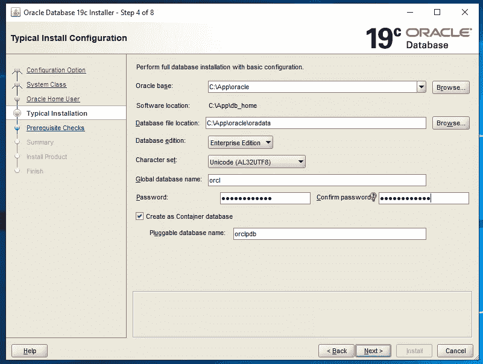

Click “Next”

## **步骤 5:先决条件检查**

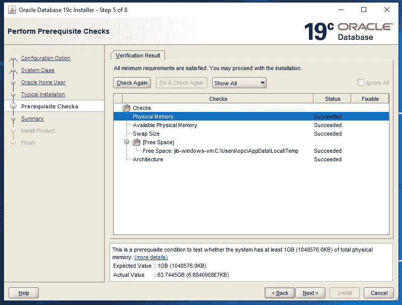

Click “Next”

## **第六步:汇总**

如果您愿意，可以通过单击 GUI 中的“保存响应文件”按钮来保存响应文件。我把我的保存到了我的桌面上。然后，当你准备好了，点击“安装”

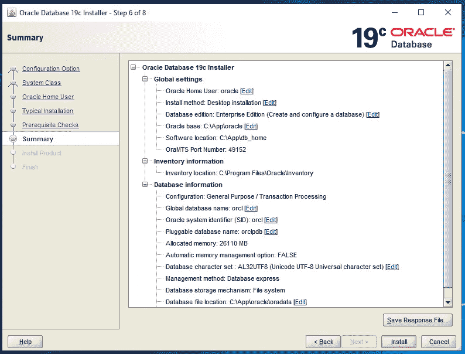

Click “Install

## **第七步:安装产品**

耐心点——这需要一点时间。

## 完成

安装现已完成。

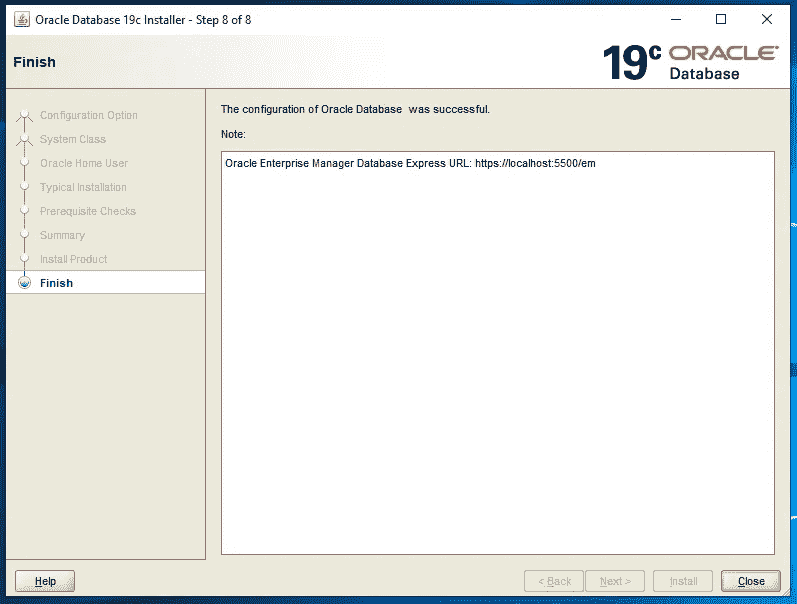

Click “Close”

现在，我们已经在 Windows 虚拟机上成功安装了 Oracle Database 19c。让我们启动数据库并登录到 SQL Plus。我们可以使用 Windows PowerShell 来做到这一点。

# 启动数据库并打开容器

点击屏幕左下角的开始菜单。然后右键点击“Windows Server”下面写着 Windows PowerShell 的图标，就像我在下面用红色圈出的一样。

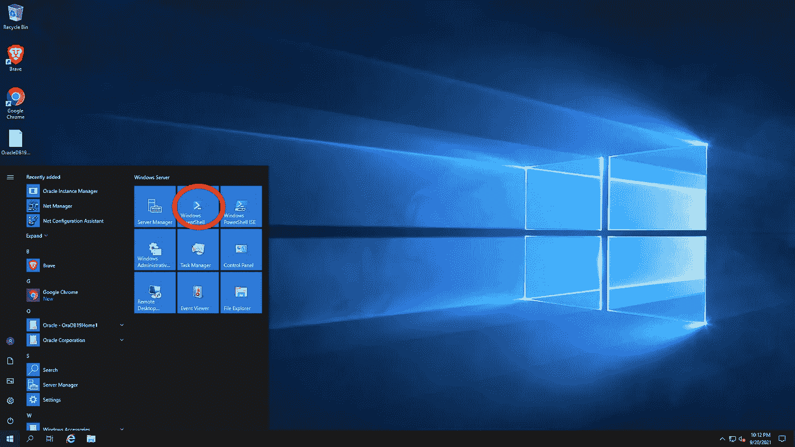

右键点击“Windows PowerShell”后，会弹出一个菜单。在弹出菜单的“任务”下，选择“以管理员身份运行”，就像我在下面用红色圈出的那样。


如果您看到如下所示的弹出窗口，请单击“是”

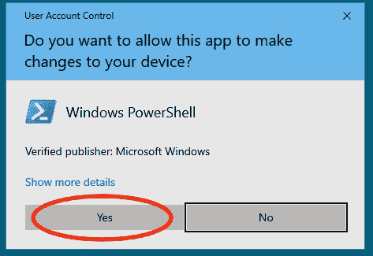

Click “Yes”

您的 Windows PowerShell 现在应该看起来像这样。

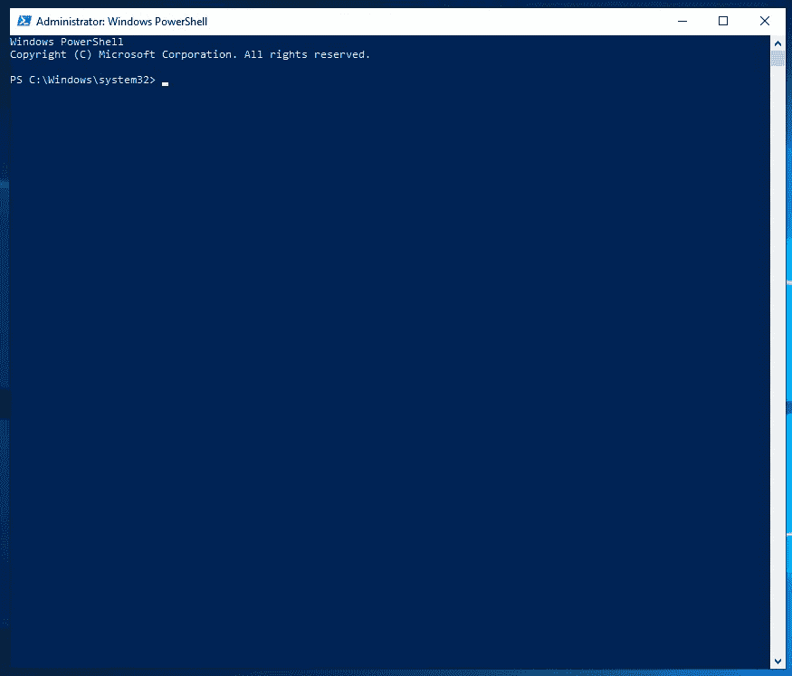

在我们登录到 SQL Plus 之前，让我们使用以下命令在我们的环境中设置 Oracle SID 变量。

```
set ORACLE_SID=orcl
```

接下来，输入以下命令，以 SYS DBA 身份登录到 SQL Plus。

```
sqlplus "/ AS SYSDBA"
```

进入 SQL Plus 后，运行以下命令启动数据库。

```
STARTUP;
```

运行下面的命令来打开我们的容器数据库。

```
ALTER PLUGGABLE DATABASE ALL OPEN;
```

在 SQL 中执行以下命令来查看我们的容器数据库的打开状态。

```
SELECT name, con_id, open_mode FROM v$pdbs;
```

您的输出应该如下所示。

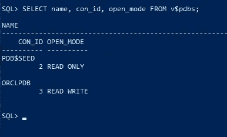

如你所见，PDB 基地是 ORCLPDB。此外，我们可以看到 ORCLPDB 是打开的，并且具有读写权限。这是因为我们用前面的命令修改了数据库并打开了容器。接下来，运行以下查询。

```
SELECT CON_ID, NAME, OPEN_MODE FROM V$CONTAINERS;
```

您的 PowerShell 应该是这样的。

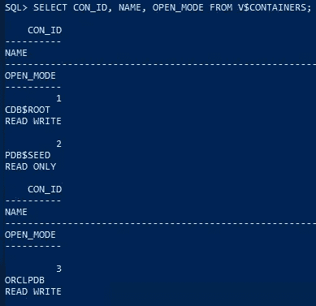

看起来一切正常。然而，我们还没有完成。我们需要检查我们与数据库的连接是否正常。我们可以使用 SQL Developer 来实现这一点。

在您的终端中键入 *exit* 并按 enter 键退出 SQL Plus 并返回到普通终端。

# 在 Windows 上安装 SQL Developer


## 步骤 1:安装 JDK

在安装 SQL Developer 之前，我们需要确保安装了正确版本的 Java JDK。为了让 SQL Developer 正常工作，我们需要 JDK 8 或 11。您可以通过在命令提示符下输入以下命令来检查您是否已经安装了 Java。

```
java -version
```

您可以通过在桌面左下角的“开始”菜单中搜索命令提示符来打开它。

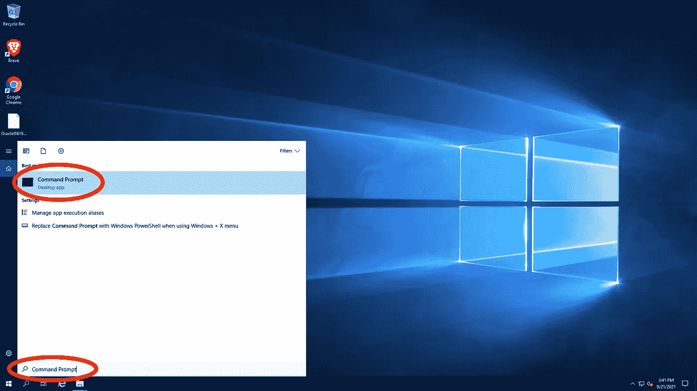

如果您的命令返回类似这样的结果，您的计算机上很可能没有安装 Java。

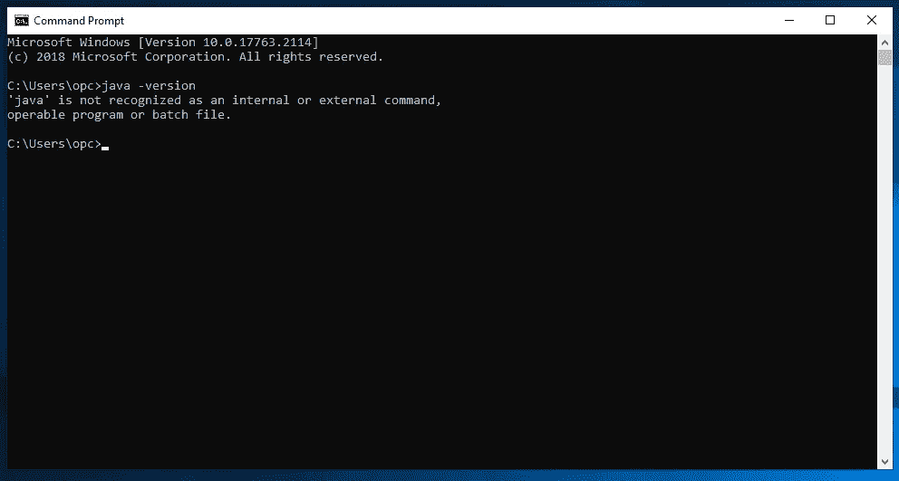

导航到[这个页面](https://downloads.ensemblevideo.com/Temp/Java/)下载 JDK 8。下载 jdk1.8.0_77.zip。

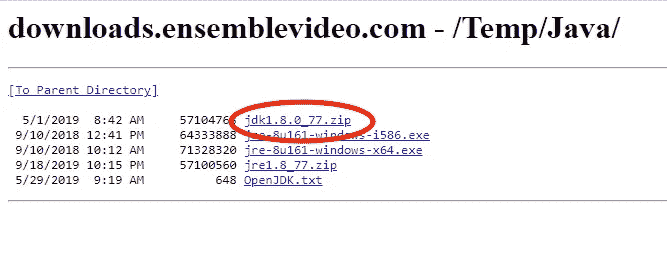

记住这个 zip 文件保存的位置。默认情况下，它应该保存在您的下载文件夹中。如果您打开文件浏览器并导航到 Downloads 文件夹，您应该会在那里看到 zip 文件。你的文件浏览器应该是这样的。

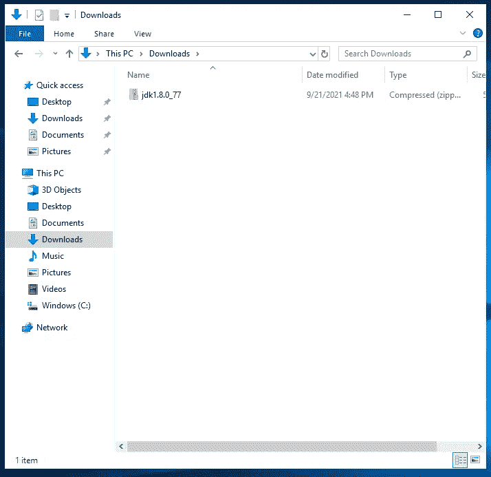

我们可以通过右键单击 zip 文件，然后在右键菜单中选择“Extract All…”选项来提取 zip 文件。应该会弹出一个新窗口，如下所示。

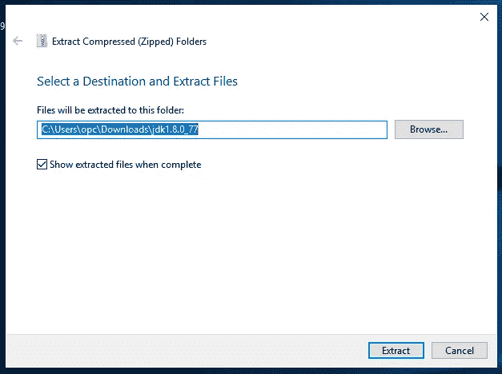

在显示“文件将被提取到此文件夹:”的地方，我们将把提取位置更改为。

```
C:\Program Files\Java
```

将上述目录路径复制并粘贴到地址栏中。窗口现在应该看起来像这样。

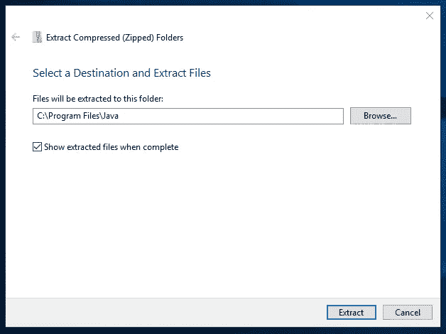

准备好后，点击“提取”如果弹出如下所示的窗口，请点按“继续”

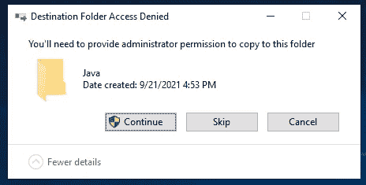

Click “Continue”

最终完成后，我们现在将使用文件资源管理器导航到 Java 在我们计算机上的安装位置。双击地址栏，在文件浏览器中显示 *>快速访问>* 。我有你需要双击的地方，在下面用红色圈出。

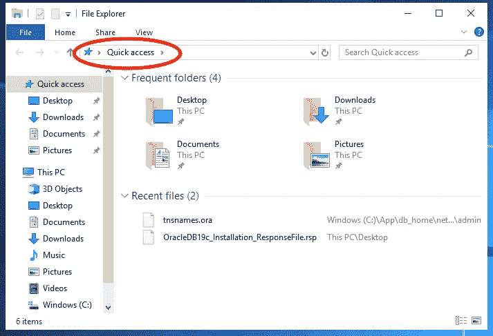

然后，将该命令复制并粘贴到地址栏中。

```
C:\Program Files\Java
```

您的文件资源管理器现在应该看起来像这样。

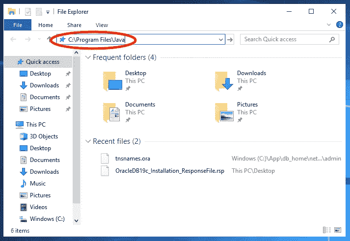

然后，按回车键。这将把您带到 Java 安装位置。您的文件资源管理器现在应该看起来像这样。


双击 jdk1.8.0_77 文件夹。你的文件浏览器应该是这样的。用红色圈出的是 bin 文件夹。双击这个。

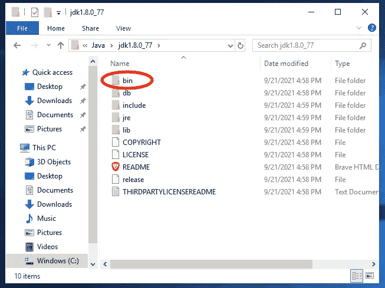

您的文件资源管理器现在应该看起来像这样。

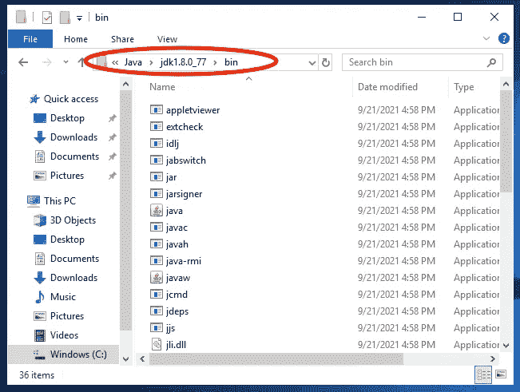

这是所有重要的 Java 相关可执行文件的存储位置。我们现在想将这个 bin 文件夹设置为我们的环境变量，这样我们就可以在命令提示符和 Windows PowerShell 中运行所有相关的 Java 命令。双击上面用红色圈出的地址栏。记下路径。路径应该如下所示。

```
C:\Program Files\Java\jdk1.8.0_77\bin
```

我们将把这个目录添加到我们的路径中。首先，点击屏幕左下角的开始菜单。然后，点击用红色圈出的齿轮图标，打开你的设置应用程序。


您的屏幕现在应该看起来像这样。点击“系统”

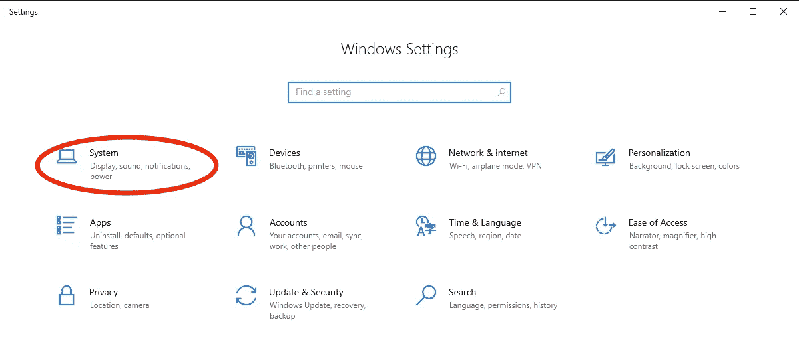

您的屏幕现在应该看起来像这样。

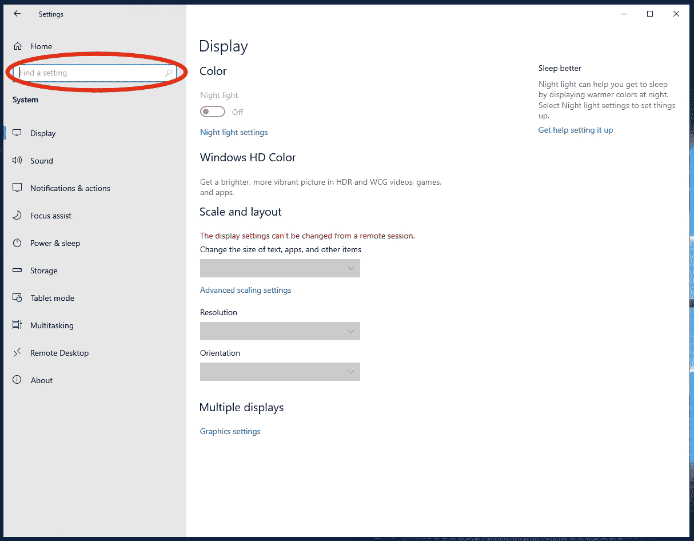

在“查找设置”搜索栏中，搜索以下内容。

```
Edit the system environment variables
```

选择下面的【仅 选项。


应该会弹出一个新窗口，看起来像这样。点击“环境变量”，我在下面用红笔圈了出来。

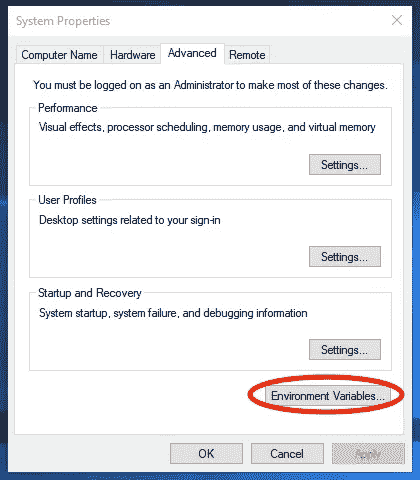

应该会弹出一个新窗口，看起来像这样。点击“系统变量”下的“路径”然后，点击“编辑”

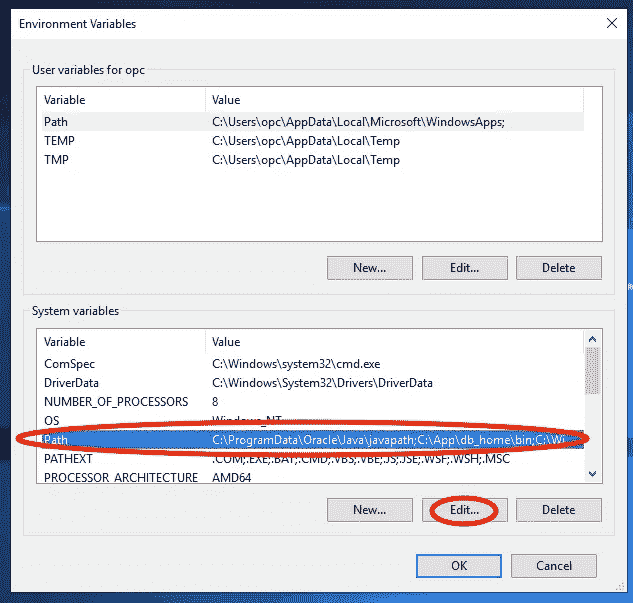

应该会弹出一个新窗口，看起来像这样。单击“新建”按钮，将 Java/bin 路径粘贴到此处。

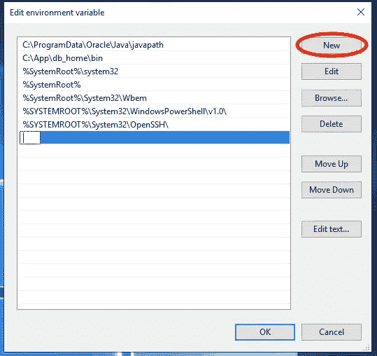

您的屏幕现在应该看起来像这样。单击“确定”

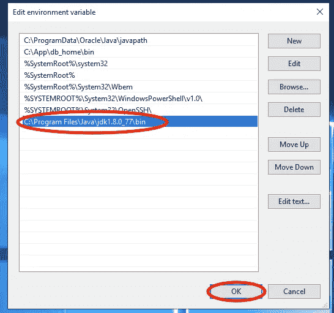

我们现在要设置 JAVA_HOME 环境变量。在您的环境变量屏幕中，单击下面用红色圈出的“新建”按钮。

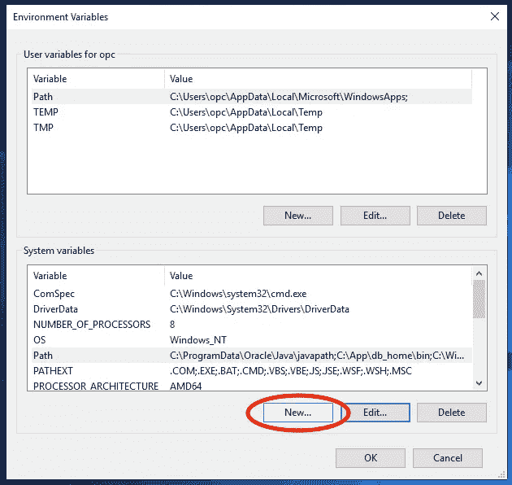

应该会弹出一个新窗口，如下所示。


如下设置“变量名”。

```
JAVA_HOME
```

如下设置“变量值”。

```
C:\Program Files\Java\jdk1.8.0_77
```

请注意，我们在这里没有将 bin 包含在 out 路径中。窗口现在应该看起来像这样。单击“确定”


现在让我们也设置 ORACLE_HOME 变量，并将其添加到我们的路径中。在您的环境变量屏幕中，单击下面用红色圈出的“新建”按钮。

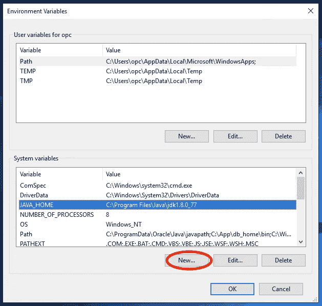

应该会弹出一个新窗口，如下所示。


如下设置“变量名”。

```
ORACLE_HOME
```

如下设置“变量值”。

```
C:\App\db_home
```

窗口现在应该看起来像这样。单击“确定”

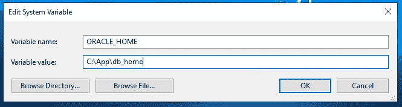

太棒了—现在让我们将 ORACLE_HOME 添加到我们的路径中。点击“系统变量”下的“路径”然后，点击“编辑”


应该会弹出一个新窗口，看起来像这样。单击“新建”按钮，并将 ORACLE_HOME 路径粘贴到此处。


您的屏幕现在应该看起来像这样。单击“确定”


同样，ORACLE_HOME 路径如下所示。

```
C:\App\db_home
```

最后，当我们在这里时，让我们也设置 ORACLE_SID 变量。如果您还记得，在我们打开数据库和 SQL Plus 之前，我们必须手动将它输入到 PowerShell 中。让我们也在这里添加这个变量，这样我们就不需要每次打开一个新的 SQL Plus 会话时都设置这个变量。在您的环境变量屏幕中，单击下面用红色圈出的“新建”按钮。


应该会弹出一个新窗口，如下所示。


如下设置“变量名”。

```
ORACLE_SID
```

如下设置“变量值”。

```
orcl
```

请注意，我们在这里没有将 bin 包含在 out 路径中。窗口现在应该看起来像这样。单击“确定”

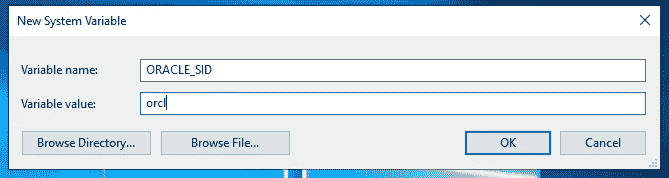

最后，在环境变量窗口中单击“确定”，如下图中用红色圈出的内容。

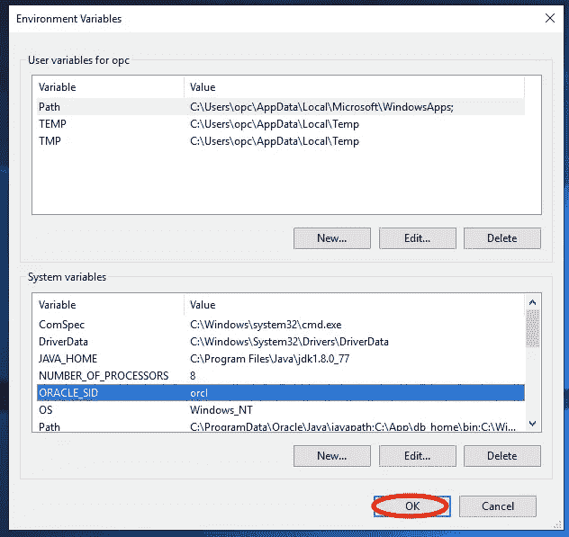

在系统属性窗口中单击“确定”，如下图中红色圆圈所示。

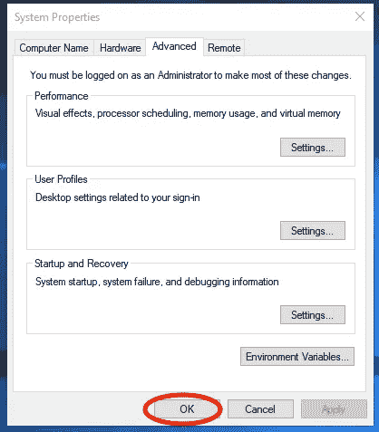

我们将通过在命令提示符下输入以下命令，再次检查我们是否正确安装了 Java。

```
java -version
```

您可以通过在桌面左下角的“开始”菜单中搜索命令提示符来打开它。


如果您的命令返回如下所示的结果，那么恭喜您，您已经成功地在您的计算机上安装了 Java。现在让我们继续安装 SQL Developer。

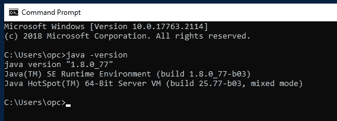

## 步骤 2:安装 SQL Developer

我们现在需要安装 SQL Developer。要安装 SQL Developer，[导航到此页面](https://www.oracle.com/tools/downloads/sqldev-downloads.html)并下载 Windows 32 位/64 位文件。在下载开始之前，系统会提示您登录 Oracle SSO 帐户。记住这个 zip 文件保存的位置。默认情况下，它应该保存在您的下载文件夹中。


打开文件浏览器，导航到下载文件夹。您应该在那里看到 zip 文件。你的文件浏览器应该是这样的。

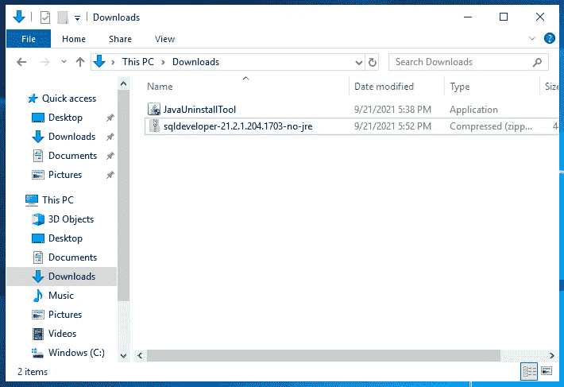

我们可以通过右键单击 zip 文件，然后在右键菜单中选择“Extract All…”选项来提取 zip 文件。应该会弹出一个新窗口，如下所示。

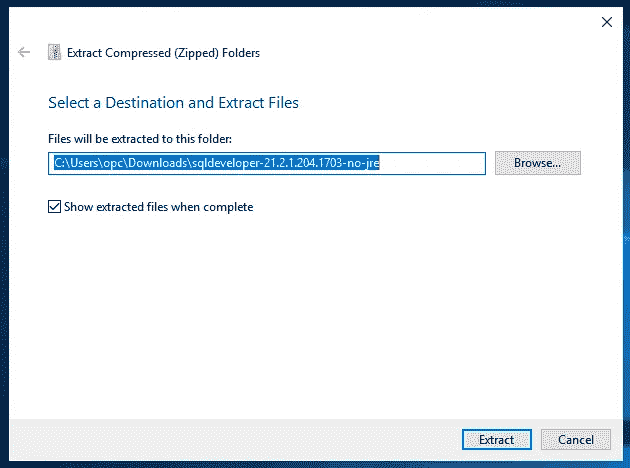

准备好后，点击“提取”您可以将 SQL Developer 解压缩到您计算机上的任何位置。出于这个博客的目的，我把它放在了我的下载文件夹中。您的文件资源管理器现在应该看起来像这样。双击 SQL developer-21 . 2 . 1 . 204 . 1703-no-JRE 文件夹。

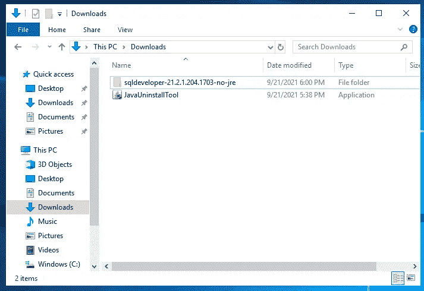

您的文件资源管理器现在应该看起来像这样。双击 sqldeveloper 文件夹。


进入 sqldeveloper 文件夹后，找到 sqldeveloper 应用程序，我在下面用红色圈出了它。找到该应用程序后，双击它。

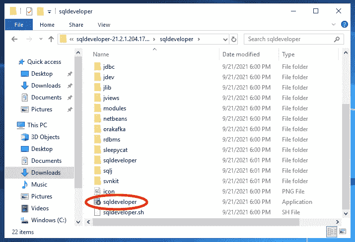

如果您收到此消息，请选中“下次跳过此消息”并选择“是”

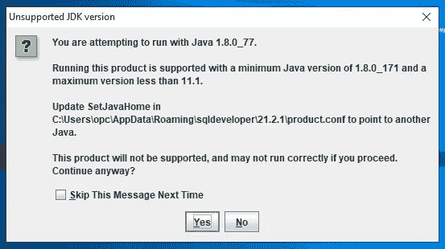

如果弹出此窗口，请按“否”

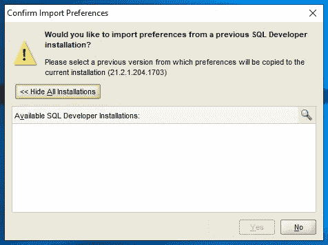

Oracle SQL Developer 现在应该已经成功加载并打开了。你的屏幕应该是这样的。现在最小化 SQL Developer。我们将回到这个话题。

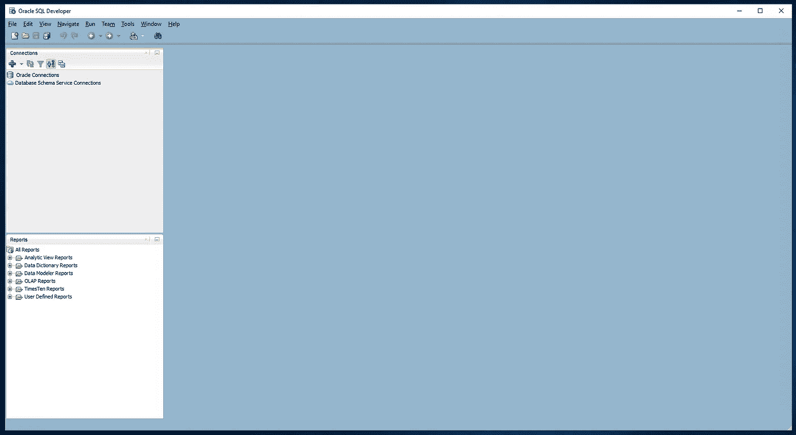

现在让我们连接到一个示例数据库。

# 访问样本数据集

我们现在差不多完成了。此安装的最后一步是测试我们与 Oracle 19c 中数据库的连接。为了测试我们的连接，我们将使用 Oracle Database 19c 附带的一个样本数据集:HR 数据集。我们首先需要解锁这个数据库的示例 HR 用户。


请按照下面的步骤进行操作。在命令提示符下运行以下命令，以 SYS 用户身份登录到 SQL Plus。

```
sqlplus "/ AS SYSDBA"
```

## 第一步:找到 PDB 的名字

在 SQL 中执行以下命令。

```
SELECT name, con_id, open_mode FROM v$pdbs;
```

您的输出应该如下所示。

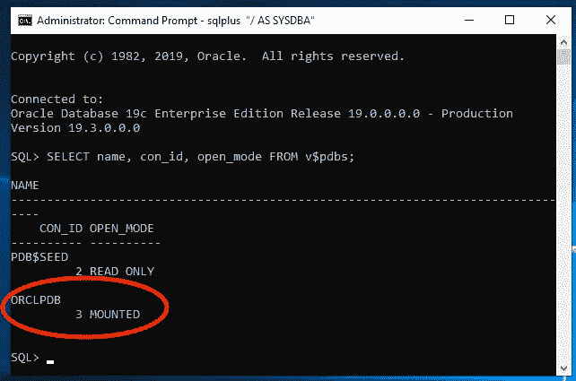

PDB 基地是 ORCLPDB。此外，我们可以看到 ORCLPDB 已经挂载，但是它还没有读写权限。我们会解决这个问题的。

## 2.更新 tnsnames.ora

tnsnames.ora 文件包含客户端网络配置参数。在 SQL Plus 之外的新终端选项卡中执行下面的代码行。这将把您带到 tnsnames.ora 文件所在的位置，或者应该所在的位置。如果这个位置没有 tnsnames.ora 文件，请不要担心。我们将创建一个。在编辑和/或创建 tnsnames.ora 文件之前，我们首先需要在 PowerShell 中启用文本编辑功能。我们可以通过安装 nano 和 choco 来实现这一点。

首先，我们需要以管理员身份安装 choco。以管理员身份打开 PowerShell。然后，用下面的命令安装 choco。

```
Set-ExecutionPolicy Bypass -Scope Process -Force; iex ((New-Object System.Net.WebClient).DownloadString('https://chocolatey.org/install.ps1'))
```

一旦安装完成，您的 PowerShell 应该看起来像这样。

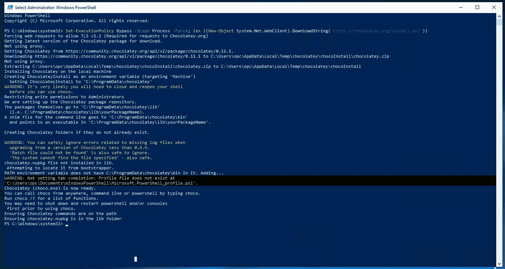

接下来，我们需要安装 vim。我们可以用下面的命令做到这一点。

```
choco install vim
```

一旦安装完成，您的 PowerShell 应该看起来像这样。

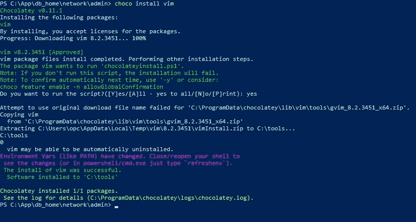

现在让我们用下面的命令来改变我们的目录。这是我们的 tnsnames.ora 文件所在的位置。

```
chdir C:\App\db_home\network\admin
```

让我们用 *ls* 命令查看这个目录的内容。您的 PowerShell 应该是这样的。

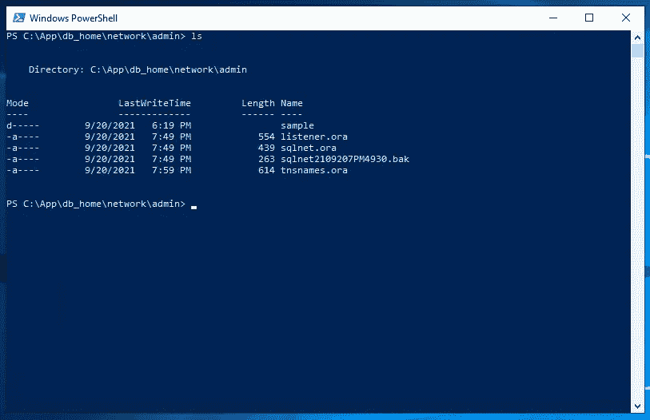

要编辑 tnsnames.ora 文件，请运行下面的代码行。

```
 vim tnsnames.ora
```

您的 PowerShell 现在应该看起来像这样。

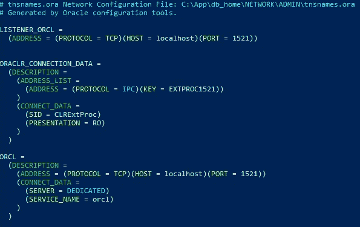

按 Shift+G 导航到文档的底部。按下键盘上的字母“I”开始编辑文档。把下面的文字放在文件的底部。我在粘贴文本时遇到了问题，所以你可能需要手动写出来。

```
ORCLPDB = 
  (DESCRIPTION =
    (ADDRESS = (PROTOCOL = TCP)(HOST = localhost)(PORT = 1521))
    (CONNECT_DATA = 
      (SERVER = DEDICATED)
      (SERVICE_NAME = orclpdb)
    )
  )
```

您的 PowerShell 现在应该看起来像这样。

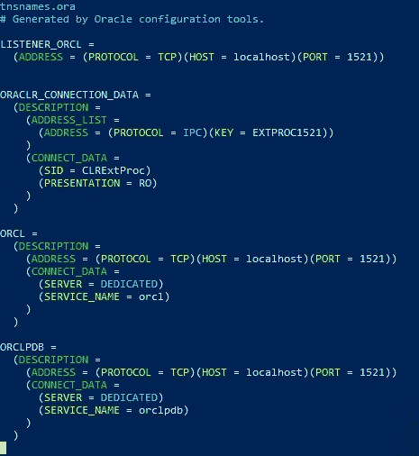

完成此任务后，点击 ESC 按钮，向下滚动到文档底部，键入以下文本。然后，按回车键。

```
:wq
```

这个序列将保存文件并退出编辑器。

## 3.更新监听器. ora

listerner.ora 文件包含服务器端网络配置参数。要创建和配置 listener.ora 文件，请在我们刚刚使用的目录中运行下面的代码行。

```
vim listener.ora
```

您的 PowerShell 现在应该看起来像这样。

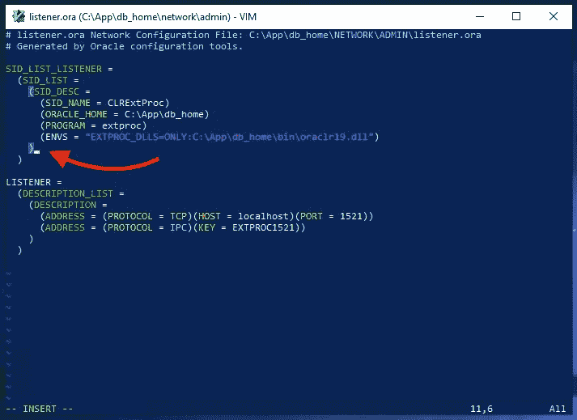

按下键盘上的字母“I”开始编辑文档。导航至上图中红色箭头在文档上指向的位置。开始新的一行，并在此输入以下文本。我在粘贴文本时遇到了问题，所以你可能需要手动写出来。

```
(SID_DESC = 
      (GLOBAL_DBNAME = orclpdb_DGMGRL)
      (ORACLE_HOME = C:\App\db_home)
      (SID_NAME = orcl)
      (ENVS="TNS_ADMIN=C:\App\db_home")
)
```

您的 PowerShell 现在应该看起来像这样。

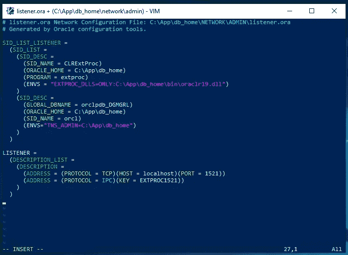

完成此任务后，点击 ESC 按钮，向下滚动到文档底部，键入以下文本。然后，按回车键。

```
:wq
```

这个序列将保存文件并退出编辑器。使用以下命令停止然后启动监听器

```
lsnrctl stop
lsnrctl start
```

## 4.打开 ORCLPDB

我们现在想要连接到 ORCLPDB。导航回打开 SQL Plus 的命令提示符会话。如果您需要使用 SQL Plus 重新打开终端，请运行以下命令。

```
sqlplus "/ AS SYSDBA"
```

您的命令提示符应该如下所示。

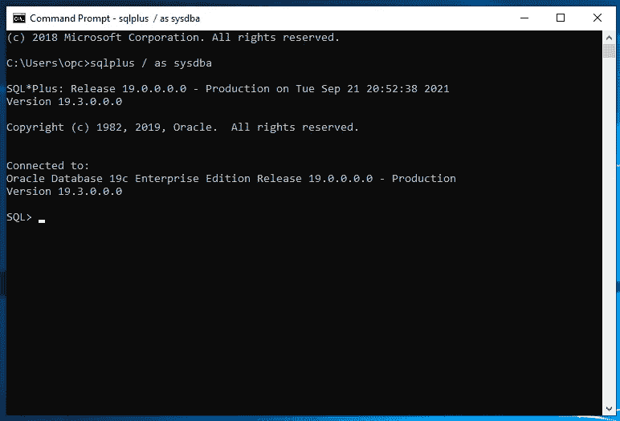

运行下面的命令来打开我们的容器数据库。

```
ALTER PLUGGABLE DATABASE ALL OPEN;
```

## 5.连接到容器 ORCLPDB

运行下面的命令连接到 ORCLPDB。

```
ALTER SESSION SET container=ORCLPDB;
```

## 6.解锁人力资源方案

最后，我们可以使用下面的命令解锁 HR 模式。

```
ALTER USER HR IDENTIFIED BY HR ACCOUNT UNLOCK;
```

## 7.检查 tnsnames.ora 配置

在 SQL Plus 之外的新 PowerShell 中，在命令提示符下，通过执行以下命令来更改目录。

```
chdir C:\App\db_home\bin
```

进入该目录后，执行下面的命令检查 tnsnames.ora 文件是否配置正确。

```
./tnsping ORCLPDB
```

如果是，那么您的输出应该是这样的。

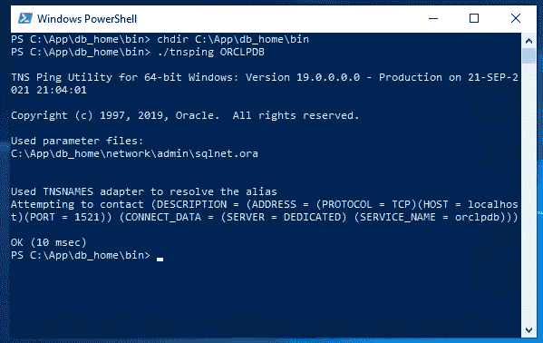

让我们进入下一步，我们将最终连接到 HR 数据集。

# 最终确定人力资源数据集连接

接下来，我们需要运行 hr_main.sql 文件来创建所有对象并加载数据。以下步骤将提供此安装过程的摘要。


在 SQL PLUS 中，在命令提示符下运行此命令。

```
@?/demo/schema/human_resources/hr_main.sql
```

按照屏幕上的提示进行操作。使用下面的标准来指导你。

1.  在此输入*小时*。这是给用户 HR 的，这是我们用来访问数据库的。
2.  输入适当的表空间，例如，*用户*作为 HR 的默认表空间
3.  输入 *temp* 作为 HR 的临时表空间
4.  输入日志目录的目录路径，例如:

```
C:\App\db_home\demo\schema\log
```

在脚本 hr_main.sql 成功运行并安装了模式 hr 之后，您将作为用户 HR 进行连接。

```
SELECT table_name FROM user_tables;
```

您应该得到类似这样的结果。

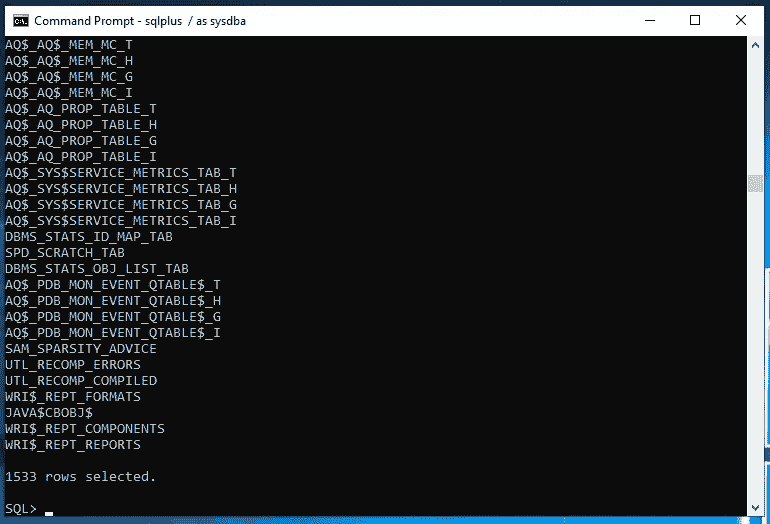

我们有所发现。让我们在 SQL Developer 中测试连接。

# 在 SQL Developer 中访问人力资源数据库

在本地虚拟机上打开 SQL Developer。进入 SQL Developer 后，选择“连接”下的“+”按钮，下面用红色圈出。

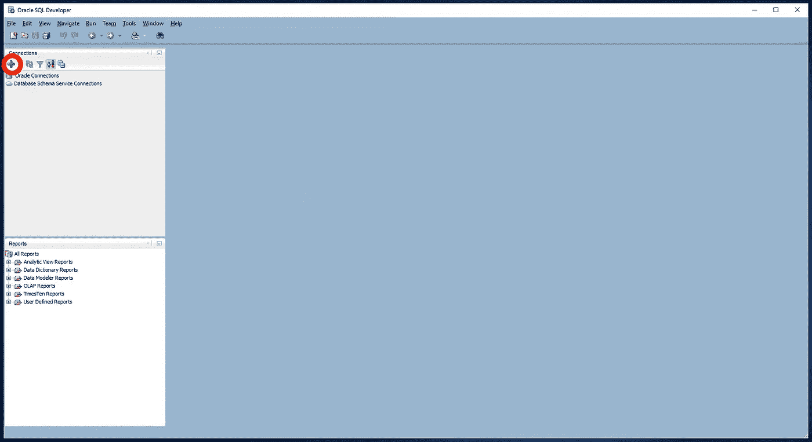

将会弹出一个如下所示的窗口。

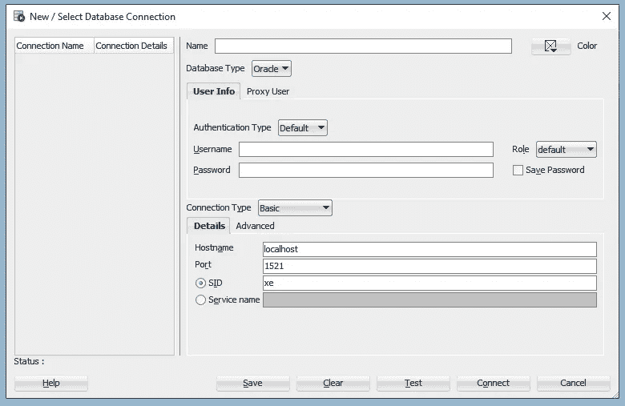

请按照以下标准填写:

*   **姓名:** *人力资源*
*   **用户名:** *hr*
*   **密码:** *hr*
*   **服务名:**勾选此框，放入*或*

窗口现在应该看起来像这样。

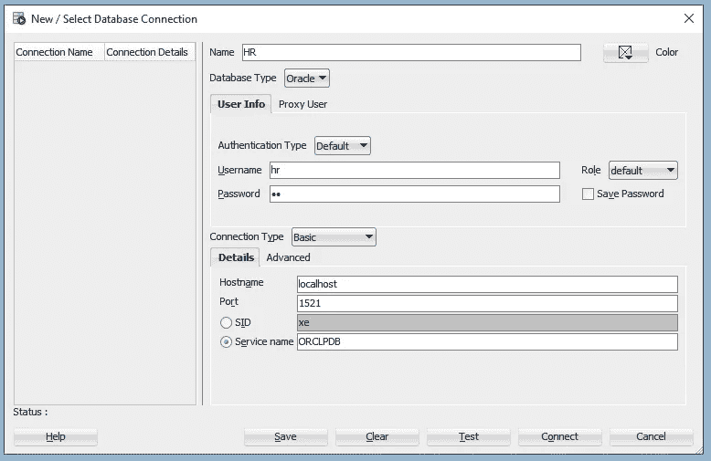

当你准备好了，点击“测试”——关键时刻。如果在“状态:”旁边的左下角显示“成功”，您将知道它是否成功。测试成功后，单击“保存”按钮，然后单击“连接”如果再次提示您输入密码，请输入 *hr* 。

您的屏幕现在应该看起来像这样。

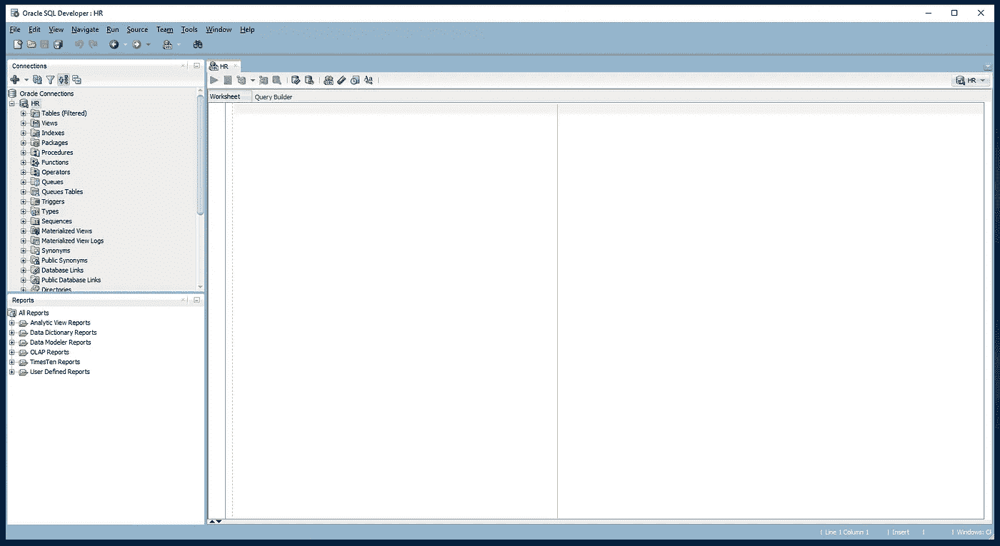

让我们运行一个快速查询来查看数据库的运行情况。让我们用下面的 SQL 命令看看数据库中有多少雇员。

```
select count(*) from employees;
```

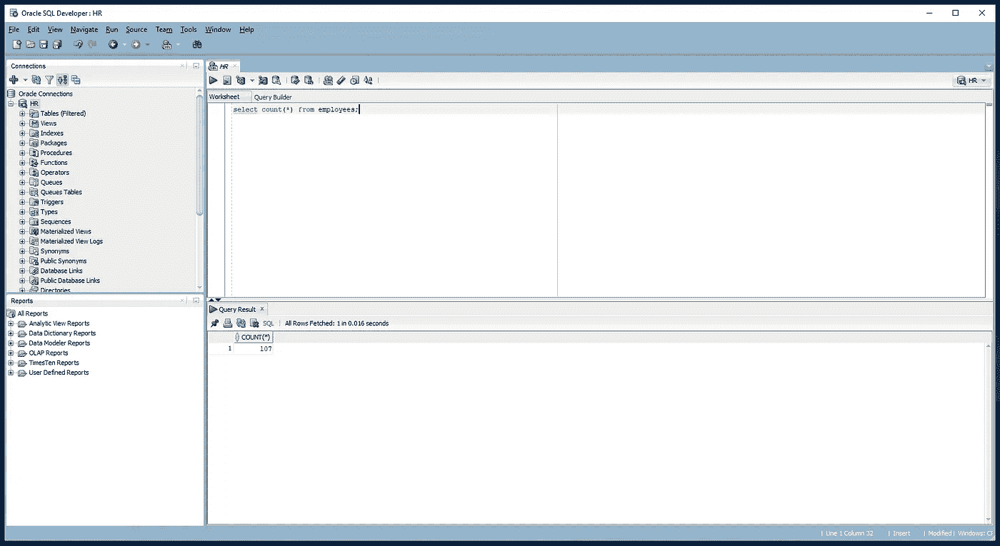

我考了 107 分——成功了。


# 计算机重新启动后启动数据库

最后一个注意事项—如果您重新启动计算机，您需要按照下面的步骤让您的数据库重新启动并运行。首先，用下面的命令启动监听器。

```
lsnrctl start
```

我们现在需要重新登录到 SQL Plus。使用下面的命令重新登录到 SQL Plus。

```
sqlplus "/ AS SYSDBA"
```

运行此命令启动数据库。

```
STARTUP;
```

如果容器数据库尚未打开，请运行以下命令打开它。注意:这段代码的“保存状态”部分将使您不必在每次计算机重新启动时打开可插拔数据库。

```
ALTER PLUGGABLE DATABASE ALL OPEN; 
ALTER PLUGGABLE DATABASE ALL SAVE STATE;
```

如果您尚未连接到 ORCLPDB，请运行下面的命令连接到它。

```
ALTER SESSION SET container=ORCLPDB;
```

享受您的数据库。

