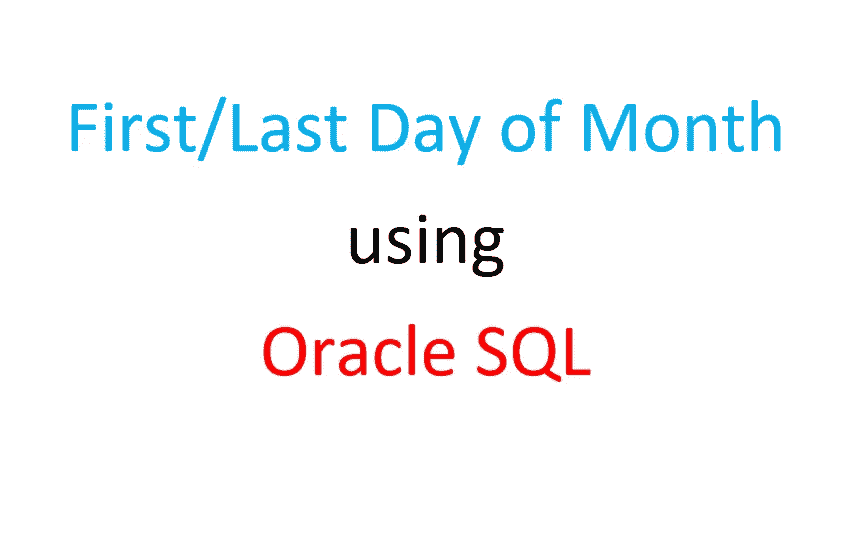

# Oracle SQL:如何获取一个月的第一天和最后一天

> 原文：<https://medium.com/geekculture/oracle-sql-how-to-get-the-first-and-last-day-of-a-month-a19f5ae8220f?source=collection_archive---------8----------------------->

## 简单的参数化例子，外加一个有趣的例子。

我使用的是 Oracle SQL，我需要获得某个月的第一个**日期**和最后一个**日期**，作为参数提供。如果您有同样的问题，这可能会有所帮助。

首先，我将向您展示一个使用今天日期的简单示例，然后我将向您展示如何…