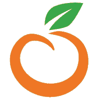
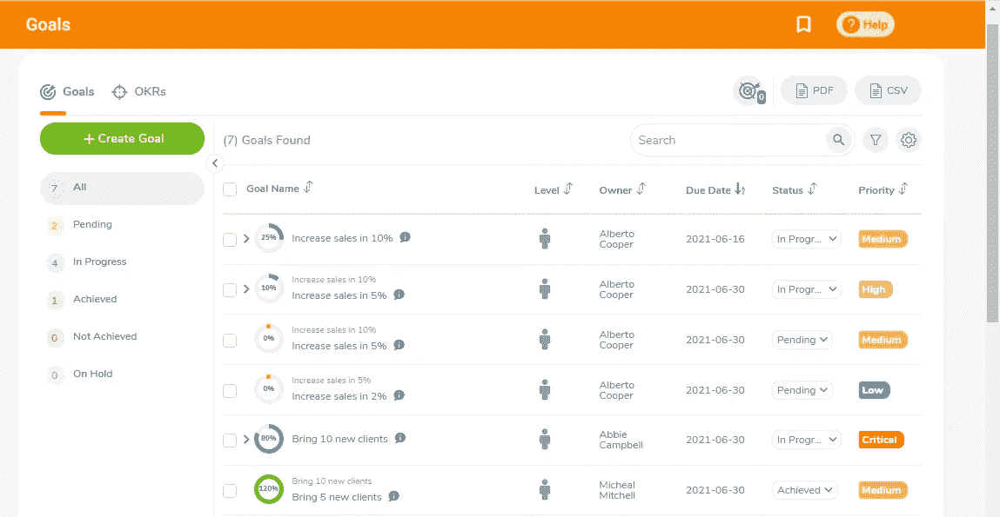
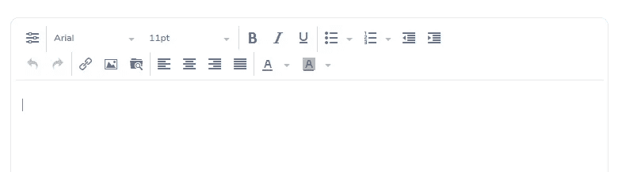
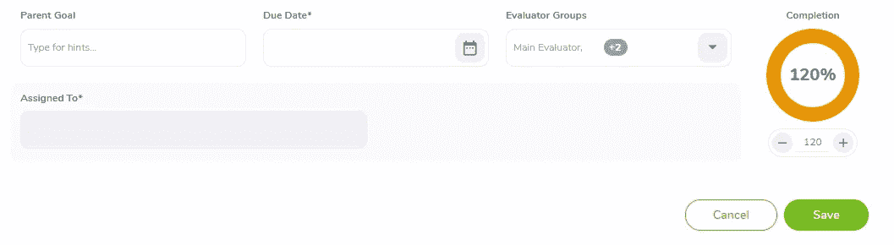
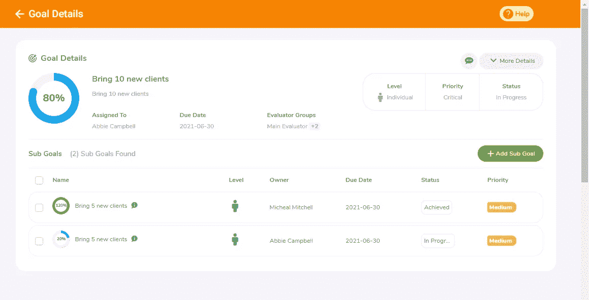
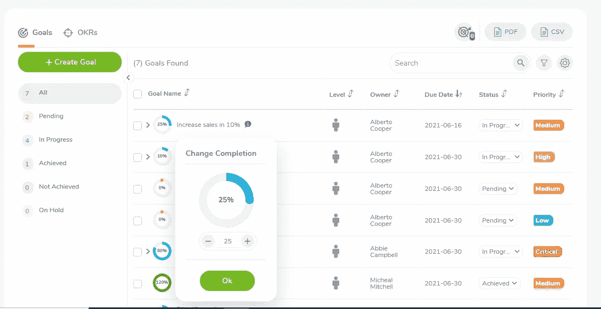
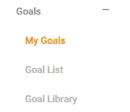
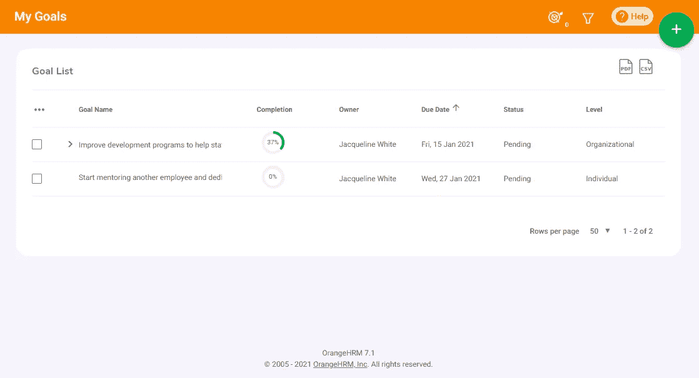

# OrangeHRM 绩效目标功能

> 原文：<https://medium.com/geekculture/orangehrm-performance-goal-feature-98e75ebaaacf?source=collection_archive---------20----------------------->

OrangeHRM Logo

OrangeHRM Inc .是一家计算机软件公司，由知名人士 Sujee Saparamadu 先生于 2005 年创立。该公司主要致力于提供 HRIS 软件解决方案，以使您的日常人力资源活动更加高效和有效。OrangeHRM 是一家总部设在美国的公司，大约有 150 多名员工为该公司工作。最近，OrangeHRM 将其主要产品重新命名为 OrangeHRM Advanced 和 OrangeHRM Starter，这之前被称为 OrangeHRM Enterprise & OrangeHRM 开源。

现在让我们进入主要焦点。在本文中，我将主要关注他们的企业版——性能目标特性，现在称为高级。因此，现在让我们进入他们的绩效目标功能，这对于正在寻找 HRIS 解决方案来顺利开展人力资源活动的公司来说非常有帮助。

OrangeHRM 绩效目标功能有助于公司在这种新冠肺炎情况下顺利监控员工目标，因为远程工作鼓励员工在家工作，而不是待在办公室。由于大多数员工现在在家工作，他们的主管很难远程监控他们团队成员的表现。因此，OrangeHRM 绩效目标功能对于正在寻找远程员工绩效监控功能的公司来说非常有用。

世界上有如此多的 HRIS 软件公司提供这项功能。但是为什么我要专门写 OrangeHRM 呢？现在让我们看看..为什么 OrangeHRM 的绩效目标与其他 HRIS 软件相比如此特别。

# 绩效目标用户界面

Image — 1

OrangeHRM 目标功能在绩效模块下可见。在“性能模块”下拉列表中，有三个主要部分。它们是，

1.  目标
2.  员工跟踪器
3.  估价

如果你看看他们的业绩目标功能，你会发现它真的很有吸引力，主要是因为他们使用的颜色。正如你所看到的，任何人使用它都非常方便，即使是一个新生也很容易理解如何将他们的目标添加到这个列表中。基本上，他们对所有的目标都有一个很好的展示，包括待定、进行中、存档、未存档和暂停。此功能还根据目标的级别(个人)、所有者、到期日、优先级及其状态对目标进行分类。如果您查看他们用于目标优先级的色调，您将能够看到最重要的色调为红色，最不重要的色调为绿色。此外，如果你的目标是中级重要，它将是黄色。就像交通灯的颜色一样。看起来很吸引人，对吧？太好了！。现在让我们潜入更深的地方。

Image — 2

OrangeHRM 的绩效目标名称支持 500 个字符。这意味着你可以根据自己的便利来宽泛地定义你的目标。

Toggle Toolbar

OrangeHRM 绩效目标功能的切换工具栏可根据您的要求，帮助您添加图像、插入链接、编辑图像、添加数字、项目符号和更改标题。此外，有一个巨大的空间，可以帮助你大致确定你的目标

在此功能中，主管或主要评估者能够以员工的名义为其指定特定目标。这个功能最大的好处是，你可以添加高达 120%的完成度。想象一下，你已经超额完成了某些目标。那么很明显它会超过 100%。

Image — 2

Image — 3

用户还可以根据完成的数量编辑他们的目标，只需单击加号图标即可。此外，这有助于用户在主目标下添加子目标。评估者和主管可以将员工目标导出为 PDF 或 CSV 格式，以便顺利运行员工评估流程，并按时为员工提供必要的加薪和晋升。

7.1 Version ( Old )

7.2 Version (New )

该公司还减少了目标下的子部分，其中目标部分下的内容现在在目标子部分下。现在处理起来真的很方便，不用从一个标签转到另一个标签。

# 7.1 发布的用户界面与 7.2 新发布的“目标”用户界面

7\. 2.1 Release ( New )

7\. 1 Release ( Old )

他们还有“自动目标到期日电子邮件提醒”功能，这是一种自动电子邮件提醒，可帮助您在目标到期日发出提醒。这个提醒非常有用，可以提醒员工盘子里还有什么未完成的事情。员工还可以从目标列表中快速更新目标进度和状态，这对于员工处理相关目标非常方便。

## 整篇文章简而言之…

# **orange HRM 7.2 版本在“绩效目标”特性上有什么新功能？**

*   允许用户标记超过 100%的目标进度
*   批量批准目标列表中的目标
*   从目标列表中快速更新目标进度和状态
*   目标和 OKR 的分类列表视图
*   增加了目标名称的大小(增加到 500 个字符)
*   允许添加关键结果的描述
*   自动目标到期日电子邮件提醒
*   为目标添加优先级
*   在视图目标内显示子目标
*   允许从编辑目标屏幕添加/编辑/删除子目标
*   添加新的目标状态:暂停和未实现

听起来很有趣？对他们的新用户界面和目标功能印象深刻？立即登录并预订演示【https://www.orangehrm.com T2