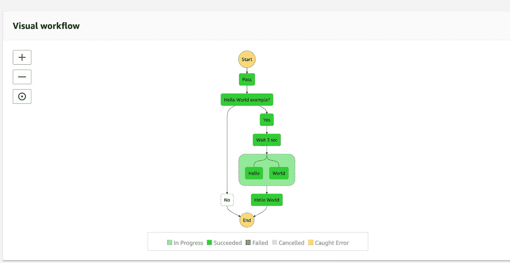

# 使用 AWS 步骤功能协调多个微/无服务器服务

> 原文：<https://medium.com/geekculture/orchestrate-multiple-micro-serverless-services-using-aws-step-function-f76289933560?source=collection_archive---------11----------------------->

AWS Step Function Illustration

像 AWS Lambda 这样的无服务器功能很棒。它们是模块化的、事件驱动的，无需配置或管理服务器就能很好地扩展。但是，在现实世界中，您更可能想要执行一系列函数，或者并行运行它们，或者重试某些失败的函数，等等。以生成您需要的最终结果。