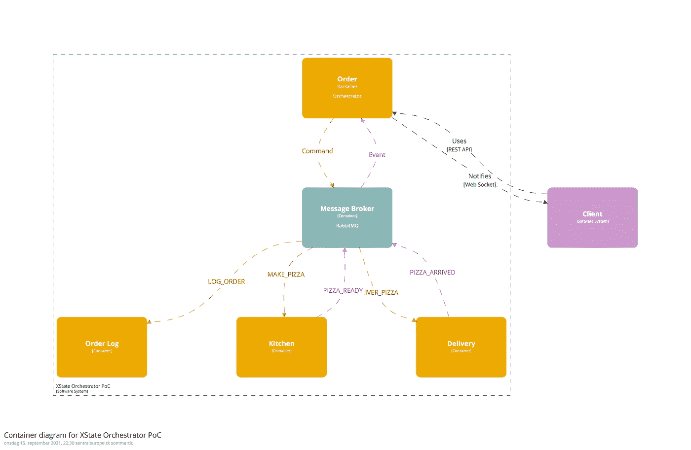
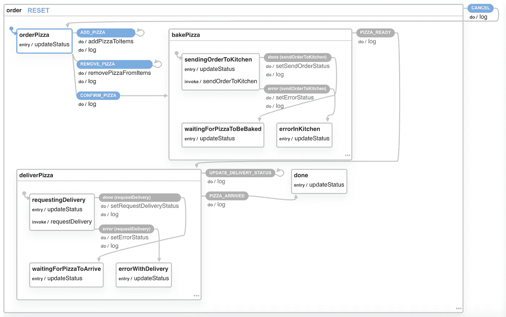

# 从无服务器编排无服务器

> 原文：<https://medium.com/geekculture/orchestrating-serverless-from-serverless-bcdb751ddd6c?source=collection_archive---------7----------------------->

## 将 XState 和持久对象用于 Cloudflare Workers



Diagram of the PoC

如今，无服务器是一个令人兴奋的领域。来自大、中、小企业的竞争非常激烈，这使得它成为各种应用和架构中的一个有趣的选择。但是在一个连贯的流程中管理许多较小的功能会带来一些挑战。在这里，我展示了一个我做的 PoC，关于如何用一个无服务器功能实现编排*模式来管理其他无服务器功能的流程。我使用* [*XState*](https://xstate.js.org/) *来管理流，使用* [*Cloudflare 持久对象*](https://developers.cloudflare.com/workers/learning/using-durable-objects) *来保持调用之间的状态。RabbitMQ 用作消息代理。*

*编排*通常与*编排*一起被提及，是管理微服务流程的主要架构模式之一。编排是设计好的服务流获取其他服务的姿态，而编排是不同服务之间的精心指导，创建一个整体。这两者都与 [*传奇模式*](https://microservices.io/patterns/data/saga.html) 一起被提及，作为在微服务架构中保持服务间事务完整性的一种方式。我不会在这里详细介绍，但是假设您对这个主题比较熟悉。如果没有，有很多东西值得一读。我自己，我喜欢 Burning Monk 关于何时选择编排或编排的经验法则([https://theburningmonk . com/2020/08/Choreography-vs-Orchestration-in-the-land-of-server less/](https://theburningmonk.com/2020/08/choreography-vs-orchestration-in-the-land-of-serverless/))，以及 Kislay 维尔马关于编排和工作流模式的文章([https://kislayverma . com/software-architecture/architecture-pattern-Orchestration-via-workflows/](https://kislayverma.com/software-architecture/architecture-pattern-orchestration-via-workflows/))。

当然，也可以使用 AWS Step 函数、Azure Durable 函数或第三方托管服务(如 Camunda 或 Temporal.io)来完成编排。因此，正如我在这里描述的那样，有一些自行开发的变体可供选择，但这有什么意思呢？此外，这些选项可能非常昂贵，或者会将您锁定在主要的云平台上。同样重要的是，进行这个 PoC 的一个明显的结果是，我怀疑在这个上下文中使用 XState 可能与使用上面的替代方法没有太大的不同(例如，参见[https://AWS . Amazon . com/blogs/compute/building-a-server less-distributed-application-using-a-saga-orchestration-pattern/](https://aws.amazon.com/blogs/compute/building-a-serverless-distributed-application-using-a-saga-orchestration-pattern/))。

# 警告

这是一个概念验证，所以我没有为一个健壮的实现所需要的数据验证、错误处理等而烦恼。响应也不是适当的 API 响应，而只是原始数据。

# 使用案例和设置

假设的用例是基于水果的比萨饼店*热带比萨饼*在早期的如何做简单的微前端原型中出名😉(【https://itnext.io/prototyping-micro-frontends-d03397c5f770】)。这些微前端取得了巨大的成功，所以现在后端也需要现代化，以满足不断增长的业务需求。当然，这意味着无服务器、消息代理和所有热门的东西😁

所以你可以点一份有菠萝、香蕉等一切多汁美味的比萨，并让它安全地送到你家。基本的 PoC 架构类似于上图:一个编排服务(*订单*)管理“购物车”和相关服务(*厨房*，*送货*)，这是获得卓越披萨体验流程的一部分。此外，一些基本的可观察性日志。PoC 中的客户端只是使用邮递员或类似的人，*订单日志*、*厨房*和*送货*是存根，只是确认和移动物流。所以我将重点介绍*订单*和*消息代理*。

*订单*编制器包括:

*   一个*无服务器功能* (Cloudflare Worker)，将来自*客户端*或*消息代理*的请求转换为可能触发状态机转换的事件。
*   一个*状态机*，作用于事件，并可能基于转换和状态变化触发动作和消息。
*   以及用于在调用之间持久保存状态和工作流数据的持久对象

您通过将第一个比萨饼发送到一个基本端点(我使用 [itty 路由器](https://www.npmjs.com/package/itty-router))来创建一个比萨饼订单:

```
router.post('/', auth, async (request, env) => {
    const eventRequest = new Request('ADD_PIZZA', {
        body: request.body,
        method: request.method,
    });
    const orderId = env.ORDER.newUniqueId();
    const order = env.ORDER.get(orderId);
    const response = await order.fetch(eventRequest);
    return response;
});
```

之后，可以通过引用创建的订单 id 将披萨添加到订单中:

```
router.post('/:id', auth, checkValidOrderId, async (request, env) => {
    const orderId = env.ORDER.idFromString(request.params.id);
    const order = env.ORDER.get(orderId);
    const eventRequest = new Request('ADD_PIZZA', {
        body: request.body,
        method: 'POST',
    });
    const response = await order.fetch(eventRequest);
    return response;
});
```

**婀。ORDER** 是一个到持久对象名称空间的绑定，该名称空间被配置为使用上传的 Javascript 类。由此我得到了一个符合该类的存根。因此，路由检查请求，将其转换为适合状态机的事件请求，并将其转发给保存订单状态机的持久对象实例。参见[https://developers . cloud flare . com/workers/runtime-API/durable-objects](https://developers.cloudflare.com/workers/runtime-apis/durable-objects)。

XState 有一个*解释器*的概念，它以处理事件、转换、动作等的服务的形式解释和管理状态机。在 PoC 中，解释后的状态机是下面的 **orderService** ，它基于我制作的一个自定义解释器，该解释器比库附带的标准解释器更适合无服务器场景。因此，当持久对象获得 **ADD_PIZZA** 事件时，它会经历如下过程:

```
//Process request and get the event type
const type = new URL(request.url).pathname.substr(1);//Get data from event/request
const data = await request.json();//Process the transition and run associated actions based on the event type and -data
const newState = await orderService.send({ type, data });//Update statemachine context with some workflow data
const newContext = { ...newState.context, nextEvents: newState.nextEvents, currentState: newState.value };//Store it in the storage of the Durable Object
await storage.put(newContext);//Create response based on the updated context
const strContext = JSON.stringify(newContext)return new Response(strContext, {
    status: 201,
    headers: {
        "content-type": "application/json;charset=UTF-8"
    }
});
```

对于状态机，区分离散状态和连续状态是很有用的。例如:对于交通灯，红、黄、绿将是交通灯的离散状态，而灯在一天中切换多少次，可以是交通灯的连续状态的一部分。在 XState 中，连续状态作为状态机的*上下文*来处理，它总是可用于动作等。因此，正是这个上下文被持久化在持久对象中，并保存有问题的比萨饼订单的数据。

所以神奇的事情发生在 **orderService** 中，它接收一个事件并根据状态机返回一个带有更新上下文的状态。PoC 中的状态机可以通过以下直接从代码生成的状态图来可视化:



Statechart with the service flow visualized from the xstate code.

状态图有一个带有不同转换的 **orderPizza** 状态，如 **ADD_PIZZA** :

```
states: {
    orderPizza: {
        entry: ['updateStatus'],
        meta: {
            message: 'Oh, just ordering some pizza...',
        },
        on: {
            ADD_PIZZA: {
                target: 'orderPizza',
                actions: ['addPizzaToItems', 'log'],
            },
            REMOVE_PIZZA: {
                target: 'orderPizza',
                actions: ['removePizzaFromItems', 'log'],
            },
            CONFIRM_PIZZA: {
                target: 'bakePizza',
                actions: ['log'],
            },
        },
    },
```

可以在条目上调用动作( **updateStatus** )，或者作为转换的一部分调用动作( **addPizzaToItems** 、 **log** )。 **ADD_PIZZA** 转换的目标是同一个状态。即使不改变状态，我也发现将改变作为转换来处理是有用的，而不是直接的 CRUD 式的操作，因为它让我对属于一起并且与不同状态相关的改变进行建模和封装。**例如，addPizzaToItems** 将仅在状态为 **orderPizza** 时被调用。

因此 **ADD_PIZZA** 事件触发了 **addPizzaToItems** 动作:

```
addPizzaToItems: assign({
    items: (context, event) => context.items.concat(event.data.pizza),
}),
```

assign-method 是一个 XState action-creator，允许您操纵上下文。在这里，我只是将比萨饼添加到订单的 items-array 中。

当顾客对她选择的比萨饼感到满意时，她将确认并触发 **CONFIRM_PIZZA** 事件，这将再次触发到 **bakePizza** 状态的转换:

```
bakePizza: {
    initial: 'sendingOrderToKitchen',
    states: {
        sendingOrderToKitchen: {
            entry: ['updateStatus'],
            meta: {
                message: 'Sending the order for the pizza...',
            },
            invoke: {
                id: 'sendOrderToKitchen',
                src: 'orderPizzaFromKitchen',
                onDone: {
                    target: 'waitingForPizzaToBeBaked',
                    actions: ['setSendOrderStatus', 'log']
                },
                onError: {
                    target: 'errorInKitchen',
                    actions: ['setErrorStatus', 'log'],
                },
            }
        },
        waitingForPizzaToBeBaked: {
            entry: ['updateStatus'],
            meta: {
                message: 'Waiting for the pizza to be baked...',
            },
        },
        errorInKitchen: {
            entry: ['updateStatus'],
            meta: {
                message: 'Ooops! Something got burned...',
            },
        },
    },
    on: {
        PIZZA_READY: {
            target: 'deliverPizza',
            actions: ['log'],
        },
    },
}, 
```

这种状态更复杂，有三个嵌套的子状态:

*sendingOrderToKitchen* :通过调用 XState 定义的 [*可调用服务*](https://xstate.js.org/docs/guides/communication.html#the-invoke-property) 将订单发送到厨房的默认服务。如果调用 **sendOrderToKitchen** 成功，那么状态机转换到

*waitingforpizzoteborked*:这里它只是等待 **PIZZA_READY** 事件。但是如果 **sendOrderToKitchen** 不成功，状态机转换到

*errorInKitchen* :这是一种错误状态，可以作为错误处理的起点——错误处理不作为此 PoC 的一部分实施。

# 消息/事件代理

**sendOrderToKitchen** 和随后的 **PIZZA_READY** 事件被绑定到 PoC 的消息代理部分。有时您会看到编排和编排之间的区别取决于前者依赖于同步调用，而后者依赖于事件/消息传递。但是更准确地说，第一种通常是基于请求/响应模式( **MAKE_PIZZA** ， **PIZZA_READY** )，这种模式既可以使用 REST-API(我知道严格来说 REST 调用是异步的，但是在这种情况下，它会阻塞流，直到它获得响应并同步动作)，也可以使用消息代理来异步实现。异步执行的好处是，它为长时间运行的工作流和手动步骤的工作流打开了大门。但是，当然，如果有帮助的话，可以混合使用。

PoC 中的消息代理基于 RabbitMC (CloudAMPQ)。实际上，PoC 依赖于使用 RabbitMQ 的 REST-API 发送消息，同样依赖于 webhooks 从 RabbitMQ 接收消息。在 PoC 中，链接到**sendOrderToKitchen**-服务的方法代码是这样定义的:

```
const orderPizzaFromKitchen = async (context, event) => {
    const mqEvent = createMQEvent(mqTypes.MAKE_PIZZA, context.orderId, context.items, true);
    return await postEvent(mqEvent, env)
}
```

**createMQEvent** 助手函数基于来自状态机上下文的数据创建一个格式正确的消息(我基于[https://cloudevents.io/](https://cloudevents.io/))。 **MAKE_PIZZA** 类型确保它在被发送到 CloudAMPQ 上我的 RabbitMQ 实例的 exchange-endpoint 之后到达正确的队列。然后，该队列的 webhook 将把它委托给合适的服务(PoC 图中的*厨房*)。如果一切顺利，那么状态机转换到**waitingForPizzaToBeBaked**。

在概念验证中，*厨房*服务只是一个非常简单的无服务器服务，让我将事件存储在一个持久对象中。它还提供了一个端点，让我检查是否有订单正在处理，然后为队列中的下一个订单发出一个 **PIZZA_READY** 事件。然后，我在 RabbitMQ 实例上为 **PIZZA_READY** 队列创建了另一个 webhook，它命中了 *Order* orchestrator 上的事件端点:

```
router.post('/event', mqCheck, async (request, env) => {
    const message = await request.json();
    const orderid = env.ORDER.idFromString(message.subject);
    const order = env.ORDER.get(orderid);
    const data = JSON.stringify(message.data); const eventRequest = new Request(`${message.type}`, {
        body: data,
        method: 'POST',
    })
    const response = await order.fetch(eventRequest);
    return response;
});
```

这个端点将 RabbitMQ 中的事件转换成持久对象上的状态机可以解释的东西。有了 **PIZZA_READY** 事件，它现在将转换到 **deliverPizza** 状态，其设置方式与 **bakePizza、**和相同，这将触发类似的流程。它发送一个对 **DELIVER_PIZZA** 的请求，当它稍后接收到 **PIZZA_DELIVERED** 时，它转换为 done，披萨订单完成。

# 使用 websocket 与客户端连接

在工作流程的任何时候，客户都可以从*订单*编制器轮询订单状态。在 PoC 中，它只是序列化当前上下文:

```
if (type === 'GET_ORDER') {
    return new Response(JSON.stringify(currentContext), {
        status: 201,
        headers: {
            "Content-Type": "application/json;charset=UTF-8",
        }
    });
}
```

但是既然 Cloudflare Workers 和 Postman 现在都支持 websockets，我想我也应该试着添加和测试一下。这意味着让持久对象处理在对象上注册套接字并返回套接字客户端的特殊事件:

```
if (type.indexOf('websocket') !== -1) {//Request is for websocket
    const [client, server] = Object.values(new WebSocketPair())
    server.accept()
    this.sockets.push(server);
    return new Response(null, {
        status: 101,
        webSocket: client
    })
}
```

因此，在返回常规响应之前，持久对象可以向 websocket 客户端广播相同的数据:

```
//Create response based on the updated context
const strContext = JSON.stringify(newContext)//Broadcast state changes on registered sockets
this.sockets = this.sockets.filter(socket => {
    try {
        socket.send(strContext);
        return true;
    } catch (err) {
        // Whoops, this connection is dead. Remove it from the list.
        return false;
    }
});return new Response(strContext, {
    status: 201,
    headers: {
        "content-type": "application/json;charset=UTF-8"
    }
});
```

这意味着当消息代理触及事件端点并触发转换/状态变化时，这种变化将立即广播给监听客户端——这非常酷！

# 结束语

使用 XState 在无服务器上进行编排是一种积极的体验。它并没有为此进行优化，但仍然有很多相关的功能，并且设置非常简单。它有一个灵活的方法来平衡配置和代码，你可以很容易地得到可视化的状态图。我必须制作一个自定义解释器，以便更容易地对操作和服务使用 await/async，所以我希望这可以成为 XState 未来迭代的一部分。但是这也不是一个真正的问题，因为 XState 提供了更“低级”的 API。

这里我没有演示 Saga 模式，但是使用 XState 处理 Saga 应该不难。至少不会比使用替代品更困难。状态图可以很快变得非常复杂，但这是自然的，不一定是由于实现细节。

必须依赖 REST-API 和 Webhooks 进行消息代理可能会排除一些基于性能的用例。或许有可能使用 websockets 来建立一些东西，所以这可能是一个未来的实验。但是有一种“本地”的方式将无服务器与消息传递和队列集成在一起，对于能够提供这种方式的平台来说是一个巨大的卖点。