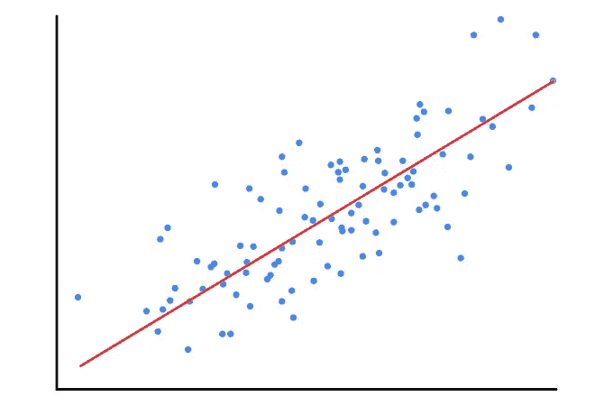
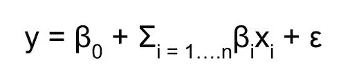
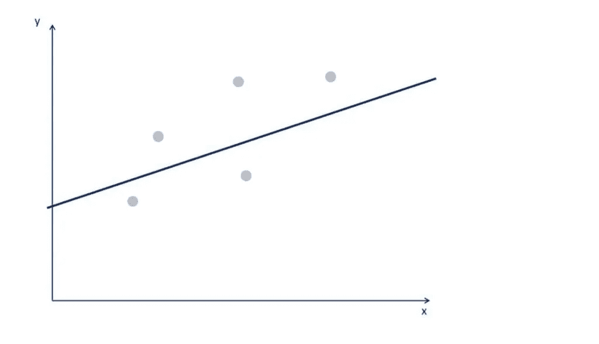
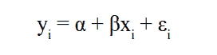
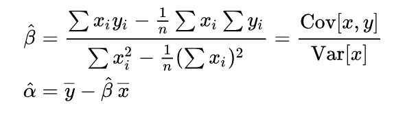
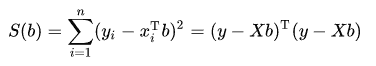
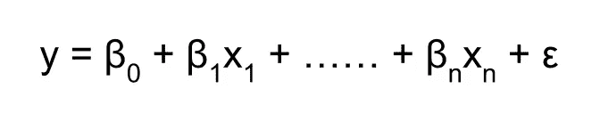
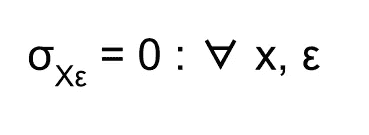
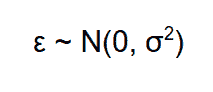
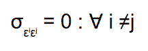

# 普通最小二乘回归

> 原文：<https://medium.com/geekculture/ordinary-least-squares-regression-41f40400a58d?source=collection_archive---------6----------------------->

> 本文是[线性回归的一部分，概括地说就是](https://arunaddagatla.medium.com/linear-regression-in-a-nutshell-1714d5665fd2)

普通最小二乘回归(OLS)通常称为线性回归算法，是一种用于估计线性回归模型中未知参数的线性最小二乘法。

在具有“n”个解释变量的模型的情况下，OLS 回归方程给出为:

在哪里，

*   y 是因变量
*   β₀是模型的截距
*   xᵢ对应于模型的 iᵗʰ解释变量
*   ε是均值和方差均为零的随机误差σ

在 OLS，最小平方代表最小平方误差或 SSE(误差平方和)。

> 模型的误差越小，解释力越强。

因此，该方法旨在找到使误差平方和最小的线。

我们可以找到许多符合数据的直线，但 OLS 会确定误差最小的直线。

*从图形上看，它是同时最接近所有点的一个*

这种系统通常没有精确解，因此目标是找到“最佳”拟合方程的系数β。

***简单线性回归***

对于简单的线性回归模型，计算简单。考虑简单线性回归方程:

Equation of simple linear regression

为了计算α和β的值，OLS 使用以下等式来最小化误差项:

***多元线性回归***

对于多元线性回归，计算变得有点复杂。由于在多元回归中有两个以上的维度，我们用高维超平面来表示它们。

这是一个最小化问题，我们将利用微积分和线性代数来确定直线的斜率和截距。

*用于查找最佳拟合线的表达式为:*

*其中，*

*   *T 表示矩阵转置*
*   *X 表示与因变量特定值相关的所有自变量的值，Xᵢ = xᵢᵗ*
*   y 表示因变量
*   使这个误差平方和最小的 b 值称为β的 OLS 估计量。

假设 *b* 是 *β* 的“候选”值。量(*y*ᵢ*x*ᵢᵗ*b)*，称为**残差**用于 *i* ᵗʰ观测，测量数据点( *x* ᵢ， *y* ᵢ)与超平面*y*=*x*ᵗ*b*之间的垂直距离，以及

> 观测值的**残差**是感兴趣的量的观测值和*估计值*之间的差。

我们可以尝试在纸上最小化误差的平方和，但对于更大的数据集，这几乎是不可能的。

如今，回归分析是通过软件和编程语言如 SAS、Excel、Python 和 r。

确定回归线还有其他方法。在不同的上下文中，它们通常是首选的。

*其中有:*

*   *广义最小二乘法*
*   *最大似然估计*
*   *贝叶斯回归*
*   *内核回归*
*   *高斯过程回归*

然而，对于大多数线性问题，OLS 仍然足够强大。

## OLS 假设

在进行回归分析之前，有五个不同的 OLS 假设需要考虑。

1.  **线性度**
2.  **无内生性**
3.  正态性和同方差性
4.  **无自相关**
5.  **无多重共线性**

## 线性

线性回归假设线性。每个独立变量乘以一个系数，然后求和来预测值。线性回归是最简单的非平凡关系。因为方程是线性的，所以称之为线性的。

> 线性意味着因变量和自变量之间必须有线性关系。

***检查线性度***

一种方法是将自变量与因变量进行散点图。如果数据来自看起来像直线的模式，那么线性回归模型是合适的。

***修正线性***

*   运行非线性回归
*   指数变换
*   对数变换

## 没有内生性

它指的是禁止自变量和误差之间的联系。

***数学上表示为:***

在这种情况下，误差项与观测值和预测值之差的总和与独立变量相关。这个问题被称为 ***省略变量偏差*** 。

当相关变量不包括在分析中时，省略变量偏差被引入。

> 基本上，没有被模型解释的一切都进入了错误。

所以，

*   不正确地排除一个变量会导致有偏见的和违反直觉的估计，这对回归分析是有害的。
*   一个变量的不正确包含会导致低效的估计，这种估计不会使回归产生偏差，人们可以丢弃这些变量。

***修正为内生性***

遗漏变量偏差因问题而异。它总是偷偷摸摸的，要克服它，你必须有经验和先进的知识。

## 正态性和同方差性

1. ***正态-*** 我们假设误差项是正态分布的。

***误差项不是正态分布怎么办？***

问题的解决方法是中心极限定理。

> 中心极限定理指出，如果您有一个均值为μ、标准差为σ的总体，并从替换总体中抽取足够大的随机样本，那么样本均值的分布将近似为正态分布。

这个定理使得误差项在默认情况下是正常的。

**2。*同方差****——同方差*表示方差相等。误差项应该具有彼此相等的方差。

考虑一个例子，

如果一个人很穷，那么他或她会在食物和其他住宿上花费一定数量的钱。但是一个人越富有，他的支出的可变性就越高。因此异方差是存在的。

*同方差*指变量的可变性在数值范围内不相等的情况。这主要是由于数据中存在异常值。

> 异方差中的异常值是指样本中存在的观察值相对于其他观察值而言是小的还是大的。

**异方差修正**

*   检查遗漏的可变偏差
*   寻找异常值，并尝试消除它们
*   对解释变量执行对数转换

## 无自相关

无自相关也被称为无序列相关。根据假设，误差不应该是不相关的。

***检查自相关***

*   在图上画出所有的残差，并检查模式。如果看不到模式，那么就没有自相关。
*   *德宾沃森测试* -其值在 0 到 4 之间。值为 2 表示没有自相关。低于 1 和高于 3 的值表明存在自相关

***修正为自相关***

自相关的唯一解决方案是避免使用线性回归。

> 自相关问题的一个例子是时间序列分析。

## 无多重共线性

**多重共线性**是指多元回归模型中两个以上的解释变量高度线性相关的情况。

当两个或多个变量高度相关时，我们观察到多重共线性。

考虑一个等式 a = 2 + 5 * b 的例子。

这个等式可以重新排列为 b = (a - 2) / 5。

这里，

*   “a”和“b”是两个具有精确线性组合的变量
*   因为‘b’可以用‘a’来表示，反之亦然。

包含“a”和“b”作为解释变量的模型将具有完美的多重共线性。这给我们的回归模型带来了一个大问题，因为系数会被错误地估计。

理由是，如果 a 可以用 b 来表示，那么两个都用就没有意义了，我们可以只保留其中一个。

***检查多重共线性***

*   多重共线性是一个大问题，但也是最容易注意到的问题。
*   在建立回归之前，找出两对独立变量之间的相关性。

***修复多重共线性***

*   删除两个特征中的一个
*   将两个特征转换成一个特征

*感谢阅读本文！如果你有任何问题，请在下面留言。请务必关注*[*@ arunadagatla*](https://arunaddagatla.medium.com/)*，获取关于数据科学和深度学习的最新文章通知。*

> *可以在*[***LinkedIn***](https://www.linkedin.com/in/arun-addagatla/)*[***Github***](https://github.com/arun2728)*[***Kaggle***](https://www.kaggle.com/arun2729)*上与我联系，或者通过访问*[***【Medium.com***](https://arunaddagatla.medium.com/)*。***