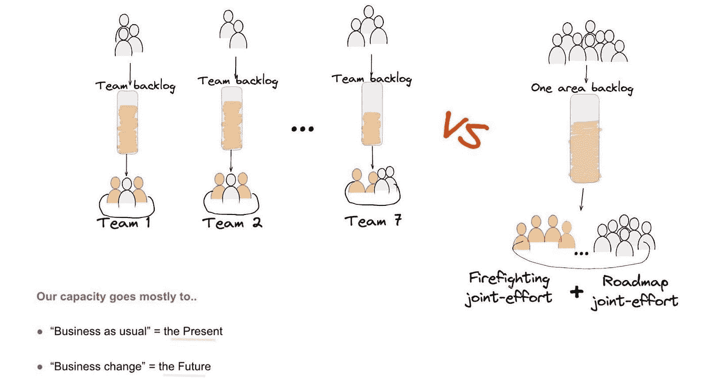
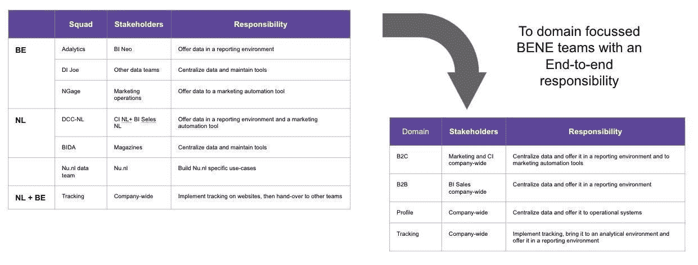
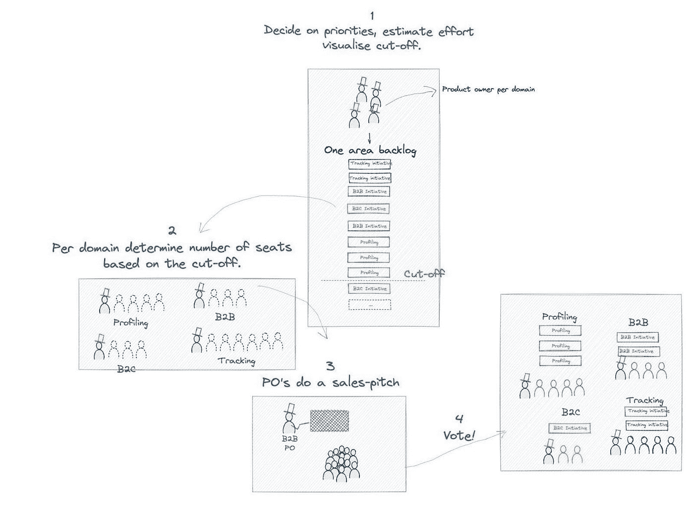
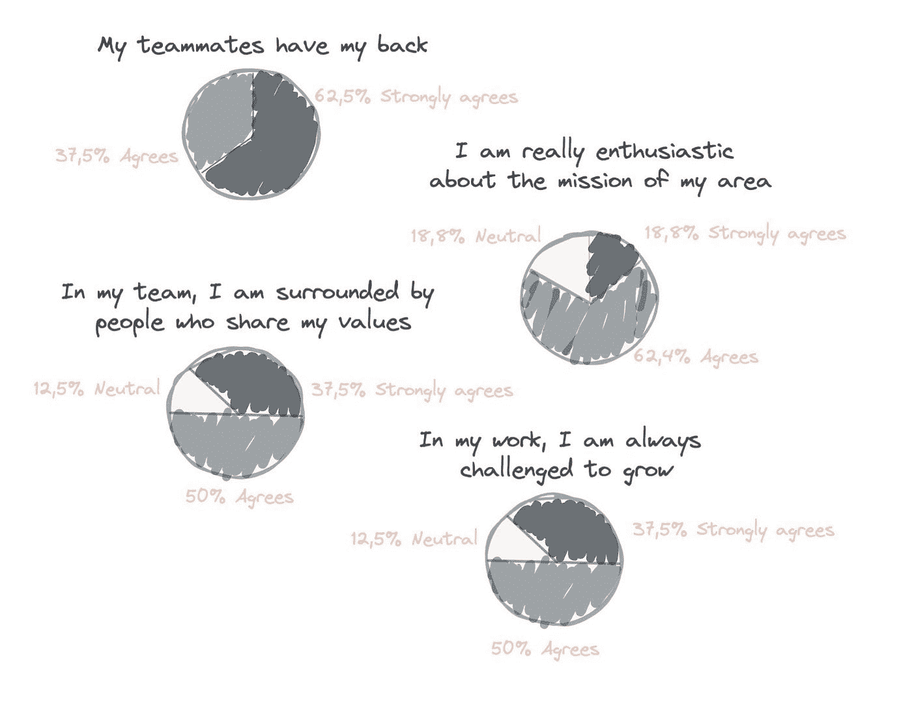

# 组织数据团队:建立一支军队并运行内部招聘会

> 原文：<https://medium.com/geekculture/organizing-data-teams-build-an-army-and-run-an-internal-job-fair-106aae79536d?source=collection_archive---------9----------------------->

## 从分散在各处的数据工程师到一个团队

*由区域经理 Filip Beslic 撰写数据*

**DPG 媒体是比利时和荷兰最大的媒体公司，在接近 2019 年底的时候，该公司开始了一项成为真正数据驱动的使命。在不到两年的时间里，我们已经超越了最初的预期，现在我们已经有了一个出色的数据工程部门。不是通过花费大量的金钱来引进新的血液，而是通过把我们分散在各处的数据工程师拼凑在一起。想知道我们是怎么做到的吗？**

# 召集所有数据专家

我们想把为 DPG 媒体工作的数据工程师聚集在一个屋檐下。可以这么说，因为他们中大约一半在阿姆斯特丹工作，另一半在比利时。一开始，他们分布在四个不同的地点，总共五个团队。

这些数据工程团队并不是一个人来的，因为他们都带来了自己的一套要求苛刻的利益相关者、背包和技术。一些人写 Python，另一些人写 Scala，他们中的大部分都不是。他们总共负责多达 103 个生产系统！大多数运行在本地的 Linux 或 Windows 服务器上，其他的运行在 AWS 云中，还有一个运行在 Azure 中。没错。我们在开始时估计，总时间的 60–70%用于灭火和维持正常业务。我们很快意识到这种情况不会很快消失。

这在一开始真的让我们很困惑，因为我们有很大的计划，但是几乎没有带宽来将它们付诸实施。

# 一群数据工程师

没有人能承担更大的项目，因为消防消耗了大部分产能。我们需要将这些分散在这些团队中的小块免费带宽粘在一起，以产生真正的影响。所以，我们选择了大部队的方式。与其让我们都打些小仗，不如让我们团结起来，在真正重要的地方发动战争。

但是我们需要重新考虑我们的小数据组织完全为了那个目的。我们需要推倒我们团队之间的非正式的墙，因为他们把我们分开了。任何结构，真的，无论是隐含的还是明确的，都必须被去除。我们想要的是某种形式的彻底合作。至少这是想法和愿景。

# 受 LeSS 的启发

但是怎么做呢？我们把目光投向了这个很少有人尝试的激进概念——有些人很快就放弃了，因为它太具侵略性了。大多数(如果不是全部的话)公司选择简单安全的方法；我们选择了较小规模或较大规模的 scrum，并为其激进的思想和简单性喝彩。但是和所有事情一样，将理论付诸实践完全是另外一回事。当公司想要改变一些事情时，他们通常意味着他们想要利用他们已经拥有的东西，稍微改变一下。

我们的利益相关者，可以说是我们存在的理由，我们的金融家，也就是我们的老板，我们没有什么不同。为什么要戏剧性地改变事情？人们通常不想和与众不同的人有任何瓜葛，当然也不想和激进分子有任何瓜葛！甚至我们新数据领域的工程师最初也不太喜欢变化。因此，通往我们目的地的旅程是漫长的，是许多步骤、尝试和失败中的一步。到达目的地的过程会让我们离题太多，所以我可能会在另一个时间讨论细节。相反，让我们专注于最后的步骤，就在我们建立一个适度润滑的机器之前，它将我们带到了今天的位置。

可悲的是，我们不能把一切都改变成我们喜欢的样子。环境和语境，现实中不允许。因此，LeSS 成了我们灵感的源泉，而不是一个框架或方法。这可能会引发一些纯粹主义者，因为在敏捷社区中，当团队没有按照预期 100%应用 Scrum 时，我们使用轻蔑的术语“ScrumBut”。有些人可能会认为这种剪裁是失败的，但老实说，它为我们带来了巨大的成果，并极大地改变了我们的工作方式——往好的方面说。

# 我们采取的第一步

由于数据在整个组织中运行，数据环境非常复杂，生产系统和沉重的运营负担都与特定的业务领域相关联。更糟糕的是，两国在处理类似问题时存在相当大的分歧和替代解决方案。结果，团队做着相似的事情，但是在边界的另一边使用不同的工具和技术。

第一步是在 B2B、B2C、跟踪和分析这四个战略领域组织我们自己。在比利时和荷兰各有一个产品负责人和一个总体战略。平台经理负责整个数据区的积压工作。尽管有国家边界，我们还是希望能够根据优先级在这些领域之间轮换数据工程师。

# 内部数据招聘会

我们想要构建的所有东西都必须放在一个大的 backlog 上，这听起来很棒，但这只是一个简单的表。然后将对那里的项目进行优先排序和评估。然后，根据总体容量，进行截止，这也隐含地确定了在给定时间给定域所需的席位数。

但通过轮换数据工程师，许多人担心维护生产系统消防工作的连续性会受到影响，因为这需要特定的领域知识，而人们无法快速获得这些知识。因此，我们最初的想法是每季度轮换一次，而不是每月一次，我们现在称之为内部招聘会。对一些人来说还是有风险的。

在每个季度开始时，产品负责人向整个数据工程部门(43 名工程师)进行推销，说服他们在下个季度加入他们的领域。选择一个领域也意味着负责该领域内的救火工作。

我们第一次招聘会的结果:

*   47%的人选择留在自己的领域
*   84%的人最终有了自己的第一选择
*   10%是开放的，所以我们让他们留在他们目前的领域
*   1 个人有第二个选择

第二次，大家都得到了第一选择。

# 绝对自由

one data area backlog 也是监控进度的唯一工具。尽管产品负责人通常有他们单独的待办事项，他们和他们的工程师将那些较大的待办事项分解成较小的、更容易理解的部分。

一些领域的故事点他们的工作；其他人没有。事实上，这些短命的领域团队有绝对的自由来组织自己。他们很少被监视和控制，而是被信任、授权和启用。

许多人使用 Scrum，其他人使用看板？就我们所关心的而言，他们使用 Prince2 唯一重要的是他们应该处理的数据区域积压工作。他们确实需要参加两周一次的业务演示，即使他们不喜欢在 sprints 中工作。对于其他一切:大量的自由。可能有点激进，但结果是惊人的！值得注意的是，通过轮换，我们最终会产生交叉污染，并最终形成一种不断发展的工作方式。

# 那么，它给我们带来了什么？

通过给予人们信任，花在监控和微观管理团队上的时间就少了。因此，有更多的时间来做事情，推动整个地区向前发展——可以说是重心的转移。

我们希望通过给人们自由和选择他们将从事的项目，这反过来会激发他们的动力、主人翁意识并提供更大的目标感。

但是，我们非常清楚地意识到，在我们的领域内，团队的概念越来越小，会带来风险和潜在的问题。我们希望人们能感受到更大的数据区域团队的一部分。因此，基于陈述团队重要性的书“[关于工作的九个谎言](https://www.amazon.com/Nine-Lies-about-Work-Freethinking-ebook/dp/B07C3ZT28C)”，我们决定在每个季度的某个时候，我们必须做一个小调查来精确地监控。一些结果:

令人震惊的是，那些以前没有一起工作过并且经常住在边界另一边的人感觉自己是一个团队的一部分，声称他们的队友支持他们！人们最初的怀疑很快就消失了。即使是那些不喜欢轮换的人也承认，每次都感觉像是一股新风吹进了他们的领域，带来了新面孔和其他关于如何做他们正在做的事情的聪明想法和观点。招聘会很快也成为了景观更加协调和简化的驱动力。然而，我们不得不承认，通过使我们比以前走得更快，这也带来了成长痛苦的代价，有时表现为遗产的增加。

但从积极的方面来看，我们后来发现招聘会也给人们提供了一条出路。在他们不开心或沮丧的领域之外。所以偶尔会有人离开一个域名，幸好不是公司！招聘会使我们能够识别遗留问题、大量消防工作或其他潜在问题。更重要的是，它现在也为质疑现状提供了必要的论据，同时也提供了从结构上改变现状的机会。

# 行动自由

同样，这条道路是许多尝试和失败中的一个，极端的实用主义引领我们走向成功。还有一个问题是太多的自由，在这种情况下，更直接的方法有时会更好。但是话又说回来，当有机会的时候，人们会承担多少责任，完全出乎你的意料。给予人们自由也教会了我们，不是每件事都必须做得完美。这是一个平衡的行为，但是首先要放手去找到正确的平衡。

一开始，在招聘会举行之前，人们会留在自己的团队中——无论如何——因为他们更喜欢自己熟悉的环境。此外，调动对某个领域、其工具、技术和生产系统非常了解的人似乎是不可取的。因此，根据不断变化的优先事项，扩大或缩小规模几乎是不可能的。招聘会带来了更多积极和快乐的人，领域之间的交叉污染，并给了我们巨大的灵活性来应对不断变化的环境。有了它，我们可以在需要的时候扩大规模，产生影响。

在这样一个可以选择项目的地方工作，你会有动力吗？在一个四分之一的时间在写 Python 而另一部分时间在写 Scala 的环境中，你会受到挑战吗？先学红移的来龙去脉再学[雪花](https://levelup.gitconnected.com/data-mesh-a-self-service-infrastructure-at-dpg-media-with-snowflake-566f108a98db)怎么样？

如果这看起来对你来说是一个有趣的环境，数据区总是热衷于结识新朋友！在[比利时](https://www.werkenbij.dpgmedia.be/nl/vacatures)或[荷兰](https://vacatures.dpgmedia.nl/)寻找工作机会。