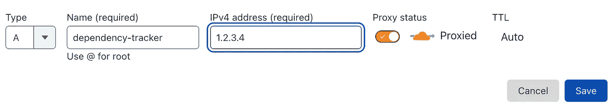
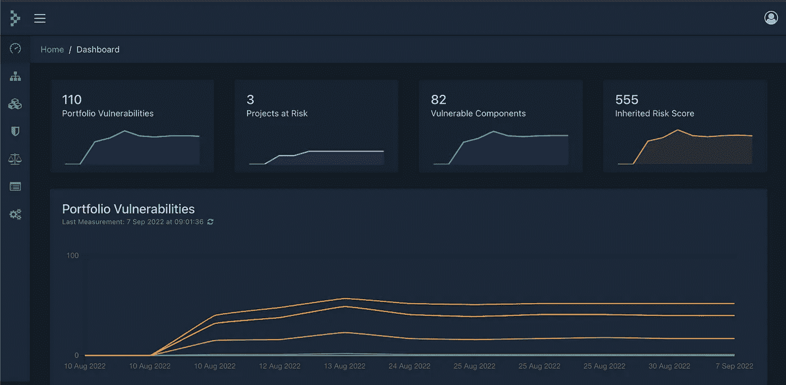
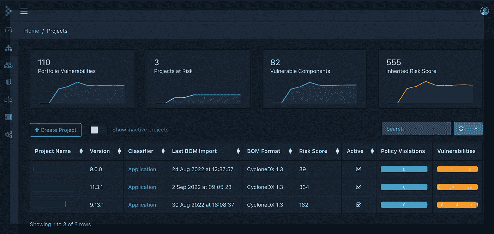
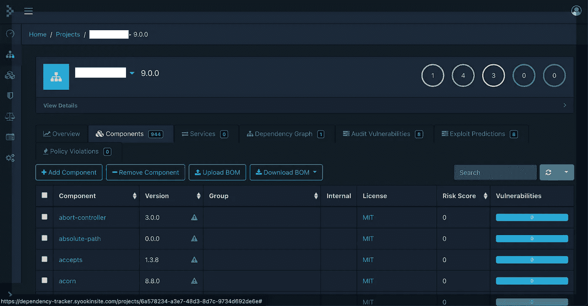
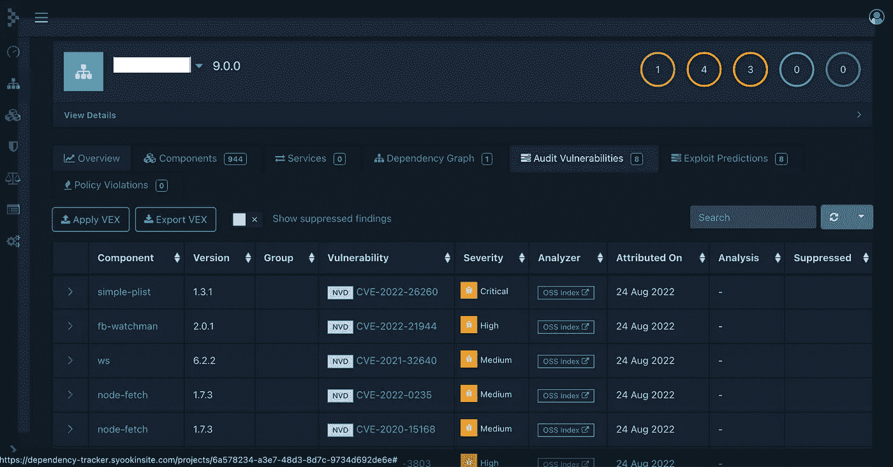
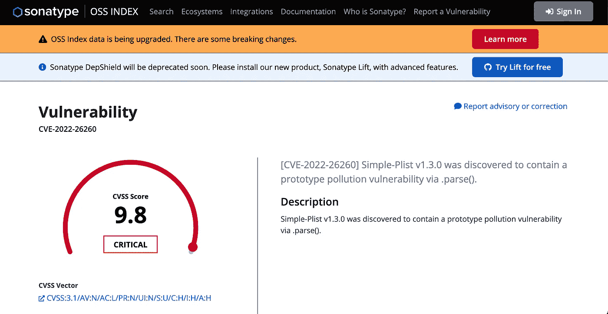
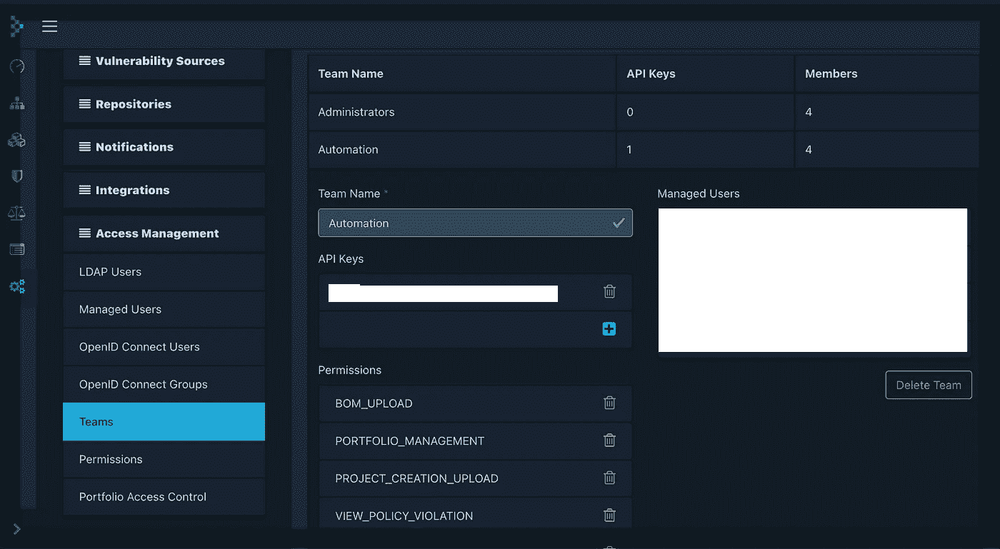

# SBoM 中的 OSS 漏洞检测，带有用于 JS 应用程序的 CI/CD

> 原文：<https://medium.com/geekculture/oss-vulnerability-detection-from-sbom-with-ci-cd-for-js-applications-4edcdfba499d?source=collection_archive---------7----------------------->


[image source](https://static.vecteezy.com/system/resources/previews/000/607/791/original/internet-security-modern-concept-vector.jpg)

开放源码软件(OSS)开创了现代应用程序开发的新时代，推出了一套全新的软件产品，这在以前是不可能的。现代应用程序的软件组合已经变得复杂，并且经常涉及大量开源软件。人们可以利用大量的 OSS 软件包，用必要的业务逻辑快速组合新的软件应用程序。软件工程速度的提高伴随着一个需要注意和防范的重大隐患:OSS 漏洞。

网络安全正成为全球企业的一大担忧。随着越来越多的软件建立在 OSS 上，这些 OSS 依赖关系中的任何漏洞都可能导致恶意方利用这些应用程序。由于 SaaS 的发展，世界各地的组织正在消耗比以往更多的软件。这也意味着网络安全事件的风险和威胁也在增加，需要由构建这些应用程序的人来适当缓解。

对于任何软件应用程序，可以生成列出所有依赖关系的软件材料清单(SBoM ),并且可以分析 SBoM 中列出的所有组件，以找出开源数据库中的已知漏洞。SBoM 生成和漏洞分析的整个过程可以自动化到 CI/CD 管道中。我们可以使用[依赖跟踪](https://dependencytrack.org/)应用程序来实现这一点，该应用程序可以分析 CI/CD 期间创建的或从供应商处获得的 CycloneDX 软件物料清单。

所以让我们开始准备吧。

**对接器设置**

由于 dependency track 也是一个 OSS 包，我们可以使用 docker 映像为后端服务器和前端应用程序在 4 vCPU 16GB RAM VM 上托管应用程序。

使用 docker-compose

```
# Downloads the latest Docker Compose file
curl -LO https://dependencytrack.org/docker-compose.yml

# Starts the stack using Docker Compose
docker-compose up -d
```

使用 docker swarm

```
# Downloads the latest Docker Compose file
curl -LO https://dependencytrack.org/docker-compose.yml

# Initializes Docker Swarm (if not previously initialized)
docker swarm init

# Starts the stack using Docker Swarm
docker stack deploy -c docker-compose.yml dtrack
```

在 docker-compose.yml 中将有一个可变的 API 基本 URL，您必须根据您想要如何访问应用程序来更改它

```
- API_BASE_URL=http://localhost:8081
```

如果您想使用 IP:Port 直接访问它，那么请确保端口 8080 和 8081 对于您的虚拟机是可访问的，并将`API_BASE_URL`变量更改为`API_BASE_URL=http://IP:8081`，这将允许您访问应用程序`http://IP:8080`。对 docker-compose.yml 进行更改后，重新启动 docker-compose 或 docker 堆栈。

因为我们希望这成为我们 CI/CD 管道的一部分，所以我们不会像这样公开虚拟机的公共 IP，而是使用 nginx 作为反向代理，并设置 DNS 名称空间，例如[http://dependency-tracker.mydomain.com](http://dependency-tracker.mydomain.com)

**DNS 设置**

在您的域名的 DNS 管理器(mydomain.com)中，添加一个 A 记录，该记录将您的子域(dependency-tracker)映射到公共 IP(下面您可以看到 cloudflare 中的 A 记录)



**Nginx 设置**

在`/etc/nginx/sites-available`和`/etc/nginx/sites-enabled`中添加一个名为 dependency-track 的文件，配置如下。请注意，max_body_size 被设置为 100Mb，以便能够接收大型 json 文件，这取决于您的应用程序中有多少依赖项。

```
server {
    listen 80;
    server_name dependency-tracker.mydomain.com;
    client_max_body_size 100M;
    location / {
        proxy_set_header X-Forwarded-For $proxy_add_x_forwarded_for;
        proxy_set_header Host $host;
        proxy_pass [http://127.0.0.1:8080](http://127.0.0.1:8080);
        proxy_http_version 1.1;
        proxy_set_header Upgrade $http_upgrade;
        proxy_set_header Connection "upgrade";
    }
    location /api/ {
        proxy_set_header X-Forwarded-For $proxy_add_x_forwarded_for;
        proxy_set_header Host $host;
        proxy_pass [http://127.0.0.1:8081](http://127.0.0.1:8081);
        proxy_http_version 1.1;
        proxy_set_header Upgrade $http_upgrade;
        proxy_set_header Connection "upgrade";
    }
}
```

如果您希望通过生成和添加 TLS 证书，通过 https 而不是 http 对访问进行加密，您可以通过端口 443 进行路由。我们使用自己定制的 cfbot 服务从 cloudflare 自动生成 TLS 证书。你可以从我的文章[这里](/geekculture/launching-cfbot-for-automated-tls-certificate-management-using-cloudflare-a9fc973d29fb)阅读更多关于自动化 cloud flare TLS 证书管理的信息。您可以使用的另一个选项是 lets encrypt 和 certbot(将 ssl_certificate 和 ssl_certificate_key 指向正确的文件路径)。

```
listen 443 ssl;
    server_name dependency-tracker.syookinsite.com;
    ssl_certificate /etc/cfbot/live/certificate.pem;
    ssl_certificate_key /etc/cfbot/live/key.pem;
```

一旦完成重启 nginx，你将能够在 URL(http://dependency-tracker.mydomain.com 或 https://dependency-tracker.mydomain.com)上看到依赖跟踪器

使用默认凭据登录并添加新项目(在 CI/CD 管道中自动上传 SBoM 需要项目名称和项目 UUID)。您可以在项目的组件部分下手动添加 SBoM。我们将使用 API 来上传 sbom 和更新项目版本。



dependency track dashboard



project list with risk score and vulnerabilities count



project component details



project vulnerabilities list



vulnerability details

**SBoM 生成**

使用将生成 sbom 的 npm 添加以下库

```
npm i --save @cyclonedx/bom
```

创建一个名为 bomGenerator.sh 的新脚本文件，并添加以下命令

```
cyclonedx-node -d -t application -o ./bom.json
```

这个命令的输出将是一个 bom.json，我们将把它上传到依赖项跟踪应用程序。确保将 bom.json 添加到。gitignore

在 package.json 文件中添加一个名为“sbom”的阶段

```
"sbom": "sh ./bomGenerator.sh"
```

任何时候你运行`npm run sbom`都会生成 bom.json

**SBoM 上传**

我们将 gitlab 用于 CI/CD，因此我们将为依赖项跟踪添加一个新的管道

在阶段下添加新阶段

```
stages:- Build Staging- Build Production- Dependency Track
```

添加阶段详细信息

```
dependency-track:stage: Dependency Trackimage:name: node:14.16entrypoint: ['']script:- npm install --silent- npm run sbom- |curl --location --request POST 'https://dependency-tracker.mydomain.com/api/v1/bom' -H 'Content-Type: multipart/form-data' -H 'X-Api-Key: '$DEPENDENCY_TRACKER_KEY'' -F 'project='$PROJECT_UUID'' -F 'bom=@./bom.json';- |curl --location --request POST 'https://dependency-tracker.mydomain.com/api/v1/project' \-H 'X-Api-Key: '$DEPENDENCY_TRACKER_KEY'' \-H 'Content-Type: application/json' \--data-raw '{"uuid": "'$PROJECT_UUID'","name": "project name","version": "'$VERSION'"}'only:- mastertags:- docker
```

这将首先使用 projectUUID 将 sbom 上传到项目。sbom 上传后，您可以使用 gitlab-ci.yml 文件中的版本更新项目版本(替换为您认为必要的任何其他变量)。

gitlab 组的 CI CD 变量中增加了变量 DEPENDENCY_TRACKER_KEY 和 PROJECT_UUID。要使用 API，您必须在 dependency track 应用程序的访问管理设置下创建一个新团队，并使用在您的团队下生成的 API 密钥。



仅此而已。现在，每次运行依赖项跟踪管道时，它都会创建一个节点容器，安装所有包，为这些依赖项生成一个 sbom，并将其上传到依赖项跟踪应用程序，以便对正在使用的所有包进行漏洞分析。一旦扫描完成，依赖跟踪将列出您的组件中发现的漏洞以及 OSS 索引的链接。您可以解决安全问题，上传新的 sbom，并跟踪 OSS 数据库中列出的漏洞的代码安全性。

希望这篇文章对你有帮助！！