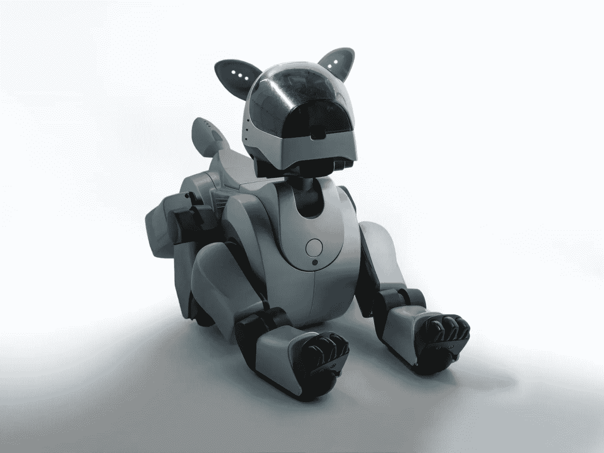

# 我们的狗需要人工智能的帮助:25 种预测

> 原文：<https://medium.com/geekculture/our-dogs-need-ai-help-25-predictions-on-how-d0dc27d75ad1?source=collection_archive---------11----------------------->

人工智能能提高我们的狗的质量并延长它们的寿命吗？

By [Brett Jordan](https://unsplash.com/@brett_jordan) from Unsplash

别搞错了。当我知道我们的宠物，我们心爱的狗，不能活 90 多岁时，我和你一样生气。在他们短暂的生命中，我们还能为我们的狗提供或做些什么来为他们提供最好的生活质量呢？此外，人工智能如何发挥作用，如果有的话？