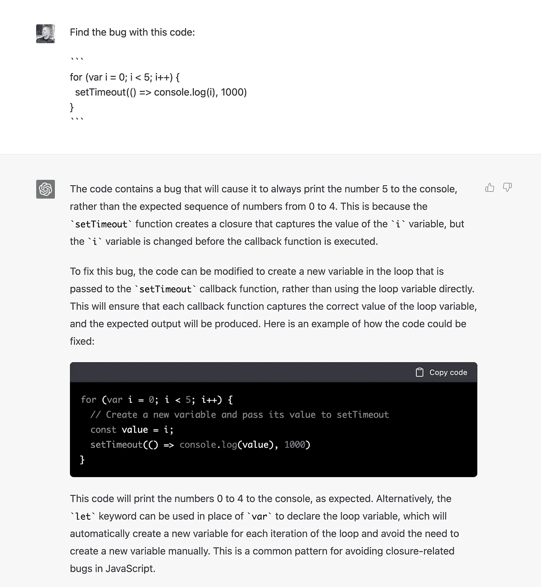
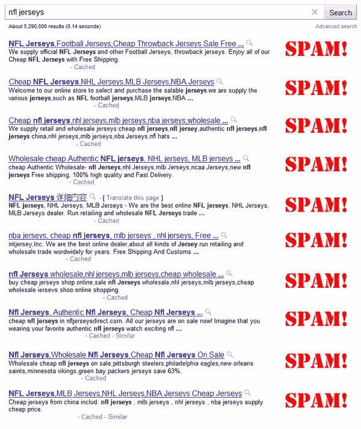
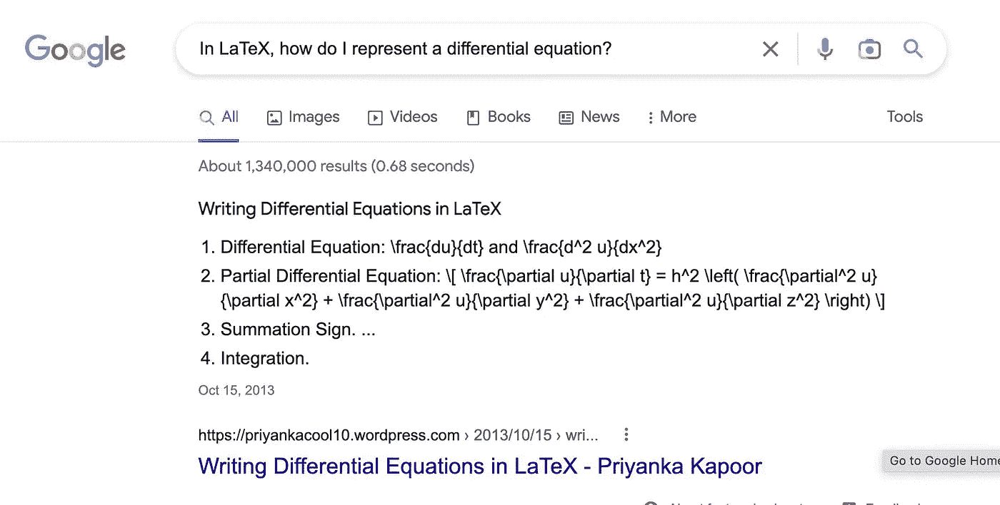
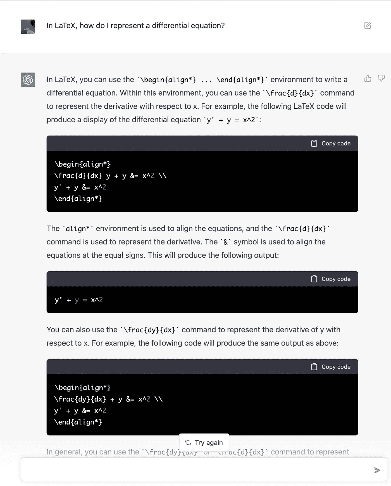
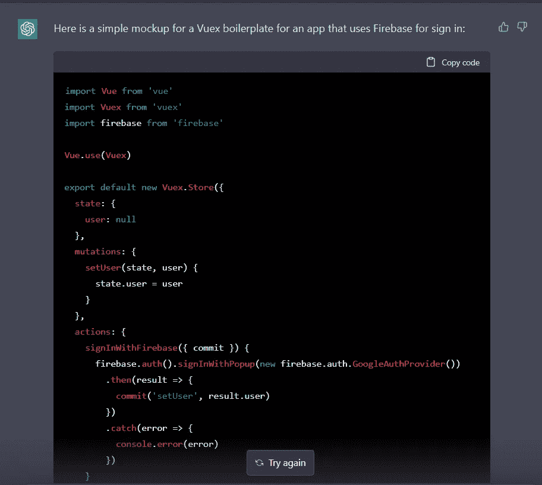
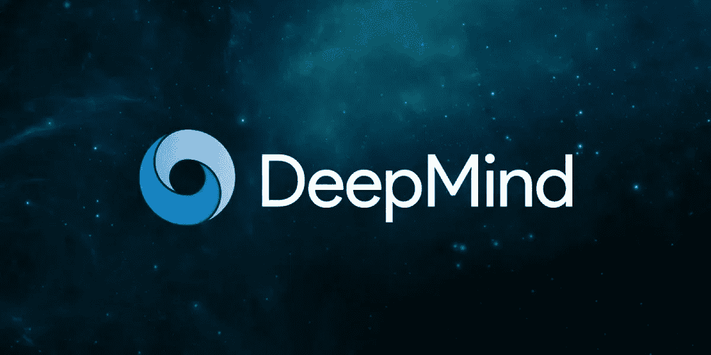

# 我们的知识经济正在迅速走向终结

> 原文：<https://medium.com/geekculture/our-knowledge-economy-is-swiftly-coming-to-an-end-734c5dc97355?source=collection_archive---------1----------------------->

## 加:ChatGPT 会扼杀谷歌搜索吗？

W elcome to [**风口浪尖**](https://nicksaraev.com/#/portal/signup) :前沿 AI 新闻(及其含义)用简单的英语讲解。

在本周的杂志中:

*   ChatGPT(或类似软件)准备颠覆谷歌搜索，
*   V2 悄悄在后台发起嘀咕，
*   我们的知识经济即将结束:如何让自己免受即将到来的人工智能能力快速变化的影响

让我们开始吧。

# 1.ChatGPT 准备颠覆谷歌搜索

如果你正在阅读这篇文章，你可能已经听说过 ChatGPT。

但对于那些还没有的人来说:ChatGPT 是 OpenAI 上周推出的一个令人难以置信的对话代理。它被训练、强化和优化是为了一个特定的目的:帮助你走出地狱。它做得非常好。

在短短的七天内，人们已经开始使用它来外包他们的编程工作，教育，甚至客户服务。

然而:真正改变游戏规则的是它摧毁谷歌搜索的潜力。

ChatGPT 的能力[回答问题](https://twitter.com/karpathy/status/1600214083206193153/photo/1)、[交织上下文](https://twitter.com/goodside/status/1600347160515514368/photo/1)和[提供详细的代码示例](https://pbs.twimg.com/media/FjVJ6T7VEAAypet?format=jpg&name=large)使得它有可能在不久的将来成为信息搜索者的首选。

# 谷歌的问题是

二十多年来，谷歌一直主导着搜索领域，其巨大的市场份额总是给它带来巨大的优势。但是最近几年，他们的搜索结果页面越来越像一个垃圾信息市场，而不是一个知识引擎。

搜索很嘈杂，充斥着不相关的关键词，最终往往会让用户失望。

相比之下，ChatGPT 可以在很短的时间内为用户的查询提供简洁而详细的答案。它使用上下文，考虑与它对话的人的阅读和写作水平，并且(不像搜索引擎)可以将概念彼此联系起来。

比较这两个例子:

# 谷歌

# ChatGPT 聊天机器人

用户得到的不是一般的内容或垃圾链接，而是对他们的查询的实际回应，所有这些都以最自然的方式呈现给我们这些低等人类:一次来回的对话。

# 怎么才能利用呢？

当然，ChatGPT 是一个闭源实现。人们已经创建了使用浏览器自动化向其他地方发送消息的模拟 API，但坦率地说，我认为这忽略了画面。

ChatGPT 的真正力量不在于它的直接经济效用(比如，我怎样才能让它转起来赚更多的钱)，而在于它作为一种教育[力量倍增器](https://en.wikipedia.org/wiki/Force_multiplication)的效用。

ChatGPT 真的*是*助理。获得它的价值的最好方法就是这样使用它。我让 ChatGPT 帮我模拟 Vue 样板文件，构思博客帖子的内容(就像这篇)，甚至用隐喻解释复杂的编程概念。

更多想法:

*   粘贴一个新的代码库或 API &让它一行一行地解释它是如何工作的。
*   自学历史、政治、博弈论、理性——随便你。
*   为常见但难以解释的主题创建隐喻列表。记住它们以便和你的朋友一起使用，并且不断地用你的聪明让他们惊叹

我猜，这会让你的工作效率提高 50%到 100%。想象一下你口袋里有一个老师。

OpenAI 计划给它提供互联网接入，这将使它的援助能力增加十倍。我等不及了！

# 2.V2 悄悄发起了嘀咕

两个多月前，世界上最强大的语音转录模型 Whisper 首次亮相。

从那以后，人们用它来[自动转录讲座](https://twitter.com/ai__pub/status/1574067679555559424)、[推特视频](https://twitter.com/dancow/status/1576630960287686656)，以及更多准确率达 99%的内容。

但是 OpenAI 昨天悄悄地对他们最有能力的模型进行了修改，进一步改进了它。

# 我们如何利用这一点呢？

你知道 YouTube 上 80%的标题是怎么出现的吗？

耳语要好几个数量级。[这里有一个例子，它以 500wpm 的速度转录某人的讲话(剧透:它做得完美无缺)。](https://openai.com/blog/whisper/#:~:text=VIEW%20MODEL%20CARD-,Whisper,-examples%3A)

肯定比大多数人类强。因为它是开源的，你可以相对容易地在你自己的项目中使用这个模型。

您可以:

*   在 Flask 中创建一个简单的 [Whisper API，编译一个转录服务列表，&发邮件给他们提供一个免费的实现。每次使用收费。](https://blog.deepgram.com/how-to-build-an-openai-whisper-api/)
*   对着警察或无线电扫描仪窃窃私语。使用 [Twitter API](https://developer.twitter.com/en/docs/twitter-api) 创建一个 Twitter 账户，并自动发布地区性的重要公告。
*   抄写 20 世纪 50-80 年代嘈杂、低质量的讲座(想想类似于[的费曼系列](https://www.feynmanlectures.caltech.edu/))并将它们捆绑成一个系列丛书。

# 3.我们的知识经济即将结束

在过去的六十多年里，我们的经济依靠人类的智慧来创造和保持经济价值。历史的这一阶段(幸运或不幸)即将结束。

大多数纯数字公司——尤其是那些在创意垂直领域工作的公司——将在未来几年面临大规模颠覆，除非他们将人工智能作为明确的重点。

任何一家*不*转向人工智能的公司都没有机会开发出比大玩家(OpenAI、DeepMind、谷歌等)更好的模型。如果这是对你的描述，那么你的服务质量最终将被不断增加的人工智能能力所吞噬，从而变得毫无意义。

编程、营销、设计、教育、动画、预测、财务规划、研究、音乐……真的，任何以创意联想/知识为主要输出的行业，都会主要由少数以规模为导向的公司开发的 API 来运行。

# 我们如何利用这一点？

大多数公司都无法成功转向人工智能。你需要数亿美元、极有才华的工程师和规模可观的计算基础设施(或获得它的手段)。

A small room in one of Microsoft’s billion-dollar data warehouses.

所以对于其他人来说:为了获胜，你需要停止关注冰球*在*的位置，而开始[滑向冰球*将要到达的*](https://twitter.com/mathemagic1an/status/1598168348340408320) 的位置。

这可能看起来像什么？

*   **关注*接口*，而不是*基础设施*** 。因为任何值得拥有的功能都将是 API 调用，所以您组织的关键区别将是您的客户体验的质量&它的整体运营效率— **而不是**您的团队能够多好地完成 x、y 或 z 服务。
*   将你的产品与人工智能的快速发展 **隔离开来。把它与现实世界联系起来，在未来十年里，人工智能在现实世界中的影响力将会减弱。例如，转向会议空间，或者为您的产品添加实体产品。你的目标应该是增加现实世界中的依赖和关系的数量，因为这些不容易自动化。**
*   花费时间和金钱打造个人品牌 *。*加入公共话语(如果你还没有的话)。确保相当数量的利益相关者关注*你*，而不是你的企业——这样当后者总是被技术超越时，你还有剩余。

当然，任何读到这篇文章的人都还有点跑道。但跑道的长度取决于不确定的因素，如你与客户关系的质量，他们接触强大人工智能的程度等。

安全总比后悔好。

这是一个总结！

喜欢这个吗？考虑和你认识的人分享。如果你读这篇文章是因为有人发给你了，请在这里注册[获取下一期时事通讯](https://nicksaraev.com/#/portal/signup)。如果你喜欢简短的形式，你也可以在 Twitter 上关注我。

下周见。

尼克