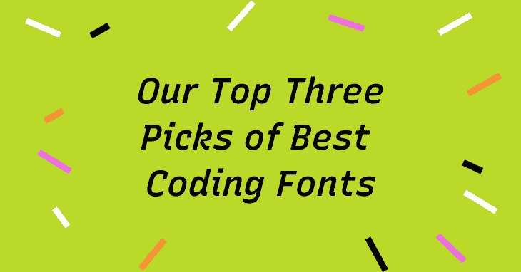
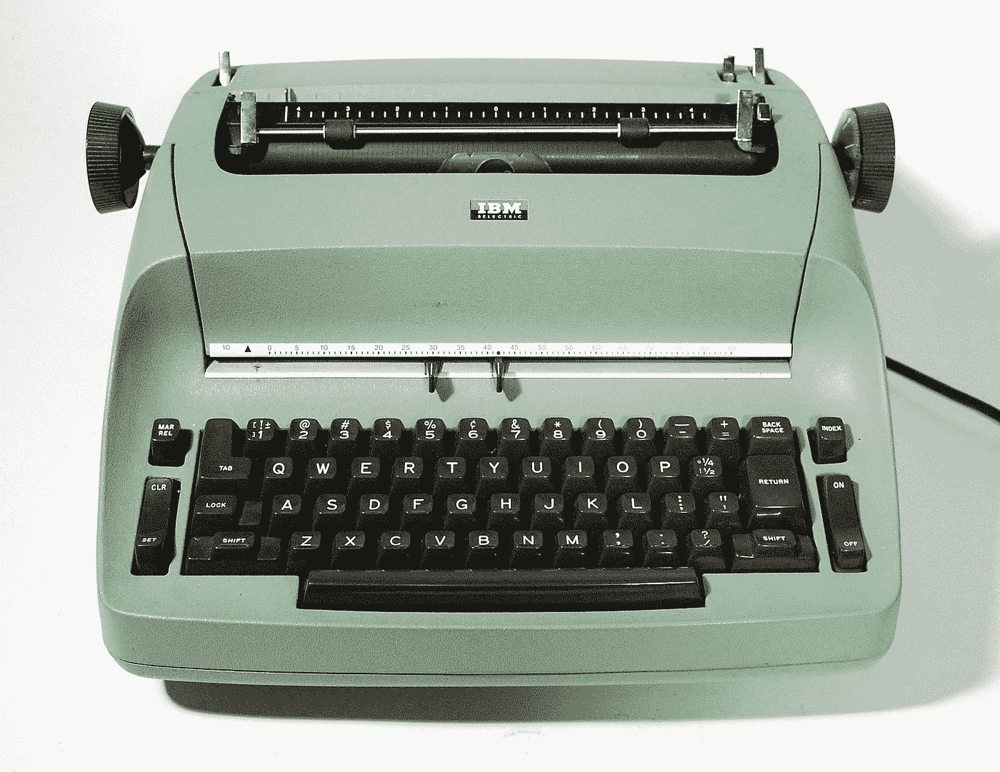
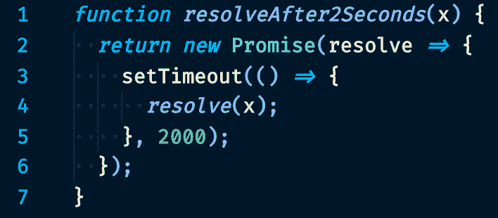
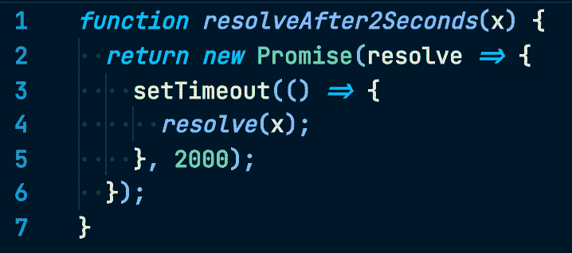

# 我们最喜欢的三种编码字体

> 原文：<https://medium.com/geekculture/our-top-three-picks-of-coding-fonts-2c77cdff3629?source=collection_archive---------21----------------------->

作为工程师，我们每天花大量时间在代码编辑器中工作。在编程时，拥有一种适合我们的编码字体可以减少我们的视觉疲劳，提高生产率，并使代码更整洁。在本帖中，我们回顾了我们最喜欢的编码字体，并讨论了每种字体的细节，因此您可以决定哪种字体最适合您。但首先，为了一些背景，让我们简单谈谈等宽字体的历史。

# 等宽字体的历史

等宽字体是具有相同固定宽度的字体。最早的形式是为了适应机械打字机的需要，这种打字机有一个滑架，每当有人按下一个键时，滑架就把纸移动相同的距离。

即使后来推出了有更多字体选择的电动打字机，等宽字体仍然适用。它们的实用功能很容易转移到新技术中，尤其是最早的计算机，因为它们的显示能力有限。

Img: IBM Selectric is one of the most successful typewriters ever made. It allowed consumers to use multiple fonts. Source: wikimedia)

# 典型图形选择

现在，我们在终端和代码编辑器中找到等宽字体，如 Sublime 或 VS Code 作为我们的编码字体。这里是我们最喜欢的三个，在这个网站上。

# Fira 代码

[Fira Code](https://fonts.google.com/specimen/Fira+Code) 是一个很棒的编码字体。我们喜欢 Fira 代码中的连字。通常情况下，`=>`需要两个字符，`=`和`>`。连字功能允许这种字符组合显示为单个相连的字符。使用连字可以减少噪音，使代码块看起来格外整洁。此外，Fira 代码还支持 ASCII 图形和控制台用户界面。

**字体详情:**

*   代码友好的连字，如`&&`、`www`、`=>`等等。
*   纵横数字“0”

Img: Fira Code in use. Created by [Nikita Prokopov.](https://tonsky.me/)

# Cousine

[Cousine](https://fonts.google.com/specimen/Cousine) 是我最喜欢的编程字体。Cousine 是一种无衬线字体，以公制匹配 Courier new 的宽度。作为一种无衬线字体，Cousine 缺少衬线字体的生硬和字母的华丽细节。在大块代码中看起来非常舒服。

**字体详情:**

*   带点数字“0”
*   无衬线使其易于阅读

Img: Cousine in use. Created by [Steve Matteson](https://mattesontypographics.com/).

# 喷气脑单声道

[JetBrains](https://www.jetbrains.com/lp/mono/) 是一种令人印象深刻的八权重编码字体。这种字体的一个特点是小写字母高度最大化。这个特性减少了编辑器中显示的代码长度，使代码读起来更舒服。

**字体详情**

*   带点数字“0”
*   代码友好的连字
*   最大化小写高度并切割成椭圆形，使代码更容易阅读

Img: Jet Brains Mono in use. Create by [Jet Brains](https://www.jetbrains.com/).

那是我们的最爱！哪种编码字体适合你？如果需要一点帮助，就拿 [**编码字体挑战**](https://www.codingfont.com/) **来了解一下吧！**

*还有，我最近启动了一个品牌设计工具 startup，*[*typ ogram*](https://www.typogram.co/)*。如果你想保持联系，* [*报名*](https://build.typogram.co/) *参加我们的集结-公开更新。*