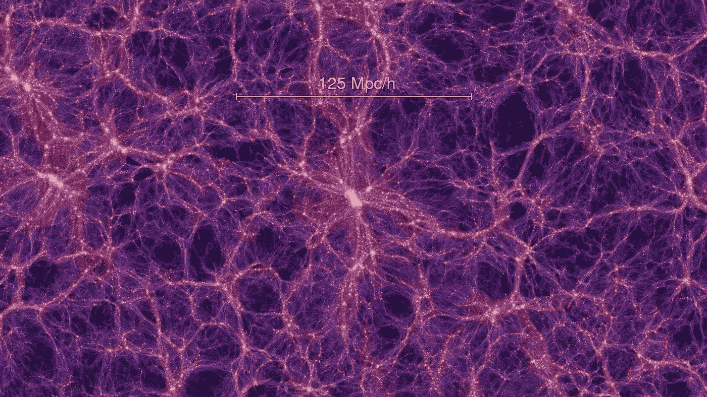

# 我们的宇宙是一个巨大的神经网络:原因如下

> 原文：<https://medium.com/geekculture/our-universe-is-a-massive-neural-network-heres-why-a0d5a5787230?source=collection_archive---------11----------------------->

几天前，[我在 arXiv](https://arxiv.org/pdf/2008.01540.pdf?ref=hackernoon.com) 上读到了维塔利·范楚林的一篇关于“作为神经网络的世界”的文章。

我的第一个想法是这将是关于[模拟假设](https://en.wikipedia.org/wiki/Simulation_hypothesis?ref=hackernoon.com)的一些东西，但在一些阅读之后，我看到它不是真的。如今，在物理学中，最流行的理论是[弦理论](https://en.wikipedia.org/wiki/String_theory?ref=hackernoon.com)(或者说理论，因为有很多)。

根据弦理论，空间有 9 个(或更多)维度，最基本的物体是超弦。这些弦在这个高维空间中振动，宇宙中的每一个粒子都是一个超弦的振动。

在 Vanchurin 的理论中，最基本的对象是神经元，宇宙可以描述为神经网络。[神经网络](https://en.wikipedia.org/wiki/Neural_network?ref=hackernoon.com)是受人脑启发的可训练的数学结构。神经元是一个简单的处理单元，通常用简单的数学函数来描述。

神经网络是这些神经元的图形，它取决于连接的强度(权重)。所以，神经网络就像一台计算机，可以通过权重来编程。Vanchurin 在他的文章中表明，宇宙可以被描述为一个神经网络，他可以从中恢复量子力学和广义相对论。

因此，神经网络至少是和弦理论或其他理论一样好的宇宙模型。这篇文章充满了数学，如果你不是物理学家或数学家，很难读懂，但概括地说，这就是重点。

Vanchurin 的理论令人印象深刻，但需要注意的是，在这个模型中，神经网络不是“思维机器”，它不识别模式等。当我们在计算机技术中使用它们时，他把它作为粒子的数学模型。

但是如果粒子甚至空间和时间都不是基本的呢？

时空的非基本性是一种怪异的东西，但不是一种新事物。[唐纳德·霍夫曼](https://en.wikipedia.org/wiki/Donald_D._Hoffman?ref=hackernoon.com)是“意识宇宙”理论的大预言家。在他的理论中，最基本的东西是有意识的主体，时空和粒子只是有意识经验的突现性质。

*如果你对霍夫曼的理论感兴趣，那就看* [*他的 ted 演讲*](https://www.ted.com/talks/donald_hoffman_do_we_see_reality_as_it_is?ref=hackernoon.com) *，或者这些对他的采访*

19 世纪末，爱因斯坦给出了空间和时间的新定义，它们是现实中不可触及的基本属性。他假设对于每个观察者来说光速必须相等，这是一个比时间无关性更基本的物理定律。

这是狭义相对论的基础。另一个例子是量子力学，量子非局域性表明时空与我们日常生活中经历的不同。

虽然霍夫曼的空间和时间理论更激进，但这些案例是很好的例子，说明有时对基本事物的质疑可以成为一个好理论的基础。

在霍夫曼的理论中，根本现实是意识主体的层级结构，整个经验到的具有空间和时间的现实是我们意识头脑上类似“耳机”的东西，所以它非常接近模拟假设。

几年前，我写过一篇关于如何构建模拟现实的文章？！’。在这篇文章中，我试图想象一个未来，在那里心灵上传是真实的，我问了一个问题:为这些心灵创造模拟现实的最佳方式是什么？

我第一次读到心灵上传是在雷·库兹韦尔的名著中。心灵上传是人脑的全数字化。一种在数字计算机中逐个神经元复制和模拟大脑的技术。如果人类的思想是大脑功能的结果，那么这个模拟的复制品将和我们完全一样。那么，如果思想上传是可能的，我们如何为这些数字化的思想创造一个最佳的模拟现实呢？

第一种解决方案是一个粒子一个粒子地模拟现实，但这非常浪费，而且需要惊人的计算能力。

那能怎么办呢？

我们可以做每个电脑游戏做的事情，只渲染用户看到的东西。既然我们有 5 种感官，渲染视觉体验是不够的，气味、声音等。但是模型是一样的:它必须只呈现被某人观察到的东西。

量子力学的一些解释对现实也有类似的说法。在这些解释中，只有观察到的事物才是真实的。但这种“把戏”并没有解决计算能力的问题，因为只有在粒子没有被观察到时也进行模拟，模拟的现实才会一致。

例如，如果我手里拿着一个苹果，我闭上眼睛，当我再次睁开眼睛时，苹果应该在那里。在量子力学中，[波函数](https://en.wikipedia.org/wiki/Wave_function?ref=hackernoon.com)描述的是没人观测时的粒子，当观测者观测时它会坍缩成一个真实的物体。

模拟波函数还需要巨大的(近乎无限的)计算能力。幸运的是，还有另外一个“窍门”可以解决这个问题。如果目标是向观察者模拟现实，那么考虑观察者的期望就足够了。如果我们坚持苹果的例子，当我睁开眼睛时，我期望苹果会在那里。

因此，如果系统知道我的期望，它就能向我模拟一个完全一致的现实。渲染期望就像投射现实一样。人类的大脑每天都在这样做。我们总是只感知现实的片段，而我们的大脑会把缺失的部分添加进去。但是如果现实的这些部分不是来自外部而是来自另一个头脑的投射呢？

*如果你对我们的大脑如何投射现实感兴趣，请观看安尼尔·塞斯关于这个话题的 ted 演讲* *。*

我的假想模拟系统并没有模拟任何东西，只是“融合”了不同头脑的投射，从中创造出一致的现实，这就是为什么我称它为“一致性机器”。

一致性机器从个人上传的头脑中收集投影，合并它们，并向它们呈现一致的现实。一致性机器不需要外部存储器，也不需要模拟任何粒子。它仅呈现来自合并投影的 5 种感觉的刺激。

但是如果一致性机器因为投影之间存在基本矛盾而无法合并投影呢？在这种情况下，一致性机器必须改变期望来同步它们。个体思维的期望来自于过去的经历，所以操纵思维和改变期望就像时间旅行一样。

一致性机器“回到过去”并改变事件以同步期望。这也是保护模拟的最终解决方案。如果有人能证明我们生活在模拟中，一致性机器就能回到过去，修补“安全漏洞”。所以，在这个系统中，你永远无法证明它是一个模拟。

2012 年，雷·库兹韦尔[发表了关于人类大脑如何工作的理论](https://en.wikipedia.org/wiki/How_to_Create_a_Mind?ref=hackernoon.com)。在这个理论中，人类大脑的新皮层是由模式识别模块构建的。

模块是一群神经元，它能够识别模式。这些模块以分层结构相互连接。低级模块识别基本模式并将信号转发给高级模块，高级模块也可以将信号发送给低级模块以激活它们。

在这个模型中，思维有点像模式识别激活的关联链。在许多情况下，模式识别器相互竞争，在更高的层次上决定哪个模块胜出。

在这个模型中，有意识的体验是这种等级制度顶层竞争的结果。这种分层模型能够确保顶层的一致性。如果在任何级别上存在不一致，则模式识别器向较低级别的模块发送信号以阻止它们或改变较低级别的激活。

库兹韦尔的模式识别器有点像霍夫曼的意识代理。不同之处在于，霍夫曼的代理是更抽象的基本事物，而库兹韦尔的识别器是由一堆神经元构建的原始模块。

这两种理论都声称人类意识是等级制度的结果。导致一致意识体验的模块层级网络与一致性机器非常相似。如果个体心智(自我)不在顶层，只是模块层级中的一个中层结构，那会怎样？

在这个模型中，层级的顶端不是个体头脑，而是包含个体头脑并保持他们所经历的现实的一致性的顶级全球意识。它有点像一个拥有多重人格的巨型大脑。

虽然多重人格听起来很怪异，但并不像你想象的那么不寻常。霍夫曼最喜欢的例子之一是裂脑实验。胼胝体切开术是治疗医学上难治性癫痫的外科手术。

在这个过程中，胼胝体被切断以限制癫痫活动在大脑两半之间的传播。在很多情况下，手术后病人会觉得自己有两种人格。

这些实验表明，每个人的大脑都是由两个有意识的实体构成的，但是如果大脑的两个部分连接在一起，那么它们就形成了一个一致的人格。

在全球意识模型中，个体意识以同样的方式相互联系，个体意识以一致的现实体验到这一点。在这个模型中，空间、时间、粒子和现实的每一个元素都是心灵互联的结果。

如果时空和粒子仅仅是相互联系的思想的结果，那么对于“外部”的客观现实又能说些什么呢？几乎没有。但是如果我们假设全局意识是由抽象的神经元样的数学结构构建的，那么我们可以将其与当前的物理模型进行比较。

在物质世界的艺术模型中，宇宙是在宾爆炸时从无到有形成的，它最基本的组成部分是超弦。

超弦是形成粒子的高维数学结构。每个粒子都可以用一个状态向量来描述，物理定律就是这些向量上的算符。随着时间的推移，这些算子不断变换状态向量。

意识是进化的结果，它形成的原因是人择原理。人择原理是一个简单而优雅的答案，它解释了为什么我们的宇宙存在，以及为什么它为有意识的智慧生命而微调。

在多元宇宙中可能有许多宇宙，但在没有为有意识的智慧生命微调的宇宙中，没有人会问“为什么我的宇宙被微调了？”。多元宇宙正在玩彩票游戏，我们的宇宙赢得了头奖:我们。

神经网络宇宙非常相似。它也可以从无到有，但它是由神经元而不是粒子构成的。在最低层次上，神经元和粒子非常相似。

两者都是由状态向量描述的数学结构，状态向量是通过神经相互作用由神经法则不断变换的。

可能有许多空的神经宇宙，但其中一些适合某种进化和在其中发展的意识实体。

这种类型的宇宙是我们当前宇宙的正确模型吗？它可能是，正如上面所描述的，我们可能永远无法证明或反驳我们的宇宙是否是一个神经网络。

这样的理论能做什么？如果霍夫曼是对的，时空不是基本的，那么也许我们可以像霍夫曼所说的那样“破解它”。

如果他是错的，意识是大脑功能的结果，可以用物理定律来解释，那么我们就可以模拟它，并在未来建立我们自己的现实。

所以正确的问题是:“我们什么时候会生活在一个模拟环境中，或者我们已经生活在其中了？”

这个故事最初发表在 [HackerNoon](https://hackernoon.com/our-universe-is-a-massive-neural-network-heres-why-c14j3ze1) 上。