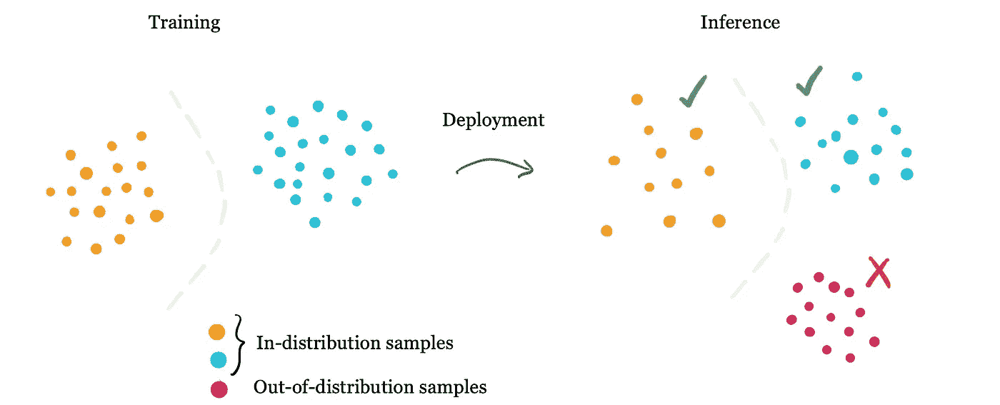
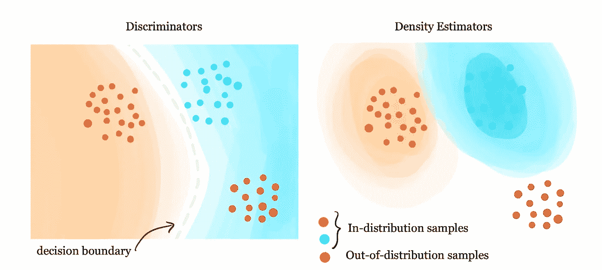
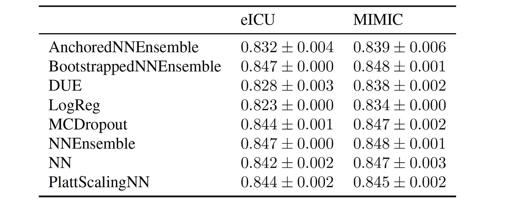
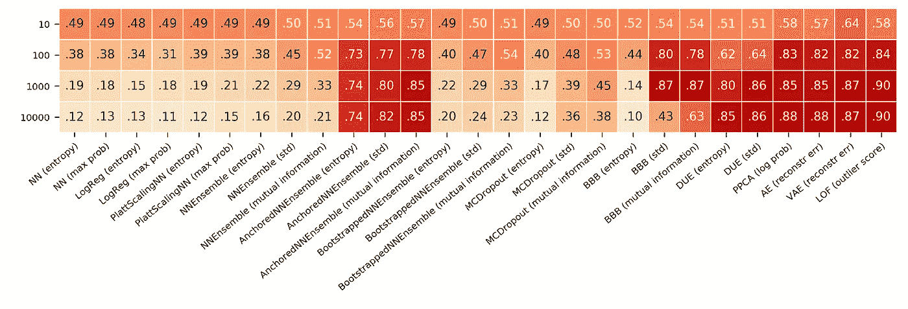
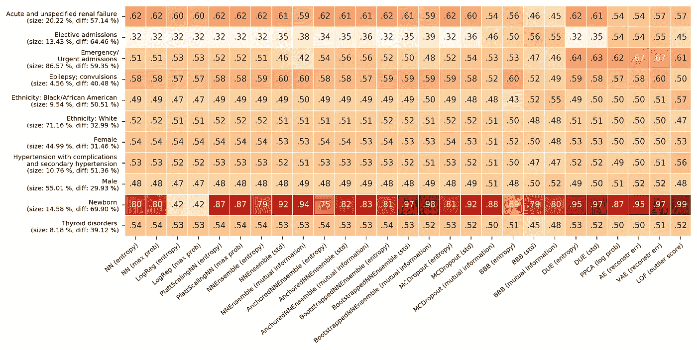
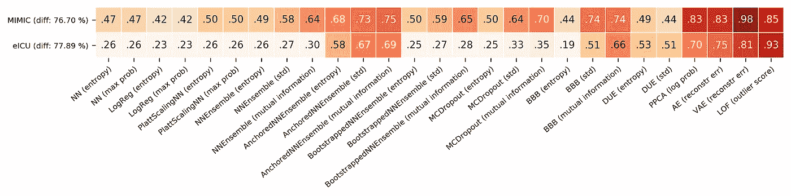

# 医学人工智能中的非分布检测

> 原文：<https://medium.com/geekculture/out-of-distribution-detection-in-medical-ai-b638b385c2a3?source=collection_archive---------31----------------------->

## 为什么它是一个问题和寻找解决方案的基准

*由卡琳娜·扎多罗兹尼和乔瓦尼·西纳(*[](https://pacmed.ai/en/labs)**)**

> *如果你对在现实世界中部署医疗人工智能感兴趣，这篇博客适合你。*

# *介绍*

*随着机器学习即将彻底改变医疗保健，我们需要停下来思考我们的超高性能模型在实践中可能不太好用的所有可能方式。其中一个关键原因是真实的**实时数据可能不同于训练数据**，即模型已经学习的数据。即使实时数据现在看起来相当像训练数据，也不能保证它在未来会保持这样*。**

**在医疗机构中，患者数据会随着时间的推移而发生变化有多种原因，例如:**

*   **患者群体发生变化(由于人口统计学、健康政策等的变化)。**
*   **护理方案发生变化(例如，参数测量方法不同，或治疗行为改变)。**
*   **由于 AI 工具或该工具连接的医疗保健基础设施中以前未发现的错误。**
*   **由于网络攻击或其他对数据的有意篡改。**

**因此，生产中的模型很可能最终会收到与定型数据不同的数据点。**

# **食品检测问题**

****机器学习模型假设新的样本与它们已经被训练的数据相似**。更准确地说，我们假设数据是独立的，同分布的。与训练数据相似的样本被视为*分布不均。***

**然而，在实践中，我们不能保证模型只会看到与它被训练和测试的数据相似的数据。在训练数据集中没有被很好代表的样本被认为是*非分布* (OOD)。如上所述，**有许多临床相关场景会导致数据分布发生变化。****

****

**为了在医疗保健中安全部署机器学习模型，**我们能够标记“奇怪”的样本至关重要，因为在这些样本上，模型的输出不可靠**。此外，我们希望实时标记这样的 OOD 样本，否则在我们意识到数据已经改变之前，大量的错误可能会堆积起来。**

**为了能够判断我们对一个模型的信任程度，我们希望获得一个单独的*不确定性*分数，而不是只获得每个样本的一个预测。然后，这种不确定性可用于标记预测不可信的 OOD 患者。**

# **食品检测方法**

**鉴于这项任务的重要性，近年来提出了各种不确定性量化方法。广义地说，我们要么不确定一个模型的预测，要么不确定一个新的 T2 样本本身，即 T4。利用这种直觉，我们可以将食品检测器分为两组:**

1.  **鉴别者在他们自己的预测中表达不确定性。**
2.  ****密度估计器**学习低密度区域中的训练特征和标记样本的密度。**

****哪种技术最适合标记食品样本？**在本节的剩余部分，我们列出了我们在 OOD 检测任务中进行基准测试的方法，重点是真实世界的医疗数据。您可以在[本文](http://proceedings.mlr.press/v136/ulmer20a/ulmer20a.pdf)中找到所有细节，包括所有模型和指标的详细描述。**

****

**Shades of orange and blue indicate confidence levels. For discriminator, the regions of low certainty are defined by model’s decision boundaries. For density estimators, the areas with low sample density will end up with low confidence levels.**

## ****1。鉴别器****

**鉴别器是基于样本特征输出预测的模型。鉴别器，如标准前馈神经网络或集成网络，可以被调整以提供一个分数，该分数指示它们在预测中有多确定。**

**我们研究的鉴别器模型包括:**

*   **逻辑回归**
*   **前馈神经网络**
*   **温度标度神经网络**
*   **神经网络集成**
*   **贝叶斯神经网络**
*   **蒙特卡洛辍学**

**可以添加几个简单的度量来量化分类设置中网络的不确定性。我们使用了:**

*   **最大软最大概率**
*   **熵**
*   **差异**
*   **交互信息**

## ****2。密度估计器****

**顾名思义，密度估计器学习估计训练数据的密度。为了理解这意味着什么，假设有一些生成我们的训练数据的过程——例如，收集病人体温测量值的过程。了解这一过程的密度函数意味着了解测量特定值的可能性。**

**通过学习训练数据的所有特征的密度，密度估计器可以判断新样本是否来自相同的分布。一些密度模型原则上也可以通过学习特征和目标的联合分布来输出关于标签的预测。然而，密度估计器通常与主预测模型分开使用，因为它们可以以模型不可知的方式标记 OOD 样本。**

**我们纳入此类别的型号有*:**

*   **概率主成分分析**
*   **自动编码器**
*   **变分自动编码器**
*   **局部异常因素**
*   **神经高斯过程**

****请注意，显式密度估计器为我们提供了一种表达已知数据分布的方式——例如，作为正态分布的参数。在这个列表中，我们包括了不具备这种能力的模型，如局部异常值因子。***

# **真实世界公共医疗数据的实验**

**如上所述，有太多的食品新颖性检测技术。但是它们中的哪些起作用，什么时候起作用？**

**为了帮助回答医疗领域的这个问题，我们在公开可用的医疗表格数据(电子健康记录，EHR)上创建了一组**基准实验。我们实现了上述模型，并设计了几个临床相关实验，可以帮助我们找到最佳的 OOD 检测器。****

**具体来说，我们设计了三个实验来模拟临床相关场景:**

1.  ****如果测量设备输出错误值，检测损坏特征**与**T5 相关。****
2.  ****如果模型接收一组患有新疾病或人口统计数据不同于训练数据的患者，则检测临床相关的 OOD 组**是相关的。**
3.  ****如果患者数据来自可能有不同程序的新医院，则检测数据集的来源**是相关的。**

**实验和结果的完整描述可在 [Ulmer 等人，2020](http://proceedings.mlr.press/v136/ulmer20a/ulmer20a.pdf)【1】中找到。[这里的](https://github.com/Pacmed/ehr_ood_detection)是一个链接，指向带有模型和实验实现的开源库。**

## **数据集**

**我们使用了两个公开可用的数据集:**

*   **[MIMIC-III](https://mimic.mit.edu/) (重症监护医疗信息集市)，包含超过十年的重症监护病房收治患者的信息。该数据集中的要素包括实验室测试结果、诊断代码或人口统计数据。**
*   **[eICU](https://eicu-crd.mit.edu/) (电子重症监护病房)数据库包含 2014 年和 2015 年美国各地重症监护病房的数据。与 MIMIC 类似，它包含实验室测量值、住院时间和患者的人口统计数据。**

## **死亡率预测任务**

**所有鉴别器模型都接受了住院死亡率二元分类任务的训练。也就是说，鉴别器模型不是在食品检测方面训练的*，而是在它们将被用于的实际任务方面训练的*。**

**鉴于医院内死亡率低，死亡率预测是一项非常不均衡的任务。因此，衡量 AUC-ROC 评分比准确性更有意义。模型的性能如下:**

****

**密度模型在没有标签的情况下被训练，仅基于训练数据的特征。**

# **食品检测实验**

## **1.检测损坏的特征**

**考虑以下情况:患者已经接受了实验室测试，但是测量设备输出了具有生理上无感觉值的有缺陷的测量值。自然地，我们希望这些样本被标记为 OOD，而不是对使用了故障设备的样本进行预测。**

**为了模拟这种情况，我们选择了一个随机特征，然后用一个因子(10、100、1000 或 10 000)对其进行缩放。然后，我们比较了每个模型标记这种规模样本的能力。结果是用不同的随机选择的特征进行的 100 次实验的平均值，以防止任何特征偏差。**

****

**The perturbation experiment on the eICU dataset. A random feature was scaled by a factor of 10, 100, 1000, or 10 000 and the models were compared in their ability to flag these perturbed samples. In the image, the final AUC-ROC score for OOD detection is shown. It is an average over 100 experiments with randomly selected features.**

**预期的趋势是，随着比例因子的增加，AUC-ROC 得分会增加(深色方块)。对于大部分歧视者来说，其实是相反的！随着测量中的缺陷越来越大，它们标记损坏样本的能力下降。这意味着模型给被破坏的样本分配了非常高的确定性分数。密度模型在这个测试中表现得更好。**

## **2.检测临床相关的食品组**

**另一个相关的场景是观察一组新的患者，该模型没有对其进行训练。这可能是由于一种新的潜在疾病，或者仅仅是患者群体的人口变化。**

**每个临床相关组(例如，患有特定疾病(如肾衰竭)的患者，或具有特定人口统计学特征(如性别或种族)的患者)在模型训练期间被保留。然后，我们在测试时介绍这些患者，并比较他们被标记为 OOD 的程度。**

****

**Clinically relevant OOD groups for the MIMIC dataset. We first withhold a particular group during training and then compare the AUC-ROC scores of detecting the indicated OOD groups at test time. *Diff* shows how different the features of the group are compared to the features in the training data. (Average results over 5 experiments are shown).**

**除了新生儿这一最明显的群体外，模型对 OOD 群体的检测非常差。在这个测试中，甚至密度模型也失败了。**

## **3.检测新数据集**

**作为第三个实验，我们使用数据源作为 OOD 标准。这也是一个相关的问题:改变医院协议会导致不精确的预测。**

**为了测试这一点，我们可以在 MIMIC 数据集上训练模型，然后在 eICU 数据集上测试它的不确定性(或者反过来)。这不同于领域适应问题，因为我们不是着眼于模型的预测性能，而是着眼于它们区分来自两个不同数据集的样本的能力。**

****

**Detecting samples coming from a different dataset. The models were trained on the MIMIC dataset and then presented with the samples from eICU (top row), or visa versa (bottom row). The scores show AUC-ROC of detecting the new datasets as OOD. *Diff* shows how different the features of the group are compared to the features in the training data. (Average results over 5 experiments are shown).**

**类似于扰动实验，密度模型比鉴别器表现得更好。看起来它们可以比神经鉴别器更可靠地标记来自新数据集的样本。**

# **结论**

**在这篇博文中，我们介绍了食品检测的问题，并强调了它对于医疗保健中机器学习模型的可靠部署的重要性。有许多不同的技术用于 OOD 检测和不确定性估计，它们可以大致分为两组——鉴别器和密度估计器。**

**从医学表格数据的真实实验中可以看出，**方法并不完美，无法检测某些类型的 OOD** 。这强调了对更鲁棒的新颖性检测方法的需求。**

**我们的希望是，通过为实验提供开源代码并使用公开可用的数据集，我们的实验框架可以作为新技术的易用基准。**

# **参考**

**如需进一步阅读，请参阅我们的原始论文:**

***Ulmer，d .，Meijerink，l .，和 Cinà，g .信任问题:不确定性估计无法对医疗表格数据进行可靠的食物不良检测。《健康神经科学机器学习研讨会论文集》，第 136 卷，第 341–354 页，2020 年。***

**在本文中，我们提供了神经鉴别器在扰动任务中系统失败的理论解释:**

***Ulmer，d .和 Cinà，g .了解您的极限:ReLU 分类器的不确定性估计在可靠的食品检测中失败。arXiv:2012.05329，2021***

**这里描述的实验和模型使用的所有代码可以在以下位置找到:**

```
**[https://github.com/Pacmed/ehr_ood_detection](https://github.com/Pacmed/ehr_ood_detection)**
```